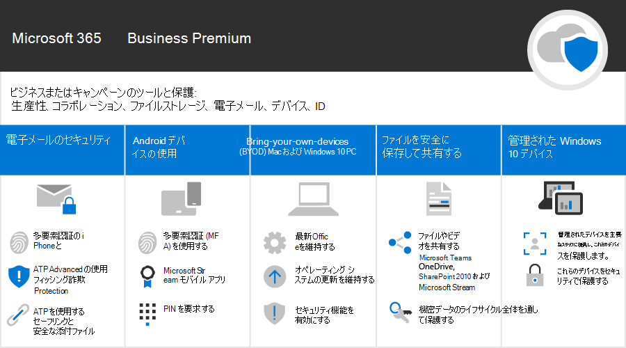

Microsoft 365 for Campaigns
===========================

現代の社会において、データと通信を安全に保つことは、とりわけ政治キャンペーン、医療および法務、および他の多くのビジネスの分野において重要な事項です。 Microsoft 365 for Campaigns には、お客様とお客様のデータを保護するための一連の推奨事項が付属しています。 このライブラリには、キャンペーンにかかわりなく、推奨される環境をセットアップして使用するためのヘルプが用意されています。

> [!VIDEO https://www.microsoft.com/videoplayer/embed/RE3clbH] 

**Microsoft 365 for Campaigns** とは? これは、推奨されている Microsoft 365 Business Premium を含む安全な構成です。次のようなことができるようになります。
- 信頼できるビジネス生産性と共同作業ツール (Outlook、Word、Excel、その他の Office 製品など) に依存している 
- iOS、Android、Windows 10 のすべてのデバイス上の作業ファイルを、管理が容易なエンタープライズ レベルのセキュリティで保護 
- ユーザーアカウントと ID に追加の保護を適用する 

米国の連邦選挙キャンペーンには、Microsoft 365 Business Premium の特別価格の対象となりますが、このプランを採用している組織は、このガイダンスを利用して、セキュリティの強化を構成し、安全に共同作業を行う方法について学ぶことができます。

このライブラリの内訳は次のとおりです。
- セキュリティを強化する際に規範となるセットアップ ガイダンス。
- セキュリティで保護されたアクセスができるよう、デバイスをセットアップするためのヘルプ。
- セキュイティで保護された共同作業および共有を行う方法を示したガイダンス。

含まれる機能の詳細については、[[Microsoft 365 Business Premium]](https://www.microsoft.com/microsoft-365/business)を参照してください。 

作業の開始
--------------------------

<ul class="panelContent cardsJ">
    <li>
        

            

                

                    

                        

                            
                        

                    

                    

                        
<b>以下の手順に従って開始しましょう。</b>

                        
<a href="get-microsoft-365-campaigns.md">Microsoft 365 for campaigns を入手する</a>

                        
<a href="m365-campaigns-users.md">ユーザーが Microsoft 365 を使用する方法について説明</a>

                        
<a href="microsoft-365-campaigns-setup-overview.md">Microsoft 365 for Campaigns を設定する</a>

                    

                

            

        

    </li>
</ul>

お客様のキャンペーンまたは小規模ビジネス向けのソリューション
--------------------------

セキュリティで保護された Microsoft 365 環境をセットアップした後は、次のソリューションを使用して作業できます。

<ul class="panelContent cardsW cols cols2">
    <li>
        

            

                

                    

                        

                            
                        

                    

                    

                        <h3>共同作業のためのチームを作成する</h3>
                        
Microsoft Teams を使用して、主要なスタッフ、すべてのスタッフ、パートナーやベンダーを対象とした、コミュニケーションと共同作業のためのスペースを確保します。

                        
<a href="create-teams-for-collaboration.md">チームを作成する</a>

                    

                

            

        

    </li>
    <li>
        

            

                

                    

                        

                            
                        

                    

                    

                        <h3>オンライン会議を設定する</h3>
                        
Microsoft Teams でオーディオ、ビデオ、共有を使用して会議をスケジュールします。

                        
<a href="set-up-meetings.md">会議を設定する</a>

                    

                

            

        

    </li>
    <li>
        

            

                

                    

                        

                            
                        

                    

                    

                        <h3>機密情報を暗号化またはラベル付けする</h3>
                        
機密情報や機密情報を含むメールを保護するには、暗号化と機密ラベルを使用します。

                        
<a href="send-encrypted-email.md">暗号化された電子メールを送信する</a>

                    

                

            

        

    </li>
    <li>
        

            

                

                    

                        

                            
                        

                    

                    

                        <h3>コミュニケーション サイトを作成する</h3>
                        
SharePoint で作成した内部のコミュニケーションサイトで、イベント、メッセージ、画像などをチームと共有できます。

                        
<a href="create-communications-site.md">サイトを作成する</a>

                    

                

            

        

    </li>
    <li>
        

            

                

                    

                        

                            
                        

                    

                    

                        <h3>ファイルやビデオを共有する</h3>
                        
ファイルとビデオをクラウドに保存して、適切なすべてのユーザーが利用できるようにします。

                        
<a href="share-files-and-videos.md">共有の開始</a>

                    

                

            

        

    </li>
</ul>
