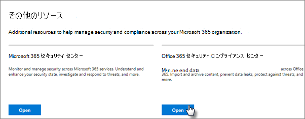

# サブスクリプションの脅威保護をMicrosoft 365する

この記事は、フィッシング、マルウェア、その他の脅威Microsoft 365保護するために、サブスクリプションの保護を強化するのに役立ちます。 これらの推奨事項は、政治キャンペーン、法律事務所、医療クリニックなど、セキュリティの必要性が高い組織に適しています。

開始する前に、Microsoft Secure Score を確認してください。 Microsoft Secure Score は、通常のアクティビティとセキュリティ設定に基づいて組織のセキュリティを分析し、スコアを割り当てる。 まず、現在のスコアをメモします。 この記事で推奨されるアクションを実行すると、スコアが上昇します。 目標は、最大スコアを達成するのではなく、ユーザーの生産性に悪影響を及ぼしない環境を保護する機会を認識する方法です。

詳細については [、「Microsoft Secure Score」を参照してください](../security/defender/microsoft-secure-score.md)。

## メール内のマルウェアに対する保護のレベルを上げる

ユーザー Office 365またはMicrosoft 365にはマルウェアに対する保護が含まれますが、マルウェアに一般的に使用されるファイルの種類を含む添付ファイルをブロックすることで、この保護を強化できます。 電子メールでマルウェア保護を強化するには、次の方法を実行します。

1. コンプライアンス センター Office 365<a href="https://go.microsoft.com/fwlink/p/?linkid=2077143" target="_blank">セキュリティ &に移動</a>し、管理者アカウントの資格情報でサインインします。

2. 左側のナビゲーション ウィンドウの [脅威の管理] **で、[** ポリシーマルウェア対策 **]** \> **を選択します**。

3. 既定のポリシーをダブルクリックして、この会社全体のポリシーを編集します。

4. **[設定]** をクリックします。

5. [共通 **の添付ファイルの種類フィルター] で**、[オン] を **選択します**。 ブロックされているファイルの種類は、このコントロールの直下のウィンドウに表示されます。 次のファイル型を追加してください。

   `ade, adp, ani, bas, bat, chm, cmd, com, cpl, crt, hlp, ht, hta, inf, ins, isp, job, js, jse, lnk, mda, mdb, mde, mdz, msc, msi, msp, mst, pcd, reg, scr, sct, shs, url, vb, vbe, vbs, wsc, wsf, wsh, exe, pif`

   必要に応じて、後でファイルの種類を追加または削除できます。

6. [ **保存**] をクリックします。

詳細については [、「EOP でのマルウェア対策保護」を参照してください](../security/office-365-security/anti-malware-protection.md)。

## ランサムウェアから保護する

ランサムウェアは、ファイルを暗号化するか、コンピューター画面をロックすることで、データへのアクセスを制限します。 その後、データへのアクセスと引き換えに、通常はBitcoinのような暗号化の形で「身代金」を求め、被害者から金銭を強要しようとする。

ランサムウェアから保護するには、1 つ以上のメール フロー ルールを作成して、ランサムウェアに一般的に使用されるファイル拡張子 (メールステップでマルウェアに対する保護レベルの向上に追加されたファイル拡張子) をブロックしたり、電子メールでこれらの添付ファイルを受け取るユーザーに警告したりします。

前の手順でブロックしたファイルに加えて、マクロを含む Office ファイル添付ファイルを開く前にユーザーに警告するルールを作成する方法も良い方法です。 ランサムウェアはマクロ内に隠される可能性があります。そのため、ユーザーに知らない人からこれらのファイルを開かされないように警告します。

メール トランスポート ルールを作成するには、次の方法を実行します。

1. 管理センターに移動し、[管理 <https://admin.microsoft.com> センター]**を選択Exchange。** \> 

2. メール フロー **カテゴリで、[** ルール] を **クリックします**。

3. を **+** クリックし、[新しい **ルールの作成] をクリックします**。

4. ダイアログ **ボックスの下部** にある [その他のオプション] をクリックして、オプションの完全なセットを表示します。

5. ルールの次の表の設定を適用します。 残りの設定は、変更しない限り、既定のままにします。

6. **[保存]** をクリックします。

|Setting|ファイルの添付ファイルを開く前にユーザーにOfficeする|
|---|---|
|名前|ランサムウェア対策ルール: ユーザーに警告する|
|場合は、このルールを適用します。 . .|任意の添付ファイル 。 . . ファイル拡張子が一致します。 . .|
|単語または語句を指定する|次のファイルの種類を追加します。   `dotm, docm, xlsm, sltm, xla, xlam, xll, pptm, potm, ppam, ppsm, sldm`|
|次の操作を行います。 . .|受信者にメッセージで通知します。|
|メッセージ テキストを提供する|これらの種類のファイルは、悪意のあるコードを含むマクロが含まれている可能性があるから、知らない人から開かれません。|

詳細については、以下を参照してください。

- [ランサムウェア: リスクを軽減する方法](https://www.microsoft.com/security/blog/2020/04/28/ransomware-groups-continue-to-target-healthcare-critical-services-heres-how-to-reduce-risk/)

- [OneDrive を復元する](https://support.microsoft.com//office/fa231298-759d-41cf-bcd0-25ac53eb8a15)

## 電子メールの自動転送を停止する

ユーザーのメールボックスにアクセスするハッカーは、メールを自動的に転送するメールボックスを設定することで、メールを盗む可能性があります。 これは、ユーザーの認識がなくても発生する可能性があります。 メール フロー ルールを構成することで、この問題を回避できます。

メール トランスポート ルールを作成するには、この短い [ビデオを見](https://support.office.com/article/f9d693ba-5c78-47c0-b156-8e461e062aa7) るか、次の手順を実行します。

1. [管理] <a href="https://go.microsoft.com/fwlink/p/?linkid=2024339" target="_blank">Microsoft 365 管理センター、[</a>**管理センター] をクリック** \> **Exchange。**

2. メール フロー **カテゴリで、[** ルール] を **クリックします**。

3. を **+** クリックし、[新しい **ルールの作成] をクリックします**。

4. ダイアログ **ボックスの下部** にある [その他のオプション] をクリックして、オプションの完全なセットを表示します。

5. 次の表の設定を適用します。 残りの設定は、変更しない限り、既定のままにします。

6. **[保存]** をクリックします。

|Setting|ファイルの添付ファイルを開く前にユーザーにOfficeする|
|---|---|
|名前|外部ドメインへの電子メールの自動転送を防止する|
|... の場合は、このルールを適用します。|送信者 。 . . は外部/内部です。 . . 組織内|
|条件の追加|メッセージのプロパティ 。 . . メッセージの種類を含める。 . . 自動転送|
|次の ..を実行します。|メッセージをブロックします。 . . メッセージを拒否し、説明を含める。|
|メッセージ テキストを提供する|この組織外の電子メールの自動転送は、セキュリティ上の理由から防止されます。|

## フィッシング攻撃からメールを保護する

1 つ以上のカスタム ドメインを Office 365または Microsoft 365環境に構成した場合は、ターゲットフィッシング対策保護を構成できます。 Microsoft Defender for Office 365 の一部であるフィッシング対策保護は、悪意のある偽装ベースのフィッシング攻撃や他のフィッシング攻撃から組織を保護するのに役立ちます。 カスタム ドメインを構成していない場合は、これを行う必要があります。

最も重要なユーザーとカスタム ドメインを保護するためのポリシーを作成して、この保護を開始することをお勧めします。

Defender for Office 365でフィッシング対策ポリシーを作成するには、この短いトレーニングビデオを見る、または次の手順を実行します。

1. [コンプライアンス センター <a href="https://go.microsoft.com/fwlink/p/?linkid=2077143" target="_blank">Office 365セキュリティ&に移動します</a>。

2. 左側のナビゲーション ウィンドウの [脅威の管理] **で、[ポリシー**] を **選択します**。

3. [ポリシー] **ページで** 、[フィッシング対策 **] を選択します**。

4. [フィッシング **対策] ページで、[+** 作成] **を選択します**。 ウィザードが起動し、フィッシング対策ポリシーを定義する手順を実行します。

5. 推奨されるポリシーの名前、説明、設定を以下のグラフで指定します。 詳細については、「Microsoft Defender のフィッシング対策ポリシーについて」を参照[してください。Office 365してください](../security/office-365-security/set-up-anti-phishing-policies.md)。

6. 設定を確認した後、必要に応じて [このポリシーを作成する] または **[****保存]** を選択します。

|設定またはオプション|推奨される設定値|
|---|---|
|名前|ドメインと最も貴重なスタッフ|
|説明|最も重要なスタッフとドメインが偽装されていないか確認します。|
|保護対象のユーザーの追加|[+**条件の追加] を選択します。受信者は .** ユーザー名を入力するか、ビジネス所有者、パートナー、または候補者、マネージャー、その他の重要なスタッフ メンバーの電子メール アドレスを入力します。 偽装から保護する最大 20 の内部アドレスと外部アドレスを追加できます。|
|保護対象のドメインの追加|Select **+ Add a condition, the recipient domain is**. サブスクリプションを定義している場合は、Microsoft 365に関連付けられているカスタム ドメインを入力します。 複数のドメインを入力できます。|
|処理の選択|偽装ユーザーによって電子メールが送信される場合: **[メッセージ** を別の電子メール アドレスにリダイレクトする] を選択し、セキュリティ管理者の電子メール アドレスを入力します。たとえば *、Alice   @contoso.com*.   メールが偽装ドメインによって送信されている場合: **[メッセージを検疫]** を選択します。|
|メールボックス インテリジェンス|既定では、新しいフィッシング対策ポリシーの作成時にはメールボックス インテリジェンスが選択されています。 最適な結果が得られるように、この設定は **[オン]** のままにしておいてください。|
|信頼できる送信者とドメインの追加|ここでは、独自のドメイン、または他の信頼できるドメインを追加できます。|
|適用先|**[受信者のドメインが次の場合]** を選択します。 **[これらのいずれか]** では、**[選択]** を選択します。 **[+ 追加]** を選択します。 contoso など、ドメインの名前の横にあるチェック ボックスを *オンにします。  com* をクリックし、一覧で [追加] を **選択します**。 [**完了**] を選択します。|

詳細については、「Defender [for Office 365」を参照してください](../security/office-365-security/set-up-anti-phishing-policies.md)。

## Defender を使用して悪意のある添付ファイル、ファイル、およびリンクから保護Office 365

最初に、管理センターで新しい管理センターのプレビューを有効 <https://admin.microsoft.com> にしてください。 [新しい管理センター] というテキストの横にある **トグルをオンにします**。

   

テナントにカードを含む[セットアップ] ページがまだ表示されていない場合は、「Security & コンプライアンス センター」の手順を参照してください。 「[セキュリティ セーフ](#set-up-safe-attachments-in-the-security--compliance-center)コンプライアンス センター&の添付ファイルを設定する」および「セキュリティ セーフ コンプライアンス センターのリンクを&[する」を参照してください](#set-up-safe-links-in-the-security--compliance-center)。

1. 左側のナビゲーションで、[セットアップ] を **選択します**。
2. [セットアップ] **ページで** 、[ **高度な脅威からの** 保護を強化 **する] カードの [表示] を選択** します。

   ![[高度な脅威からの保護の強化] で [表示] を選択します。](../media/startatp.png)

3. [高度な **脅威からの保護の強化] ページで** 、[開始する] **を選択します**。
4. 開くウィンドウで、[メール内のリンクと添付ファイル]  **、SharePoint、OneDrive、** および Teams のファイルのスキャン、および Office デスクトップアプリと **Office Online** アプリの [悪意のあるコンテンツのアイテムのスキャン] の横にあるチェック ボックスをオンにします。

   [ **メールのリンクと添付ファイル]** で、[すべてのユーザー] またはメールをスキャンする特定のユーザーを入力します。

   ![[高度な脅威からの保護を強化する] で、すべてのチェック ボックスをオンにします。](../media/setatp.png)

5. [**ポリシーの作成] を** 選択して、[添付ファイルセーフリンクセーフします。

### セキュリティ セーフ コンプライアンス センターで添付ファイル&設定する

ドキュメント、プレゼンテーション、スプレッドシートなどの添付ファイルを定期的に送信、受信、共有します。 電子メール メッセージを見ただけで、添付ファイルが安全か悪意かを判断するのは必ずしも簡単ではありません。 Microsoft Defender for Office 365添付セーフが含まれていますが、この保護は既定では有効にされません。 この保護の使用を開始するには、新しいルールを作成することをお勧めします。 この保護は、SharePoint、OneDrive、およびMicrosoft Teams。

添付ファイル ポリシーをセーフするには、この短いビデオ[を見](https://support.office.com/article/e7e68934-23dc-4b9c-b714-e82e27a8f8a5)るか、次の手順を実行します。

1. コンプライアンス センター <a href="https://go.microsoft.com/fwlink/p/?linkid=2077143" target="_blank">Office 365[&] に移動し</a>、管理者アカウントでサインインします。

2. 左側のナビゲーション ウィンドウの [脅威の管理] **で、[ポリシー**] を **選択します**。

3. [ポリシー] ページで、[添付ファイル]**をセーフします**。

4. [添付ファイルセーフ] ページで、[atp for SharePoint、OneDrive、および Microsoft Teams] チェック ボックスをオンにして、この保護 **を広く適用** します。

5. 新 **+** しいポリシーを作成する場合に選択します。

6. 次の表の設定を適用します。

7. 設定を確認した後、必要に応じて [ **このポリシーの作成** ] または **[保存]** を選択します。

|設定またはオプション|推奨される設定値|
|---|---|
|名前|検出されたマルウェアを使用して、現在および将来のメールをブロックします。|
|説明|検出されたマルウェアを使用して、現在および将来の電子メールと添付ファイルをブロックします。|
|添付ファイルの不明なマルウェアの応答を保存する|[ **ブロック] を選択します。 検出されたマルウェアを使用して現在および将来のメールと添付ファイルをブロックします**。|
|検出時に添付ファイルをリダイレクトする|リダイレクトを有効にする (このボックスを選択)   検疫用の管理者アカウントまたはメールボックスのセットアップを入力します。   添付ファイルのマルウェア スキャンが時間切れまたはエラーが発生した場合は、上記の選択項目を適用します (このボックスを選択します)。|
|適用先|受信者ドメインはです。 . . ドメインを選択します。|

詳細については、「Defender [for Office 365」を参照してください](../security/office-365-security/set-up-anti-phishing-policies.md)。

### セキュリティ セーフ コンプライアンス センターでリンクを&設定する

ハッカーは、メールや他のファイルのリンクに悪意のある Web サイトを非表示にしている場合があります。 セーフ Office 365 用 Microsoft Defender の一部であるリンクは、電子メール メッセージおよびドキュメント内の Web アドレス (URL) のクリック時の検証を提供することで、組織を保護Officeできます。 保護は、リンク ポリシーセーフによって定義されます。

次の手順を実行することをお勧めします。

- 保護を強化するために既定のポリシーを変更します。

- ドメイン内のすべての受信者を対象とする新しいポリシーを追加します。

リンクを設定セーフ、この短いトレーニング ビデオ[を見](https://support.office.com/article/61492713-53c2-47da-a6e7-fa97479e97fa)る、または次の手順を実行します。

1. コンプライアンス センター <a href="https://go.microsoft.com/fwlink/p/?linkid=2077143" target="_blank">Office 365[&] に移動し</a>、管理者アカウントでサインインします。

2. 左側のナビゲーション ウィンドウの [脅威の管理] **で、[ポリシー**] を **選択します**。

3. [ポリシー] ページで、[リンク]**セーフ選択します**。

既定のポリシーを変更するには、次のコマンドを実行します。

1. [リンクセーフ] ページの [組織全体に適用されるポリシー] で、[既定のポリシー]**を選択** します。

2. **[設定以外のコンテンツ** に適用する場合は、[iOS と Android **Microsoft 365 Apps for enterprise] Officeを選択します**。

3. **[保存]** をクリックします。

ドメイン内のすべての受信者を対象とする新しいポリシーを作成するには、次の方法を実行します。

1. [リンクセーフ] ページの [組織全体に適用されるポリシー] で、クリックして新しい **+** ポリシーを作成します。

2. 次の表に示す設定を適用します。

3. **[保存]** をクリックします。

|設定またはオプション|推奨される設定値|
|---|---|
|名前|セーフのすべての受信者のリンク ポリシー|
|メッセージ内の不明な潜在的に悪意のある URL のアクションを選択する|[ **オン] を選択すると、ユーザー** がリンクをクリックすると、URL が書き換えされ、既知の悪意のあるリンクの一覧に対してチェックされます。|
|[添付セーフを使用してダウンロード可能なコンテンツをスキャンする|このボックスを選択します。|
|適用先|受信者ドメインはです。 . . ドメインを選択します。|

詳細については、「Defender[セーフリンク」を参照Office 365。](../security/office-365-security/safe-links.md)

## 統合監査ログを有効にする

セキュリティ & コンプライアンス センターで監査ログ検索を有効にした後、管理者と他のユーザー アクティビティをログに保持して検索できます。

監査ログの検索をサブスクリプションでオンまたはオフExchange Onlineするには、監査ログロールを割り当てるMicrosoft 365必要があります。 既定では、この役割は、管理センターの [アクセス許可] ページの [コンプライアンス管理] および [組織の管理]<a href="https://go.microsoft.com/fwlink/p/?linkid=2059104" target="_blank">役割グループExchange割り当てられます</a>。 既定では、Microsoft 365のグローバル管理者は、このグループのメンバーです。

1. 監査ログ検索を有効にする場合は、管理センターに移動し、左側のナビゲーションの [管理センター] で [セキュリティ <https://admin.microsoft.com> **]** を選択します。
2. [セキュリティの **Microsoft 365]** ページで、[その他のリソース]を選択し、[コンプライアンス センター] **Office 365[&] カードで開** きます。

    
3. [セキュリティとコンプライアンス] ページで、[検索] を選択 **し** 、[ログ検索 **の監査] を選択します**。
4. [監査ログ検索] ページ **の上部にある [** 監査 **を有効にする] を選択します**。

機能を有効にすると、ファイル、フォルダー、および多くのアクティビティを検索できます。 詳細については、「監査ログ [の検索」を参照してください](../compliance/search-the-audit-log-in-security-and-compliance.md)。

## ファイルとフォルダーの共有と管理SharePoint匿名OneDrive設定を調整する

(既定の匿名リンクの有効期限を 14 日間に変更し、既定の共有の種類を "特定のユーザー" に変更する)ユーザーとユーザーの共有設定をOneDriveするにはSharePoint。

1. 管理センターに移動し、左側のナビゲーション <https://admin.microsoft.com> **SharePoint** **[管理センター** ] で [管理センター] を選択します。
2. 管理センター SharePoint、[ポリシーの共有]**に移動** \> **します**。
3. [共有] ページの [ファイルとフォルダーのリンク] で、[特定のユーザー] を選択し、[すべてのユーザー] リンクの [詳細設定 **]** で、[これらのリンクは、この数日以内に期限切れになる必要があります] を選択し、14 (またはリンクの有効期間を制限する別の日数) を入力します。  

   ![[特定のユーザー] を選択し、リンクの有効期限を 14 日間に設定します。](../media/anyonelinks.png)

## アクティビティ通知

アクティビティ通知を使用して、管理者とユーザーのアクティビティを追跡し、組織内のマルウェアやデータ損失防止インシデントを検出できます。 サブスクリプションには一連の既定のポリシーが含まれていますが、カスタム ポリシーを作成できます。 詳細については、「アラート ポリシー [」を参照してください](../compliance/alert-policies.md)。 たとえば、誰も外部で共有したくない重要なファイルを SharePoint に保存する場合は、他のユーザーが共有した場合に通知する通知を作成できます。

次の図は、このポリシーに含まれる既定のポリシーをMicrosoft 365。

## 予定表の共有を無効または管理する

組織内のユーザーが予定表を共有したり、共有できるコンテンツを管理したりすることもできます。 たとえば、共有を空き時間に制限できます。

1. 管理センターに移動し、[組織 <https://admin.microsoft.com> 設定 \> **サービス設定**  >  <a href="https://go.microsoft.com/fwlink/p/?linkid=2053743" target="_blank">**します**</a>。

1. [**予定表]** を選択し、組織内のユーザーが自分の予定表を外部のユーザーと共有できるかどうかをOffice 365、Exchange、または他のユーザーと共有できます。

   [すべてのユーザーと共有] オプションを選択した場合は、空き時間情報のみを共有することもできます。

3. ページの **下部にある** [変更の保存] を選択します。

   次の図は、予定表の共有が許可されていないを示しています。

   

   次の図は、空き時間情報のみを含むメール リンクで予定表の共有が許可されている場合の設定を示しています。

   

ユーザーが予定表の共有を許可されている場合は、ユーザーが予定表から共有する方法については、次の手順をOutlook on the web。
