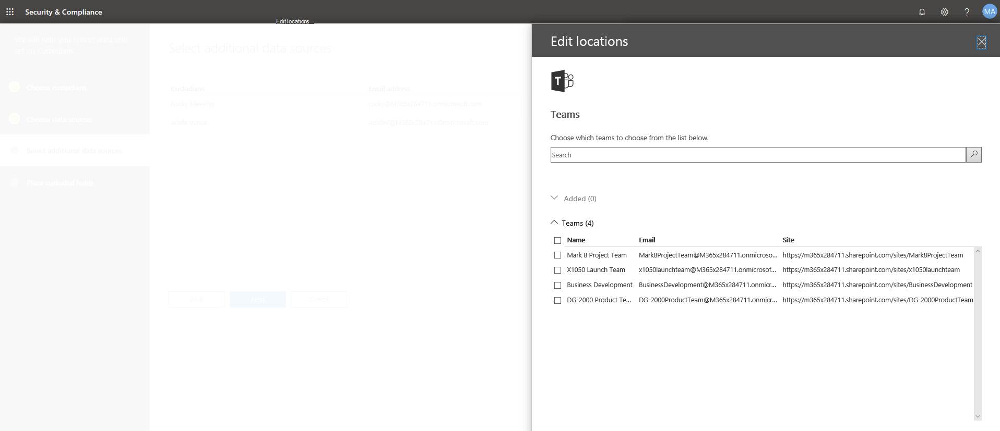

# 高度な電子情報開示ケースに保管担当者を追加するAdd custodians to an Advanced eDiscovery case

Advanced 電子情報開示の組み込みの保管担当者管理ツールを使用して、保管担当者の管理に関するワークフローを調整し、ケースに関連付けられている関連する custodial データソースを特定します。Use the built-in custodian management tool in Advanced eDiscovery to coordinate your workflows around managing custodians and identifying relevant, custodial data sources associated with a case. 保管担当者を追加すると、システムは自動的に Exchange メールボックスと OneDrive for Business アカウントを自動的に識別して保持することができます。When you add a custodian, the system can automatically identify and place a hold on their Exchange mailbox and OneDrive for Business account. 調査の検出プロセスでは、保管担当者がアクセスまたは投稿されたその他のデータソース (メールボックス、サイト、チームなど) を特定することもできます。During the discovery process of your investigation, you might also identify additional data sources (such as mailboxes, sites, or Teams) that a custodian accessed or contributed to. このような状況では、保管担当者管理ツールを使用して、これらのデータソースを特定の保管担当者に関連付けることができます。In this situation, you can use the custodian management tool to associate those data sources will a specific custodian. 保管担当者をケースに追加して、その他のデータソースをそのケースに関連付けると、データをすばやく保持して、custodial データを検索することができます。After you add custodians to a case and associate other data source with them, you can quickly preserve data and search the custodial data.

次のワークフローを使用して、高度な電子情報開示ケースで保管担当者を追加して管理します。Use the following workflow to add and manage custodians in Advanced eDiscovery cases.

![高度な電子情報開示ケースの [ソース] タブ](../media/AeD-Sources-Tab.png)

## 必要なアクセス許可を持っていることを確認するMake sure you have the necessary permissions

ケースに保管担当者を追加するには、電子情報開示マネージャーの役割グループのメンバーである必要があります。To add custodians to a case, you must be a member of the eDiscovery Manager role group. これにより、ケースに保管担当者を追加し、custodial データソースにホールドを配置するために必要なアクセス許可が提供されます。This will provide you with the necessary permissions to add custodians to a case and place a hold on the custodial data sources.

## 手順 1: 潜在的な保管担当者を追加するStep 1: Add potential custodians

最初の手順として、保管担当者を識別し、ケースに追加します。The first step is to identify and add custodians to the case.

1. [ **Advanced eDiscovery**ホーム] ページで、保管担当者を追加するケースをクリックします。On the **Advanced eDiscovery** home page, click the case that you want to add custodians to. 

2. [**ソース**] タブをクリックし、[ **Add 保管担当者**] をクリックします。Click the **Sources** tab and then click **Add custodians**.

3. ケースに追加する保管担当者を見つけます。Find the custodians to add to the case. ユーザー名の最初の部分を入力して、組織の Azure Active Directory のユーザーを表示します。Type the first part of a person's name to display users from your organization's Azure Active Directory. 適切な人物が見つかったら、その名前をクリックして一覧に追加します。When you find the correct person, click their name to add them to the list.

   

4. 関連するすべての保管担当者を追加した後、[**次**へ] をクリックして、保管担当者のプライマリデータソースを選択します。After added all the relevant custodians, click **Next** to select the custodians' primary data sources.
  
## 手順 2: 保管担当者データソースを選択するStep 2: Select custodian data sources

保管担当者を追加した後、保管担当者ツールを使用すると、各保管担当者が所有するプライマリデータソースを識別するのに役立ちます。After adding custodians, the custodian tool will help you identify the primary data sources owned by each custodian. これらのデータの場所は、保管担当者の Exchange メールボックスおよび OneDrive アカウントです。These data locations are the custodian's Exchange mailbox and OneDrive account. 

保管担当者データソースを識別するには、次のようにします。To identify custodian data sources:

1. すべての保管担当者の Exchange メールボックスを選択するには、列の上部にある [ **exchange** ] チェックボックスをオンにします。To select the Exchange mailbox for all custodians, select the **Exchange** check box at the top of the column. その後、特定の保管担当者のチェックボックスをオフにして、メールボックスを custodial の場所として削除することができます。You can then clear the check box for any specific custodian to remove a mailbox as a custodial location. または、列の選択が解除された状態で**Exchange**チェックボックスをオンのままにして、個々の保管担当者のチェックボックスをオンにします。Alternatively, you can leave the **Exchange** check box at the top of the column unselected and then select the check box for individual custodians. 

   

2. 保管担当者の OneDrive アカウントに対して同じことを繰り返します。Repeat the same thing for the custodians' OneDrive accounts. 

    保管担当者データソースを選択すると、システムは自動的にこれらのデータソースを識別して確認し、それを保管担当者に関連付けられたデータソースとしてケースに追加します。After you select the custodian data sources, the system automatically attempts to identify and verify these data sources, and then adds them to the case as data sources associated with the custodians.

3. [**次**へ] をクリックして、追加のデータソースの保管担当者への関連付けを開始します。Click **Next** to begin associating additional data sources to the custodians in the case.

## 手順 3: 追加のデータソースを保管担当者に関連付けるStep 3: Associate additional data sources to a custodian

調査しているケースに応じて、特定の保管担当者がアクセスしている可能性のあるメールボックス、保管担当者が現在メンバーになっている Microsoft 365 グループ、または保管担当者によってもアクセスされているサイトを検索 (および保持) する必要がある場合もあります。Depending on the case you're investigating, you may also need to search (and preserve content in) mailboxes that a specific custodian may have accessed, Microsoft 365 groups that a custodian is currently a member of, or sites that a custodian has also accessed. そのため、前の手順で指定したプライマリ保管担当者データソースに加えて、追加の Microsoft データソースを保管担当者に関連付けることもできます。So in addition to the primary custodian data sources that you specified in the previous step, you can also associate additional Microsoft data sources with a custodian in the case. 

メールボックス、サイト、またはチームを特定の保管担当者にマップするには、次のようにします。To map mailboxes, sites, or teams to a specific custodian:

1. [**追加データソースの選択**] ページで、特定の保管担当者の行にある [**追加**] をクリックします。On the **Select additional data sources** page, click **Add** in the row for the specific custodian. 
  
   

2. フライアウトページでは、次のいずれかのサービスからデータソースを指定できます。On the flyout page, you can specify a data source from any of the following services:
  
   -  **Exchange 電子メール**-[**ユーザー、グループ、またはチームの選択**] をクリックし、[**ユーザー、グループ、またはチームの選択**] をもう一度クリックします。**Exchange email** - Click **Choose users, groups, or Teams** and then click **Choose users, groups, or teams** again. 検索ボックスを使用して、保管担当者に関連付けるメールボックスを検索します。Use the search box to find mailboxes to associate with the custodian. 選択した保管担当者に割り当てるメールボックスを指定するには、検索ボックスを使用してユーザーのメールボックスと配布グループを検索します。To specify mailboxes to assign to the selected custodian, use the search box to find user mailboxes and distribution groups. また、Microsoft 365 グループまたは Microsoft チームに関連付けられたメールボックスを割り当てることもできます。You can also assign the associated mailbox for a Microsoft 365 group or a Microsoft Team. [ユーザー、グループ、チーム] チェックボックスをオンにし、[**選択**] をクリックし、[**完了**] をクリックします。Select the user, group, team check box, click **Choose**, and then click **Done**.

        > [!NOTE]
        > [ユーザー、グループ、またはチームの選択] をクリックしてメールボックスを指定すると、表示されているメールボックスピッカーが空になります。When you click Choose users, groups, or teams to specify mailboxes, the mailbox picker that's displayed is empty. これは、パフォーマンスを向上させるための仕様です。This is by design to enhance performance. このリストにメールボックスを追加するには、検索ボックスに名前またはエイリアス (少なくとも3文字) を入力します。To add mailbox to this list, type a name or alias (a minimum of 3 characters) in the search box.
     
     - **Sharepoint サイト**-[**サイトの選択**] をクリックし、[**サイトの選択**] をもう一度クリックして、組織内の SharePoint サイトのリストを表示します。**SharePoint sites** - Click **Choose sites** and then click **Choose sites** again to display a list of SharePoint sites in your organization. サイトを保管担当者に関連付けるには、一覧からサイトを選択するか、Microsoft 365 グループ、Microsoft teams、または OneDrive アカウントに関連付けられている別のサイトまたはサイトの URL を入力できます。To associate a site with the custodian, you can select a site in the list or you can type the URL of a different site or a site associated with a Microsoft 365 group, Microsoft Team, or a OneDrive account.
     
     - **Teams** – [**チームの選択**] をクリックし、[ **teams の選択**] をもう一度クリックして、保管担当者が現在メンバーになっている Microsoft teams の一覧を表示します。**Teams** – Click **Choose teams** and then click **Choose teams** again to display a list of Microsoft Teams that the custodian is currently a member of. 保管担当者に追加する Teams を選択します。Select the Teams that you would like to add to your custodian. このチェックボックスをオンにすると、関連付けられた SharePoint サイトと、その Microsoft teams に関連付けられているグループメールボックスを選択 & が自動的に識別されます。Once selected, the system will automatically identify & select the associated SharePoint site and Group Mailbox associated to that Microsoft Team. [**選択**] をクリックし、[**完了**] をクリックします。Click **Choose**, and then click **Done**.

       
        
      > [!NOTE]
      > 追加のチームを保管担当者に関連付けるには、 **Exchange メール**および**SharePoint サイト**の場所を使用して、チームに関連付けられているメールボックスとサイトを個別に追加する必要があります。To associate an additional team with a custodian, you have to separately add the mailbox and site associated with the team by using the **Exchange mail** and **SharePoint sites** locations.

保管担当者での追加のデータソースの関連付けを終了すると、 **[その他のデータソースの選択] ページ**の各保管担当者に関連付けられているメールボックス、サイト、およびチームの合計数を表示できます。After you've finished associating additional data sources with the custodians, you can view the total number of mailboxes, sites, and teams associated with each custodian on the **Select additional data sources page**. 特定の保管担当者に関連するデータソースを完成させると、この関連付けは電子情報開示ワークフローのコレクション、処理、およびレビューの各ステージで維持され、使用されます。When you've finalized the relevant data sources for a specific custodian, this association will be maintained and used during the collection, processing, and review stages in eDiscovery workflow.

## 手順 4: 保管担当者を保留にするStep 4: Place custodians on hold

保管担当者およびケースに追加するデータソースの最終処理が完了したら、必要に応じて、一部またはすべての保管担当者を保留にすることができます。After you've finalized the custodians and data sources to add to the case, you can optionally place some or all of the custodians on hold. 保管担当者を保持すると、保管担当者に関連付けられているすべてのコンテンツの場所にあるすべてのコンテンツが保持されます。保留を解除するか、保留リストから保管担当者を解放します。When you place a custodian on hold, all content in all content locations that are associated with the custodian is preserved until you remove the hold or release the custodian from the hold. 場合によっては、保管担当者をホールドの対象にしないで、ケースに追加することもできます。In some cases, you may want to add custodians to a case without placing them on hold.

保管担当者とデータソースを保持するには、次のようにします。To place the custodians and data sources on hold:

1. [選択した**保管担当者ページにホールドを配置**する] で、列の上部にある [**保留**] チェックボックスをオンにして、すべての保管担当者を保留にします。On the **Place a hold on the selected custodians** page, select the **Hold** check box at the top of the column to place all custodians on hold. 保持から削除する特定の保管担当者のチェックボックスをオフにすることができます。You can then clear the check box for any specific custodian to remove from the hold. または、列の選択が解除されている状態で**保持**チェックボックスをオンのままにして、個々の保管担当者のチェックボックスをオンにすることもできます。Alternatively, you can leave the **Hold** check box at the top of the column unselected and then select the check box for individual custodians.

   

2. 保管担当者ホールドの選択を確認し、[**完了**] をクリックします。Verify the custodian hold selections and then click **Complete**.

保管担当者にホールドを設定しない場合、保管担当者と関連データソースがケースに追加されますが、それらのデータソースのコンテンツは保持されません。If you don't place a hold on a custodian, the custodian and their associated data sources will be added to the case but the content in those data sources won't be placed on hold.

保管担当者が保留になると、すべての custodial ソースを含む保管担当者保持ポリシーが自動的に作成されます。After a custodian is placed on hold, a custodian hold policy that contains all custodial sources will be automatically created. このポリシーを表示するにはTo view this policy:

1. ケースの**ホーム**ページで、[**保留**] タブをクリックし、[ **Custodianhold-Guid**] をクリックします。On the **Home** page of the case, click the **Holds** tab and then click **CustodianHold-Guid**,  

2. [ポップアップ] ページで、[**保留リストの編集**] をクリックして、保留になっているすべての保管担当者データソースを表示します。On the flyout page, click **Edit hold** to view all the custodian data sources that are placed on hold.
