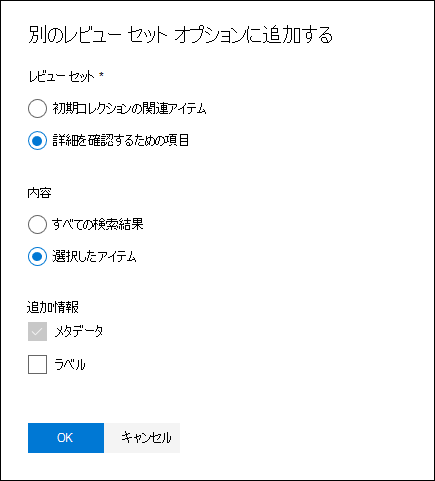

# 別のレビュー セットからレビュー セットにデータを追加

場合によっては、あるレビュー セットからドキュメントを選択し、別のレビュー セットで個別に作業する必要がある場合があります。 これは、レビューセットのコンテンツを選別して、データのサブセットに対して 分析を実行する場合に、特に役立ちます。

この記事のワークフローに従って、あるレビュー セットから別のレビュー セットにコンテンツを追加します。

## レビュー セットを作成する

開始する前に、データを追加するレビュー セットを作成する必要があります。  ケースの [レビュー セット] タブに新しい **レビュー** セットを追加できます。 詳細については、「レビュー セットを [作成する」を参照してください](managing-review-sets.md#create-a-review-set)。

## 手順 1: 別のレビュー セットに追加するコンテンツを識別する

ソース レビュー セットの特定のドキュメントを選択するか、レビュー セット クエリで返されたすべてのアイテムを選択し、レビュー セットから別のレビュー セットにコンテンツを追加できます。 選択したアイテムを追加する場合は、アイテムを選択し、[アクション] を選択し、[別のレビュー セットに追加]**を選択します**。

![[アクション] メニューの別のレビュー セットに追加します。](../media/64f2a4d4-eba3-4ab3-a3ba-d519feea3142.png)

## 手順 2: 別のレビュー セットに追加するためのオプションを指定する

[別の **レビュー セット オプションに追加] フライ** アウト ページで、アイテムを追加するレビュー セットを選択します。 [すべての検索結果] または [ **選択されたアイテム]** **を追加するかどうかを選択します**。  追加情報には、アイテムのすべてのメタデータを含めるオプションと、ドキュメントが新しいレビュー セットに追加される際に、ソース レビュー セットからタグを含める ([ラベル] チェック ボックスをオンにして) 含めるオプションが提供されます。  

[OK] **をクリックすると**、新しいジョブ ([別のレビュー セットにデータを追加 **する]** という名前) が作成され、コンテンツが別のレビュー セットに追加されます。 [ジョブ] タブに **移動** して、このジョブの進行状況を監視できます。 詳細については、「ジョブの管理 [」を参照してください](managing-jobs-ediscovery20.md)。
