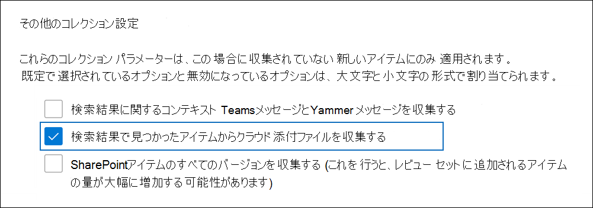
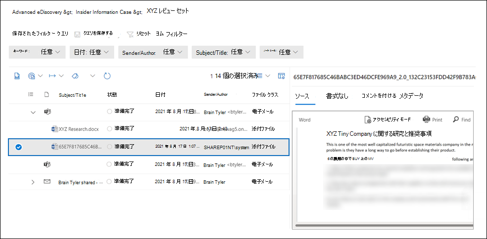

# Microsoft Purview 電子情報開示 (プレミアム) でクラウド添付ファイルを収集する (プレビュー)

[!include[Purview banner](../includes/purview-rebrand-banner.md)]

クラウド添付ファイルは、通常、SharePoint サイトとOneDriveに格納されるドキュメントへのリンクです。 そのため、電子メール メッセージまたはTeamsチャット会話にドキュメントの実際のコピーを添付する代わりに、ファイルへのリンクを共有することもできます。 クラウド添付ファイルは、ドキュメントを共有し、組織内の他のユーザーと共同作業する効果的な方法です。 ただし、クラウド添付ファイルは電子情報開示ワークフロー中に課題を提示します。これは、共有ドキュメント内の実際のコンテンツではなく、クラウド添付ファイルリンクのみが電子情報開示検索で返されるためです。 この課題に対処するために、電子情報開示 (プレミアム) には、クラウド添付ファイルを収集するための 2 つのソリューションが用意されています。  

- クラウド添付ファイルにリンクされているドキュメントのライブ バージョンを収集する。

- クラウド添付ファイルで共有された時点のドキュメントのバージョンを収集します。

## クラウド添付ファイルの収集

下書きコレクションを作成し、検索結果にクラウド添付ファイルを含むアイテムが含まれている場合は、下書きコレクションをレビュー セットにコミットするときに、クラウド添付ファイルのターゲットを収集するオプションが必要です。 このオプションを選択すると、電子情報開示 (プレミアム) によって、クラウド添付ファイルにリンクされているドキュメントがレビュー セットに追加されます。 これにより、対象のドキュメントを確認し、そのドキュメントがケースまたは調査に関連しているかどうかを判断できます。

次のスクリーンショットは、コレクションをレビュー セットにコミットするときにクラウド添付ファイルのターゲットを含めるオプションを示しています。

> [!NOTE]
>- 電子情報開示 (プレミアム) で[新しいケース形式](advanced-ediscovery-new-case-format.md)を使用する場合、レビュー セットにクラウド添付ファイルを含めるオプションは既定で選択されており、選択を解除することはできません。 
>- また、レビュー セットにクラウド添付ファイルのすべてのバージョン (共有されたバージョンに加えて) を含めることもできます。  
コレクションをレビュー セットにコミットする手順については、「レビュー セットに [下書きコレクションをコミットする」を](commit-draft-collection.md)参照してください。

## クラウド添付ファイルで共有されているバージョンを収集する

クラウド添付ファイルを収集するための電子情報開示 (プレミアム) ワークフローには、最新バージョンのクラウド添付ファイルをレビュー セットに追加することのみが含まれます。 つまり、レビュー セットに収集および追加されるバージョンは、クラウド添付ファイルで最初に共有されていたバージョンとは異なる可能性があります。 そのため、共有時にクラウド添付ファイルに存在していたコンテンツが削除され、レビュー セットに追加された現在のバージョンに存在しない可能性があります。

組織では、Microsoft 365保持ラベルを使用して、ドキュメントがクラウド添付ファイルとして共有された時点でドキュメントのバージョンを保持するオプションが追加されました。 これを行うには、組織で保持ラベルを作成し、ラベルをクラウド添付ファイルに適用するオプションを選択し、SharePointおよびOneDriveに格納されているドキュメントにラベルを自動的に適用します。 この構成を設定すると、ファイルが共有された時点でドキュメントのコピーが作成されます。 また、ドキュメントが変更され、クラウド添付ファイルとして再び共有された場合、変更されたバージョンも保持されます。 ファイルが変更され、再び共有された場合、新しいバージョンとしてのファイルの新しいコピーが保持されます。

クラウド添付ファイルの共有バージョンを保持すると、組織は、関連する可能性があるコンテンツの保存と収集を、現在のライブ バージョンではなく共有されたドキュメントの特定のバージョンに限定するのに役立ちます。 この保持ソリューションを実装すると、クラウド添付ファイルの現在のライブ バージョンと、クラウド添付ファイルで共有されたバージョンの両方が収集され、レビュー セットに追加されます。

保持ラベルを設定し、クラウド添付ファイルに自動的に適用する手順については、「クラウド添付ファイル [にラベルを自動適用する」を](apply-retention-labels-automatically.md#auto-apply-labels-to-cloud-attachments)参照してください。

次のスクリーンショットは、レビュー セットに追加されたクラウド添付ファイル ドキュメント ( *XYZ Research.docx*) を示しています。 ドキュメントは、Teamsチャット会話でクラウド添付ファイルとして共有されました。 レビュー セットには、クラウド添付ファイルで最初に共有されていたバージョンも含まれています。 このバージョンのクラウド添付ファイルの名前はシステムによって生成され、作成者は **SharePoint** として識別されます。

さらに、現在のライブ バージョンと共有されたバージョンには、親オブジェクトの **FamilyId** と同じ **FamilyId** プロパティ値があります (電子メール メッセージやチャット会話Teamsなど)。 これにより、クラウドの添付ファイルを、それらが共有されたアイテムとグループ化できます。

保持ラベルを実装し、SharePointドキュメントにラベルを自動適用した後も、下書きコレクションをレビュー セットにコミットするときにクラウド添付ファイルを収集するオプションを選択します。 クラウド添付ファイルが収集されると、現在のライブ バージョンと最初に共有されたバージョンの両方がレビュー セットに追加されます。
