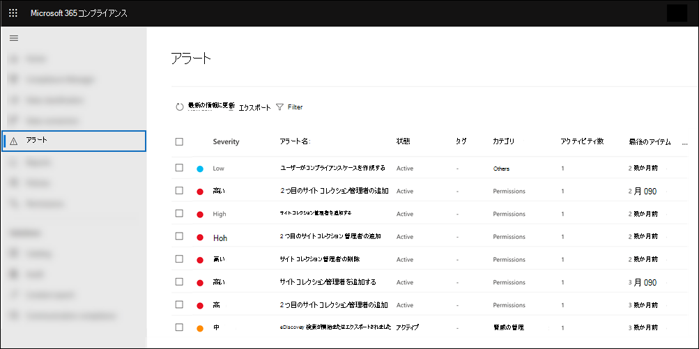

# <a name="alert-policies-in-microsoft-365"></a>Microsoft 365 のアラート ポリシー

Microsoft Purview コンプライアンス ポータルまたはMicrosoft 365 Defender ポータルのアラート ポリシーとアラート ダッシュボードを使用してアラート ポリシーを作成し、ユーザーがアラート ポリシーの条件に一致するアクティビティを実行したときに生成されたアラートを表示できます。 Exchange Onlineでの管理者特権の割り当て、マルウェア攻撃、フィッシング キャンペーン、ファイルの削除や外部共有の異常なレベルなど、アクティビティを監視するのに役立つ既定のアラート ポリシーがいくつかあります。

> [!TIP]
> 使用可能なアラート ポリシーの一覧と説明については、この記事の [[既定](#default-alert-policies) のアラート ポリシー] セクションを参照してください。

アラート ポリシーを使用すると、ポリシーによってトリガーされるアラートを分類し、組織内のすべてのユーザーにポリシーを適用し、アラートがトリガーされるタイミングのしきい値レベルを設定し、アラートがトリガーされたときにメール通知を受信するかどうかを決定できます。 アラートを表示およびフィルター処理したり、アラートの管理に役立つアラート状態を設定したり、基になるインシデントに対処または解決した後でアラートを閉じる **アラート ページもあります** 。

> [!NOTE]
> アラート ポリシーは、Microsoft 365 Enterprise、Office 365 Enterprise、または米国政府機関 E1/F1/G1、E3/F3/G3、または E5/G5 サブスクリプションOffice 365組織で使用できます。 高度な機能は、E5/G5 サブスクリプションを持つ組織、または E1/F1/G1 または E3/F3/G3 サブスクリプションを持ち、Microsoft Defender for Office 365 P2 またはMicrosoft 365 E5 Complianceまたは E5 電子情報開示および監査アドオン サブスクリプションを持つ組織でのみ使用できます。 このトピックでは、E5/G5 またはアドオン サブスクリプションを必要とする機能について説明します。 また、アラート ポリシーは、Office 365 GCC、GCC High、DoD の米国政府機関の環境で使用できることにも注意してください。

## <a name="how-alert-policies-work"></a>アラート ポリシーの動作

アラート ポリシーのしくみと、ユーザーまたは管理者のアクティビティがアラート ポリシーの条件と一致したときにトリガーされるアラートの概要を次に示します。


1. 組織内の管理者は、コンプライアンス ポータルまたはMicrosoft 365 Defender ポータルの [アラート ポリシー] ページを使用して **、アラート ポリシー** を作成、構成、およびオンにします。 セキュリティ & コンプライアンス センター PowerShell の [New-ProtectionAlert](/powershell/module/exchange/new-protectionalert) コマンドレットを使用して、アラート ポリシーを作成することもできます。

   アラート ポリシーを作成するには、コンプライアンス ポータルまたは Defender ポータルでアラートの管理ロールまたは組織構成ロールを割り当てる必要があります。

   > [!NOTE]
   > アラート ポリシーを作成または更新してから、ポリシーによってアラートをトリガーできるようになるまでに最大 24 時間かかります。 これは、ポリシーをアラート検出エンジンに同期する必要があるためです。

2. ユーザーは、アラート ポリシーの条件に一致するアクティビティを実行します。 マルウェア攻撃の場合、組織内のユーザーに送信された感染した電子メール メッセージによってアラートがトリガーされます。

3. Microsoft 365は、コンプライアンス ポータルまたは Defender ポータルの [**アラート]** ページに表示されるアラートを生成します。 また、アラート ポリシーに対して電子メール通知が有効になっている場合、Microsoft は受信者の一覧に通知を送信します。 管理者または他のユーザーが [アラート] ページで確認できるアラートは、ユーザーに割り当てられたロールによって決まります。 詳細については、「アラートを [表示するために必要な RBAC アクセス許可」を参照してください](#rbac-permissions-required-to-view-alerts)。

4. 管理者は、コンプライアンス センターでアラートを管理します。 アラートの管理は、調査の追跡と管理に役立つアラートの状態を割り当てることで構成されます。

## <a name="alert-policy-settings"></a>アラート ポリシーの設定

アラート ポリシーは、アラートを生成するユーザーまたは管理者アクティビティを定義する一連のルールと条件、アクティビティを実行した場合にアラートをトリガーするユーザーのリスト、およびアラートがトリガーされる前にアクティビティが発生する必要がある回数を定義するしきい値で構成されます。  また、ポリシーを分類し、重大度のレベルを割り当てます。 この 2 つの設定は、ポリシーの管理時とコンプライアンス センターでのアラートの表示時にこれらの設定をフィルター処理できるため、アラート ポリシー (およびポリシー条件が一致したときにトリガーされるアラート) を管理するのに役立ちます。 たとえば、同じカテゴリの条件に一致するアラートを表示したり、同じ重大度レベルのアラートを表示したりできます。

アラート ポリシーを表示して作成するには:

### <a name="microsoft-purview-compliance-portal"></a>Microsoft Purview コンプライアンス ポータル

<a href="https://go.microsoft.com/fwlink/p/?linkid=2077149" target="_blank">コンプライアンス ポータル</a>に移動し、**PoliciesAlertAlert** >  >  **ポリシー** を選択します。

![コンプライアンス センターで [ポリシー] を選択し、[アラート] で [アラート ポリシー] を選択して、アラート ポリシーを表示および作成します。](../media/LaunchAlertPoliciesMCC.png)

### <a name="microsoft-365-defender-portal"></a>Microsoft 365 Defender ポータル

<a href="https://go.microsoft.com/fwlink/p/?linkid=2077139" target="_blank">Microsoft 365 Defender ポータル</a>に移動し、[**電子メール & コラボレーション**] で [**ポリシー& rulesAlert** >  ポリシー] を選択 **します**。 または、. に直接 <https://security.microsoft.com/alertpolicies>移動することもできます。

![Defender ポータルで、[電子メール &コラボレーション] で [ポリシー&ルール] を選択し、[アラート ポリシー] を選択してアラート ポリシーを表示および作成します。](../media/LaunchAlertPoliciesDefenderPortal.png)

> [!NOTE]
> コンプライアンス センターまたは Defender ポータルでアラート ポリシーを表示するには、View-Onlyアラートの管理ロールを割り当てる必要があります。 アラート ポリシーを作成および編集するには、アラートの管理ロールを割り当てる必要があります。 詳細については、「 [セキュリティとコンプライアンス センターのアクセス許可」を参照してください](../security/office-365-security/permissions-in-the-security-and-compliance-center.md)。

アラート ポリシーは、次の設定と条件で構成されます。

- **アラートが追跡しているアクティビティ**。 アクティビティを追跡するポリシーを作成します。場合によっては、ファイルを外部ユーザーと共有したり、アクセス許可を割り当てたり、匿名リンクを作成したりするなど、いくつかの関連するアクティビティを作成します。 ポリシーによって定義されているアクティビティをユーザーが実行すると、アラートしきい値の設定に基づいてアラートがトリガーされます。

    > [!NOTE]
    > 追跡できるアクティビティは、組織のOffice 365 Enterpriseまたは米国政府の計画Office 365異なります。 一般に、マルウェア キャンペーンやフィッシング攻撃に関連するアクティビティには、E5/G5 サブスクリプション、または E1/F1/G1 または E3/F3/G3 サブスクリプションと[Defender for Office 365](../security/office-365-security/defender-for-office-365.md)プラン 2 アドオン サブスクリプションが必要です。

- **アクティビティの条件**。 ほとんどのアクティビティでは、アラートをトリガーするために満たす必要がある追加の条件を定義できます。 一般的な条件には、IP アドレス (ユーザーが特定の IP アドレスまたは IP アドレス範囲内のコンピューターでアクティビティを実行したときにアラートがトリガーされるように)、特定のユーザーまたはユーザーがそのアクティビティを実行した場合にアラートがトリガーされるかどうか、およびアクティビティが特定のファイル名または URL で実行されるかどうかが含まれます。 また、組織内の任意のユーザーがアクティビティを実行したときにアラートをトリガーする条件を構成することもできます。 使用可能な条件は、選択したアクティビティによって異なります。

アラート ポリシーの条件としてユーザー タグを定義することもできます。 これにより、影響を受けるユーザーのコンテキストを含めるアラートがポリシーによってトリガーされます。 システム ユーザー タグまたはカスタム ユーザー タグを使用できます。 詳細については、「[Microsoft Defender for Office 365のユーザー タグ](/microsoft-365/security/office-365-security/user-tags)」を参照してください。

- **アラートがトリガーされたとき**。 アラートがトリガーされる前にアクティビティが発生する頻度を定義する設定を構成できます。 これにより、アクティビティがポリシー条件と一致するたびに、特定のしきい値を超えた場合、またはアラートが追跡しているアクティビティの発生が組織にとって異常になったときに、アラートを生成するポリシーを設定できます。

    

    異常なアクティビティに基づいて設定を選択した場合、Microsoft は、選択したアクティビティの通常の頻度を定義するベースライン値を確立します。 このベースラインの確立には最大 7 日間かかります。その間、アラートは生成されません。 ベースラインが確立されると、アラート ポリシーによって追跡されるアクティビティの頻度がベースライン値を大きく超えると、アラートがトリガーされます。 監査関連のアクティビティ (ファイルアクティビティやフォルダー アクティビティなど) の場合は、1 人のユーザーまたは組織内のすべてのユーザーに基づいてベースラインを確立できます。マルウェア関連のアクティビティの場合は、単一のマルウェア ファミリ、単一の受信者、または組織内のすべてのメッセージに基づいてベースラインを確立できます。

    > [!NOTE]
    > しきい値または異常なアクティビティに基づいてアラート ポリシーを構成するには、E5/G5 サブスクリプション、または E1/F1/G1 または E3/F3/G3 サブスクリプションで、Microsoft Defender for Office 365 P2、Microsoft 365 E5 Compliance、またはMicrosoft 365電子情報開示と監査アドオンが必要ですサブスクリプション。 E1/F1/G1 および E3/F3/G3 サブスクリプションを持つ組織では、アクティビティが発生するたびにアラートがトリガーされるアラート ポリシーのみを作成できます。

- **アラート カテゴリ**。 ポリシーによって生成されたアラートの追跡と管理を支援するために、次のいずれかのカテゴリをポリシーに割り当てることができます。

  - データ損失防止

  - 情報ガバナンス

  - メール フロー

  - Permissions

  - 脅威の管理

  - Others

  アラート ポリシーの条件に一致するアクティビティが発生すると、生成されたアラートには、この設定で定義されているカテゴリがタグ付けされます。 これにより、コンプライアンス センターの [アラート **] ページで** 同じカテゴリ設定を持つアラートを追跡および管理できます。これは、カテゴリに基づいてアラートを並べ替え、フィルター処理できるためです。

- **アラートの重大度**。 アラート カテゴリと同様に、重大度属性 (**低**、 **中**、 **高**、または **情報**) をアラート ポリシーに割り当てます。 アラート カテゴリと同じく、アラート ポリシーの条件を満たすアクティビティが発生した場合、生成されるアラートには、アラート ポリシーに設定されているものと同じ重大度レベルのタグが付けられます。 繰り返しになりますが、これにより、[ **アラート]** ページで同じ重大度設定を持つアラートを追跡および管理できます。 たとえば、重大度が **高い** アラートのみが表示されるように、アラートの一覧をフィルター処理できます。

    > [!TIP]
    > アラート ポリシーを設定する場合は、ユーザーへの配信後のマルウェアの検出、機密データまたは分類されたデータの表示、外部ユーザーとのデータの共有、データ損失やセキュリティの脅威につながる可能性があるその他のアクティビティなど、重大な悪影響を及ぼす可能性があるアクティビティに重大度を高く割り当てることを検討してください。 これにより、アラートと、基になる原因を調査して解決するために実行するアクションに優先順位を付けることができます。

- **自動調査**。 一部のアラートでは、修復または軽減策が必要な潜在的な脅威とリスクを特定するための自動調査がトリガーされます。  ほとんどの場合、これらのアラートは悪意のあるメールやアクティビティの検出によってトリガーされますが、場合によっては、セキュリティ ポータルの管理者アクションによってアラートがトリガーされます。  自動調査の詳細については、[Microsoft Defender for Office 365の自動調査と対応 (AIR) に関するページを](../security/office-365-security/office-365-air.md)参照してください。

- **電子メール通知**。 アラートがトリガーされたときに電子メール通知がユーザーの一覧に送信 (または送信されない) ようにポリシーを設定できます。 通知の最大数に達すると、その日にアラートに対してそれ以上通知が送信されないように、1 日の通知制限を設定することもできます。 電子メール通知に加えて、ユーザーまたは他の管理者は、ポリシーによってトリガーされるアラートを **[アラート]** ページで表示できます。 特定のカテゴリまたは重大度が高いアラート ポリシーに対して電子メール通知を有効にすることを検討してください。

## <a name="default-alert-policies"></a>既定のアラート ポリシー

Microsoft では、管理者のアクセス許可の悪用、マルウェア アクティビティ、潜在的な外部および内部の脅威、および情報ガバナンス リスクExchange特定するのに役立つ組み込みのアラート ポリシーを提供しています。 [ **アラート ポリシー** ] ページで、これらの組み込みポリシーの名前は太字で表示され、ポリシーの種類は **System** として定義されます。 これらのポリシーは既定で有効になっています。 これらのポリシーを無効にするか、もう一度オンに戻したり、電子メール通知を送信する受信者の一覧を設定したり、1 日の通知制限を設定したりできます。 これらのポリシーの他の設定は編集できません。

次の表に、使用可能な既定のアラート ポリシーと、各ポリシーが割り当てられているカテゴリを示します。 カテゴリは、ユーザーが [アラート] ページで表示できるアラートを決定するために使用されます。 詳細については、「アラートを [表示するために必要な RBAC アクセス許可」を参照してください](#rbac-permissions-required-to-view-alerts)。

この表には、各プランに必要なOffice 365 Enterpriseと米国政府の計画Office 365も示されています。 組織が E1/F1/G1 または E3/F3/G3 サブスクリプションに加えて、適切なアドオン サブスクリプションを持っている場合は、一部の既定のアラート ポリシーを使用できます。
 
| 既定のアラート ポリシー | 説明 | カテゴリ | 自動調査 | サブスクリプションをEnterpriseする |
|:-----|:-----|:-----|:-----|:-----|
|**悪意のある可能性がある URL のクリックが検出されました**|組織内の [セーフ リンク](../security/office-365-security/safe-links.md)によって保護されたユーザーが悪意のあるリンクをクリックしたときにアラートを生成します。 このイベントは、URL の判定の変更がMicrosoft Defender for Office 365によって識別されたとき、またはユーザーが セーフ リンク ページをオーバーライドするときにトリガーされます (組織のビジネス セーフ リンク ポリシーのMicrosoft 365に基づく)。 このアラート ポリシーには、 **重大度が高い** 設定があります。 Defender for Office 365 P2、E5、G5 のお客様の場合、このアラートにより、[Office 365での自動調査と応答が自動的にトリガーされます](../security/office-365-security/office-365-air.md)。 このアラートをトリガーするイベントの詳細については、「[リンク ポリシーセーフ設定](../security/office-365-security/set-up-safe-links-policies.md)する」を参照してください。|脅威の管理|はい|E5/G5 または Defender for Office 365 P2 アドオン サブスクリプション|
|**管理者の提出結果が完了しました**|[管理者申請](../security/office-365-security/admin-submission.md)が送信されたエンティティの再スキャンを完了したときにアラートを生成します。 管理者申請から再スキャン結果がレンダリングされるたびに、アラートがトリガーされます。 これらのアラートは、 [以前の提出の結果を確認](https://compliance.microsoft.com/reportsubmission)し、ユーザーが報告したメッセージを送信して最新のポリシー チェックと再スキャンの判定を行い、組織内のフィルター処理ポリシーが意図した影響を与えているかどうかを判断するのに役立ちます。 このポリシーには、 **情報の** 重大度設定があります。|脅威の管理|いいえ|E1/F1、E3/F3、または E5|
|**管理者が電子メールの手動調査をトリガーしました**|管理者が脅威エクスプローラーから電子メールの手動調査をトリガーしたときにアラートを生成します。 詳細については、「 [例: セキュリティ管理者が脅威エクスプローラーから調査をトリガーする」を参照してください](../security/office-365-security/automated-investigation-response-office.md#example-a-security-administrator-triggers-an-investigation-from-threat-explorer)。 このアラートは、調査が開始されたことを組織に通知します。 アラートには、誰がトリガーしたかに関する情報が表示され、調査へのリンクが含まれます。 このポリシーには、 **情報の** 重大度設定があります。|脅威の管理|はい|E5/G5 または Microsoft Defender for Office 365 P2 アドオン サブスクリプション|
|**管理者によってトリガーされたユーザー侵害調査**|管理者が脅威エクスプローラーから電子メールの送信者または受信者の手動のユーザー侵害調査をトリガーしたときにアラートを生成します。 詳細については、「 [例: セキュリティ管理者が脅威エクスプローラーから調査をトリガーする](../security/office-365-security/automated-investigation-response-office.md#example-a-security-administrator-triggers-an-investigation-from-threat-explorer)」を参照してください。これは、電子メールに対する調査の関連する手動トリガーを示しています。 このアラートは、ユーザー侵害の調査が開始されたことを組織に通知します。 アラートには、誰がトリガーしたかに関する情報が表示され、調査へのリンクが含まれます。 このポリシーには **、中程度** の重大度設定があります。|脅威の管理|はい|E5/G5 または Microsoft Defender for Office 365 P2 アドオン サブスクリプション|
|**転送/リダイレクト ルールの作成**|組織内のユーザーがメールボックスの受信トレイ ルールを作成し、メッセージを別の電子メール アカウントに転送またはリダイレクトするときにアラートを生成します。 このポリシーは、Outlook on the web (以前はOutlook Web Appと呼ばられていました) または PowerShell Exchange Onlineを使用して作成された受信トレイルールのみを追跡します。 このポリシーには、 **情報の** 重大度設定があります。 受信トレイ ルールを使用してOutlook on the webで電子メールを転送およびリダイレクトする方法の詳細については、「[Outlook on the webのルールを使用して別のアカウントにメッセージを自動的に転送する」を参照してください](https://support.office.com/article/1433e3a0-7fb0-4999-b536-50e05cb67fed)。|脅威の管理|いいえ|E1/F1/G1、E3/F3/G3、または E5/G5|
|**eDiscovery 検索が開始またはエクスポートされました**|セキュリティとコンプライアンス センターで他のユーザーがコンテンツ検索ツールを使用したときにアラートを生成します。 次のコンテンツ検索アクティビティが実行されると、アラートがトリガーされます。 <br><br> <li> コンテンツ検索が開始される <li> コンテンツ検索の結果がエクスポートされます <li> コンテンツ検索レポートがエクスポートされる <br><br> アラートは、以前のコンテンツ検索アクティビティが電子情報開示ケースと関連付けて実行されたときにもトリガーされます。 このポリシーには、 **情報の** 重大度設定があります。 コンテンツ検索アクティビティの詳細については、「 [監査ログで電子情報開示アクティビティを検索する」を参照してください](search-for-ediscovery-activities-in-the-audit-log.md#ediscovery-activities)。|脅威の管理|いいえ|E1/F1/G1、E3/F3/G3、または E5/G5|
|**Exchange管理者特権の昇格**|Exchange Online組織内の管理者アクセス許可が他のユーザーに割り当てられたときにアラートを生成します。 たとえば、Exchange Onlineの組織管理役割グループにユーザーが追加された場合などです。 このポリシーには、 **重大度が低** い設定があります。|アクセス許可|いいえ|E1/F1/G1、E3/F3/G3、または E5/G5|
|**配信後に削除された悪意のあるファイルを含むメール メッセージ**|悪意のあるファイルを含むメッセージが組織内のメールボックスに配信されたときにアラートを生成します。 このイベントが発生した場合、Microsoft は[ゼロ時間の自動消去](../security/office-365-security/zero-hour-auto-purge.md)を使用して、Exchange Onlineメールボックスから感染したメッセージを削除します。 このポリシーには **、情報の** 重大度設定があり、[Office 365の自動調査と応答が自動的にトリガーされます](../security/office-365-security/office-365-air.md)。 この新しいポリシーの詳細については、「[Microsoft Defender for Office 365の新しいアラート ポリシー](new-defender-alert-policies.md)」を参照してください。|脅威の管理|はい|E5/G5 または Microsoft Defender for Office 365 P2 アドオン サブスクリプション|
|**配信後に削除された悪意のある URL を含む電子メール メッセージ**|悪意のある URL を含むメッセージが組織内のメールボックスに配信されたときにアラートを生成します。 このイベントが発生した場合、Microsoft は[ゼロ時間の自動消去](../security/office-365-security/zero-hour-auto-purge.md)を使用して、Exchange Onlineメールボックスから感染したメッセージを削除します。 このポリシーには **、情報の** 重大度設定があり、[Office 365の自動調査と応答が自動的にトリガーされます](../security/office-365-security/office-365-air.md)。 この新しいポリシーの詳細については、「[Microsoft Defender for Office 365の新しいアラート ポリシー](new-defender-alert-policies.md)」を参照してください。|脅威の管理|はい|E5/G5 または Defender for Office 365 P2 アドオン サブスクリプション|
|**配信後に削除されたキャンペーンからのメール メッセージ**|[キャンペーン](../security/office-365-security/campaigns.md)に関連付けられているメッセージが組織内のメールボックスに配信されたときにアラートを生成します。 このイベントが発生した場合、Microsoft は[ゼロ時間の自動消去](../security/office-365-security/zero-hour-auto-purge.md)を使用して、Exchange Onlineメールボックスから感染したメッセージを削除します。 このポリシーには **、情報の** 重大度設定があり、[Office 365の自動調査と応答が自動的にトリガーされます](../security/office-365-security/office-365-air.md)。 この新しいポリシーの詳細については、「[Microsoft Defender for Office 365の新しいアラート ポリシー](new-defender-alert-policies.md)」を参照してください。|脅威の管理|はい|E5/G5 または Defender for Office 365 P2 アドオン サブスクリプション|
|**メール メッセージが配信後に削除されました**|悪意のあるエンティティ (URL またはファイル) を含まない、またはキャンペーンに関連付けられている悪意のあるメッセージが組織内のメールボックスに配信されたときにアラートを生成します。 このイベントが発生した場合、Microsoft は[ゼロ時間の自動消去](../security/office-365-security/zero-hour-auto-purge.md)を使用して、Exchange Onlineメールボックスから感染したメッセージを削除します。 このポリシーには **、情報の** 重大度設定があり、[Office 365の自動調査と応答が自動的にトリガーされます](../security/office-365-security/office-365-air.md)。 この新しいポリシーの詳細については、「[Microsoft Defender for Office 365の新しいアラート ポリシー](new-defender-alert-policies.md)」を参照してください。|脅威の管理|はい|E5/G5 または Defender for Office 365 P2 アドオン サブスクリプション|
|**ユーザーによってマルウェアまたはフィッシングとして報告されたメール**|組織内のユーザーがレポート メッセージ アドインを使用してフィッシング メールとしてメッセージを報告するときにアラートを生成します。 このポリシーの重大度が **低** い設定です。 このアドインの詳細については、「 [レポート メッセージ アドインを使用する」を](https://support.office.com/article/b5caa9f1-cdf3-4443-af8c-ff724ea719d2)参照してください。 Defender for Office 365 P2、E5、G5 のお客様の場合、このアラートにより、[Office 365での自動調査と応答が自動的にトリガーされます](../security/office-365-security/office-365-air.md)。|脅威の管理|はい|E1/F1/G1、E3/F3/G3、または E5/G5|
|**電子メール送信の制限を超えました**|組織内のユーザーが送信スパム ポリシーで許可されているメール数を超えるメールを送信したときにアラートを生成します。 これは通常、ユーザーがメールを送信しすぎているか、アカウントが侵害されている可能性があることを示しています。 このポリシーには **、中程度** の重大度設定があります。 このアラート ポリシーによって生成されたアラートを取得する場合 [は、ユーザー アカウントが侵害されているかどうかを確認](../security/office-365-security/responding-to-a-compromised-email-account.md)することをお勧めします。|脅威の管理|いいえ|E1/F1/G1、E3/F3/G3、または E5/G5|
|**フィッシング詐欺の可能性が原因でブロックされたフォーム**|フィッシングの繰り返しの動作が検出されたため、組織内のユーザーがフォームの共有とMicrosoft Formsを使用した応答の収集を制限されたときにアラートを生成します。 このポリシーには、 **重大度が高い設定があります** 。|脅威の管理|いいえ|E1、E3/F3、または E5|
|**フラグが設定され、フィッシングが確認されたフォーム**|組織内からMicrosoft Formsで作成されたフォームが、レポートの不正使用を通じて潜在的なフィッシングとして識別され、Microsoft によってフィッシングとして確認されたときにアラートを生成します。 このポリシーには、 **重大度が高い** 設定があります。|脅威の管理|いいえ|E1、E3/F3、または E5|
|**メッセージが遅延しました**|Microsoft がコネクタを使用してオンプレミスの組織またはパートナー サーバーに電子メール メッセージを配信できない場合にアラートを生成します。 この場合、メッセージはOffice 365にキューに入れられます。 このアラートは、1 時間以上キューに登録されているメッセージが 2,000 件以上ある場合にトリガーされます。 このポリシーには、 **重大度が高い** 設定があります。|メール フロー|いいえ|E1/F1/G1、E3/F3/G3、または E5/G5|
|**配信後に検出されたマルウェア キャンペーン**|マルウェアを含む異常に多くのメッセージが組織内のメールボックスに配信されたときにアラートを生成します。 このイベントが発生した場合、Microsoft はExchange Onlineメールボックスから感染したメッセージを削除します。 このポリシーには、 **重大度が高い** 設定があります。|脅威の管理|いいえ|E5/G5 または Microsoft Defender for Office 365 P2 アドオン サブスクリプション|
|**マルウェア キャンペーンの検出とブロック**|特定の種類のマルウェアを含む電子メール メッセージの数が異常に多いユーザーを組織内のユーザーに送信しようとしたときにアラートを生成します。 このイベントが発生した場合、感染したメッセージは Microsoft によってブロックされ、メールボックスには配信されません。 このポリシーには、 **重大度が低** い設定があります。|脅威の管理|いいえ|E5/G5 または Defender for Office 365 P2 アドオン サブスクリプション|
|**SharePointおよびOneDriveで検出されたマルウェア キャンペーン**|組織のSharePoint サイトまたはOneDrive アカウントにあるファイルで異常に大量のマルウェアやウイルスが検出された場合にアラートを生成します。 このポリシーには、 **重大度が高い** 設定があります。|脅威の管理|いいえ|E5/G5 または Defender for Office 365 P2 アドオン サブスクリプション|
|**ZAP が無効になっているため、マルウェアがザップされない**| Zero-Hourフィッシング メッセージの自動消去が無効になっているため、Microsoft がメールボックスへのマルウェア メッセージの配信を検出したときにアラートを生成します。 このポリシーには、 **情報の** 重大度設定があります。 |脅威の管理|いいえ|E5/G5 または Defender for Office 365 P2 アドオン サブスクリプション|
|**ユーザーの迷惑メール フォルダーが無効になっているため、フィッシングが配信されました**|Microsoft がユーザーの迷惑メール フォルダーが無効になっていることを検出したときにアラートを生成し、信頼度の高いフィッシング メッセージをメールボックスに配信できるようにします。 このポリシーには、 **情報の** 重大度設定があります。|脅威の管理|いいえ|E1/F1/G1、E3/F3/G3、または E5/G5|
|**ETR オーバーライドが原因で配信されたフィッシング**|Microsoft が、信頼度の高いフィッシング メッセージをメールボックスに配信できるExchangeトランスポート ルール (ETR) を検出したときにアラートを生成します。 このポリシーには、 **情報の** 重大度設定があります。 Exchangeトランスポート ルール (メール フロー ルール) の詳細については、「[Exchange Onlineのメール フロー ルール (トランスポート ルール)」](/exchange/security-and-compliance/mail-flow-rules/mail-flow-rules)を参照してください。|脅威の管理|いいえ|E1/F1/G1、E3/F3/G3、または E5/G5|
|**IP 許可ポリシーが原因で配信されたフィッシング**|信頼度の高いフィッシング メッセージをメールボックスに配信できる IP 許可ポリシーが Microsoft によって検出されたときにアラートを生成します。 このポリシーには、 **情報の** 重大度設定があります。 IP 許可ポリシー (接続フィルター) の詳細については、「[既定の接続フィルター ポリシーの構成 - Office 365](../security/office-365-security/configure-the-connection-filter-policy.md)」を参照してください。|脅威の管理|いいえ|E1/F1/G1、E3/F3/G3、または E5/G5|
|**ZAP が無効になっているため、フィッシングがザップされない**| フィッシングメッセージの自動消去が無効になっているため、Microsoft がメールボックスへの信頼度の高いフィッシング メッセージの配信を検出したときにアラートZero-Hour生成します。 このポリシーには、 **情報の** 重大度設定があります。|脅威の管理|いいえ|E5/G5 または Defender for Office 365 P2 アドオン サブスクリプション|
|**テナントまたはユーザーのオーバーライド 1 が原因で配信されたフィッシング**<sup></sup>|Microsoft が管理者またはユーザーのオーバーライドがメールボックスへのフィッシング メッセージの配信を許可していることを検出したときにアラートを生成します。 オーバーライドの例には、特定の送信者またはドメインからのメッセージを許可する受信トレイまたはメール フロー ルール、または特定の送信者またはドメインからのメッセージを許可するスパム対策ポリシーが含まれます。 このポリシーには、 **重大度が高い** 設定があります。|脅威の管理|いいえ|E5/G5 または Defender for Office 365 P2 アドオン サブスクリプション|
|**疑わしいメール転送アクティビティ**|組織内のユーザーが疑わしい外部アカウントに電子メールを自動転送したときにアラートを生成します。 これは、アカウントが侵害されている可能性がありますが、ユーザーを制限するのに十分なほど重大ではない可能性がある動作に対する早期警告です。 このポリシーには、 **重大度が高い** 設定があります。 まれですが、このポリシーによって生成されたアラートは異常である可能性があります。 [ユーザー アカウントが侵害されているかどうかを確認](../security/office-365-security/responding-to-a-compromised-email-account.md)することをお勧めします。|脅威の管理|いいえ|E1/F1/G1、E3/F3/G3、または E5/G5|
|**疑わしい電子メール送信パターンが検出されました**|組織内のユーザーが疑わしいメールを送信し、電子メールの送信を制限されるリスクがある場合にアラートを生成します。 これは、アカウントが侵害されている可能性がありますが、ユーザーを制限するのに十分なほど重大ではない可能性がある動作の早期警告です。 このポリシーには **、中程度** の重大度設定があります。 まれですが、このポリシーによって生成されたアラートは異常である可能性があります。 ただし、 [ユーザー アカウントが侵害されているかどうかを確認](../security/office-365-security/responding-to-a-compromised-email-account.md)することをお勧めします。|脅威の管理|はい|E1/F1/G1、E3/F3/G3、または E5/G5  |
|**テナント許可/ブロック リストエントリの有効期限が切れようとしています**|テナント許可/ブロック リストエントリを削除しようとしているときにアラートを生成します。 このイベントは、有効期限の 3 日前にトリガーされます。これは、エントリが作成または最後に更新された日時に基づきます。 このアラート ポリシーには、 **情報の** 重大度設定があります。 これは、許可またはブロックが削除される可能性があるため、フィルターの今後の変更を管理者に通知するためです。 ブロックの場合は、有効期限を延長してブロックを維持できます。 許可を得るには、アナリストが別の外観を見ることができるように、アイテムを再送信する必要があります。 ただし、許可が既に誤検知として評価されている場合、エントリは、エントリを自然に許可するようにシステム フィルターが更新されたときにのみ期限切れになります。 このアラートをトリガーするイベントの詳細については、「 [テナント許可/ブロックの一覧を管理する」を参照してください](../security/office-365-security/tenant-allow-block-list.md)。|脅威の管理|いいえ|E5/G5 または Defender for Office 365 P2 アドオン サブスクリプション|
|**電子メールの送信が制限されているテナント**|組織からの電子メール トラフィックのほとんどが疑わしいと検出され、Microsoft によって組織の電子メール送信が制限された場合にアラートを生成します。 侵害された可能性があるユーザーアカウントと管理者アカウント、新しいコネクタ、またはオープン リレーを調査し、Microsoft サポートに連絡して組織のブロックを解除します。 このポリシーには、 **重大度が高い** 設定があります。 組織がブロックされる理由の詳細については、「[Exchange Onlineのエラー コード 5.7.7xx の電子メール配信の問題を修正](/Exchange/mail-flow-best-practices/non-delivery-reports-in-exchange-online/fix-error-code-5-7-700-through-5-7-750)する」を参照してください。|脅威の管理|いいえ|E1/F1/G1、E3/F3/G3、または E5/G5|
|**プロビジョニングされていないメールの送信が制限されているテナント**|登録されていないドメイン (プロビジョニングされていないドメインとも呼ばれます) から送信される電子メールが多すぎる場合 *にアラートを* 生成します。 Office 365 では、未登録ドメインから来るメールを妥当な量まで許容しますが、メールを送信するために使用するすべてのドメインを、承認済みドメインとして構成するようにしてください。 このアラートは、組織内のすべてのユーザーが電子メールを送信できなくなったことを示します。 このポリシーには、 **重大度が高い** 設定があります。 組織がブロックされる理由の詳細については、「[Exchange Onlineのエラー コード 5.7.7xx の電子メール配信の問題を修正](/Exchange/mail-flow-best-practices/non-delivery-reports-in-exchange-online/fix-error-code-5-7-700-through-5-7-750)する」を参照してください。|脅威の管理|いいえ|E1/F1/G1、E3/F3/G3、または E5/G5|
|**通常とは異なる外部ユーザー ファイル アクティビティ**|組織外のユーザーによってSharePointまたはOneDrive内のファイルに対して異常に多くのアクティビティが実行された場合にアラートを生成します。 これには、ファイルへのアクセス、ファイルのダウンロード、ファイルの削除などのアクティビティが含まれます。 このポリシーには、 **重大度が高い** 設定があります。|情報ガバナンス|いいえ|E5/G5、Microsoft Defender for Office 365 P2、またはアドオン サブスクリプションMicrosoft 365 E5|
|**外部ファイル共有の異常なボリューム**|SharePointまたはOneDrive内の異常に多くのファイルが組織外のユーザーと共有されている場合にアラートを生成します。 このポリシーには **、中程度** の重大度設定があります。|情報ガバナンス|いいえ|E5/G5、Defender for Office 365 P2、またはアドオン サブスクリプションMicrosoft 365 E5|
|**ファイル削除の異常なボリューム**|短時間でSharePointまたはOneDriveで異常に多くのファイルが削除された場合にアラートを生成します。 このポリシーには **、中程度** の重大度設定があります。|情報ガバナンス|いいえ|E5/G5、Defender for Office 365 P2、またはアドオン サブスクリプションMicrosoft 365 E5|
|**フィッシングとして報告されたメールの異常な増加**|レポート メッセージ アドインを使用して組織内のユーザー数が大幅に増加した場合にアラートを生成Outlook、メッセージをフィッシング メールとして報告します。 このポリシーには **、中程度** の重大度設定があります。 このアドインの詳細については、「 [レポート メッセージ アドインを使用する」を](https://support.office.com/article/b5caa9f1-cdf3-4443-af8c-ff724ea719d2)参照してください。|脅威の管理|いいえ|E5/G5 または Defender for Office 365 P2 アドオン サブスクリプション|
|**受信トレイ/folder1,2 に配信されたユーザー偽装フィッシング**<sup></sup><sup></sup>|管理者またはユーザーのオーバーライドによって、メールボックスの受信トレイ (または他のユーザーがアクセスできるフォルダー) へのユーザー偽装フィッシング メッセージの配信が許可されたことを Microsoft が検出したときにアラートを生成します。 オーバーライドの例には、特定の送信者またはドメインからのメッセージを許可する受信トレイまたはメール フロー ルール、または特定の送信者またはドメインからのメッセージを許可するスパム対策ポリシーが含まれます。 このポリシーには **、中程度** の重大度設定があります。|脅威の管理|いいえ|E5/G5 または Defender for Office 365 P2 アドオン サブスクリプション|
|**検疫済みメッセージの解放を要求されたユーザー**|ユーザーが検疫済みメッセージのリリースを要求したときにアラートを生成します。 検疫済みメッセージのリリースを要求するには、検疫ポリシー (制限 **付きアクセス** プリセットのアクセス許可グループなど) で **、受信者が検疫から解放されるメッセージを要求できるようにする** (_PermissionToRequestRelease_) アクセス許可が必要です。 詳細については、「 [受信者が検疫アクセス許可から解放するメッセージを要求することを許可する](../security/office-365-security/quarantine-policies.md#allow-recipients-to-request-a-message-to-be-released-from-quarantine-permission)」を参照してください。 このポリシーには、 **情報の** 重大度設定があります。|脅威の管理|いいえ|E1/F1/G1、E3/F3/G3、または E5/G5|
|**電子メールの送信が制限されているユーザー**|組織内のユーザーが送信メールの送信を制限されたときにアラートを生成します。 これは通常、アカウントが侵害され、ユーザーがコンプライアンス ポータルの **[制限付きユーザー]** ページに一覧表示されたときに発生します。 (このページにアクセスするには、 **脅威管理>制限付きユーザー>確認** する) に移動します。 このポリシーには、 **重大度が高い** 設定があります。 制限付きユーザーの詳細については、「 [スパム メールの送信後にブロック リストからユーザー、ドメイン、または IP アドレスを削除する」を](/office365/securitycompliance/removing-user-from-restricted-users-portal-after-spam)参照してください。|脅威の管理|はい|E1/F1/G1、E3/F3/G3、または E5/G5|
|**フォームの共有と応答の収集について制限されたユーザー**|フィッシングの繰り返しの動作が検出されたため、組織内のユーザーがフォームの共有とMicrosoft Formsを使用した応答の収集を制限されたときにアラートを生成します。 このポリシーには、 **重大度が高い** 設定があります。|脅威の管理|いいえ|E1、E3/F3、または E5|

> [!NOTE]
> <sup>1</sup> お客様からのフィードバックに基づいて、この既定のアラート ポリシーを一時的に削除しました。 改善に取り組んでおり、近い将来、新しいバージョンに置き換える予定です。 それまでは、次の設定を使用して、この機能を置き換えるカスタム アラート ポリシーを作成できます。 <ul><li>アクティビティは、配信時に検出されたフィッシングメールです</li> <li>メールは ZAP'd ではありません</li> <li>メールの方向は受信です</li> <li>メール配信状態が配信済み</li> <li>検出テクノロジは、悪意のある URL リテンション、URL デトネーション、高度なフィッシング フィルター、一般的なフィッシング フィルター、ドメイン偽装、ユーザー偽装、ブランド偽装です。</li></ul> Office 365でのフィッシング対策の詳細については、「[フィッシング対策ポリシーとフィッシング対策ポリシーを設定する](../security/office-365-security/set-up-anti-phishing-policies.md)」を参照してください。<br/><br/><sup>2</sup> このアラート ポリシーを再作成するには、前の脚注のガイダンスに従いますが、唯一の検出テクノロジとして [ユーザー偽装] を選択します。

一部の組み込みポリシーによって監視される異常なアクティビティは、前に説明したアラートしきい値の設定と同じプロセスに基づいています。 Microsoft は、"通常" アクティビティの通常の頻度を定義する基準値を確立します。 その後、組み込みのアラート ポリシーによって追跡されるアクティビティの頻度がベースライン値を大幅に超えると、アラートがトリガーされます。

<a name="viewing-alerts"></a>

## <a name="view-alerts"></a>警告を表示する

組織内のユーザーによって実行されるアクティビティがアラート ポリシーの設定と一致すると、アラートが生成され、コンプライアンス センターまたは Defender ポータルの **[アラート]** ページに表示されます。 アラート ポリシーの設定に応じて、アラートがトリガーされたときに、指定したユーザーの一覧にも電子メール通知が送信されます。 アラートごとに、[ **アラート]** ページのダッシュボードには、対応するアラート ポリシーの名前、アラートの重大度とカテゴリ (アラート ポリシーで定義)、およびアラートが生成されたアクティビティが発生した回数が表示されます。 この値は、アラート ポリシーのしきい値の設定に基づいています。 ダッシュボードには、各アラートの状態も表示されます。 status プロパティを使用してアラートを管理する方法の詳細については、「 [アラートの管理](#manage-alerts)」を参照してください。

アラートを表示するには:

### <a name="microsoft-purview-compliance-portal"></a>Microsoft Purview コンプライアンス ポータル

 **[アラート**] に<https://compliance.microsoft.com>移動し、[アラート] を選択します。 または、. に直接 <https://compliance.microsoft.com/compliancealerts>移動することもできます。



### <a name="microsoft-365-defender-portal"></a>Microsoft 365 Defender ポータル

<a href="https://go.microsoft.com/fwlink/p/?linkid=2077139" target="_blank">Microsoft 365 Defender ポータル</a>に移動し、**インシデント &** **alertsAlerts** >  を選択します。 または、. に直接 <https://security.microsoft.com/alerts>移動することもできます。

![Microsoft 365 Defender ポータルで[インシデント&アラート]、[アラート] の順に選択します。](../media/ViewAlertsDefenderPortal.png)

次のフィルターを使用して、[ **アラート]** ページですべてのアラートのサブセットを表示できます。

- **ステータス。** このフィルターを使用して、特定の状態が割り当てられているアラートを表示します。 既定の状態は **[アクティブ] です**。 自分または他の管理者は、状態の値を変更できます。

- **ポリシー。** このフィルターを使用して、1 つ以上のアラート ポリシーの設定に一致するアラートを表示します。 または、すべてのアラート ポリシーのすべてのアラートを表示することもできます。

- **時間範囲。** このフィルターを使用して、特定の日付と時刻の範囲内で生成されたアラートを表示します。

- **重大 度。** このフィルターを使用して、特定の重大度が割り当てられているアラートを表示します。

- **カテゴリ。** このフィルターを使用して、1 つ以上のアラート カテゴリのアラートを表示します。

- **タグ。** このフィルターを使用して、1 つ以上のユーザー タグからのアラートを表示します。 タグは、アラートに表示されるタグ付きメールボックスまたはユーザーに基づいて反映されます。 詳細については、[Office 356 ATP のユーザー タグ](../security/office-365-security/user-tags.md)に関するページを参照してください。

- **ソース。** このフィルターを使用して、コンプライアンス センターのアラート ポリシーまたはOffice 365 Cloud App Security ポリシーによってトリガーされるアラート、またはその両方によってトリガーされるアラートを表示します。 Office 365 Cloud App Securityアラートの詳細については、「[Defender for Cloud アプリアラートの表示」を](#viewing-cloud-app-security-alerts)参照してください。

> [!IMPORTANT]
> 現在、ユーザー タグによるフィルター処理と並べ替えはパブリック プレビュー段階です。
> これは、商用リリースされる前に大幅に変更される可能性があります。 Microsoft は、明示的または黙示的に、提供された情報に関して一切の保証を行いません。

## <a name="alert-aggregation"></a>アラート集計

アラート ポリシーの条件に一致する複数のイベントが短時間で発生すると、アラート集計と呼ばれるプロセスによって既存の *アラート* に追加されます。 イベントがアラートをトリガーすると、アラートが生成され、[ **アラート]** ページに表示され、通知が送信されます。 同じイベントが集計期間内に発生した場合、新しいアラートをトリガーする代わりに、新しいイベントに関する詳細が既存のアラートに追加Microsoft 365。 アラート集計の目的は、アラート "疲れ" を軽減し、同じイベントに対してより少ないアラートに集中してアクションを実行できるようにすることです。

集計間隔の長さは、Office 365またはMicrosoft 365サブスクリプションによって異なります。

|サブスクリプション|集計間隔|
|:---------|:---------:|
|Office 365またはMicrosoft 365 E5/G5|1 分|
|Defender for Office 365 プラン 2 |1 分|
|E5 コンプライアンス アドオンまたは E5 検出および監査アドオン|1 分|
|E1/F1/G1 または E3/F3/G3 Office 365またはMicrosoft 365|15 分|
|Defender for Office 365 プラン 1 またはExchange Online Protection|15 分|

同じアラート ポリシーに一致するイベントが集計期間内に発生すると、後続のイベントに関する詳細が元のアラートに追加されます。 すべてのイベントについて、集計イベントに関する情報が詳細フィールドに表示され、集計間隔でイベントが発生した回数がアクティビティ/ヒット カウント フィールドに表示されます。 アクティビティの一覧を表示すると、集計されたすべてのイベント インスタンスの詳細を表示できます。

次のスクリーンショットは、4 つの集計イベントを含むアラートを示しています。 アクティビティ リストには、アラートに関連する 4 つの電子メール メッセージに関する情報が含まれています。


アラートの集計については、次の点に注意してください。

- **A 潜在的に悪意のある URL クリックによってトリガーされたアラートは、**[既定のアラート ポリシー](#default-alert-policies)は集計されません。 これは、このポリシーによってトリガーされるアラートが、各ユーザーと電子メール メッセージに固有であるためです。

- 現時点では、 **ヒット カウント** アラート プロパティは、すべてのアラート ポリシーの集計イベントの数を示すわけではありません。 これらのアラート ポリシーによってトリガーされるアラートの場合は、[ **メッセージ一覧** の表示] または [アラートのアクティビティの **表示** ] をクリックして集計イベントを表示できます。 すべてのアラート ポリシーで **、[ヒット数** ] アラート プロパティに一覧表示される集計イベントの数を使用できるように取り組んでいます。

## <a name="rbac-permissions-required-to-view-alerts"></a>アラートを表示するために必要な RBAC アクセス許可

組織内のユーザーに割り当てられているロール ベースのAccess Control (RBAC) アクセス許可によって、ユーザーが **[アラート]** ページで表示できるアラートが決まります。 これはどのように実現されますか? ユーザーに割り当てられている管理ロール (コンプライアンス ポータルまたはMicrosoft 365 Defender ポータルの役割グループのメンバーシップに基づいて) によって、ユーザーが **[アラート**] ページで表示できるアラート カテゴリが決まります。 次に、いくつかの例を示します:

- レコード管理役割グループのメンバーは、**Information Governance** カテゴリが割り当てられたアラート ポリシーによって生成されたアラートのみを表示できます。

- コンプライアンス管理者役割グループのメンバーは、 **脅威管理** カテゴリが割り当てられているアラート ポリシーによって生成されたアラートを表示できません。

- 割り当てられた役割のいずれもアラート カテゴリからのアラートを表示する権限を提供しないため、電子情報開示マネージャー役割グループのメンバーはアラートを表示できません。

この設計 (RBAC のアクセス許可に基づく) を使用すると、組織内の特定のジョブ ロールのユーザーが表示 (および管理) できるアラートを決定できます。

次の表に、6 つの異なるアラート カテゴリのアラートを表示するために必要なロールを示します。 テーブルの最初の列には、コンプライアンス ポータルまたはMicrosoft 365 Defender ポータルのすべてのロールが一覧表示されます。  チェック マークは、そのロールが割り当てられているユーザーが、一番上の行に一覧表示されている対応するアラート カテゴリのアラートを表示できることを示します。

既定のアラート ポリシーが割り当てられているカテゴリを確認するには、「 [既定のアラート ポリシー](#default-alert-policies)」の表を参照してください。

|Role|情報ガバナンス|データ損失防止|メール フロー|Permissions|脅威の管理|Others|
|:---------|:---------:|:---------:|:---------:|:---------:|:---------:|:---------:|
|監査ログ|||||||
|ケース管理|||||||
|コンプライアンス管理者|||||||
|コンプライアンス検索|||||||
|デバイスの管理|||||||
|廃棄管理|||||||
|DLP コンプライアンス管理|||||||
|Export|||||||
|Hold|||||||
|Information Protection アナリスト|||||||
|Information Protection 調査員|||||||
|通知の管理|||||||
|組織の構成|||||||
|Preview|||||||
|レコード管理|||||||
|リテンション期間管理|||||||
|レビュー|||||||
|RMS の暗号化解除|||||||
|ロール管理|||||||
|検索と消去|||||||
|セキュリティ管理者|||||||
|セキュリティ閲覧者||||||
|サービス アシュアランス ビュー|||||||
|監督レビュー管理者|||||||
|表示専用の監査ログ|||||||
|View-Only デバイス管理|||||||
|View-Only DLP コンプライアンス管理|||||||
|View-Only アラートの管理|||||||
|"View-Only Recipients/表示専用受信者"|||||||
|View-Only レコード管理|||||||
|View-Onlyリテンション期間管理|||||||

> [!TIP]
> 各既定の役割グループに割り当てられているロールを表示するには、Security & Compliance Center PowerShell で次のコマンドを実行します。
>
> ```powershell
> $RoleGroups = Get-RoleGroup
> ```
>
> ```powershell
> $RoleGroups | foreach {Write-Output -InputObject `r`n,$_.Name,"-----------------------"; Get-RoleGroup $_.Identity | Select-Object -ExpandProperty Roles}
> ```
>
> コンプライアンス ポータルまたはMicrosoft 365 Defender ポータルで、役割グループに割り当てられているロールを表示することもできます。 **[アクセス許可]** ページに移動し、役割グループを選択します。 割り当てられたロールがポップアップ ページに一覧表示されます。

<a name="manage-alerts"></a>

## <a name="manage-alerts"></a>アラートの管理

アラートが生成され、コンプライアンス センターの **[アラート** ] ページに表示されたら、それらをトリアージ、調査、解決できます。 ユーザーにアラートへのアクセス権を付与するのと同じ [RBAC アクセス許可](#rbac-permissions-required-to-view-alerts) により、アラートを管理することもできます。

アラートを管理するために実行できるタスクを次に示します。

- **アラートに状態を割り当てます。** 次のいずれかの状態をアラートに割り当てることができます。 **アクティブ** (既定値)、 **調査** 中、 **解決済み**、または **無視済み**。 次に、この設定をフィルター処理して、同じ状態設定のアラートを表示できます。 この状態設定は、アラートの管理プロセスを追跡するのに役立ちます。

- **アラートの詳細を表示します。** アラートを選択すると、アラートに関する詳細を含むポップアップ ページが表示されます。 詳細情報は、対応するアラート ポリシーによって異なりますが、通常は次のものが含まれます。

  - コマンドレットや監査ログ操作など、アラートをトリガーした実際の操作の名前。

  - アラートをトリガーしたアクティビティの説明。

  - アラートをトリガーしたユーザー (またはユーザーの一覧)。 これは、1 人のユーザーまたは 1 つのアクティビティを追跡するように設定されたアラート ポリシーにのみ含まれます。

  - アラートによって追跡されたアクティビティが実行された回数。 より多くのアラートがトリガーされた可能性があるため、この数が [アラート] ページに表示されている関連するアラートの実際の数と一致しない可能性があります。

  - アラートをトリガーした実行された各アクティビティのアイテムを含むアクティビティ リストへのリンク。 この一覧の各エントリは、アクティビティがいつ発生したか、実際の操作の名前 ("FileDeleted" など)、アクティビティを実行したユーザー、アクティビティが実行されたオブジェクト (ファイル、電子情報開示ケース、メールボックスなど)、ユーザーのコンピューターの IP アドレスを識別します。 マルウェア関連のアラートの場合、このリンクはメッセージ リストにリンクされます。

  - 対応するアラート ポリシーの名前 (およびリンク)。

- **電子メール通知を非表示にします。** ポップアップ ページからアラートの電子メール通知をオフ (または抑制) できます。 電子メール通知を抑制すると、アラート ポリシーの条件に一致するアクティビティやイベントが発生しても、Microsoft は通知を送信しません。 ただし、ユーザーが実行するアクティビティがアラート ポリシーの条件と一致すると、アラートがトリガーされます。 アラート ポリシーを編集して、電子メール通知を無効にすることもできます。

- **アラートを解決します。** アラートのポップアップ ページでアラートを解決済みとしてマークできます (アラートの状態を **解決済みに** 設定します)。 フィルターを変更しない限り、解決されたアラートは [ **アラート]** ページに表示されません。

<a name="viewing-cloud-app-security-alerts"></a>

## <a name="view-defender-for-cloud-apps-alerts"></a>Defender for Cloud アプリのアラートを表示する

Office 365 Cloud App Security ポリシーによってトリガーされるアラートが、コンプライアンス センターの **[アラート]** ページに表示されるようになりました。 これには、アクティビティ ポリシーによってトリガーされるアラートと、Office 365 Cloud App Securityの異常検出ポリシーによってトリガーされるアラートが含まれます。 つまり、コンプライアンス センターですべてのアラートを表示できます。 Office 365 Cloud App Securityは、Office 365 Enterprise E5 またはOffice 365米国政府機関 G5 サブスクリプションを持つ組織でのみ使用できます。 詳細については、「[Defender for Cloud アプリの概要」を](/cloud-app-security/what-is-cloud-app-security)参照してください。

Enterprise Mobility + Security E5 サブスクリプションの一部として、またはスタンドアロン サービスとしてMicrosoft Defender for Cloud Appsを持つ組織は、Microsoft 365に関連するDefender for Cloudアプリアラートを表示することもできます。 コンプライアンス ポータルまたはMicrosoft 365 Defender ポータルのアプリとサービス。

コンプライアンス センターまたは Defender ポータルで Defender for Cloud アプリアラートのみを表示するには、[**ソース]** フィルターを使用して **[Defender for Cloud アプリ**] を選択します。


コンプライアンス センターのアラート ポリシーによってトリガーされるアラートと同様に、Defender for Cloud アプリアラートを選択すると、アラートの詳細を含むポップアップ ページを表示できます。 アラートには、Defender for Cloud アプリ ポータルで詳細を表示してアラートを管理するためのリンクと、アラートをトリガーした対応する Defender for Cloud Apps ポリシーへのリンクが含まれています。 [Defender for Cloud アプリでアラートを監視](/cloud-app-security/monitor-alerts)する方法に関するDefender for Cloudを参照してください。


> [!IMPORTANT]
> コンプライアンス センターで Defender for Cloud アプリ アラートの状態を変更しても、Defender for Cloud アプリ ポータルで同じアラートの解決状態は更新されません。 たとえば、コンプライアンス センターでアラートの状態を **解決済み** としてマークすると、Defender for Cloud Apps ポータルのアラートの状態は変更されません。 Defender for Cloud Apps アラートを解決または無視するには、Defender for Cloud アプリ ポータルでアラートを管理します。
