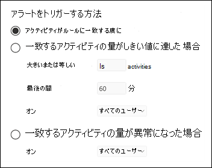
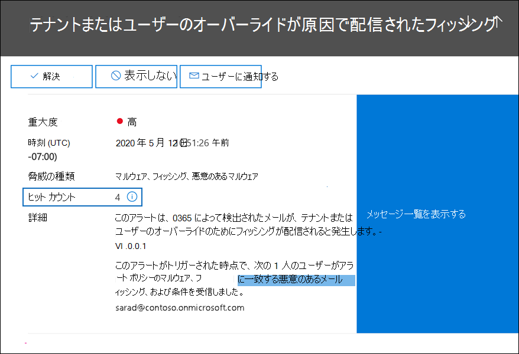
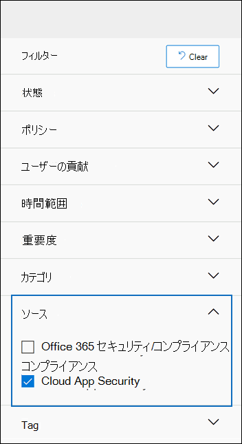
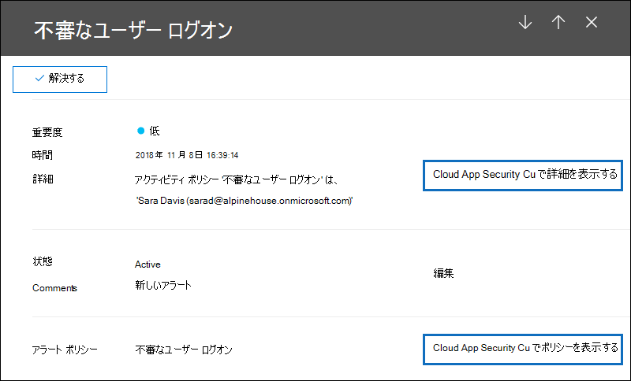

# <a name="alert-policies-in-the-microsoft-365-compliance-center"></a><span data-ttu-id="10b33-103">[アラート ポリシー] Microsoft 365 コンプライアンス センター</span><span class="sxs-lookup"><span data-stu-id="10b33-103">Alert policies in the Microsoft 365 compliance center</span></span>

<span data-ttu-id="10b33-104">Microsoft 365 コンプライアンス センター のアラート ポリシーとアラート ダッシュボード ツールを使用して、アラート ポリシーを作成し、ユーザーがアラート ポリシーの条件に一致するアクティビティを実行するときに生成されるアラートを表示できます。</span><span class="sxs-lookup"><span data-stu-id="10b33-104">You can use the alert policy and alert dashboard tools in the Microsoft 365 compliance center to create alert policies and then view the alerts generated when users perform activities that match the conditions of an alert policy.</span></span> <span data-ttu-id="10b33-105">Exchange Online での管理者特権の割り当て、マルウェア攻撃、フィッシング キャンペーン、ファイルの削除や外部共有の異常なレベルなど、アクティビティを監視するのに役立つ既定のアラート ポリシーがいくつかあります。</span><span class="sxs-lookup"><span data-stu-id="10b33-105">There are several default alert policies that help you monitor activities such as assigning admin privileges in Exchange Online, malware attacks, phishing campaigns, and unusual levels of file deletions and external sharing.</span></span>

<span data-ttu-id="10b33-106">アラート ポリシーを使用すると、ポリシーによってトリガーされるアラートを分類し、組織内のすべてのユーザーにポリシーを適用し、アラートがトリガーされる時間のしきい値レベルを設定し、アラートがトリガーされたときに電子メール通知を受信するかどうかを決定できます。</span><span class="sxs-lookup"><span data-stu-id="10b33-106">Alert policies let you categorize the alerts that are triggered by a policy, apply the policy to all users in your organization, set a threshold level for when an alert is triggered, and decide whether to receive email notifications when alerts are triggered.</span></span> <span data-ttu-id="10b33-107">コンプライアンス センターには[アラート] ページもあります。アラートの表示とフィルター処理、アラートの管理に役立つアラートの状態の設定、および基になるインシデントに対処または解決した後にアラートを却下できます。</span><span class="sxs-lookup"><span data-stu-id="10b33-107">There's also a **Alerts** page in the compliance center where you can view and filter alerts, set an alert status to help you manage alerts, and then dismiss alerts after you've addressed or resolved the underlying incident.</span></span>

> [!NOTE]
> <span data-ttu-id="10b33-108">アラート ポリシーは、Microsoft 365 Enterprise、Office 365 Enterprise、または Office 365 米国政府機関 E1/F1/G1、E3/F3/G3、または E5/G5 サブスクリプションを持つ組織で使用できます。</span><span class="sxs-lookup"><span data-stu-id="10b33-108">Alert policies are available for organizations with a Microsoft 365 Enterprise, Office 365 Enterprise, or Office 365 US Government E1/F1/G1, E3/F3/G3, or E5/G5 subscription.</span></span> <span data-ttu-id="10b33-109">高度な機能は、E5/G5 サブスクリプションを持つ組織、または E1/F1/G1 または E3/F3/G3 サブスクリプションと microsoft Defender for Office 365 P2 または Microsoft 365 E5 Compliance または E5 電子情報開示および監査アドオン サブスクリプションを持つ組織でのみ使用できます。</span><span class="sxs-lookup"><span data-stu-id="10b33-109">Advanced functionality is only available for organizations with an E5/G5 subscription, or for organizations that have an E1/F1/G1 or E3/F3/G3 subscription and a Microsoft Defender for Office 365 P2 or a Microsoft 365 E5 Compliance or an E5 eDiscovery and Audit add-on subscription.</span></span> <span data-ttu-id="10b33-110">E5/G5 またはアドオン サブスクリプションを必要とする機能については、このトピックで強調表示されています。</span><span class="sxs-lookup"><span data-stu-id="10b33-110">The functionality that requires an E5/G5 or add-on subscription is highlighted in this topic.</span></span> <span data-ttu-id="10b33-111">また、アラート ポリシーは、Office 365 GCC、GCC、DoD 米国政府機関の環境で利用できます。</span><span class="sxs-lookup"><span data-stu-id="10b33-111">Also note that alert policies are available in Office 365 GCC, GCC High, and DoD US government environments.</span></span>

## <a name="how-alert-policies-work"></a><span data-ttu-id="10b33-112">アラート ポリシーの動作</span><span class="sxs-lookup"><span data-stu-id="10b33-112">How alert policies work</span></span>

<span data-ttu-id="10b33-113">アラート ポリシーの動作の概要と、ユーザーまたは管理者のアクティビティがアラート ポリシーの条件と一致するときにトリガーされるアラートの概要を次に示します。</span><span class="sxs-lookup"><span data-stu-id="10b33-113">Here's a quick overview of how alert policies work and the alerts that are triggers when user or admin activity matches the conditions of an alert policy.</span></span>


1. <span data-ttu-id="10b33-115">組織の管理者は、コンプライアンス センターの [アラート ポリシー] ページを使用して、アラート ポリシーを作成、構成、およびオンにします。</span><span class="sxs-lookup"><span data-stu-id="10b33-115">An admin in your organization creates, configures, and turns on an alert policy by using the **Alert policies** page in the compliance center.</span></span> <span data-ttu-id="10b33-116">また、コンプライアンス センター PowerShell の [セキュリティ] の [New-ProtectionAlert](/powershell/module/exchange/new-protectionalert) コマンドレットを使用して&作成することもできます。</span><span class="sxs-lookup"><span data-stu-id="10b33-116">You can also create alert policies by using the [New-ProtectionAlert](/powershell/module/exchange/new-protectionalert) cmdlet in Security & Compliance Center PowerShell.</span></span>

   <span data-ttu-id="10b33-117">アラート ポリシーを作成するには、コンプライアンス センターで [アラートの管理] 役割または [組織の構成] 役割を割り当てる必要があります。</span><span class="sxs-lookup"><span data-stu-id="10b33-117">To create alert policies, you have to be assigned the Manage Alerts role or the Organization Configuration role in the compliance center.</span></span>

   > [!NOTE]
   > <span data-ttu-id="10b33-118">ポリシーによってアラートをトリガーするには、アラート ポリシーを作成または更新してから最大 24 時間かかります。</span><span class="sxs-lookup"><span data-stu-id="10b33-118">It takes up to 24 hours after creating or updating an alert policy before alerts can be triggered by the policy.</span></span> <span data-ttu-id="10b33-119">これは、ポリシーをアラート検出エンジンに同期する必要があるためです。</span><span class="sxs-lookup"><span data-stu-id="10b33-119">This is because the policy has to be synced to the alert detection engine.</span></span>

2. <span data-ttu-id="10b33-120">ユーザーは、アラート ポリシーの条件に一致するアクティビティを実行します。</span><span class="sxs-lookup"><span data-stu-id="10b33-120">A user performs an activity that matches the conditions of an alert policy.</span></span> <span data-ttu-id="10b33-121">マルウェア攻撃の場合、組織内のユーザーに送信された感染した電子メール メッセージがアラートをトリガーします。</span><span class="sxs-lookup"><span data-stu-id="10b33-121">In the case of malware attacks, infected email messages sent to users in your organization trigger an alert.</span></span>

3. <span data-ttu-id="10b33-122">Microsoft 365の [アラート] ページに表示されるアラートが生成Microsoft 365 コンプライアンス センター。</span><span class="sxs-lookup"><span data-stu-id="10b33-122">Microsoft 365 generates an alert that's displayed on the **Alerts** page in Microsoft 365 compliance center.</span></span> <span data-ttu-id="10b33-123">また、アラート ポリシーに対して電子メール通知が有効になっている場合、Microsoft は受信者の一覧に通知を送信します。</span><span class="sxs-lookup"><span data-stu-id="10b33-123">Also, if email notifications are enabled for the alert policy, Microsoft sends a notification to a list of recipients.</span></span> <span data-ttu-id="10b33-124">管理者または他のユーザーが [アラート] ページで確認できるアラートは、ユーザーに割り当てられた役割によって決まります。</span><span class="sxs-lookup"><span data-stu-id="10b33-124">The alerts that an admin or other users can see that on the Alerts page is determined by the roles assigned to the user.</span></span> <span data-ttu-id="10b33-125">詳細については、「アラートを表示 [するために必要な RBAC アクセス許可」を参照してください](#rbac-permissions-required-to-view-alerts)。</span><span class="sxs-lookup"><span data-stu-id="10b33-125">For more information, see [RBAC permissions required to view alerts](#rbac-permissions-required-to-view-alerts).</span></span>

4. <span data-ttu-id="10b33-126">管理者はコンプライアンス センターでアラートを管理します。</span><span class="sxs-lookup"><span data-stu-id="10b33-126">An admin manages alerts in the compliance center.</span></span> <span data-ttu-id="10b33-127">アラートの管理は、調査の追跡と管理に役立つアラート状態の割り当てで構成されます。</span><span class="sxs-lookup"><span data-stu-id="10b33-127">Managing alerts consists of assigning an alert status to help track and manage any investigation.</span></span>

## <a name="alert-policy-settings"></a><span data-ttu-id="10b33-128">アラート ポリシーの設定</span><span class="sxs-lookup"><span data-stu-id="10b33-128">Alert policy settings</span></span>

<span data-ttu-id="10b33-129">アラート ポリシーは、アラートを生成するユーザーまたは管理者アクティビティを定義する一連のルールと条件、アクティビティを実行した場合にアラートをトリガーするユーザーの一覧、およびアラートがトリガーされる前にアクティビティが発生する回数を定義するしきい値で構成されます。</span><span class="sxs-lookup"><span data-stu-id="10b33-129">An alert policy consists of a set of rules and conditions that define the user or admin activity that generates an alert, a list of users who trigger the alert if they perform the activity, and a threshold that defines how many times the activity has to occur before an alert is triggered.</span></span> <span data-ttu-id="10b33-130">また、ポリシーを分類し、重大度レベルを割り当てします。</span><span class="sxs-lookup"><span data-stu-id="10b33-130">You also categorize the policy and assign it a severity level.</span></span> <span data-ttu-id="10b33-131">これらの 2 つの設定は、ポリシーを管理し、コンプライアンス センターでアラートを表示するときにこれらの設定をフィルター処理することができるため、アラート ポリシー (およびポリシー条件が一致した場合にトリガーされるアラート) を管理するのに役立ちます。</span><span class="sxs-lookup"><span data-stu-id="10b33-131">These two settings help you manage alert policies (and the alerts that are triggered when the policy conditions are matched) because you can filter on these settings when managing policies and viewing alerts in the compliance center.</span></span> <span data-ttu-id="10b33-132">たとえば、同じカテゴリの条件に一致するアラートを表示したり、同じ重大度レベルのアラートを表示できます。</span><span class="sxs-lookup"><span data-stu-id="10b33-132">For example, you can view alerts that match the conditions from the same category or view alerts with the same severity level.</span></span>

<span data-ttu-id="10b33-133">**アラート ポリシーを表示および作成するには、次の方法を使用します。**</span><span class="sxs-lookup"><span data-stu-id="10b33-133">**To view and create alert policies:**</span></span>

<span data-ttu-id="10b33-134">[ポリシー] <https://compliance.microsoft.com> アラート アラート ポリシー **に** 移動  >    >  **し、[ポリシー] を選択します**。</span><span class="sxs-lookup"><span data-stu-id="10b33-134">Go to <https://compliance.microsoft.com> and then select **Policies** > **Alert** > **Alert policies**.</span></span> <span data-ttu-id="10b33-135">または、直接に移動することもできます <https://compliance.microsoft.com/alertpolicies> 。</span><span class="sxs-lookup"><span data-stu-id="10b33-135">Alternatively, you can go directly to <https://compliance.microsoft.com/alertpolicies>.</span></span>

![コンプライアンス センターで [ポリシー] を選択し、[アラート] で [アラート ポリシー] を選択して、アラート ポリシーを表示および作成します。](../media/LaunchAlertPoliciesMCC.png)

> [!NOTE]
> <span data-ttu-id="10b33-137">通知ポリシーを表示するには、View-Only管理役割を割り当てる必要Microsoft 365 コンプライアンス センター。</span><span class="sxs-lookup"><span data-stu-id="10b33-137">You have to be assigned the View-Only Manage Alerts role to view alert policies in the Microsoft 365 compliance center.</span></span> <span data-ttu-id="10b33-138">アラート ポリシーを作成および編集するには、[アラートの管理] 役割を割り当てる必要があります。</span><span class="sxs-lookup"><span data-stu-id="10b33-138">You have to be assigned the Manage Alerts role to create and edit alert policies.</span></span> <span data-ttu-id="10b33-139">詳細については、「セキュリティとコンプライアンス [センターのアクセス許可」を参照してください](../security/office-365-security/permissions-in-the-security-and-compliance-center.md)。</span><span class="sxs-lookup"><span data-stu-id="10b33-139">For more information, see [Permissions in the security and compliance center](../security/office-365-security/permissions-in-the-security-and-compliance-center.md).</span></span>

<span data-ttu-id="10b33-140">アラート ポリシーは、次の設定と条件で構成されます。</span><span class="sxs-lookup"><span data-stu-id="10b33-140">An alert policy consists of the following settings and conditions.</span></span>

- <span data-ttu-id="10b33-141">**アラートが追跡しているアクティビティ**。</span><span class="sxs-lookup"><span data-stu-id="10b33-141">**Activity the alert is tracking**.</span></span> <span data-ttu-id="10b33-142">アクティビティを追跡するためのポリシーを作成します。場合によっては、ファイルを共有したり、アクセス許可を割り当てる、または匿名リンクを作成したりして、外部ユーザーとファイルを共有するなどのいくつかの関連アクティビティを作成します。</span><span class="sxs-lookup"><span data-stu-id="10b33-142">You create a policy to track an activity or in some cases a few related activities, such a sharing a file with an external user by sharing it, assigning access permissions, or creating an anonymous link.</span></span> <span data-ttu-id="10b33-143">ユーザーがポリシーによって定義されたアクティビティを実行すると、アラートしきい値の設定に基づいてアラートがトリガーされます。</span><span class="sxs-lookup"><span data-stu-id="10b33-143">When a user performs the activity defined by the policy, an alert is triggered based on the alert threshold settings.</span></span>

    > [!NOTE]
    > <span data-ttu-id="10b33-144">追跡できるアクティビティは、組織の組織のOffice 365 Enterprise、Office 365によって異なります。</span><span class="sxs-lookup"><span data-stu-id="10b33-144">The activities that you can track depend on your organization's Office 365 Enterprise or Office 365 US Government plan.</span></span> <span data-ttu-id="10b33-145">一般に、マルウェア キャンペーンやフィッシング攻撃に関連するアクティビティでは、E5/G5 サブスクリプションまたは E1/F1/G1 または E3/F3/G3 サブスクリプションと Defender [for Office 365](../security/office-365-security/defender-for-office-365.md) Plan 2 アドオン サブスクリプションが必要です。</span><span class="sxs-lookup"><span data-stu-id="10b33-145">In general, activities related to malware campaigns and phishing attacks require an E5/G5 subscription or an E1/F1/G1 or E3/F3/G3 subscription with an [Defender for Office 365](../security/office-365-security/defender-for-office-365.md) Plan 2 add-on subscription.</span></span>

- <span data-ttu-id="10b33-146">**アクティビティ条件**.</span><span class="sxs-lookup"><span data-stu-id="10b33-146">**Activity conditions**.</span></span> <span data-ttu-id="10b33-147">ほとんどのアクティビティでは、アラートをトリガーするために満たされる必要がある追加の条件を定義できます。</span><span class="sxs-lookup"><span data-stu-id="10b33-147">For most activities, you can define additional conditions that must be met to trigger an alert.</span></span> <span data-ttu-id="10b33-148">一般的な条件には、IP アドレス (ユーザーが特定の IP アドレスまたは IP アドレス範囲内のコンピューターでアクティビティを実行するときにアラートがトリガーされる)、特定のユーザーまたはユーザーがアクティビティを実行した場合にアラートがトリガーされるかどうか、およびアクティビティが特定のファイル名または URL に対して実行されるかどうかが含まれます。</span><span class="sxs-lookup"><span data-stu-id="10b33-148">Common conditions include IP addresses (so that an alert is triggered when the user performs the activity on a computer with a specific IP address or within an IP address range), whether an alert is triggered if a specific user or users perform that activity, and whether the activity is performed on a specific file name or URL.</span></span> <span data-ttu-id="10b33-149">また、組織内の任意のユーザーがアクティビティを実行するときにアラートをトリガーする条件を構成することもできます。</span><span class="sxs-lookup"><span data-stu-id="10b33-149">You can also configure a condition that triggers an alert when the activity is performed by any user in your organization.</span></span> <span data-ttu-id="10b33-150">使用可能な条件は、選択したアクティビティによって異なります。</span><span class="sxs-lookup"><span data-stu-id="10b33-150">The available conditions are dependent on the selected activity.</span></span>

- <span data-ttu-id="10b33-151">**アラートがトリガーされた場合**。</span><span class="sxs-lookup"><span data-stu-id="10b33-151">**When the alert is triggered**.</span></span> <span data-ttu-id="10b33-152">アラートがトリガーされる前にアクティビティが発生する頻度を定義する設定を構成できます。</span><span class="sxs-lookup"><span data-stu-id="10b33-152">You can configure a setting that defines how often an activity can occur before an alert is triggered.</span></span> <span data-ttu-id="10b33-153">これにより、アクティビティがポリシー条件に一致するたび、特定のしきい値を超えた場合、またはアラートが追跡しているアクティビティの発生が組織で異常になった場合に、アラートを生成するポリシーを設定できます。</span><span class="sxs-lookup"><span data-stu-id="10b33-153">This allows you to set up a policy to generate an alert every time an activity matches the policy conditions, when a certain threshold is exceeded, or when the occurrence of the activity the alert is tracking becomes unusual for your organization.</span></span>

    

    <span data-ttu-id="10b33-155">異常なアクティビティに基づいて設定を選択すると、選択したアクティビティの通常の頻度を定義する基準値が設定されます。</span><span class="sxs-lookup"><span data-stu-id="10b33-155">If you select the setting based on unusual activity, Microsoft establishes a baseline value that defines the normal frequency for the selected activity.</span></span> <span data-ttu-id="10b33-156">この基準を確立するのに最大 7 日かかるので、アラートは生成されません。</span><span class="sxs-lookup"><span data-stu-id="10b33-156">It takes up to seven days to establish this baseline, during which alerts won't be generated.</span></span> <span data-ttu-id="10b33-157">ベースラインが確立されると、アラート ポリシーによって追跡されるアクティビティの頻度がベースライン値を大幅に超えると、アラートがトリガーされます。</span><span class="sxs-lookup"><span data-stu-id="10b33-157">After the baseline is established, an alert is triggered when the frequency of the activity tracked by the alert policy greatly exceeds the baseline value.</span></span> <span data-ttu-id="10b33-158">監査関連のアクティビティ (ファイルアクティビティやフォルダー アクティビティなど) の場合は、1 人のユーザーに基づいて、または組織内のすべてのユーザーに基づいてベースラインを確立できます。マルウェア関連のアクティビティの場合は、単一のマルウェア ファミリ、単一の受信者、または組織内のすべてのメッセージに基づいてベースラインを確立できます。</span><span class="sxs-lookup"><span data-stu-id="10b33-158">For auditing-related activities (such as file and folder activities), you can establish a baseline based on a single user or based on all users in your organization; for malware-related activities, you can establish a baseline based on a single malware family, a single recipient, or all messages in your organization.</span></span>

    > [!NOTE]
    > <span data-ttu-id="10b33-159">しきい値に基づいて、または異常なアクティビティに基づいてアラート ポリシーを構成するには、E5/G5 サブスクリプション、または E1/F1/G1 または E3/F3/G3 サブスクリプションと Microsoft Defender for Office 365 P2、Microsoft 365 E5 Compliance、または Microsoft 365 電子情報開示および監査アドオン サブスクリプションが必要です。</span><span class="sxs-lookup"><span data-stu-id="10b33-159">The ability to configure alert policies based on a threshold or based on unusual activity requires an E5/G5 subscription, or an E1/F1/G1 or E3/F3/G3 subscription with a Microsoft Defender for Office 365 P2, Microsoft 365 E5 Compliance, or Microsoft 365 eDiscovery and Audit add-on subscription.</span></span> <span data-ttu-id="10b33-160">E1/F1/G1 サブスクリプションと E3/F3/G3 サブスクリプションを持つ組織は、アクティビティが発生する度にアラートがトリガーされるアラート ポリシーのみを作成できます。</span><span class="sxs-lookup"><span data-stu-id="10b33-160">Organizations with an E1/F1/G1 and E3/F3/G3 subscription can only create alert policies where an alert is triggered every time that an activity occurs.</span></span>

- <span data-ttu-id="10b33-161">**アラート カテゴリ**。</span><span class="sxs-lookup"><span data-stu-id="10b33-161">**Alert category**.</span></span> <span data-ttu-id="10b33-162">ポリシーによって生成されたアラートの追跡と管理を支援するために、次のいずれかのカテゴリをポリシーに割り当てできます。</span><span class="sxs-lookup"><span data-stu-id="10b33-162">To help with tracking and managing the alerts generated by a policy, you can assign one of the following categories to a policy.</span></span>

  - <span data-ttu-id="10b33-163">データ損失防止</span><span class="sxs-lookup"><span data-stu-id="10b33-163">Data loss prevention</span></span>

  - <span data-ttu-id="10b33-164">情報ガバナンス</span><span class="sxs-lookup"><span data-stu-id="10b33-164">Information governance</span></span>

  - <span data-ttu-id="10b33-165">メール フロー</span><span class="sxs-lookup"><span data-stu-id="10b33-165">Mail flow</span></span>

  - <span data-ttu-id="10b33-166">アクセス許可</span><span class="sxs-lookup"><span data-stu-id="10b33-166">Permissions</span></span>

  - <span data-ttu-id="10b33-167">脅威の管理</span><span class="sxs-lookup"><span data-stu-id="10b33-167">Threat management</span></span>

  - <span data-ttu-id="10b33-168">Others</span><span class="sxs-lookup"><span data-stu-id="10b33-168">Others</span></span>

  <span data-ttu-id="10b33-169">アラート ポリシーの条件に一致するアクティビティが発生すると、生成されるアラートには、この設定で定義されているカテゴリがタグ付けされます。</span><span class="sxs-lookup"><span data-stu-id="10b33-169">When an activity occurs that matches the conditions of the alert policy, the alert that's generated is tagged with the category defined in this setting.</span></span> <span data-ttu-id="10b33-170">これにより、カテゴリに基づいてアラートを並べ替え、フィルター処理できるので、コンプライアンス センターの [アラート] ページで同じカテゴリ設定を持つアラートを追跡および管理できます。</span><span class="sxs-lookup"><span data-stu-id="10b33-170">This allows you to track and manage alerts that have the same category setting on the **Alerts** page in the compliance center because you can sort and filter alerts based on category.</span></span>

- <span data-ttu-id="10b33-171">**アラートの重大度**。</span><span class="sxs-lookup"><span data-stu-id="10b33-171">**Alert severity**.</span></span> <span data-ttu-id="10b33-172">アラート カテゴリと同様に、アラート ポリシーに重大度属性 (**低**、 **中**、 **高**、または **情報**) を割り当てる必要があります。</span><span class="sxs-lookup"><span data-stu-id="10b33-172">Similar to the alert category, you assign a severity attribute (**Low**, **Medium**, **High**, or **Informational**) to alert policies.</span></span> <span data-ttu-id="10b33-173">アラート カテゴリと同様に、アラート ポリシーの条件に一致するアクティビティが発生すると、生成されるアラートには、アラート ポリシーに設定されているのと同じ重大度レベルでタグが付けされます。</span><span class="sxs-lookup"><span data-stu-id="10b33-173">Like the alert category, when an activity occurs that matches the conditions of the alert policy, the alert that's generated is tagged with the same severity level that's set for the alert policy.</span></span> <span data-ttu-id="10b33-174">繰り返しますが、これにより、[アラート] ページで同じ重大度設定を持つアラートを追跡および **管理** できます。</span><span class="sxs-lookup"><span data-stu-id="10b33-174">Again, this allows you to track and manage alerts that have the same severity setting on the **Alerts** page.</span></span> <span data-ttu-id="10b33-175">たとえば、アラートの一覧をフィルター処理して、重大度が高いアラートのみを表示できます。</span><span class="sxs-lookup"><span data-stu-id="10b33-175">For example, you can filter the list of alerts so that only alerts with a **High** severity are displayed.</span></span>

    > [!TIP]
    > <span data-ttu-id="10b33-176">アラート ポリシーを設定する場合は、ユーザーへの配信後のマルウェアの検出、機密または分類されたデータの表示、外部ユーザーとのデータの共有、データの損失やセキュリティ上の脅威を引き起す可能性のあるその他のアクティビティなど、重大な悪影響を及ぶ可能性のあるアクティビティに対して、重要度の高いアクティビティを割り当てる検討してください。</span><span class="sxs-lookup"><span data-stu-id="10b33-176">When setting up an alert policy, consider assigning a higher severity to activities that can result in severely negative consequences, such as detection of malware after delivery to users, viewing of sensitive or classified data, sharing data with external users, or other activities that can result in data loss or security threats.</span></span> <span data-ttu-id="10b33-177">これにより、アラートと、基になる原因を調査して解決するために実行するアクションに優先順位を付けるのに役立ちます。</span><span class="sxs-lookup"><span data-stu-id="10b33-177">This can help you prioritize alerts and the actions you take to investigate and resolve the underlying causes.</span></span>

- <span data-ttu-id="10b33-178">**電子メール通知**。</span><span class="sxs-lookup"><span data-stu-id="10b33-178">**Email notifications**.</span></span> <span data-ttu-id="10b33-179">アラートがトリガーされると、電子メール通知がユーザーの一覧に送信 (または送信されない) 状態で送信されるポリシーを設定できます。</span><span class="sxs-lookup"><span data-stu-id="10b33-179">You can set up the policy so that email notifications are sent (or not sent) to a list of users when an alert is triggered.</span></span> <span data-ttu-id="10b33-180">また、1 日の通知制限を設定して、通知の最大数に達すると、その日のアラートに対してそれ以上の通知が送信されません。</span><span class="sxs-lookup"><span data-stu-id="10b33-180">You can also set a daily notification limit so that once the maximum number of notifications has been reached, no more notifications are sent for the alert during that day.</span></span> <span data-ttu-id="10b33-181">電子メール通知に加えて、ユーザーまたは他の管理者は、[アラート] ページでポリシーによってトリガーされるアラートを **表示** できます。</span><span class="sxs-lookup"><span data-stu-id="10b33-181">In addition to email notifications, you or other administrators can view the alerts that are triggered by a policy on the **Alerts** page.</span></span> <span data-ttu-id="10b33-182">特定のカテゴリのアラート ポリシーまたは重要度の設定が高い場合は、電子メール通知を有効にしてください。</span><span class="sxs-lookup"><span data-stu-id="10b33-182">Consider enabling email notifications for alert policies of a specific category or that have a higher severity setting.</span></span>

## <a name="default-alert-policies"></a><span data-ttu-id="10b33-183">既定のアラート ポリシー</span><span class="sxs-lookup"><span data-stu-id="10b33-183">Default alert policies</span></span>

<span data-ttu-id="10b33-184">Microsoft は、管理者のアクセス許可の悪用、マルウェアのExchange外部および内部の脅威、情報ガバナンスのリスクを特定するのに役立つ、組み込みのアラート ポリシーを提供します。</span><span class="sxs-lookup"><span data-stu-id="10b33-184">Microsoft provides built-in alert policies that help identify Exchange admin permissions abuse, malware activity, potential external and internal threats, and information governance risks.</span></span> <span data-ttu-id="10b33-185">[アラート **ポリシー] ページで** 、これらの組み込みポリシーの名前は太字で、ポリシーの種類は System として定義 **されます**。</span><span class="sxs-lookup"><span data-stu-id="10b33-185">On the **Alert policies** page, the names of these built-in policies are in bold and the policy type is defined as **System**.</span></span> <span data-ttu-id="10b33-186">これらのポリシーは既定で有効になっています。</span><span class="sxs-lookup"><span data-stu-id="10b33-186">These policies are turned on by default.</span></span> <span data-ttu-id="10b33-187">これらのポリシーをオフにするか、もう一度オンに戻したり、電子メール通知を送信する受信者の一覧を設定したり、毎日の通知制限を設定したりできます。</span><span class="sxs-lookup"><span data-stu-id="10b33-187">You can turn off these policies (or back on again), set up a list of recipients to send email notifications to, and set a daily notification limit.</span></span> <span data-ttu-id="10b33-188">これらのポリシーの他の設定は編集できない。</span><span class="sxs-lookup"><span data-stu-id="10b33-188">The other settings for these policies can't be edited.</span></span>

<span data-ttu-id="10b33-189">次の表に、使用可能な既定のアラート ポリシーと、各ポリシーが割り当てられているカテゴリを示します。</span><span class="sxs-lookup"><span data-stu-id="10b33-189">The following table lists and describes the available default alert policies and the category each policy is assigned to.</span></span> <span data-ttu-id="10b33-190">このカテゴリは、ユーザーが [アラート] ページで表示できるアラートを決定するために使用されます。</span><span class="sxs-lookup"><span data-stu-id="10b33-190">The category is used to determine which alerts a user can view on the Alerts page.</span></span> <span data-ttu-id="10b33-191">詳細については、「アラートを表示 [するために必要な RBAC アクセス許可」を参照してください](#rbac-permissions-required-to-view-alerts)。</span><span class="sxs-lookup"><span data-stu-id="10b33-191">For more information, see [RBAC permissions required to view alerts](#rbac-permissions-required-to-view-alerts).</span></span>

<span data-ttu-id="10b33-192">また、この表は、Office 365 EnterpriseにOffice 365米国政府機関の計画を示しています。</span><span class="sxs-lookup"><span data-stu-id="10b33-192">The table also indicates the Office 365 Enterprise and Office 365 US Government plan required for each one.</span></span> <span data-ttu-id="10b33-193">E1/F1/G1 または E3/F3/G3 サブスクリプションに加えて、組織が適切なアドオン サブスクリプションを持つ場合、一部の既定のアラート ポリシーを使用できます。</span><span class="sxs-lookup"><span data-stu-id="10b33-193">Some default alert policies are available if your organization has the appropriate add-on subscription in addition to an E1/F1/G1 or E3/F3/G3 subscription.</span></span>

| <span data-ttu-id="10b33-194">既定のアラート ポリシー</span><span class="sxs-lookup"><span data-stu-id="10b33-194">Default alert policy</span></span> | <span data-ttu-id="10b33-195">説明</span><span class="sxs-lookup"><span data-stu-id="10b33-195">Description</span></span> | <span data-ttu-id="10b33-196">カテゴリ</span><span class="sxs-lookup"><span data-stu-id="10b33-196">Category</span></span> | <span data-ttu-id="10b33-197">Enterpriseサブスクリプション</span><span class="sxs-lookup"><span data-stu-id="10b33-197">Enterprise subscription</span></span> |
|:-----|:-----|:-----|:-----|
|<span data-ttu-id="10b33-198">**悪意のある可能性がある URL のクリックが検出されました**</span><span class="sxs-lookup"><span data-stu-id="10b33-198">**A potentially malicious URL click was detected**</span></span>|<span data-ttu-id="10b33-199">組織のリンクによって保護されたユーザーセーフ[が](../security/office-365-security/safe-links.md)悪意のあるリンクをクリックすると、警告が生成されます。</span><span class="sxs-lookup"><span data-stu-id="10b33-199">Generates an alert when a user protected by [Safe Links](../security/office-365-security/safe-links.md) in your organization clicks a malicious link.</span></span> <span data-ttu-id="10b33-200">このイベントは、url の評決の変更が Microsoft Defender によって Office 365 用に識別された場合、またはユーザーが セーフ リンク ページ (組織の Microsoft 365 for business セーフ Links ポリシーに基づいて) を上書きするときにトリガーされます。</span><span class="sxs-lookup"><span data-stu-id="10b33-200">This event is triggered when URL verdict changes are identified by Microsoft Defender for Office 365 or when users override the Safe Links pages (based on your organization's Microsoft 365 for business Safe Links policy).</span></span> <span data-ttu-id="10b33-201">このアラート ポリシーには、重大度 **の高** い設定があります。</span><span class="sxs-lookup"><span data-stu-id="10b33-201">This alert policy has a **High** severity setting.</span></span> <span data-ttu-id="10b33-202">Defender for Office 365 P2、E5、G5 のお客様に対して、このアラートは自動的に自動調査と応答をトリガー [Office 365。](../security/office-365-security/office-365-air.md)</span><span class="sxs-lookup"><span data-stu-id="10b33-202">For Defender for Office 365 P2, E5, G5 customers, this alert automatically triggers [automated investigation and response in Office 365](../security/office-365-security/office-365-air.md).</span></span> <span data-ttu-id="10b33-203">このアラートをトリガーするイベントの詳細については[、「Set up セーフリンク ポリシー」を参照してください](../security/office-365-security/set-up-safe-links-policies.md)。</span><span class="sxs-lookup"><span data-stu-id="10b33-203">For more information on events that trigger this alert, see [Set up Safe Links policies](../security/office-365-security/set-up-safe-links-policies.md).</span></span>|<span data-ttu-id="10b33-204">脅威の管理</span><span class="sxs-lookup"><span data-stu-id="10b33-204">Threat management</span></span>|<span data-ttu-id="10b33-205">E5/G5 または Defender for Office 365 P2 アドオン サブスクリプション</span><span class="sxs-lookup"><span data-stu-id="10b33-205">E5/G5 or Defender for Office 365 P2 add-on subscription</span></span>|
|<span data-ttu-id="10b33-206">**管理者の提出結果が完了しました**</span><span class="sxs-lookup"><span data-stu-id="10b33-206">**Admin Submission result completed**</span></span>|<span data-ttu-id="10b33-207">管理者申請が送信されたエンティティ[](../security/office-365-security/admin-submission.md)の再スキャンを完了すると、アラートを生成します。</span><span class="sxs-lookup"><span data-stu-id="10b33-207">Generates an alert when an [Admin Submission](../security/office-365-security/admin-submission.md) completes the rescan of the submitted entity.</span></span> <span data-ttu-id="10b33-208">管理者申請から再スキャン結果が表示される度に、アラートがトリガーされます。</span><span class="sxs-lookup"><span data-stu-id="10b33-208">An alert will be triggered every time a rescan result is rendered from an Admin Submission.</span></span> <span data-ttu-id="10b33-209">これらのアラートは、以前の申請の[](https://compliance.microsoft.com/reportsubmission)結果を確認し、ユーザーが報告したメッセージを送信して最新のポリシー チェックと再スキャンの評決を取得し、組織内のフィルター ポリシーが意図した影響を与えているかどうかを判断することを目的とします。</span><span class="sxs-lookup"><span data-stu-id="10b33-209">These alerts are meant to remind you to [review the results of previous submissions](https://compliance.microsoft.com/reportsubmission), submit user reported messages to get the latest policy check and rescan verdicts, and help you determine if the filtering policies in your organization are having the intended impact.</span></span> <span data-ttu-id="10b33-210">このポリシーには、[ **情報の重大度]** 設定があります。</span><span class="sxs-lookup"><span data-stu-id="10b33-210">This policy has a **Informational** severity setting.</span></span>|<span data-ttu-id="10b33-211">脅威の管理</span><span class="sxs-lookup"><span data-stu-id="10b33-211">Threat management</span></span>|<span data-ttu-id="10b33-212">E1/F1、E3/F3、または E5</span><span class="sxs-lookup"><span data-stu-id="10b33-212">E1/F1, E3/F3, or E5</span></span>|
|<span data-ttu-id="10b33-213">**管理者が電子メールの手動調査をトリガーしました**</span><span class="sxs-lookup"><span data-stu-id="10b33-213">**Admin triggered manual investigation of email**</span></span>|<span data-ttu-id="10b33-214">管理者が脅威エクスプローラーからの電子メールの手動調査をトリガーすると、アラートを生成します。</span><span class="sxs-lookup"><span data-stu-id="10b33-214">Generates an alert when an admin triggers the manual investigation of an email from Threat Explorer.</span></span> <span data-ttu-id="10b33-215">詳細については、「例: セキュリティ管理者が脅威エクスプローラーから [調査をトリガーする」を参照してください](../security/office-365-security/automated-investigation-response-office.md#example-a-security-administrator-triggers-an-investigation-from-threat-explorer)。</span><span class="sxs-lookup"><span data-stu-id="10b33-215">For more information, see [Example: A security administrator triggers an investigation from Threat Explorer](../security/office-365-security/automated-investigation-response-office.md#example-a-security-administrator-triggers-an-investigation-from-threat-explorer).</span></span> <span data-ttu-id="10b33-216">このアラートは、調査が開始されたと組織に通知します。</span><span class="sxs-lookup"><span data-stu-id="10b33-216">This alert notifies your organization that the investigation was started.</span></span> <span data-ttu-id="10b33-217">アラートは、トリガーしたユーザーに関する情報を提供し、調査へのリンクを含む。</span><span class="sxs-lookup"><span data-stu-id="10b33-217">The alert provides information about who triggered it and includes a link to the investigation.</span></span> <span data-ttu-id="10b33-218">このポリシーには、[ **情報の重大度]** 設定があります。</span><span class="sxs-lookup"><span data-stu-id="10b33-218">This policy has an **Informational** severity setting.</span></span>|<span data-ttu-id="10b33-219">脅威の管理</span><span class="sxs-lookup"><span data-stu-id="10b33-219">Threat management</span></span>| <span data-ttu-id="10b33-220">E5/G5 または Microsoft Defender for Office 365 P2 アドオン サブスクリプション</span><span class="sxs-lookup"><span data-stu-id="10b33-220">E5/G5 or Microsoft Defender for Office 365 P2 add-on subscription</span></span>| 
|<span data-ttu-id="10b33-221">**転送/リダイレクト ルールの作成**</span><span class="sxs-lookup"><span data-stu-id="10b33-221">**Creation of forwarding/redirect rule**</span></span>|<span data-ttu-id="10b33-222">組織内のユーザーが、別の電子メール アカウントにメッセージを転送またはリダイレクトするメールボックスの受信トレイ ルールを作成すると、アラートを生成します。</span><span class="sxs-lookup"><span data-stu-id="10b33-222">Generates an alert when someone in your organization creates an inbox rule for their mailbox that forwards or redirects messages to another email account.</span></span> <span data-ttu-id="10b33-223">このポリシーは、PowerShell または PowerShell Outlook on the web (以前は Outlook Web App) をExchange Onlineします。</span><span class="sxs-lookup"><span data-stu-id="10b33-223">This policy only tracks inbox rules that are created using Outlook on the web (formerly known as Outlook Web App) or Exchange Online PowerShell.</span></span> <span data-ttu-id="10b33-224">このポリシーには、[ **情報の重大度]** 設定があります。</span><span class="sxs-lookup"><span data-stu-id="10b33-224">This policy has a **Informational** severity setting.</span></span> <span data-ttu-id="10b33-225">受信トレイ ルールを使用してメールを Outlook on the web で転送およびリダイレクトする方法の詳細については、「Outlook on the web でルールを使用してメッセージを別のアカウントに自動的に転送する」を[参照してください](https://support.office.com/article/1433e3a0-7fb0-4999-b536-50e05cb67fed)。</span><span class="sxs-lookup"><span data-stu-id="10b33-225">For more information about using inbox rules to forward and redirect email in Outlook on the web, see [Use rules in Outlook on the web to automatically forward messages to another account](https://support.office.com/article/1433e3a0-7fb0-4999-b536-50e05cb67fed).</span></span>|<span data-ttu-id="10b33-226">脅威の管理</span><span class="sxs-lookup"><span data-stu-id="10b33-226">Threat management</span></span>|<span data-ttu-id="10b33-227">E1/F1/G1、E3/F3/G3、または E5/G5</span><span class="sxs-lookup"><span data-stu-id="10b33-227">E1/F1/G1, E3/F3/G3, or E5/G5</span></span>|
|<span data-ttu-id="10b33-228">**eDiscovery 検索が開始またはエクスポートされました**</span><span class="sxs-lookup"><span data-stu-id="10b33-228">**eDiscovery search started or exported**</span></span>|<span data-ttu-id="10b33-229">セキュリティとコンプライアンス センターでコンテンツ検索ツールを使用すると、アラートが生成されます。</span><span class="sxs-lookup"><span data-stu-id="10b33-229">Generates an alert when someone uses the Content search tool in the Security and compliance center.</span></span> <span data-ttu-id="10b33-230">次のコンテンツ検索アクティビティが実行されると、アラートがトリガーされます。</span><span class="sxs-lookup"><span data-stu-id="10b33-230">An alert is triggered when the following content search activities are performed:</span></span> <br/><br/><span data-ttu-id="10b33-231">\* コンテンツ検索が開始される</span><span class="sxs-lookup"><span data-stu-id="10b33-231">\* A content search is started</span></span><br/><span data-ttu-id="10b33-232">\* コンテンツ検索の結果がエクスポートされる</span><span class="sxs-lookup"><span data-stu-id="10b33-232">\* The results of a content search are exported</span></span><br/><span data-ttu-id="10b33-233">\* コンテンツ検索レポートがエクスポートされる</span><span class="sxs-lookup"><span data-stu-id="10b33-233">\* A content search report is exported</span></span><br/><br/><span data-ttu-id="10b33-234">以前のコンテンツ検索アクティビティが電子情報開示ケースに関連付けで実行されると、アラートもトリガーされます。</span><span class="sxs-lookup"><span data-stu-id="10b33-234">Alerts are also triggered when the previous content search activities are performed in association with an eDiscovery case.</span></span> <span data-ttu-id="10b33-235">このポリシーには、[ **情報の重大度]** 設定があります。</span><span class="sxs-lookup"><span data-stu-id="10b33-235">This policy has a **Informational** severity setting.</span></span> <span data-ttu-id="10b33-236">コンテンツ検索アクティビティの詳細については、「監査ログで電子情報開示アクティビティを検索 [する」を参照してください](search-for-ediscovery-activities-in-the-audit-log.md#ediscovery-activities)。</span><span class="sxs-lookup"><span data-stu-id="10b33-236">For more information about content search activities, see [Search for eDiscovery activities in the audit log](search-for-ediscovery-activities-in-the-audit-log.md#ediscovery-activities).</span></span>|<span data-ttu-id="10b33-237">脅威の管理</span><span class="sxs-lookup"><span data-stu-id="10b33-237">Threat management</span></span>|<span data-ttu-id="10b33-238">E1/F1/G1、E3/F3/G3、または E5/G5</span><span class="sxs-lookup"><span data-stu-id="10b33-238">E1/F1/G1, E3/F3/G3, or E5/G5</span></span>|
|<span data-ttu-id="10b33-239">**管理者特権Exchange昇格**</span><span class="sxs-lookup"><span data-stu-id="10b33-239">**Elevation of Exchange admin privilege**</span></span>|<span data-ttu-id="10b33-240">ユーザーが組織の管理者アクセス許可を割り当てられたときにアラートExchange Onlineします。</span><span class="sxs-lookup"><span data-stu-id="10b33-240">Generates an alert when someone is assigned administrative permissions in your Exchange Online organization.</span></span> <span data-ttu-id="10b33-241">たとえば、ユーザーが組織の管理役割グループに追加された場合、Exchange Online。</span><span class="sxs-lookup"><span data-stu-id="10b33-241">For example, when a user is added to the Organization Management role group in Exchange Online.</span></span> <span data-ttu-id="10b33-242">このポリシーの重大度 **が低** い設定です。</span><span class="sxs-lookup"><span data-stu-id="10b33-242">This policy has a **Low** severity setting.</span></span>|<span data-ttu-id="10b33-243">アクセス許可</span><span class="sxs-lookup"><span data-stu-id="10b33-243">Permissions</span></span>|<span data-ttu-id="10b33-244">E1/F1/G1、E3/F3/G3、または E5/G5</span><span class="sxs-lookup"><span data-stu-id="10b33-244">E1/F1/G1, E3/F3/G3, or E5/G5</span></span>|
|<span data-ttu-id="10b33-245">**マルウェアを含んだメール メッセージが配信後に削除されました**</span><span class="sxs-lookup"><span data-stu-id="10b33-245">**Email messages containing malware removed after delivery**</span></span>|<span data-ttu-id="10b33-246">マルウェアを含むメッセージが組織内のメールボックスに配信される場合にアラートを生成します。</span><span class="sxs-lookup"><span data-stu-id="10b33-246">Generates an alert when any messages containing malware are delivered to mailboxes in your organization.</span></span> <span data-ttu-id="10b33-247">このイベントが発生した場合、Microsoft はゼロ時間自動削除を使用して、Exchange Onlineメールボックスから感染したメッセージ[を削除します](../security/office-365-security/zero-hour-auto-purge.md)。</span><span class="sxs-lookup"><span data-stu-id="10b33-247">If this event occurs, Microsoft removes the infected messages from Exchange Online mailboxes using [Zero-hour auto purge](../security/office-365-security/zero-hour-auto-purge.md).</span></span> <span data-ttu-id="10b33-248">このポリシーには[**情報の重大度]** 設定が設定され、自動調査と自動応答が自動的にトリガー [Office 365。](../security/office-365-security/office-365-air.md)</span><span class="sxs-lookup"><span data-stu-id="10b33-248">This policy has an **Informational** severity setting and automatically triggers [automated investigation and response in Office 365](../security/office-365-security/office-365-air.md).</span></span>|<span data-ttu-id="10b33-249">脅威の管理</span><span class="sxs-lookup"><span data-stu-id="10b33-249">Threat management</span></span>|<span data-ttu-id="10b33-250">E5/G5 または Microsoft Defender for Office 365 P2 アドオン サブスクリプション</span><span class="sxs-lookup"><span data-stu-id="10b33-250">E5/G5 or Microsoft Defender for Office 365 P2 add-on subscription</span></span>|
|<span data-ttu-id="10b33-251">**フィッシング URL を含んだメール メッセージが配信後に削除されました**</span><span class="sxs-lookup"><span data-stu-id="10b33-251">**Email messages containing phish URLs removed after delivery**</span></span>|<span data-ttu-id="10b33-252">フィッシングを含むメッセージが組織内のメールボックスに配信される場合にアラートを生成します。</span><span class="sxs-lookup"><span data-stu-id="10b33-252">Generates an alert when any messages containing phish are delivered to mailboxes in your organization.</span></span> <span data-ttu-id="10b33-253">このイベントが発生した場合、Microsoft はゼロ時間自動削除を使用して、Exchange Onlineメールボックスから感染したメッセージ[を削除します](../security/office-365-security/zero-hour-auto-purge.md)。</span><span class="sxs-lookup"><span data-stu-id="10b33-253">If this event occurs, Microsoft removes the infected messages from Exchange Online mailboxes using [Zero-hour auto purge](../security/office-365-security/zero-hour-auto-purge.md).</span></span> <span data-ttu-id="10b33-254">このポリシーには[**情報の重大度]** 設定が設定され、自動調査と自動応答が自動的にトリガー [Office 365。](../security/office-365-security/office-365-air.md)</span><span class="sxs-lookup"><span data-stu-id="10b33-254">This policy has an **Informational** severity setting and automatically triggers [automated investigation and response in Office 365](../security/office-365-security/office-365-air.md).</span></span>|<span data-ttu-id="10b33-255">脅威の管理</span><span class="sxs-lookup"><span data-stu-id="10b33-255">Threat management</span></span>|<span data-ttu-id="10b33-256">E5/G5 または Defender for Office 365 P2 アドオン サブスクリプション</span><span class="sxs-lookup"><span data-stu-id="10b33-256">E5/G5 or Defender for Office 365 P2 add-on subscription</span></span>|
|<span data-ttu-id="10b33-257">**ユーザーによってマルウェアまたはフィッシングとして報告されたメール**</span><span class="sxs-lookup"><span data-stu-id="10b33-257">**Email reported by user as malware or phish**</span></span>|<span data-ttu-id="10b33-258">組織のユーザーがレポート メッセージ アドインを使用してフィッシング メールとしてメッセージを報告すると、アラートを生成します。</span><span class="sxs-lookup"><span data-stu-id="10b33-258">Generates an alert when users in your organization  report messages as phishing email using the Report Message add-in.</span></span> <span data-ttu-id="10b33-259">このポリシーの重大度 **が低** い設定です。</span><span class="sxs-lookup"><span data-stu-id="10b33-259">This policy has an **Low** severity setting.</span></span> <span data-ttu-id="10b33-260">このアドインの詳細については、「レポート メッセージ アドイン [を使用する」を参照してください](https://support.office.com/article/b5caa9f1-cdf3-4443-af8c-ff724ea719d2)。</span><span class="sxs-lookup"><span data-stu-id="10b33-260">For more information about this add-in, see [Use the Report Message add-in](https://support.office.com/article/b5caa9f1-cdf3-4443-af8c-ff724ea719d2).</span></span> <span data-ttu-id="10b33-261">Defender for Office 365 P2、E5、G5 のお客様に対して、このアラートは自動的に自動調査と応答をトリガー [Office 365。](../security/office-365-security/office-365-air.md)</span><span class="sxs-lookup"><span data-stu-id="10b33-261">For Defender for Office 365 P2, E5, G5 customers, this alert automatically triggers [automated investigation and response in Office 365](../security/office-365-security/office-365-air.md).</span></span>|<span data-ttu-id="10b33-262">脅威の管理</span><span class="sxs-lookup"><span data-stu-id="10b33-262">Threat management</span></span>|<span data-ttu-id="10b33-263">E1/F1/G1、E3/F3/G3、または E5/G5</span><span class="sxs-lookup"><span data-stu-id="10b33-263">E1/F1/G1, E3/F3/G3, or E5/G5</span></span>|
|<span data-ttu-id="10b33-264">**電子メール送信の制限を超えました**</span><span class="sxs-lookup"><span data-stu-id="10b33-264">**Email sending limit exceeded**</span></span>|<span data-ttu-id="10b33-265">組織内のユーザーが送信スパム ポリシーで許可されているメールよりも多くのメールを送信した場合に、アラートを生成します。</span><span class="sxs-lookup"><span data-stu-id="10b33-265">Generates an alert when someone in your organization has sent more mail than is allowed by the outbound spam policy.</span></span> <span data-ttu-id="10b33-266">これは通常、ユーザーがメールを送信しすぎるか、アカウントが侵害される可能性を示します。</span><span class="sxs-lookup"><span data-stu-id="10b33-266">This is usually an indication the user is sending too much email or that the account may be compromised.</span></span> <span data-ttu-id="10b33-267">このポリシーには、中 **程度の重大度設定** があります。</span><span class="sxs-lookup"><span data-stu-id="10b33-267">This policy has a **Medium** severity setting.</span></span> <span data-ttu-id="10b33-268">このアラート ポリシーによって生成されたアラートを受け取った場合は、ユーザー アカウントが侵害されているかどうかを確認 [してください](../security/office-365-security/responding-to-a-compromised-email-account.md)。</span><span class="sxs-lookup"><span data-stu-id="10b33-268">If you get an alert generated by this alert policy, it's a good idea to [check whether the user account is compromised](../security/office-365-security/responding-to-a-compromised-email-account.md).</span></span>|<span data-ttu-id="10b33-269">脅威の管理</span><span class="sxs-lookup"><span data-stu-id="10b33-269">Threat management</span></span>|<span data-ttu-id="10b33-270">E1/F1/G1、E3/F3/G3、または E5/G5</span><span class="sxs-lookup"><span data-stu-id="10b33-270">E1/F1/G1, E3/F3/G3, or E5/G5</span></span>|
|<span data-ttu-id="10b33-271">**フィッシング詐欺の可能性が原因でフォームがブロックされる**</span><span class="sxs-lookup"><span data-stu-id="10b33-271">**Form blocked due to potential phishing attempt**</span></span>|<span data-ttu-id="10b33-272">組織のユーザーが、繰り返しフィッシングの試み動作が検出された場合に、Microsoft Forms を使用してフォームの共有や応答の収集が制限されている場合にアラートを生成します。</span><span class="sxs-lookup"><span data-stu-id="10b33-272">Generates an alert when someone in your organization has been restricted from sharing forms and collecting responses using Microsoft Forms due to detected repeated phishing attempt behavior.</span></span> <span data-ttu-id="10b33-273">このポリシーには、 **重大度の高い設定** があります。</span><span class="sxs-lookup"><span data-stu-id="10b33-273">This policy has a **High severity** setting.</span></span>|<span data-ttu-id="10b33-274">脅威の管理</span><span class="sxs-lookup"><span data-stu-id="10b33-274">Threat management</span></span>|<span data-ttu-id="10b33-275">E1、E3/F3、または E5</span><span class="sxs-lookup"><span data-stu-id="10b33-275">E1, E3/F3, or E5</span></span>|
|<span data-ttu-id="10b33-276">**フォームにフラグが設定され、フィッシングとして確認される**</span><span class="sxs-lookup"><span data-stu-id="10b33-276">**Form flagged and confirmed as phishing**</span></span>|<span data-ttu-id="10b33-277">組織内から Microsoft Forms で作成されたフォームが、レポートの不正使用による潜在的なフィッシングとして識別され、Microsoft によってフィッシングとして確認された場合に、アラートを生成します。</span><span class="sxs-lookup"><span data-stu-id="10b33-277">Generates an alert when a form created in Microsoft Forms from within your organization has been identified as potential phishing through Report Abuse and confirmed as phishing by Microsoft.</span></span> <span data-ttu-id="10b33-278">このポリシーには、 **重大度の高** い設定があります。</span><span class="sxs-lookup"><span data-stu-id="10b33-278">This policy has a **High** severity setting.</span></span>|<span data-ttu-id="10b33-279">脅威の管理</span><span class="sxs-lookup"><span data-stu-id="10b33-279">Threat management</span></span>|<span data-ttu-id="10b33-280">E1、E3/F3、または E5</span><span class="sxs-lookup"><span data-stu-id="10b33-280">E1, E3/F3, or E5</span></span>|
|<span data-ttu-id="10b33-281">**メッセージが遅延している**</span><span class="sxs-lookup"><span data-stu-id="10b33-281">**Messages have been delayed**</span></span>|<span data-ttu-id="10b33-282">Microsoft がコネクタを使用して、オンプレミスの組織またはパートナー サーバーに電子メール メッセージを配信できない場合に警告を生成します。</span><span class="sxs-lookup"><span data-stu-id="10b33-282">Generates an alert when Microsoft can't deliver email messages to your on-premises organization or a partner server by using a connector.</span></span> <span data-ttu-id="10b33-283">この場合、メッセージはキューに入れOffice 365。</span><span class="sxs-lookup"><span data-stu-id="10b33-283">When this happens, the message is queued in Office 365.</span></span> <span data-ttu-id="10b33-284">このアラートは、1 時間以上キューに入っているメッセージが 2,000 件以上ある場合にトリガーされます。</span><span class="sxs-lookup"><span data-stu-id="10b33-284">This alert is triggered when there are 2,000 messages or more that have been queued for more than an hour.</span></span> <span data-ttu-id="10b33-285">このポリシーには、 **重大度の高** い設定があります。</span><span class="sxs-lookup"><span data-stu-id="10b33-285">This policy has a **High** severity setting.</span></span>|<span data-ttu-id="10b33-286">メール フロー</span><span class="sxs-lookup"><span data-stu-id="10b33-286">Mail flow</span></span>|<span data-ttu-id="10b33-287">E1/F1/G1、E3/F3/G3、または E5/G5</span><span class="sxs-lookup"><span data-stu-id="10b33-287">E1/F1/G1, E3/F3/G3, or E5/G5</span></span>|
|<span data-ttu-id="10b33-288">**配信後にマルウェア キャンペーンが検出された**</span><span class="sxs-lookup"><span data-stu-id="10b33-288">**Malware campaign detected after delivery**</span></span>|<span data-ttu-id="10b33-289">マルウェアを含むメッセージの数が異常に多い場合に、組織内のメールボックスに配信される場合にアラートを生成します。</span><span class="sxs-lookup"><span data-stu-id="10b33-289">Generates an alert when an unusually large number of messages containing malware are delivered to mailboxes in your organization.</span></span> <span data-ttu-id="10b33-290">このイベントが発生した場合、Microsoft は感染したメッセージをメールボックスからExchange Onlineします。</span><span class="sxs-lookup"><span data-stu-id="10b33-290">If this event occurs, Microsoft removes the infected messages from Exchange Online mailboxes.</span></span> <span data-ttu-id="10b33-291">このポリシーには、 **重大度の高** い設定があります。</span><span class="sxs-lookup"><span data-stu-id="10b33-291">This policy has a **High** severity setting.</span></span>|<span data-ttu-id="10b33-292">脅威の管理</span><span class="sxs-lookup"><span data-stu-id="10b33-292">Threat management</span></span>|<span data-ttu-id="10b33-293">E5/G5 または Microsoft Defender for Office 365 P2 アドオン サブスクリプション</span><span class="sxs-lookup"><span data-stu-id="10b33-293">E5/G5 or Microsoft Defender for Office 365 P2 add-on subscription</span></span>|
|<span data-ttu-id="10b33-294">**マルウェア キャンペーンの検出とブロック**</span><span class="sxs-lookup"><span data-stu-id="10b33-294">**Malware campaign detected and blocked**</span></span>|<span data-ttu-id="10b33-295">特定の種類のマルウェアを含む電子メール メッセージを組織内のユーザーに異常に多数送信しようとした場合に、アラートを生成します。</span><span class="sxs-lookup"><span data-stu-id="10b33-295">Generates an alert when someone has attempted to send an unusually large number of email messages containing a certain type of malware to users in your organization.</span></span> <span data-ttu-id="10b33-296">このイベントが発生した場合、感染したメッセージは Microsoft によってブロックされ、メールボックスに配信されません。</span><span class="sxs-lookup"><span data-stu-id="10b33-296">If this event occurs, the infected messages are blocked by Microsoft and not delivered to mailboxes.</span></span> <span data-ttu-id="10b33-297">このポリシーの重大度 **が低** い設定です。</span><span class="sxs-lookup"><span data-stu-id="10b33-297">This policy has a **Low** severity setting.</span></span>|<span data-ttu-id="10b33-298">脅威の管理</span><span class="sxs-lookup"><span data-stu-id="10b33-298">Threat management</span></span>|<span data-ttu-id="10b33-299">E5/G5 または Defender for Office 365 P2 アドオン サブスクリプション</span><span class="sxs-lookup"><span data-stu-id="10b33-299">E5/G5 or Defender for Office 365 P2 add-on subscription</span></span>|
|<span data-ttu-id="10b33-300">**マルウェア キャンペーンがマルウェアとSharePoint検出OneDrive**</span><span class="sxs-lookup"><span data-stu-id="10b33-300">**Malware campaign detected in SharePoint and OneDrive**</span></span>|<span data-ttu-id="10b33-301">組織内のサイトまたはユーザー アカウントにあるファイルで、異常に多くのマルウェアやウイルスが検出SharePoint OneDriveアラートを生成します。</span><span class="sxs-lookup"><span data-stu-id="10b33-301">Generates an alert when an unusually high volume of malware or viruses is detected in files located in SharePoint sites or OneDrive accounts in your organization.</span></span> <span data-ttu-id="10b33-302">このポリシーには、 **重大度の高** い設定があります。</span><span class="sxs-lookup"><span data-stu-id="10b33-302">This policy has a **High** severity setting.</span></span>|<span data-ttu-id="10b33-303">脅威の管理</span><span class="sxs-lookup"><span data-stu-id="10b33-303">Threat management</span></span>|<span data-ttu-id="10b33-304">E5/G5 または Defender for Office 365 P2 アドオン サブスクリプション</span><span class="sxs-lookup"><span data-stu-id="10b33-304">E5/G5 or Defender for Office 365 P2 add-on subscription</span></span>|
|<span data-ttu-id="10b33-305">**ZAP が無効になっているため、マルウェアがザップされない**</span><span class="sxs-lookup"><span data-stu-id="10b33-305">**Malware not zapped because ZAP is disabled**</span></span>| <span data-ttu-id="10b33-306">フィッシング メッセージの自動削除が無効になっているため、Microsoft がメールボックスへのマルウェア メッセージの配信を検出Zero-Hourアラートを生成します。</span><span class="sxs-lookup"><span data-stu-id="10b33-306">Generates an alert when Microsoft detects delivery of a malware message to a mailbox because Zero-Hour Auto Purge for Phish messages is disabled.</span></span> <span data-ttu-id="10b33-307">このポリシーには、[ **情報の重大度]** 設定があります。</span><span class="sxs-lookup"><span data-stu-id="10b33-307">This policy has an **Informational** severity setting.</span></span> |<span data-ttu-id="10b33-308">脅威の管理</span><span class="sxs-lookup"><span data-stu-id="10b33-308">Threat management</span></span>|<span data-ttu-id="10b33-309">E5/G5 または Defender for Office 365 P2 アドオン サブスクリプション</span><span class="sxs-lookup"><span data-stu-id="10b33-309">E5/G5 or Defender for Office 365 P2 add-on subscription</span></span>|
|<span data-ttu-id="10b33-310">**ユーザーの迷惑メール フォルダーが無効になっているため配信されるフィッシング**</span><span class="sxs-lookup"><span data-stu-id="10b33-310">**Phish delivered because a user's Junk Mail folder is disabled**</span></span>|<span data-ttu-id="10b33-311">Microsoft がユーザーの迷惑メール フォルダーが無効になっているのを検出すると警告を生成し、高信頼のフィッシング メッセージをメールボックスに配信できます。</span><span class="sxs-lookup"><span data-stu-id="10b33-311">Generates an alert when Microsoft detects a user’s Junk Mail folder is disabled, allowing delivery of a high confidence phishing message to a mailbox.</span></span> <span data-ttu-id="10b33-312">このポリシーには、[ **情報の重大度]** 設定があります。</span><span class="sxs-lookup"><span data-stu-id="10b33-312">This policy has an **Informational** severity setting.</span></span>|<span data-ttu-id="10b33-313">脅威の管理</span><span class="sxs-lookup"><span data-stu-id="10b33-313">Threat management</span></span>|<span data-ttu-id="10b33-314">E5/G5 または Defender for Office 365 P1 または P2 アドオン サブスクリプション</span><span class="sxs-lookup"><span data-stu-id="10b33-314">E5/G5 or Defender for Office 365 P1 or P2 add-on subscription</span></span>|
|<span data-ttu-id="10b33-315">**ETR オーバーライドが原因で配信されるフィッシング**</span><span class="sxs-lookup"><span data-stu-id="10b33-315">**Phish delivered due to an ETR override**</span></span>|<span data-ttu-id="10b33-316">高信頼フィッシング メッセージをメールボックスに配信Exchangeメール トランスポート ルール (ETR) が検出されると、アラートを生成します。</span><span class="sxs-lookup"><span data-stu-id="10b33-316">Generates an alert when Microsoft detects an Exchange Transport Rule (ETR) that allowed delivery of a high confidence phishing message to a mailbox.</span></span> <span data-ttu-id="10b33-317">このポリシーには、[ **情報の重大度]** 設定があります。</span><span class="sxs-lookup"><span data-stu-id="10b33-317">This policy has an **Informational** severity setting.</span></span> <span data-ttu-id="10b33-318">トランスポート ルール (メール フロー Exchange) の詳細については、「メール フロー ルール (トランスポート ルール[)」を](/exchange/security-and-compliance/mail-flow-rules/mail-flow-rules)参照Exchange Online。</span><span class="sxs-lookup"><span data-stu-id="10b33-318">For more information about Exchange Transport Rules (Mail flow rules), see [Mail flow rules (transport rules) in Exchange Online](/exchange/security-and-compliance/mail-flow-rules/mail-flow-rules).</span></span>|<span data-ttu-id="10b33-319">脅威の管理</span><span class="sxs-lookup"><span data-stu-id="10b33-319">Threat management</span></span>|<span data-ttu-id="10b33-320">E5/G5 または Defender for Office 365 P1 または P2 アドオン サブスクリプション</span><span class="sxs-lookup"><span data-stu-id="10b33-320">E5/G5 or Defender for Office 365 P1 or P2 add-on subscription</span></span>|
|<span data-ttu-id="10b33-321">**IP 許可ポリシーが原因で配信されるフィッシング**</span><span class="sxs-lookup"><span data-stu-id="10b33-321">**Phish delivered due to an IP allow policy**</span></span>|<span data-ttu-id="10b33-322">高信頼のフィッシング メッセージをメールボックスに配信できる IP 許可ポリシーが検出されると、アラートが生成されます。</span><span class="sxs-lookup"><span data-stu-id="10b33-322">Generates an alert when Microsoft detects an IP allow policy that allowed delivery of a high confidence phishing message to a mailbox.</span></span> <span data-ttu-id="10b33-323">このポリシーには、[ **情報の重大度]** 設定があります。</span><span class="sxs-lookup"><span data-stu-id="10b33-323">This policy has an **Informational** severity setting.</span></span> <span data-ttu-id="10b33-324">IP 許可ポリシー (接続フィルター) の詳細については[、「Configure the default connection filter policy - Office 365」 を参照してください](../security/office-365-security/configure-the-connection-filter-policy.md)。</span><span class="sxs-lookup"><span data-stu-id="10b33-324">For more information about the IP allow policy (connection filtering), see [Configure the default connection filter policy - Office 365](../security/office-365-security/configure-the-connection-filter-policy.md).</span></span>|<span data-ttu-id="10b33-325">脅威の管理</span><span class="sxs-lookup"><span data-stu-id="10b33-325">Threat management</span></span>|<span data-ttu-id="10b33-326">E5/G5 または Defender for Office 365 P1 または P2 アドオン サブスクリプション</span><span class="sxs-lookup"><span data-stu-id="10b33-326">E5/G5 or Defender for Office 365 P1 or P2 add-on subscription</span></span>|
|<span data-ttu-id="10b33-327">**ZAP が無効になっているため、フィッシングがザップされない**</span><span class="sxs-lookup"><span data-stu-id="10b33-327">**Phish not zapped because ZAP is disabled**</span></span>| <span data-ttu-id="10b33-328">Microsoft が信頼度の高いフィッシング メッセージのメールボックスへの配信を検出すると、自動フィッシング メッセージの自動削除Zero-Hourが無効になっているため、アラートを生成します。</span><span class="sxs-lookup"><span data-stu-id="10b33-328">Generates an alert when Microsoft detects delivery of a high confidence phishing message to a mailbox because Zero-Hour Auto Purge for Phish messages is disabled.</span></span> <span data-ttu-id="10b33-329">このポリシーには、[ **情報の重大度]** 設定があります。</span><span class="sxs-lookup"><span data-stu-id="10b33-329">This policy has an **Informational** severity setting.</span></span>|<span data-ttu-id="10b33-330">脅威の管理</span><span class="sxs-lookup"><span data-stu-id="10b33-330">Threat management</span></span>|<span data-ttu-id="10b33-331">E5/G5 または Defender for Office 365 P2 アドオン サブスクリプション</span><span class="sxs-lookup"><span data-stu-id="10b33-331">E5/G5 or Defender for Office 365 P2 add-on subscription</span></span>|
|<span data-ttu-id="10b33-332">**テナントまたはユーザーオーバーライド** 1 が原因で配信 <sup>されるフィッシング</sup></span><span class="sxs-lookup"><span data-stu-id="10b33-332">**Phish delivered due to tenant or user override**<sup>1</sup></span></span>|<span data-ttu-id="10b33-333">Microsoft が管理者またはユーザーの上書きを検出すると、メールボックスへのフィッシング メッセージの配信が許可された場合に警告を生成します。</span><span class="sxs-lookup"><span data-stu-id="10b33-333">Generates an alert when Microsoft  detects an admin or user override allowed the delivery of a phishing message to a mailbox.</span></span> <span data-ttu-id="10b33-334">上書きの例には、特定の送信者またはドメインからのメッセージを許可する受信トレイまたはメール フロー ルール、または特定の送信者またはドメインからのメッセージを許可するスパム対策ポリシーがあります。</span><span class="sxs-lookup"><span data-stu-id="10b33-334">Examples of overrides include an inbox or mail flow rule that allows messages from a specific sender or domain, or an anti-spam policy that allows messages from specific senders or domains.</span></span> <span data-ttu-id="10b33-335">このポリシーには、 **重大度の高** い設定があります。</span><span class="sxs-lookup"><span data-stu-id="10b33-335">This policy has a **High** severity setting.</span></span>|<span data-ttu-id="10b33-336">脅威の管理</span><span class="sxs-lookup"><span data-stu-id="10b33-336">Threat management</span></span>|<span data-ttu-id="10b33-337">E5/G5 または Defender for Office 365 P2 アドオン サブスクリプション</span><span class="sxs-lookup"><span data-stu-id="10b33-337">E5/G5 or Defender for Office 365 P2 add-on subscription</span></span>|
|<span data-ttu-id="10b33-338">**疑わしいメール転送アクティビティ**</span><span class="sxs-lookup"><span data-stu-id="10b33-338">**Suspicious email forwarding activity**</span></span>|<span data-ttu-id="10b33-339">組織内のユーザーが不審な外部アカウントに電子メールを自動送信した場合にアラートを生成します。</span><span class="sxs-lookup"><span data-stu-id="10b33-339">Generates an alert when someone in your organization has autoforwarded email to a suspicious external account.</span></span> <span data-ttu-id="10b33-340">これは、アカウントが侵害されたが、ユーザーを制限するほど重大ではない可能性がある動作に関する早期の警告です。</span><span class="sxs-lookup"><span data-stu-id="10b33-340">This is an early warning for behavior that may indicate the account is compromised, but not severe enough to restrict the user.</span></span> <span data-ttu-id="10b33-341">このポリシーには、 **重大度の高** い設定があります。</span><span class="sxs-lookup"><span data-stu-id="10b33-341">This policy has a **High** severity setting.</span></span> <span data-ttu-id="10b33-342">まれですが、このポリシーによって生成されるアラートは異常である可能性があります。</span><span class="sxs-lookup"><span data-stu-id="10b33-342">Although it's rare, an alert generated by this policy may be an anomaly.</span></span> <span data-ttu-id="10b33-343">ユーザー アカウントが侵害されているかどうかを確認すると [良い考えです](../security/office-365-security/responding-to-a-compromised-email-account.md)。</span><span class="sxs-lookup"><span data-stu-id="10b33-343">It's a good idea to [check whether the user account is compromised](../security/office-365-security/responding-to-a-compromised-email-account.md).</span></span>|<span data-ttu-id="10b33-344">脅威の管理</span><span class="sxs-lookup"><span data-stu-id="10b33-344">Threat management</span></span>|<span data-ttu-id="10b33-345">E1/F1/G1、E3/F3/G3、または E5/G5</span><span class="sxs-lookup"><span data-stu-id="10b33-345">E1/F1/G1, E3/F3/G3, or E5/G5</span></span>|
|<span data-ttu-id="10b33-346">**疑わしいメール送信パターンが検出されました**</span><span class="sxs-lookup"><span data-stu-id="10b33-346">**Suspicious email sending patterns detected**</span></span>|<span data-ttu-id="10b33-347">組織内のユーザーが不審なメールを送信し、電子メールの送信を制限される危険性がある場合にアラートを生成します。</span><span class="sxs-lookup"><span data-stu-id="10b33-347">Generates an alert when someone in your organization has sent suspicious email and is at risk of being restricted from sending email.</span></span> <span data-ttu-id="10b33-348">これは、アカウントが侵害されたが、ユーザーを制限するほど重大ではない可能性がある動作に関する早期の警告です。</span><span class="sxs-lookup"><span data-stu-id="10b33-348">This is an early warning for behavior that may indicate that the account is compromised, but not severe enough to restrict the user.</span></span> <span data-ttu-id="10b33-349">このポリシーには、中 **程度の重大度設定** があります。</span><span class="sxs-lookup"><span data-stu-id="10b33-349">This policy has a **Medium** severity setting.</span></span> <span data-ttu-id="10b33-350">まれですが、このポリシーによって生成されるアラートは異常である可能性があります。</span><span class="sxs-lookup"><span data-stu-id="10b33-350">Although it's rare, an alert generated by this policy may be an anomaly.</span></span> <span data-ttu-id="10b33-351">ただし、ユーザー アカウントが侵害されているかどうかを確認する [方が良い方法です](../security/office-365-security/responding-to-a-compromised-email-account.md)。</span><span class="sxs-lookup"><span data-stu-id="10b33-351">However, it's a good idea to [check whether the user account is compromised](../security/office-365-security/responding-to-a-compromised-email-account.md).</span></span>|<span data-ttu-id="10b33-352">脅威の管理</span><span class="sxs-lookup"><span data-stu-id="10b33-352">Threat management</span></span>|<span data-ttu-id="10b33-353">E1/F1/G1、E3/F3/G3、または E5/G5</span><span class="sxs-lookup"><span data-stu-id="10b33-353">E1/F1/G1, E3/F3/G3, or E5/G5</span></span>  |
|<span data-ttu-id="10b33-354">**テナントが電子メールの送信を制限する**</span><span class="sxs-lookup"><span data-stu-id="10b33-354">**Tenant restricted from sending email**</span></span>|<span data-ttu-id="10b33-355">組織からの電子メール トラフィックの大部分が疑わしいと検出され、Microsoft が組織が電子メールの送信を制限した場合にアラートを生成します。</span><span class="sxs-lookup"><span data-stu-id="10b33-355">Generates an alert when most of the email traffic from your organization has been detected as suspicious and Microsoft has restricted your organization from sending email.</span></span> <span data-ttu-id="10b33-356">潜在的に侵害されたユーザーアカウントと管理者アカウント、新しいコネクタ、またはオープン リレーを調査し、Microsoft サポートに問い合わせ、組織のブロックを解除します。</span><span class="sxs-lookup"><span data-stu-id="10b33-356">Investigate any potentially compromised user and admin accounts, new connectors, or open relays, and then contact Microsoft Support to unblock your organization.</span></span> <span data-ttu-id="10b33-357">このポリシーには、 **重大度の高** い設定があります。</span><span class="sxs-lookup"><span data-stu-id="10b33-357">This policy has a **High** severity setting.</span></span> <span data-ttu-id="10b33-358">組織がブロックされる理由の詳細については、「エラー コード[5.7.7xx](/Exchange/mail-flow-best-practices/non-delivery-reports-in-exchange-online/fix-error-code-5-7-700-through-5-7-750)の電子メール配信の問題を修正する」を参照Exchange Online。</span><span class="sxs-lookup"><span data-stu-id="10b33-358">For more information about why organizations are blocked, see [Fix email delivery issues for error code 5.7.7xx in Exchange Online](/Exchange/mail-flow-best-practices/non-delivery-reports-in-exchange-online/fix-error-code-5-7-700-through-5-7-750).</span></span>|<span data-ttu-id="10b33-359">脅威の管理</span><span class="sxs-lookup"><span data-stu-id="10b33-359">Threat management</span></span>|<span data-ttu-id="10b33-360">E1/F1/G1、E3/F3/G3、または E5/G5</span><span class="sxs-lookup"><span data-stu-id="10b33-360">E1/F1/G1, E3/F3/G3, or E5/G5</span></span>|
|<span data-ttu-id="10b33-361">**異常な外部ユーザー ファイルのアクティビティ**</span><span class="sxs-lookup"><span data-stu-id="10b33-361">**Unusual external user file activity**</span></span>|<span data-ttu-id="10b33-362">組織外のユーザーが、SharePoint または OneDriveファイルに対して異常に多くのアクティビティを実行すると、アラートを生成します。</span><span class="sxs-lookup"><span data-stu-id="10b33-362">Generates an alert when an unusually large number of activities are performed on files in SharePoint or OneDrive by users outside of your organization.</span></span> <span data-ttu-id="10b33-363">これには、ファイルへのアクセス、ファイルのダウンロード、ファイルの削除などのアクティビティが含まれます。</span><span class="sxs-lookup"><span data-stu-id="10b33-363">This includes activities such as accessing files, downloading files, and deleting files.</span></span> <span data-ttu-id="10b33-364">このポリシーには、 **重大度の高** い設定があります。</span><span class="sxs-lookup"><span data-stu-id="10b33-364">This policy has a **High** severity setting.</span></span>|<span data-ttu-id="10b33-365">情報ガバナンス</span><span class="sxs-lookup"><span data-stu-id="10b33-365">Information governance</span></span>|<span data-ttu-id="10b33-366">E5/G5、Microsoft Defender for Office 365 P2、Microsoft 365 E5 アドオン サブスクリプション</span><span class="sxs-lookup"><span data-stu-id="10b33-366">E5/G5, Microsoft Defender for Office 365 P2, or Microsoft 365 E5 add-on subscription</span></span>|
|<span data-ttu-id="10b33-367">**外部ファイル共有の異常なボリューム**</span><span class="sxs-lookup"><span data-stu-id="10b33-367">**Unusual volume of external file sharing**</span></span>|<span data-ttu-id="10b33-368">ユーザーまたは組織の外部のユーザーとSharePointまたはOneDriveが異常に多い場合に警告を生成します。</span><span class="sxs-lookup"><span data-stu-id="10b33-368">Generates an alert when an unusually large number of files in SharePoint or OneDrive are shared with users outside of your organization.</span></span> <span data-ttu-id="10b33-369">このポリシーには、中 **程度の重大度設定** があります。</span><span class="sxs-lookup"><span data-stu-id="10b33-369">This policy has a **Medium** severity setting.</span></span>|<span data-ttu-id="10b33-370">情報ガバナンス</span><span class="sxs-lookup"><span data-stu-id="10b33-370">Information governance</span></span>|<span data-ttu-id="10b33-371">E5/G5、Defender for Office 365 P2、Microsoft 365 E5 アドオン サブスクリプション</span><span class="sxs-lookup"><span data-stu-id="10b33-371">E5/G5, Defender for Office 365 P2, or Microsoft 365 E5 add-on subscription</span></span>|
|<span data-ttu-id="10b33-372">**ファイルの削除の異常なボリューム**</span><span class="sxs-lookup"><span data-stu-id="10b33-372">**Unusual volume of file deletion**</span></span>|<span data-ttu-id="10b33-373">短い時間枠内に、異常に多数のファイルが削除SharePointまたはOneDriveアラートを生成します。</span><span class="sxs-lookup"><span data-stu-id="10b33-373">Generates an alert when an unusually large number of files are deleted in SharePoint or OneDrive within a short time frame.</span></span> <span data-ttu-id="10b33-374">このポリシーには、中 **程度の重大度設定** があります。</span><span class="sxs-lookup"><span data-stu-id="10b33-374">This policy has a **Medium** severity setting.</span></span>|<span data-ttu-id="10b33-375">情報ガバナンス</span><span class="sxs-lookup"><span data-stu-id="10b33-375">Information governance</span></span>|<span data-ttu-id="10b33-376">E5/G5、Defender for Office 365 P2、Microsoft 365 E5 アドオン サブスクリプション</span><span class="sxs-lookup"><span data-stu-id="10b33-376">E5/G5, Defender for Office 365 P2, or Microsoft 365 E5 add-on subscription</span></span>|
|<span data-ttu-id="10b33-377">**フィッシングとして報告された電子メールの異常な増加**</span><span class="sxs-lookup"><span data-stu-id="10b33-377">**Unusual increase in email reported as phish**</span></span>|<span data-ttu-id="10b33-378">Outlook でレポート メッセージ アドインを使用してフィッシング メールとしてメッセージを報告する組織のユーザー数が大幅に増加すると、アラートが生成されます。</span><span class="sxs-lookup"><span data-stu-id="10b33-378">Generates an alert when there's a significant increase in the number of people in your organization using the Report Message add-in in Outlook to report messages as phishing mail.</span></span> <span data-ttu-id="10b33-379">このポリシーには、中 **程度の重大度設定** があります。</span><span class="sxs-lookup"><span data-stu-id="10b33-379">This policy has a **Medium** severity setting.</span></span> <span data-ttu-id="10b33-380">このアドインの詳細については、「レポート メッセージ アドイン [を使用する」を参照してください](https://support.office.com/article/b5caa9f1-cdf3-4443-af8c-ff724ea719d2)。</span><span class="sxs-lookup"><span data-stu-id="10b33-380">For more information about this add-in, see [Use the Report Message add-in](https://support.office.com/article/b5caa9f1-cdf3-4443-af8c-ff724ea719d2).</span></span>|<span data-ttu-id="10b33-381">脅威の管理</span><span class="sxs-lookup"><span data-stu-id="10b33-381">Threat management</span></span>|<span data-ttu-id="10b33-382">E5/G5 または Defender for Office 365 P2 アドオン サブスクリプション</span><span class="sxs-lookup"><span data-stu-id="10b33-382">E5/G5 or Defender for Office 365 P2 add-on subscription</span></span>|
|<span data-ttu-id="10b33-383">**受信トレイ/フォルダー**<sup>1、2</sup>に配信されるユーザー偽装 <sup>フィッシング</sup></span><span class="sxs-lookup"><span data-stu-id="10b33-383">**User impersonation phish delivered to inbox/folder**<sup>1,</sup><sup>2</sup></span></span>|<span data-ttu-id="10b33-384">管理者またはユーザーの上書きによってユーザー偽装フィッシング メッセージがメールボックスの受信トレイ (または他のユーザーアクセス可能なフォルダー) に配信されたと Microsoft が検出すると、警告が生成されます。</span><span class="sxs-lookup"><span data-stu-id="10b33-384">Generates an alert when Microsoft detects that an admin or user override has allowed the delivery of a user impersonation phishing message to the inbox (or other user-accessible folder) of a mailbox.</span></span> <span data-ttu-id="10b33-385">上書きの例には、特定の送信者またはドメインからのメッセージを許可する受信トレイまたはメール フロー ルール、または特定の送信者またはドメインからのメッセージを許可するスパム対策ポリシーがあります。</span><span class="sxs-lookup"><span data-stu-id="10b33-385">Examples of overrides include an inbox or mail flow rule that allows messages from a specific sender or domain, or an anti-spam policy that allows messages from specific senders or domains.</span></span> <span data-ttu-id="10b33-386">このポリシーには、中 **程度の重大度設定** があります。</span><span class="sxs-lookup"><span data-stu-id="10b33-386">This policy has a **Medium** severity setting.</span></span>|<span data-ttu-id="10b33-387">脅威の管理</span><span class="sxs-lookup"><span data-stu-id="10b33-387">Threat management</span></span>|<span data-ttu-id="10b33-388">E5/G5 または Defender for Office 365 P2 アドオン サブスクリプション</span><span class="sxs-lookup"><span data-stu-id="10b33-388">E5/G5 or Defender for Office 365 P2 add-on subscription</span></span>|
|<span data-ttu-id="10b33-389">**電子メールの送信を制限されたユーザー**</span><span class="sxs-lookup"><span data-stu-id="10b33-389">**User restricted from sending email**</span></span>|<span data-ttu-id="10b33-390">組織内のユーザーが送信メールの送信を制限されている場合にアラートを生成します。</span><span class="sxs-lookup"><span data-stu-id="10b33-390">Generates an alert when someone in your organization is restricted from sending outbound mail.</span></span> <span data-ttu-id="10b33-391">これは通常、アカウントが侵害され、ユーザーがアカウントの [制限付きユーザー]ページに表示Microsoft 365 コンプライアンス センター。</span><span class="sxs-lookup"><span data-stu-id="10b33-391">This typically results when an account is compromised, and the user is listed on the **Restricted Users** page in the Microsoft 365 compliance center.</span></span> <span data-ttu-id="10b33-392">(このページにアクセスするには、[脅威の管理] **>[制限>を確認する] に移動します**)。</span><span class="sxs-lookup"><span data-stu-id="10b33-392">(To access this page, go to **Threat management > Review > Restricted Users**).</span></span> <span data-ttu-id="10b33-393">このポリシーには、 **重大度の高** い設定があります。</span><span class="sxs-lookup"><span data-stu-id="10b33-393">This policy has a **High** severity setting.</span></span> <span data-ttu-id="10b33-394">制限付きユーザーの詳細については、「スパム メールの送信後にブロック リストからユーザー、ドメイン、または IP アドレスを削除する」 [を参照してください](/office365/securitycompliance/removing-user-from-restricted-users-portal-after-spam)。</span><span class="sxs-lookup"><span data-stu-id="10b33-394">For more information about restricted users, see [Removing a user, domain, or IP address from a block list after sending spam email](/office365/securitycompliance/removing-user-from-restricted-users-portal-after-spam).</span></span>|<span data-ttu-id="10b33-395">脅威の管理</span><span class="sxs-lookup"><span data-stu-id="10b33-395">Threat management</span></span>|<span data-ttu-id="10b33-396">E1/F1/G1、E3/F3/G3、または E5/G5</span><span class="sxs-lookup"><span data-stu-id="10b33-396">E1/F1/G1, E3/F3/G3, or E5/G5</span></span>|
|<span data-ttu-id="10b33-397">**フォームの共有と応答の収集を制限されたユーザー**</span><span class="sxs-lookup"><span data-stu-id="10b33-397">**User restricted from sharing forms and collecting responses**</span></span>|<span data-ttu-id="10b33-398">組織のユーザーが、繰り返しフィッシングの試み動作が検出された場合に、Microsoft Forms を使用してフォームの共有や応答の収集が制限されている場合にアラートを生成します。</span><span class="sxs-lookup"><span data-stu-id="10b33-398">Generates an alert when someone in your organization has been restricted from sharing forms and collecting responses using Microsoft Forms due to detected repeated phishing attempt behavior.</span></span> <span data-ttu-id="10b33-399">このポリシーには、 **重大度の高** い設定があります。</span><span class="sxs-lookup"><span data-stu-id="10b33-399">This policy has a **High** severity setting.</span></span>|<span data-ttu-id="10b33-400">脅威の管理</span><span class="sxs-lookup"><span data-stu-id="10b33-400">Threat management</span></span>|<span data-ttu-id="10b33-401">E1、E3/F3、または E5</span><span class="sxs-lookup"><span data-stu-id="10b33-401">E1, E3/F3, or E5</span></span>|
|||||

> [!NOTE]
> <span data-ttu-id="10b33-402"><sup>1 お</sup> 客様からのフィードバックに基づいて、この既定のアラート ポリシーを一時的に削除しました。</span><span class="sxs-lookup"><span data-stu-id="10b33-402"><sup>1</sup> We've temporarily removed this default alert policy based on customer feedback.</span></span> <span data-ttu-id="10b33-403">改善に取り組み、近い将来、新しいバージョンに置き換えます。</span><span class="sxs-lookup"><span data-stu-id="10b33-403">We're working to improve it, and will replace it with a new version in the near future.</span></span> <span data-ttu-id="10b33-404">それまでは、次の設定を使用して、この機能を置き換えるカスタム アラート ポリシーを作成できます。</span><span class="sxs-lookup"><span data-stu-id="10b33-404">Until then, you can create a custom alert policy to replace this functionality by using the following settings:</span></span><br/><span data-ttu-id="10b33-405">&nbsp; \* アクティビティは配信時に検出されたフィッシング メールです</span><span class="sxs-lookup"><span data-stu-id="10b33-405">&nbsp; \* Activity is Phish email detected at time of delivery</span></span><br/><span data-ttu-id="10b33-406">&nbsp; \* メールは ZAP'd ではありません</span><span class="sxs-lookup"><span data-stu-id="10b33-406">&nbsp; \* Mail is not ZAP'd</span></span><br/><span data-ttu-id="10b33-407">&nbsp; \* メールの方向は受信</span><span class="sxs-lookup"><span data-stu-id="10b33-407">&nbsp; \* Mail direction is Inbound</span></span><br/><span data-ttu-id="10b33-408">&nbsp; \* メール配信の状態は [配信済み] です。</span><span class="sxs-lookup"><span data-stu-id="10b33-408">&nbsp; \* Mail delivery status is Delivered</span></span><br/><span data-ttu-id="10b33-409">&nbsp; \* 検出テクノロジは、悪意のある URL の保持、URL の削除、高度なフィッシング フィルター、一般的なフィッシング フィルター、ドメイン偽装、ユーザー偽装、ブランド偽装です。</span><span class="sxs-lookup"><span data-stu-id="10b33-409">&nbsp; \* Detection technology is Malicious URL retention, URL detonation, Advanced phish filter, General phish filter, Domain impersonation, User impersonation, and Brand impersonation</span></span><br/><br/><span data-ttu-id="10b33-410">&nbsp;&nbsp;&nbsp;アプリのフィッシング対策の詳細については、「Office 365フィッシング対策ポリシーとフィッシング対策ポリシーの設定」[を参照してください](../security/office-365-security/set-up-anti-phishing-policies.md)。</span><span class="sxs-lookup"><span data-stu-id="10b33-410">&nbsp;&nbsp;&nbsp;For more information about anti-phishing in Office 365, see [Set up anti-phishing and anti-phishing policies](../security/office-365-security/set-up-anti-phishing-policies.md).</span></span><br/><br/><span data-ttu-id="10b33-411"><sup>2</sup> このアラート ポリシーを再作成するには、前の脚注のガイダンスに従いますが、唯一の検出テクノロジとして [ユーザー偽装] を選択します。</span><span class="sxs-lookup"><span data-stu-id="10b33-411"><sup>2</sup> To recreate this alert policy, follow the guidance in the previous footnote, but choose User impersonation as the only Detection technology.</span></span>

<span data-ttu-id="10b33-412">一部の組み込みポリシーによって監視される異常なアクティビティは、前に説明したアラートしきい値設定と同じプロセスに基づいて行います。</span><span class="sxs-lookup"><span data-stu-id="10b33-412">The unusual activity monitored by some of the built-in policies is based on the same process as the alert threshold setting that was previously described.</span></span> <span data-ttu-id="10b33-413">Microsoft は、"通常" アクティビティの通常の頻度を定義する基準値を確立します。</span><span class="sxs-lookup"><span data-stu-id="10b33-413">Microsoft establishes a baseline value that defines the normal frequency for "usual" activity.</span></span> <span data-ttu-id="10b33-414">その後、組み込みのアラート ポリシーによって追跡されるアクティビティの頻度が基準値を大幅に超えると、アラートがトリガーされます。</span><span class="sxs-lookup"><span data-stu-id="10b33-414">Alerts are then triggered when the frequency of activities tracked by the built-in alert policy greatly exceeds the baseline value.</span></span>

## <a name="viewing-alerts"></a><span data-ttu-id="10b33-415">アラートの表示</span><span class="sxs-lookup"><span data-stu-id="10b33-415">Viewing alerts</span></span>

<span data-ttu-id="10b33-416">組織内のユーザーが実行したアクティビティがアラート ポリシーの設定と一致すると、アラートが生成され、コンプライアンス センターの **[** アラート] ページに表示されます。</span><span class="sxs-lookup"><span data-stu-id="10b33-416">When an activity performed by users in your organization matches the settings of an alert policy, an alert is generated and displayed on the **Alerts** page in the compliance center.</span></span> <span data-ttu-id="10b33-417">アラート ポリシーの設定に応じて、アラートがトリガーされると、指定したユーザーの一覧にも電子メール通知が送信されます。</span><span class="sxs-lookup"><span data-stu-id="10b33-417">Depending on the settings of an alert policy, an email notification is also sent to a list of specified users when an alert is triggered.</span></span> <span data-ttu-id="10b33-418">アラートごとに、[アラート] ページのダッシュボードに、対応するアラート ポリシーの名前、アラートの重大度とカテゴリ (アラート ポリシーで定義)、およびアラートが生成されたアクティビティが発生した回数が表示されます。</span><span class="sxs-lookup"><span data-stu-id="10b33-418">For each alert, the dashboard on the **Alerts** page displays the name of the corresponding alert policy, the severity and category for the alert (defined in the alert policy), and the number of times an activity has occurred that resulted in the alert being generated.</span></span> <span data-ttu-id="10b33-419">この値は、アラート ポリシーのしきい値設定に基づいて設定されます。</span><span class="sxs-lookup"><span data-stu-id="10b33-419">This value is based on the threshold setting of the alert policy.</span></span> <span data-ttu-id="10b33-420">ダッシュボードには、各アラートの状態も表示されます。</span><span class="sxs-lookup"><span data-stu-id="10b33-420">The dashboard also shows the status for each alert.</span></span> <span data-ttu-id="10b33-421">status プロパティを使用してアラートを管理する方法の詳細については、「警告の管理 [」を参照してください](#managing-alerts)。</span><span class="sxs-lookup"><span data-stu-id="10b33-421">For more information about using the status property to manage alerts, see [Managing alerts](#managing-alerts).</span></span>

<span data-ttu-id="10b33-422">アラートを表示するには、[通知] に移動 <https://compliance.microsoft.com> し、[通知] を **選択します**。</span><span class="sxs-lookup"><span data-stu-id="10b33-422">To view alerts, go to <https://compliance.microsoft.com> and then select **Alerts**.</span></span> <span data-ttu-id="10b33-423">または、直接に移動することもできます <https://compliance.microsoft.com/compliancealerts> 。</span><span class="sxs-lookup"><span data-stu-id="10b33-423">Alternatively, you can go directly to <https://compliance.microsoft.com/compliancealerts>.</span></span>

![[通知] Microsoft 365 コンプライアンス センターを選択します。](../media/ViewAlertsMCC.png)

<span data-ttu-id="10b33-425">次のフィルターを使用して、[アラート] ページですべてのアラートのサブセットを **表示** できます。</span><span class="sxs-lookup"><span data-stu-id="10b33-425">You can use the following filters to view a subset of all the alerts on the **Alerts** page.</span></span>

- <span data-ttu-id="10b33-426">**状態。**</span><span class="sxs-lookup"><span data-stu-id="10b33-426">**Status.**</span></span> <span data-ttu-id="10b33-427">このフィルターを使用して、特定の状態が割り当てられているアラートを表示します。</span><span class="sxs-lookup"><span data-stu-id="10b33-427">Use this filter to show alerts that are assigned a particular status.</span></span> <span data-ttu-id="10b33-428">既定の状態は [アクティブ **] です**。</span><span class="sxs-lookup"><span data-stu-id="10b33-428">The default status is **Active**.</span></span> <span data-ttu-id="10b33-429">ユーザーまたは他の管理者は、状態の値を変更できます。</span><span class="sxs-lookup"><span data-stu-id="10b33-429">You or other administrators can change the status value.</span></span>

- <span data-ttu-id="10b33-430">**ポリシー。**</span><span class="sxs-lookup"><span data-stu-id="10b33-430">**Policy.**</span></span> <span data-ttu-id="10b33-431">このフィルターを使用して、1 つ以上のアラート ポリシーの設定に一致するアラートを表示します。</span><span class="sxs-lookup"><span data-stu-id="10b33-431">Use this filter to show alerts that match the setting of one or more alert policies.</span></span> <span data-ttu-id="10b33-432">または、すべてのアラート ポリシーに対してすべてのアラートを表示することもできます。</span><span class="sxs-lookup"><span data-stu-id="10b33-432">Or you can display all alerts for all alert policies.</span></span>

- <span data-ttu-id="10b33-433">**時間範囲。**</span><span class="sxs-lookup"><span data-stu-id="10b33-433">**Time range.**</span></span> <span data-ttu-id="10b33-434">このフィルターを使用して、特定の日付と時刻の範囲内で生成されたアラートを表示します。</span><span class="sxs-lookup"><span data-stu-id="10b33-434">Use this filter to show alerts that were generated within a specific date and time range.</span></span>

- <span data-ttu-id="10b33-435">**重大度。**</span><span class="sxs-lookup"><span data-stu-id="10b33-435">**Severity.**</span></span> <span data-ttu-id="10b33-436">このフィルターを使用して、特定の重大度が割り当てられているアラートを表示します。</span><span class="sxs-lookup"><span data-stu-id="10b33-436">Use this filter to show alerts that are assigned a specific severity.</span></span>

- <span data-ttu-id="10b33-437">**カテゴリ。**</span><span class="sxs-lookup"><span data-stu-id="10b33-437">**Category.**</span></span> <span data-ttu-id="10b33-438">このフィルターを使用して、1 つ以上のアラート カテゴリからのアラートを表示します。</span><span class="sxs-lookup"><span data-stu-id="10b33-438">Use this filter to show alerts from one or more alert categories.</span></span>

- <span data-ttu-id="10b33-439">**タグ。**</span><span class="sxs-lookup"><span data-stu-id="10b33-439">**Tags.**</span></span> <span data-ttu-id="10b33-440">このフィルターを使用して、1 つ以上のユーザー タグからの通知を表示します。</span><span class="sxs-lookup"><span data-stu-id="10b33-440">Use this filter to show alerts from one or more user tags.</span></span> <span data-ttu-id="10b33-441">タグは、タグ付きメールボックスまたはアラートに表示されるユーザーに基づいて反映されます。</span><span class="sxs-lookup"><span data-stu-id="10b33-441">Tags are reflected based on tagged mailboxes or users that appear in the alerts.</span></span> <span data-ttu-id="10b33-442">詳細[については、「User tags in Office 356 ATP」](../security/office-365-security/user-tags.md)を参照してください。</span><span class="sxs-lookup"><span data-stu-id="10b33-442">See [User tags in Office 356 ATP](../security/office-365-security/user-tags.md) to learn more.</span></span>

- <span data-ttu-id="10b33-443">**ソース。**</span><span class="sxs-lookup"><span data-stu-id="10b33-443">**Source.**</span></span> <span data-ttu-id="10b33-444">このフィルターを使用して、コンプライアンス センターのアラート ポリシーによってトリガーされるアラート、またはポリシーまたはポリシーの両方によってトリガー Office 365 Cloud App Securityアラートを表示します。</span><span class="sxs-lookup"><span data-stu-id="10b33-444">Use this filter to show alerts triggered by alert policies in the compliance center or alerts triggered by Office 365 Cloud App Security policies, or both.</span></span> <span data-ttu-id="10b33-445">アラートの詳細については、「Office 365 Cloud App Securityアラートの[表示」をCloud App Securityしてください](#viewing-cloud-app-security-alerts)。</span><span class="sxs-lookup"><span data-stu-id="10b33-445">For more information about Office 365 Cloud App Security alerts, see [Viewing Cloud App Security alerts](#viewing-cloud-app-security-alerts).</span></span>

> [!IMPORTANT]
> <span data-ttu-id="10b33-446">ユーザー タグによるフィルター処理と並べ替えは、現在パブリック プレビューに表示されています。</span><span class="sxs-lookup"><span data-stu-id="10b33-446">Filtering and sorting by user tags is currently in public preview.</span></span>
> <span data-ttu-id="10b33-447">商用リリース前に大幅に変更される場合があります。</span><span class="sxs-lookup"><span data-stu-id="10b33-447">It may be substantially modified before it's commercially released.</span></span> <span data-ttu-id="10b33-448">Microsoft は、明示または黙示を問わず、その情報に関して一切の保証を行いません。</span><span class="sxs-lookup"><span data-stu-id="10b33-448">Microsoft makes no warranties, express or implied, with respect to the information provided about it.</span></span>

## <a name="alert-aggregation"></a><span data-ttu-id="10b33-449">アラート集約</span><span class="sxs-lookup"><span data-stu-id="10b33-449">Alert aggregation</span></span>

<span data-ttu-id="10b33-450">アラート ポリシーの条件に一致する複数のイベントが短時間で発生すると、アラート集約と呼ばれるプロセスによって既存のアラート *に追加されます*。</span><span class="sxs-lookup"><span data-stu-id="10b33-450">When multiple events that match the conditions of an alert policy occur with a short period of time, they are added to an existing alert by a process called *alert aggregation*.</span></span> <span data-ttu-id="10b33-451">イベントがアラートをトリガーすると、アラートが生成され、[アラート] ページに **表示され、** 通知が送信されます。</span><span class="sxs-lookup"><span data-stu-id="10b33-451">When an event triggers an alert, the alert is generated and displayed on the **Alerts** page and a notification is sent.</span></span> <span data-ttu-id="10b33-452">集約間隔内に同じイベントが発生した場合、Microsoft 365アラートをトリガーする代わりに、新しいイベントの詳細が既存のアラートに追加されます。</span><span class="sxs-lookup"><span data-stu-id="10b33-452">If the same event occurs within the aggregation interval, then Microsoft 365 adds details about the new event to the existing alert instead of triggering a new alert.</span></span> <span data-ttu-id="10b33-453">アラート集約の目的は、アラートの "疲労" を軽減し、同じイベントに対して少ないアラートに集中してアクションを実行する方法です。</span><span class="sxs-lookup"><span data-stu-id="10b33-453">The goal of alert aggregation is to help reduce alert "fatigue" and let you focus and take action on fewer alerts for the same event.</span></span>

<span data-ttu-id="10b33-454">集計間隔の長さは、サブスクリプションまたはサブスクリプションOffice 365によってMicrosoft 365されます。</span><span class="sxs-lookup"><span data-stu-id="10b33-454">The length of the aggregation interval depends on your Office 365 or Microsoft 365 subscription.</span></span>

|<span data-ttu-id="10b33-455">サブスクリプション</span><span class="sxs-lookup"><span data-stu-id="10b33-455">Subscription</span></span>|<span data-ttu-id="10b33-456">集約間隔</span><span class="sxs-lookup"><span data-stu-id="10b33-456">Aggregation interval</span></span>|
|:---------|:---------:|
|<span data-ttu-id="10b33-457">Office 365または Microsoft 365 E5/G5</span><span class="sxs-lookup"><span data-stu-id="10b33-457">Office 365 or Microsoft 365 E5/G5</span></span>|<span data-ttu-id="10b33-458">1 分</span><span class="sxs-lookup"><span data-stu-id="10b33-458">1 minute</span></span>|
|<span data-ttu-id="10b33-459">Defender for Office 365 プラン 2</span><span class="sxs-lookup"><span data-stu-id="10b33-459">Defender for Office 365 Plan 2</span></span> |<span data-ttu-id="10b33-460">1 分</span><span class="sxs-lookup"><span data-stu-id="10b33-460">1 minute</span></span>|
|<span data-ttu-id="10b33-461">E5 コンプライアンス アドオンまたは E5 Discovery and Audit アドオン</span><span class="sxs-lookup"><span data-stu-id="10b33-461">E5 Compliance add-on or E5 Discovery and Audit add-on</span></span>|<span data-ttu-id="10b33-462">1 分</span><span class="sxs-lookup"><span data-stu-id="10b33-462">1 minute</span></span>|
|<span data-ttu-id="10b33-463">Office 365またはMicrosoft 365 E1/F1/G1 または E3/F3/G3</span><span class="sxs-lookup"><span data-stu-id="10b33-463">Office 365 or Microsoft 365 E1/F1/G1 or E3/F3/G3</span></span>|<span data-ttu-id="10b33-464">15 分</span><span class="sxs-lookup"><span data-stu-id="10b33-464">15 minutes</span></span>|
|<span data-ttu-id="10b33-465">Defender for Office 365 プラン 1 または Exchange Online Protection</span><span class="sxs-lookup"><span data-stu-id="10b33-465">Defender for Office 365 Plan 1 or Exchange Online Protection</span></span>|<span data-ttu-id="10b33-466">15 分</span><span class="sxs-lookup"><span data-stu-id="10b33-466">15 minutes</span></span>|
|||

<span data-ttu-id="10b33-467">集約間隔内に同じアラート ポリシーに一致するイベントが発生すると、後続のイベントに関する詳細が元のアラートに追加されます。</span><span class="sxs-lookup"><span data-stu-id="10b33-467">When events that match the same alert policy occur within the aggregation interval, details about the subsequent event are added to the original alert.</span></span> <span data-ttu-id="10b33-468">すべてのイベントについて、集計イベントに関する情報が詳細フィールドに表示され、集計間隔でイベントが発生した回数が [アクティビティ/ヒットカウント] フィールドに表示されます。</span><span class="sxs-lookup"><span data-stu-id="10b33-468">For all events, information about aggregated events is displayed in the details field and the number of times an event occurred with the aggregation interval is displayed in the activity/hit count field.</span></span> <span data-ttu-id="10b33-469">アクティビティ リストを表示すると、すべての集計イベント インスタンスの詳細を表示できます。</span><span class="sxs-lookup"><span data-stu-id="10b33-469">You can view more information about all aggregated events instances by viewing the activity list.</span></span>

<span data-ttu-id="10b33-470">次のスクリーンショットは、4 つの集計イベントを含むアラートを示しています。</span><span class="sxs-lookup"><span data-stu-id="10b33-470">The following screenshot shows an alert with four aggregated events.</span></span> <span data-ttu-id="10b33-471">アクティビティ リストには、アラートに関連する 4 つの電子メール メッセージに関する情報が含まれます。</span><span class="sxs-lookup"><span data-stu-id="10b33-471">The activity list contains information about the four email messages relevant to the alert.</span></span>



<span data-ttu-id="10b33-473">アラート集約については、次のことを念頭に置いておきます。</span><span class="sxs-lookup"><span data-stu-id="10b33-473">Keep the following things in mind about alert aggregation:</span></span>

- <span data-ttu-id="10b33-474">A 潜在的に悪意のある **URL** クリックによってトリガーされたアラートが検出された既定 [のアラート ポリシー](#default-alert-policies) は集計されません。</span><span class="sxs-lookup"><span data-stu-id="10b33-474">Alerts triggered by the **A potentially malicious URL click was detected** [default alert policy](#default-alert-policies) are not aggregated.</span></span> <span data-ttu-id="10b33-475">これは、このポリシーによってトリガーされるアラートは、各ユーザーと電子メール メッセージに固有のためです。</span><span class="sxs-lookup"><span data-stu-id="10b33-475">This is because alerts triggered by this policy are unique to each user and email message.</span></span>

- <span data-ttu-id="10b33-476">現時点では、[ **ヒット数]** アラート プロパティは、すべてのアラート ポリシーの集計イベントの数を示す値を示す機能を持つ必要があります。</span><span class="sxs-lookup"><span data-stu-id="10b33-476">At this time, the **Hit count** alert property doesn't indicate the number of aggregated events for all alert policies.</span></span> <span data-ttu-id="10b33-477">これらのアラート ポリシーによってトリガーされるアラートの場合は、[メッセージ一覧の表示] または[アラートのアクティビティの表示] をクリックして、集計された **イベント** を表示できます。</span><span class="sxs-lookup"><span data-stu-id="10b33-477">For alerts triggered by these alert policies, you can view the aggregated events by clicking **View message list** or **View activity** on the alert.</span></span> <span data-ttu-id="10b33-478">[ヒット数] アラート プロパティにリストされている集計イベントの数を、すべてのアラート ポリシーで使用できる状態にしています。</span><span class="sxs-lookup"><span data-stu-id="10b33-478">We're working to make the number of aggregated events listed in the **Hit count** alert property available for all alert policies.</span></span>

## <a name="rbac-permissions-required-to-view-alerts"></a><span data-ttu-id="10b33-479">アラートを表示するために必要な RBAC のアクセス許可</span><span class="sxs-lookup"><span data-stu-id="10b33-479">RBAC permissions required to view alerts</span></span>

<span data-ttu-id="10b33-480">組織内のユーザーに割り当てられた役割ベースのアクセス制御 (RBAC) アクセス許可によって、[アラート] ページでユーザーに表示できるアラートが **決** わります。</span><span class="sxs-lookup"><span data-stu-id="10b33-480">The Role Based Access Control (RBAC) permissions assigned to users in your organization determine which alerts a user can see on the **Alerts** page.</span></span> <span data-ttu-id="10b33-481">これはどのように行いますか?</span><span class="sxs-lookup"><span data-stu-id="10b33-481">How is this accomplished?</span></span> <span data-ttu-id="10b33-482">ユーザーに割り当てられた管理役割 (Microsoft 365 コンプライアンス センター の役割グループのメンバーシップに基づいて) は、ユーザーが [アラート] ページで表示できるアラート カテゴリ **を決定** します。</span><span class="sxs-lookup"><span data-stu-id="10b33-482">The management roles assigned to users (based on their membership in role groups in the Microsoft 365 compliance center) determine which alert categories a user can see on the **Alerts** page.</span></span> <span data-ttu-id="10b33-483">次に、いくつかの例を示します:</span><span class="sxs-lookup"><span data-stu-id="10b33-483">Here are some examples:</span></span>

- <span data-ttu-id="10b33-484">レコード管理役割グループのメンバーは、[情報ガバナンス] カテゴリが割り当てられているアラート ポリシーによって生成されるアラート **のみを表示** できます。</span><span class="sxs-lookup"><span data-stu-id="10b33-484">Members of the Records Management role group can view only the alerts that are generated by alert policies that are assigned the **Information governance** category.</span></span>

- <span data-ttu-id="10b33-485">コンプライアンス管理者役割グループのメンバーは、脅威管理カテゴリが割り当てられているアラート ポリシーによって生成されるアラート **を表示** できません。</span><span class="sxs-lookup"><span data-stu-id="10b33-485">Members of the Compliance Administrator  role group can't view alerts that are generated by alert policies that are assigned the **Threat management** category.</span></span>

- <span data-ttu-id="10b33-486">電子情報開示マネージャー役割グループのメンバーは、割り当てられた役割のいずれもアラート カテゴリからのアラートを表示するアクセス許可を提供しないので、アラートを表示できません。</span><span class="sxs-lookup"><span data-stu-id="10b33-486">Members of the eDiscovery Manager role group can't view any alerts because none of the assigned roles provide permission to view alerts from any alert category.</span></span>

<span data-ttu-id="10b33-487">この設計 (RBAC アクセス許可に基づく) を使用すると、組織内の特定のジョブ ロールのユーザーが表示 (および管理) できるアラートを特定できます。</span><span class="sxs-lookup"><span data-stu-id="10b33-487">This design (based on RBAC permissions) lets you determine which alerts can be  viewed (and managed) by users in specific job roles in your organization.</span></span>

<span data-ttu-id="10b33-488">次の表に、6 つの異なるアラート カテゴリからのアラートを表示するために必要な役割を示します。</span><span class="sxs-lookup"><span data-stu-id="10b33-488">The following table lists the roles that are required to view alerts from the six different alert categories.</span></span> <span data-ttu-id="10b33-489">表の最初の列には、テーブル内のすべての役割Microsoft 365 コンプライアンス センター。</span><span class="sxs-lookup"><span data-stu-id="10b33-489">The first column in the tables lists all roles in the Microsoft 365 compliance center.</span></span>  <span data-ttu-id="10b33-490">チェック マークは、その役割が割り当てられているユーザーが、一番上の行に一覧表示されている対応するアラート カテゴリからアラートを表示できる状態を示します。</span><span class="sxs-lookup"><span data-stu-id="10b33-490">A check mark indicates that a user who is assigned that role can view alerts from the corresponding alert category listed in the top row.</span></span>

<span data-ttu-id="10b33-491">既定のアラート ポリシーが割り当てられているカテゴリを確認するには、「既定のアラート ポリシー」 [の表を参照してください](#default-alert-policies)。</span><span class="sxs-lookup"><span data-stu-id="10b33-491">To see which category a default alert policy is assigned to, see the table in [Default alert policies](#default-alert-policies).</span></span>

|<span data-ttu-id="10b33-492">Role</span><span class="sxs-lookup"><span data-stu-id="10b33-492">Role</span></span>|<span data-ttu-id="10b33-493">情報ガバナンス</span><span class="sxs-lookup"><span data-stu-id="10b33-493">Information governance</span></span>|<span data-ttu-id="10b33-494">データ損失防止</span><span class="sxs-lookup"><span data-stu-id="10b33-494">Data loss prevention</span></span>|<span data-ttu-id="10b33-495">メール フロー</span><span class="sxs-lookup"><span data-stu-id="10b33-495">Mail flow</span></span>|<span data-ttu-id="10b33-496">アクセス許可</span><span class="sxs-lookup"><span data-stu-id="10b33-496">Permissions</span></span>|<span data-ttu-id="10b33-497">脅威の管理</span><span class="sxs-lookup"><span data-stu-id="10b33-497">Threat management</span></span>|<span data-ttu-id="10b33-498">Others</span><span class="sxs-lookup"><span data-stu-id="10b33-498">Others</span></span>|
|:---------|:---------:|:---------:|:---------:|:---------:|:---------:|:---------:|
|<span data-ttu-id="10b33-499">監査ログ</span><span class="sxs-lookup"><span data-stu-id="10b33-499">Audit Logs</span></span>|||||||
|<span data-ttu-id="10b33-500">ケース管理</span><span class="sxs-lookup"><span data-stu-id="10b33-500">Case Management</span></span>|||||||
|<span data-ttu-id="10b33-501">コンプライアンス管理者</span><span class="sxs-lookup"><span data-stu-id="10b33-501">Compliance Administrator</span></span>|||||||
|<span data-ttu-id="10b33-506">コンプライアンス検索</span><span class="sxs-lookup"><span data-stu-id="10b33-506">Compliance Search</span></span>|||||||
|<span data-ttu-id="10b33-507">デバイスの管理</span><span class="sxs-lookup"><span data-stu-id="10b33-507">Device Management</span></span>|||||||
|<span data-ttu-id="10b33-508">廃棄管理</span><span class="sxs-lookup"><span data-stu-id="10b33-508">Disposition Management</span></span>|||||||
|<span data-ttu-id="10b33-509">DLP コンプライアンス管理</span><span class="sxs-lookup"><span data-stu-id="10b33-509">DLP Compliance Management</span></span>|||||||
|<span data-ttu-id="10b33-511">エクスポート</span><span class="sxs-lookup"><span data-stu-id="10b33-511">Export</span></span>|||||||
|<span data-ttu-id="10b33-512">Hold</span><span class="sxs-lookup"><span data-stu-id="10b33-512">Hold</span></span>|||||||
|<span data-ttu-id="10b33-513">通知の管理</span><span class="sxs-lookup"><span data-stu-id="10b33-513">Manage Alerts</span></span>|||||||
|<span data-ttu-id="10b33-515">組織の構成</span><span class="sxs-lookup"><span data-stu-id="10b33-515">Organization Configuration</span></span>|||||||
|<span data-ttu-id="10b33-517">プレビュー</span><span class="sxs-lookup"><span data-stu-id="10b33-517">Preview</span></span>|||||||
|<span data-ttu-id="10b33-518">レコード管理</span><span class="sxs-lookup"><span data-stu-id="10b33-518">Record Management</span></span>|||||||
|<span data-ttu-id="10b33-520">アイテム保持の管理</span><span class="sxs-lookup"><span data-stu-id="10b33-520">Retention Management</span></span>|||||||
|<span data-ttu-id="10b33-522">レビュー</span><span class="sxs-lookup"><span data-stu-id="10b33-522">Review</span></span>|||||||
|<span data-ttu-id="10b33-523">RMS の暗号化解除</span><span class="sxs-lookup"><span data-stu-id="10b33-523">RMS Decrypt</span></span>|||||||
|<span data-ttu-id="10b33-524">役割の管理</span><span class="sxs-lookup"><span data-stu-id="10b33-524">Role Management</span></span>|||||||
|<span data-ttu-id="10b33-526">検索と消去</span><span class="sxs-lookup"><span data-stu-id="10b33-526">Search And Purge</span></span>|||||||
|<span data-ttu-id="10b33-527">セキュリティ管理者</span><span class="sxs-lookup"><span data-stu-id="10b33-527">Security Administrator</span></span>|||||||
|<span data-ttu-id="10b33-532">セキュリティ閲覧者</span><span class="sxs-lookup"><span data-stu-id="10b33-532">Security Reader</span></span>||||||
|<span data-ttu-id="10b33-537">サービス アシュアランス ビュー</span><span class="sxs-lookup"><span data-stu-id="10b33-537">Service Assurance View</span></span>|||||||
|<span data-ttu-id="10b33-538">監督レビュー管理者</span><span class="sxs-lookup"><span data-stu-id="10b33-538">Supervisory Review Administrator</span></span>|||||||
|<span data-ttu-id="10b33-539">表示専用の監査ログ</span><span class="sxs-lookup"><span data-stu-id="10b33-539">View-Only Audit Logs</span></span>|||||||
|<span data-ttu-id="10b33-540">View-Onlyデバイスの管理</span><span class="sxs-lookup"><span data-stu-id="10b33-540">View-Only Device Management</span></span>|||||||
|<span data-ttu-id="10b33-541">View-Only DLP コンプライアンス管理</span><span class="sxs-lookup"><span data-stu-id="10b33-541">View-Only DLP Compliance Management</span></span>|||||||
|<span data-ttu-id="10b33-543">View-Onlyアラートの管理</span><span class="sxs-lookup"><span data-stu-id="10b33-543">View-Only Manage Alerts</span></span>|||||||
|<span data-ttu-id="10b33-545">"View-Only Recipients/表示専用受信者"</span><span class="sxs-lookup"><span data-stu-id="10b33-545">View-Only Recipients</span></span>|||||||
|<span data-ttu-id="10b33-547">View-Onlyレコードの管理</span><span class="sxs-lookup"><span data-stu-id="10b33-547">View-Only Record Management</span></span>|||||||
|<span data-ttu-id="10b33-549">View-Only保持管理</span><span class="sxs-lookup"><span data-stu-id="10b33-549">View-Only Retention Management</span></span>|||||||
|||||||

> [!TIP]
> <span data-ttu-id="10b33-551">各既定の役割グループに割り当てられている役割を表示するには、「セキュリティ とコンプライアンス センター PowerShell」で&実行します。</span><span class="sxs-lookup"><span data-stu-id="10b33-551">To view the roles that are assigned to each of the default role groups, run the following commands in Security & Compliance Center PowerShell:</span></span>
> 
> ```powershell
> $RoleGroups = Get-RoleGroup
> ```
> 
> ```powershell
> $RoleGroups | foreach {Write-Output -InputObject `r`n,$_.Name,"-----------------------"; Get-RoleGroup $_.Identity | Select-Object -ExpandProperty Roles}
> ```
>
> <span data-ttu-id="10b33-552">また、グループ内の役割グループに割り当てられた役割をMicrosoft 365 コンプライアンス センター。</span><span class="sxs-lookup"><span data-stu-id="10b33-552">You can also view the roles assigned to a role group in the Microsoft 365 compliance center.</span></span> <span data-ttu-id="10b33-553">[アクセス許可] **ページに移動** し、役割グループを選択します。</span><span class="sxs-lookup"><span data-stu-id="10b33-553">Go to the **Permissions** page, and select a role group.</span></span> <span data-ttu-id="10b33-554">割り当てられた役割は、フライアウト ページに表示されます。</span><span class="sxs-lookup"><span data-stu-id="10b33-554">The assigned roles are listed on the flyout page.</span></span>

## <a name="managing-alerts"></a><span data-ttu-id="10b33-555">アラートの管理</span><span class="sxs-lookup"><span data-stu-id="10b33-555">Managing alerts</span></span>

<span data-ttu-id="10b33-556">コンプライアンス センターの [通知]ページでアラートが生成および表示された後、それらをトリアージ、調査、解決できます。</span><span class="sxs-lookup"><span data-stu-id="10b33-556">After alerts have been generated and displayed on the **Alerts** page in the compliance center, you can triage, investigate, and resolve them.</span></span> <span data-ttu-id="10b33-557">アラートを管理するために実行できるタスクの一部を次に示します。</span><span class="sxs-lookup"><span data-stu-id="10b33-557">Here are some tasks you can perform to manage alerts.</span></span>

- <span data-ttu-id="10b33-558">**アラートに状態を割り当てる。**</span><span class="sxs-lookup"><span data-stu-id="10b33-558">**Assign a status to alerts.**</span></span> <span data-ttu-id="10b33-559">アラートには、アクティブ (既定値)、調査、解決済み、または [却下] のいずれかの **状態を割** り **当てできます**。</span><span class="sxs-lookup"><span data-stu-id="10b33-559">You can assign one of the following statuses to alerts: **Active** (the default value), **Investigating**, **Resolved**, or **Dismissed**.</span></span> <span data-ttu-id="10b33-560">次に、この設定をフィルター処理して、同じ状態設定でアラートを表示できます。</span><span class="sxs-lookup"><span data-stu-id="10b33-560">Then, you can filter on this setting to display alerts with the same status setting.</span></span> <span data-ttu-id="10b33-561">この状態設定は、アラートの管理プロセスを追跡するのに役立ちます。</span><span class="sxs-lookup"><span data-stu-id="10b33-561">This status setting can help track the process of managing alerts.</span></span>

- <span data-ttu-id="10b33-562">**アラートの詳細を表示します。**</span><span class="sxs-lookup"><span data-stu-id="10b33-562">**View alert details.**</span></span> <span data-ttu-id="10b33-563">アラートを選択すると、アラートの詳細を含むフライアウト ページを表示できます。</span><span class="sxs-lookup"><span data-stu-id="10b33-563">You can select an alert to display a flyout page with details about the alert.</span></span> <span data-ttu-id="10b33-564">詳細な情報は、対応するアラート ポリシーによって異なりますが、通常、次の情報が含まれます。</span><span class="sxs-lookup"><span data-stu-id="10b33-564">The detailed information depends on the corresponding alert policy, but it typically includes the following:</span></span>

  - <span data-ttu-id="10b33-565">コマンドレットや監査ログ操作など、アラートをトリガーした実際の操作の名前。</span><span class="sxs-lookup"><span data-stu-id="10b33-565">The name of the actual operation that triggered the alert, such as a cmdlet or an audit log operation.</span></span>

  - <span data-ttu-id="10b33-566">アラートをトリガーしたアクティビティの説明。</span><span class="sxs-lookup"><span data-stu-id="10b33-566">A description of the activity that triggered the alert.</span></span>

  - <span data-ttu-id="10b33-567">アラートをトリガーしたユーザー (またはユーザーの一覧)。</span><span class="sxs-lookup"><span data-stu-id="10b33-567">The user (or list of users) who triggered the alert.</span></span> <span data-ttu-id="10b33-568">これは、1 人のユーザーまたは 1 つのアクティビティを追跡するために設定されたアラート ポリシーにのみ含まれます。</span><span class="sxs-lookup"><span data-stu-id="10b33-568">This is included only for alert policies that are set up to track a single user or a single activity.</span></span>

  - <span data-ttu-id="10b33-569">アラートによって追跡されたアクティビティが実行された回数。</span><span class="sxs-lookup"><span data-stu-id="10b33-569">The number of times the activity tracked by the alert was performed.</span></span> <span data-ttu-id="10b33-570">この数は、より多くのアラートがトリガーされた可能性があるため、[アラート] ページに表示される関連する実際のアラート数と一致しない場合があります。</span><span class="sxs-lookup"><span data-stu-id="10b33-570">This number may not match that actual number of related alerts listed on the Alerts page because more alerts may have been triggered.</span></span>

  - <span data-ttu-id="10b33-571">アラートをトリガーした各アクティビティのアイテムを含むアクティビティ リストへのリンク。</span><span class="sxs-lookup"><span data-stu-id="10b33-571">A link to an activity list that includes an item for each activity that was performed that triggered the alert.</span></span> <span data-ttu-id="10b33-572">この一覧の各エントリは、アクティビティが発生した時点、実際の操作の名前 ("FileDeleted"など)、アクティビティを実行したユーザー、アクティビティが実行されたオブジェクト (ファイル、電子情報開示ケース、メールボックスなど)、およびユーザーのコンピューターの IP アドレスを識別します。</span><span class="sxs-lookup"><span data-stu-id="10b33-572">Each entry in this list identifies when the activity occurred, the name of the actual operation (such as "FileDeleted"), the user who performed the activity, the object (such as a file, an eDiscovery case, or a mailbox) that the activity was performed on, and the IP address of the user's computer.</span></span> <span data-ttu-id="10b33-573">マルウェア関連のアラートの場合、このリンクはメッセージ リストにリンクされます。</span><span class="sxs-lookup"><span data-stu-id="10b33-573">For malware-related alerts, this links to a message list.</span></span>

  - <span data-ttu-id="10b33-574">対応するアラート ポリシーの名前 (およびリンク)。</span><span class="sxs-lookup"><span data-stu-id="10b33-574">The name (and link) of the corresponding alert policy.</span></span>

- <span data-ttu-id="10b33-575">**電子メール通知を抑制します。**</span><span class="sxs-lookup"><span data-stu-id="10b33-575">**Suppress email notifications.**</span></span> <span data-ttu-id="10b33-576">通知のフライアウト ページからメール通知をオフ (または抑制) できます。</span><span class="sxs-lookup"><span data-stu-id="10b33-576">You can turn off (or suppress) email notifications from the flyout page for an alert.</span></span> <span data-ttu-id="10b33-577">電子メール通知を非表示にした場合、アラート ポリシーの条件に一致するアクティビティやイベントが発生しても、Microsoft は通知を送信しません。</span><span class="sxs-lookup"><span data-stu-id="10b33-577">When you suppress email notifications, Microsoft won't send notifications when activities or events that match the conditions of the alert policy occur.</span></span> <span data-ttu-id="10b33-578">ただし、ユーザーが実行するアクティビティがアラート ポリシーの条件と一致すると、アラートがトリガーされます。</span><span class="sxs-lookup"><span data-stu-id="10b33-578">But alerts will be triggered when activities performed by users match the conditions of the alert policy.</span></span> <span data-ttu-id="10b33-579">アラート ポリシーを編集して電子メール通知をオフにすることもできます。</span><span class="sxs-lookup"><span data-stu-id="10b33-579">You can also turn off email notifications by editing the alert policy.</span></span>

- <span data-ttu-id="10b33-580">**アラートを解決します。**</span><span class="sxs-lookup"><span data-stu-id="10b33-580">**Resolve alerts.**</span></span> <span data-ttu-id="10b33-581">アラートのフライアウト ページで、アラートを解決済みとしてマークできます (アラートの状態を [解決済み] **に設定します**)。</span><span class="sxs-lookup"><span data-stu-id="10b33-581">You can mark an alert as resolved on the flyout page for an alert (which sets the status of the alert to **Resolved**).</span></span> <span data-ttu-id="10b33-582">フィルターを変更しない限り、解決済みアラートは [アラート] ページ **に表示** されません。</span><span class="sxs-lookup"><span data-stu-id="10b33-582">Unless you change the filter, resolved alerts aren't displayed on the **Alerts** page.</span></span>

## <a name="viewing-cloud-app-security-alerts"></a><span data-ttu-id="10b33-583">アラートCloud App Security表示</span><span class="sxs-lookup"><span data-stu-id="10b33-583">Viewing Cloud App Security alerts</span></span>

<span data-ttu-id="10b33-584">コンプライアンス ポリシーによってトリガー Office 365 Cloud App Securityアラートがコンプライアンス センターの **[アラート**] ページに表示されます。</span><span class="sxs-lookup"><span data-stu-id="10b33-584">Alerts that are triggered by Office 365 Cloud App Security policies are now displayed on the **Alerts** page in the compliance center.</span></span> <span data-ttu-id="10b33-585">これには、アクティビティ ポリシーによってトリガーされるアラートと、アクティビティ の異常検出ポリシーによってトリガーされるアラートがOffice 365 Cloud App Security。</span><span class="sxs-lookup"><span data-stu-id="10b33-585">This includes alerts that are triggered by activity policies and alerts that are triggered by anomaly detection policies in Office 365 Cloud App Security.</span></span> <span data-ttu-id="10b33-586">つまり、コンプライアンス センターですべての通知を表示できます。</span><span class="sxs-lookup"><span data-stu-id="10b33-586">This means you can view all alerts in the compliance center.</span></span> <span data-ttu-id="10b33-587">Office 365 Cloud App Security E5 サブスクリプションまたは米国政府機関 G5 サブスクリプションOffice 365 Enterprise組織Office 365でのみ使用できます。</span><span class="sxs-lookup"><span data-stu-id="10b33-587">Office 365 Cloud App Security is only available for organizations with an Office 365 Enterprise E5 or Office 365 US Government G5 subscription.</span></span> <span data-ttu-id="10b33-588">詳細については、「概要」[を参照Cloud App Security。](/cloud-app-security/what-is-cloud-app-security)</span><span class="sxs-lookup"><span data-stu-id="10b33-588">For more information, see [Overview of Cloud App Security](/cloud-app-security/what-is-cloud-app-security).</span></span>

<span data-ttu-id="10b33-589">Enterprise Mobility + Security E5 サブスクリプションの一部として、またはスタンドアロン サービスとして使用されている組織は、Microsoft 365 コンプライアンス センター の Microsoft 365 アプリとサービスに関連する Cloud App Security アラートを表示することもできます。 Microsoft Cloud App Security</span><span class="sxs-lookup"><span data-stu-id="10b33-589">Organizations that have Microsoft Cloud App Security as part of an Enterprise Mobility + Security E5 subscription or as a standalone service can also view Cloud App Security alerts that are related to Microsoft 365 apps and services in the Microsoft 365 compliance center.</span></span>

<span data-ttu-id="10b33-590">コンプライアンス センターにCloud App Security通知のみを表示するには、[ソース] フィルターを使用して [通知]**を** Cloud App Security。</span><span class="sxs-lookup"><span data-stu-id="10b33-590">To display only Cloud App Security alerts in the compliance center, use the **Source** filter and select **Cloud App Security**.</span></span>



<span data-ttu-id="10b33-592">コンプライアンス センターのアラート ポリシーによってトリガーされるアラートと同様に、Cloud App Security アラートを選択して、アラートの詳細を示すフライアウト ページを表示できます。</span><span class="sxs-lookup"><span data-stu-id="10b33-592">Similar to an alert triggered by an alert policy in the compliance center, you can select a Cloud App Security alert to display a flyout page with details about the alert.</span></span> <span data-ttu-id="10b33-593">アラートには、詳細を表示し、Cloud App Security ポータルでアラートを管理するためのリンクと、アラートをトリガーした対応する Cloud App Security ポリシーへのリンクが含まれます。</span><span class="sxs-lookup"><span data-stu-id="10b33-593">The alert includes a link to view the details and manage the alert in the Cloud App Security portal and a link to the corresponding Cloud App Security policy that triggered the alert.</span></span> <span data-ttu-id="10b33-594">「アラート[を監視する」を参照Cloud App Security。](/cloud-app-security/monitor-alerts)</span><span class="sxs-lookup"><span data-stu-id="10b33-594">See [Monitor alerts in Cloud App Security](/cloud-app-security/monitor-alerts).</span></span>



> [!IMPORTANT]
> <span data-ttu-id="10b33-596">コンプライアンス センターで Cloud App Securityアラートの状態を変更しても、ポータル内の同じアラートの解決状態はCloud App Securityされません。</span><span class="sxs-lookup"><span data-stu-id="10b33-596">Changing the status of a Cloud App Security alert in the compliance center won't update the resolution status for the same alert in the Cloud App Security portal.</span></span> <span data-ttu-id="10b33-597">たとえば、コンプライアンス センターでアラートの状態を [解決済み] にマークした場合、Cloud App Securityポータルのアラートの状態は変更されません。</span><span class="sxs-lookup"><span data-stu-id="10b33-597">For example, if you mark the status of the alert as **Resolved** in the compliance center, the status of the alert in the Cloud App Security portal is unchanged.</span></span> <span data-ttu-id="10b33-598">アラートを解決または却下するにはCloud App SecurityポータルでアラートをCloud App Securityします。</span><span class="sxs-lookup"><span data-stu-id="10b33-598">To resolve or dismiss a Cloud App Security alert, manage the alert in the Cloud App Security portal.</span></span>
