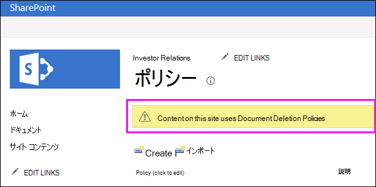

# サイトのドキュメント削除ポリシーを適用または削除するApply or remove a document deletion policy for a site

多くの場合、組織は一定期間、ドキュメントの保持が要求されるコンプライアンス、法的要件、その他の規制を受けます。Organizations are often subject to compliance, legal, or other regulations that require them to retain documents for a certain period of time. しかし、必要以上にドキュメントを長く保持すると、組織が法的なリスクにさらされる場合があります。However, retaining documents for longer than required can expose the organization to legal risk. このため、組織でサイト&mdash;用のドキュメント削除ポリシーが作成されている場合があります。たとえば、一般的なビジネスドキュメントは作成後5年間で削除する必要があります。For this reason, your organization may have created a document deletion policy for your site&mdash;for example, general business documents might be required to be deleted five years after they were created.
  
組織に応じて、ドキュメント削除ポリシーには次のようなものがあります。Depending on your organization, a document deletion policy might be:
  
- **必須**サイト所有者は必須ポリシーから脱退できません。これは、サイトに自動的に適用されます。**Mandatory** A site owner can't opt out of a mandatory policy, which is automatically applied to the site. 
    
- **既定** 既定のポリシーがサイトに自動的に適用されますが、サイトの所有者には次の選択肢がある。**Default** A default policy is automatically applied to a site, but a site owner can: 
    
  - 利用可能な場合は、別のポリシーを選択する。Choose another policy if available.
    
  - サイトのコンテンツに関連していない場合は、ポリシーを完全にオプトアウトします。Opt out of the policy entirely if it isn't relevant to the content in the site.
    
- **必須でも既定でもない** この場合、サイトにはどのポリシーも自動的に適用されず、サイトの所有者はポリシーを適用するためにアクションが必要。**Neither mandatory nor default** In this case, no policy is automatically applied to the site, and the site owner needs to take action to apply one. 
    
ドキュメント削除ポリシーには、複数のルール&mdash;が含まれている場合があります。たとえば、作成後1年後にドキュメントを削除するとします。ただし、別のルールは、最後に変更された後1年後にドキュメントを削除する場合があります。A document deletion policy may contain more than one rule&mdash;for example, one rule might say delete documents one year after they were created, but another rule might say delete documents one year after they were last modified. ポリシーに複数のルールが含まれている場合は、自分のサイトに最も適したルールを選択できます。If a policy contains more than one rule, you can select the rule that best applies to your site. 削除ルールは、サイト内のすべてのライブラリに適用されます。The delete rule will be applied to all libraries within the site. 1 つのサイトに一度に有効にできるのは、1 つのポリシーおよび 1 つのルールのみです。Only one policy and one rule can be active in a site at one time. ポリシーと同様に、ルールを既定として設定して、ポリシーが適用されたときにルールが自動的に適用されるようにすることができます。Like a policy, a rule can be set as default, so that it's applied automatically when the policy is applied.
  
最後に、ドキュメント削除ポリシーは継承されます。サイトにポリシーやルールを選択すると、その選択はすべてのサブサイトに継承されますが、サブサイトの所有者は別のポリシーやルールを選択することにより、継承を止めることができます。ポリシーやルールを選択する際には、サイトの下位にあるすべてのサブサイトのコンテンツを検討してください。Finally, document deletion policies are inherited. When you select a policy or rule for your site, that selection is inherited by all subsites, although an owner of a subsite can break inheritance by selecting a different policy or rule. When you select a policy or rule, consider the content of any subsites below your site.
  
## サイト コレクションで使用できるドキュメント削除ポリシーを表示するView the document deletion policies available in a site collection

組織は、異なるサイト コレクションに異なるポリシーを割り当てる場合があります。サイト コレクション レベルでは、サイト コレクションの所有者は、そのサイト コレクションで使用可能なすべてのドキュメント削除ポリシーを表示できます。ポリシーはサイト コレクション テンプレート (そしてそのテンプレートから作成されたすべてのサイト コレクション) で使用できるようになっている場合も、その特定のサイト コレクションで使用できるようになっている場合もあります。Your organization may assign different policies to different site collections. At the site collection level, an owner of a site collection can view all of the document deletion policies that are available to that site collection. The policies may have been made available to the site collection template (and therefore all site collections created from this template) or to this specific site collection.
  
1. サイトコレクションのトップレベルサイトで、右上隅の [**設定**] [歯車アイコン] [ \> **サイトの設定**] を選択します。In the top-level site in the site collection, in the upper-right corner, choose **Settings** [gear icon] \> **Site Settings**.
    
2. [**サイトコレクションの管理** \> **ドキュメント削除ポリシー**] を指定します。Under **Site Collection Administration** \> **Document Deletion Policies**.
    
    > [!NOTE]
    > サイトコレクションにポリシーが割り当てられていない場合、[**ドキュメント削除ポリシー**のリンクは表示されません。The **Document Deletion Policies** link won't appear unless policies have been assigned to the site collection. また、リンクは、ポリシーがサイトに割り当てられた直後には表示されず、[**ドキュメント削除ポリシー** ] リンクが表示されるときにポリシーが割り当てられると、最大24時間かかることがあります。Also, the link doesn't appear immediately after policies have been assigned to the site — it can take up to 24 hours from when the policies are assigned to when the **Document Deletion Policies** link appears. 
  
3. このページでは次のものが確認できます。On this page you can view:
    
  - 現在割り当てられているポリシーおよび関連するルール。右側のウィンドウで、ルールを表示するポリシーを選択します。The currently assigned policies and the associated rules. Select a policy to view the rules in the right pane.
    
  - 既定のポリシーがある場合、[**既定**] 列に [**はい**] が表示されます。The default policy, if any, displays **Yes** in the **Default** column. 
    
  - ポリシーが [**必須**] として割り当てられている場合は、リストの下にメッセージが表示されます。A message is displayed below the list if the policy has been assigned as **Mandatory**.
    
このリストは表示専用であり、サイト コレクションの所有者に、使用可能なすべてのポリシーとルールが表示されます。ポリシーを適用するには、次のセクションを参照してください。This list is view only, for the site collection owner to see all of the available policies and rules. To apply a policy, see the next section.
  

  
## サイトのドキュメント削除ポリシーを適用または削除するApply or remove a document deletion policy for a site

サイト所有者またはサイト コレクション所有者が自分のサイトに適用するか、まったく適用しないかを選択できるポリシーを組織が作成してある場合があります。As a site owner or site collection owner, your organization may have created policies that you can either apply to your site or opt out of entirely.
  
1. 右上隅で、[**設定**] [歯車アイコン] [サイト\>の**設定**] を選択します。In the upper-right corner, choose **Settings** [gear icon] \> **Site Settings**.
    
2. [**サイト管理** \>の**ドキュメント削除ポリシー**] の下。Under **Site Administration** \> **Document Deletion Policies**.
    
    > [!NOTE]
    > サイトコレクションにポリシーが割り当てられていない場合、[**ドキュメント削除ポリシー**のリンクは表示されません。The **Document Deletion Policies** link won't appear unless policies have been assigned to the site collection. また、リンクは、ポリシーがサイトに割り当てられた直後には表示されず、[**ドキュメント削除ポリシー** ] リンクが表示されるときにポリシーが割り当てられると、最大24時間かかることがあります。Also, the link doesn't appear immediately after policies have been assigned to the site — it can take up to 24 hours from when the policies are assigned to when the **Document Deletion Policies** link appears. 
  
3. 次のいずれかを実行します。Do one of the following:
    
  - **ポリシーを適用するには**ポリシー \>の選択そのポリシー \>の [**保存**] でルールを選択します。**To apply a policy** Select a policy \> select a rule in that policy \> **Save**.
    
    1 つのサイトに一度に有効にできるのは、1 つのポリシーおよび 1 つのルールのみです。組織は複数のポリシーとルールを用意して選択できるようにする場合も、ポリシーやルールを 1 つだけ用意する場合もあります。Only one policy and one rule can be active in a site at one time. Your organization may provide several policies and rules to choose from, or only one policy or rule.
    
    
  
  - **ポリシーからオプトアウトするに**は[**オプトアウト: Do Note Delete** \> **Save**] を選択します。**To opt out of a policy** Choose **Opt-Out: Do Note Delete** \> **Save**.
    
    サイトの所有者は、ポリシーがサイトのコンテンツに適用できないと判断した場合は、ドキュメント削除ポリシーをオプトアウトできます。As a site owner, you can opt out of a document deletion policy if you determine that the policy isn't applicable to the content in your site. ただし、**必須**としてマークされているポリシーからオプトアウトすることはできません。However, you can't opt out of a policy that has been marked as **Mandatory**.
    
    
  
## ドキュメント削除ポリシーによる、他のポリシーの上書きDocument deletion policies override other policies

コンテンツの保持と削除のために、サイトでは別のポリシーを使用する場合があります。A site may use other policies for retaining and deleting content:
  
- サイト コレクションのコンテンツ タイプ ポリシー。Content type policies for the site collection.
    
- リストまたはライブラリの情報管理ポリシー。Information management policies for a list or library.
    
リストまたはライブラリ用に既にコンテンツ タイプ ポリシーまたは情報管理ポリシーを使用しているサイトにドキュメント削除ポリシーを適用した場合、前者のポリシーは無視され、ドキュメント削除ポリシーが有効になります。If you apply a document deletion policy to a site that already uses content type policies or information management policies for a list or library, those policies are ignored while the document deletion policy is in effect. 他のポリシーが無視されると、"このサイトのコンテンツは、ドキュメント削除ポリシーを使用しています。" というメッセージが表示されます。If other policies are ignored, you'll see the message "Content on this site uses Document Deletion Policies".
  
つまり、構造化コンテンツ (情報管理ポリシーとコンテンツ タイプ ポリシー) 用か、非構造化コンテンツ (ドキュメント削除ポリシー) 用のいずれかのポリシーのみを使用するサイトを計画する必要があり、両方を使用することはできません。This means you should plan for a site to use only policies meant for structured content (information management policies and content type policies) or unstructured content (document deletion policies), not both. ドキュメント削除ポリシーの設定を解除した場合、警告は表示されず、他の種類のポリシーが引き続き機能します。If you opt out of a document deletion policy, the warning won't be displayed and other types of policies will continue to work.
  
サイト ポリシーはドキュメント削除ポリシーの影響を受けません。Site policies are not affected by document deletion policies.
  
### コンテンツ タイプ ポリシーが無視されているかどうかを確認するDetermine if content type policies are being ignored

サイトでコンテンツ タイプ ポリシーが使用されていたが、このメッセージが表示される場合、それらのポリシーはもう有効ではありません。If your site was using content type policies and you now see this message, those policies are no longer in effect. コンテンツタイプのポリシーを復元するには、使用可能なオプトアウトオプションがある場合は、前に説明したように、サイトからドキュメント削除ポリシーを削除します。To restore the content type policies, you can remove the document deletion policy from your site, as described earlier, if there's an opt-out option available. オプトアウトするオプションがない場合は、ドキュメント削除ポリシーは必須であり、組織のコンプライアンス責任者に連絡する必要があります。If there's no option to opt out, the document deletion policy is mandatory, and you need to contact the compliance officer in your organization.
  
1. 右上隅で、[**設定**] [歯車アイコン] [サイト\>の**設定**] を選択します。In the upper-right corner, choose **Settings** [gear icon] \> **Site Settings**.
    
2. [**サイト管理** \> **コンテンツタイプポリシーテンプレート**] の下。Under **Site Administration** \> **Content Type Policy Templates**.
    
    
  
### 情報管理ポリシーが無視されているかどうかを確認するDetermine if information management policies are being ignored

サイトで情報管理ポリシーが使用されていたが、このメッセージが表示される場合、それらのポリシーはもう有効ではありません。If your site was using information management policies and you now see this message, those policies are no longer in effect. 情報管理ポリシーを復元するには、前に説明したように、使用可能なオプトアウトオプションがある場合は、ドキュメント削除ポリシーをサイトから削除することができます。To restore the information management policies, you can remove the document deletion policy from your site, as described earlier, if there's an opt-out option available. オプトアウトするオプションがない場合は、ドキュメント削除ポリシーは必須であり、組織のコンプライアンス責任者に連絡する必要があります。If there's no option to opt out, the document deletion policy is mandatory, and you need to contact the compliance officer in your organization.
  
- \>リストまたはライブラリの場合、[**権限と管理** \> **情報管理ポリシーの設定**] の [リボン**ライブラリ**] タブ\> **ライブラリの設定** \> 。For a list or library, on the Ribbon \> **Library** tab \> **Library Settings** \> under **Permissions and Management** \> **Information Management Policy Settings**.
    
    
  
## 関連項目See also

[ドキュメント削除ポリシーの概要Overview of document deletion policies](document-deletion-policies.md)
  
[ドキュメント削除ポリシーを作成するCreate a document deletion policy](create-a-document-deletion-policy.md)

