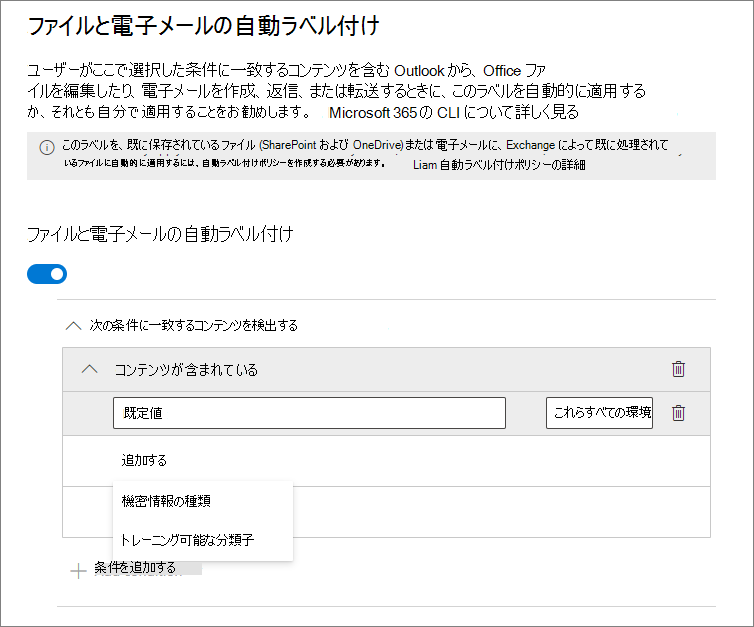
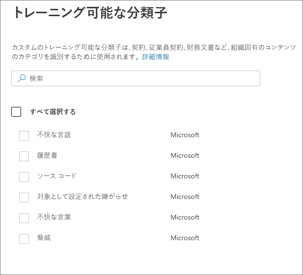
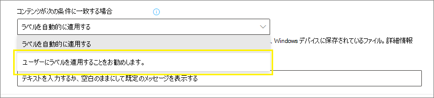
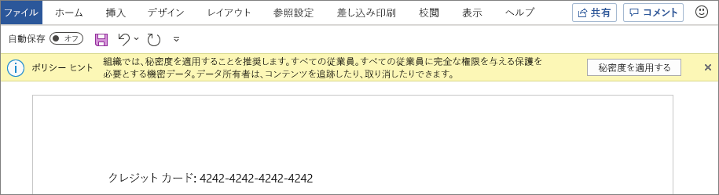
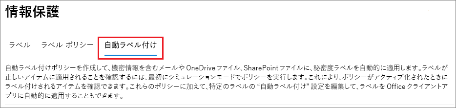
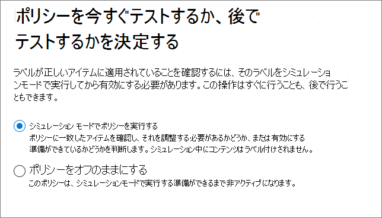

# <a name="apply-a-sensitivity-label-to-content-automatically"></a>秘密度ラベルをコンテンツに自動的に適用する

>*[セキュリティとコンプライアンスのための Microsoft 365 ライセンス ガイダンス](/office365/servicedescriptions/microsoft-365-service-descriptions/microsoft-365-tenantlevel-services-licensing-guidance/microsoft-365-security-compliance-licensing-guidance)。*

> [!NOTE]
> データ マップで秘密度ラベルを自動的に適用する方法については、「[Microsoft Purview データ マップでのラベル付け](/azure/purview/create-sensitivity-label)」を参照してください。

秘密度ラベルを作成する場合、指定した条件に一致したときに、そのラベルをファイルやメールに自動的に割り当てることができます。

秘密度ラベルを自動的にコンテンツに適用する機能が重要である理由は次のとおりです。

- それぞれの分類をいつ使用するかについて、ユーザーをトレーニングする必要がなくなる。

- ユーザーへの依存は、一部のコンテンツを正しく分類するためにのみ必要。

- ユーザーはポリシーについて把握する必要がなくなり、自分たちの仕事に集中できます。

Microsoft 365 でコンテンツに秘密度ラベルを自動的に適用するには、次の 2 つの方法があります。

- **ユーザーがドキュメントを編集したり、メールを作成 (返信または転送) するときのクライアント側のラベル付け**: ファイルやメール (Word、Excel、PowerPoint、Outlook を含む) の自動ラベル付け用に構成されたラベルを使用します。

    この方法は、ユーザーへのラベルの推奨と、ラベルの自動適用をサポートしています。 ただし、どちらの場合も、ユーザーはラベルを承諾または拒否するかどうかを決定し、コンテンツの正しいラベル付けを行います。 このクライアント側のラベル付けでは、ドキュメントを保存する前であってもラベルを適用できるため、ドキュメントの遅延が最小限に抑えられます。 ただし、すべてのクライアント アプリが自動ラベル付けをサポートしているわけではありません。 この機能は、[Office の一部のバージョン](sensitivity-labels-office-apps.md#support-for-sensitivity-label-capabilities-in-apps)に組み込みのラベル付けと、Azure Information Protection 統合ラベル付けクライアントでサポートされます。

    構成手順については、このページの「[Office アプリの自動ラベル付けを構成する方法](#how-to-configure-auto-labeling-for-office-apps)」を参照してください。

- **コンテンツが既に保存されている (SharePoint または OneDrive で) またはメールで送信された (Exchange Online によって処理される) サービス側のラベル付け**: 自動ラベル付けポリシーを使用します。
    
    この方法は、保存データ (SharePoint および OneDrive のドキュメント) や転送中のデータ (Exchange によって送信または受信されたメール) の自動ラベル付けと呼ばれることもあります。Exchangeの場合、保存中の電子メール (メールボックス) は含まれません。
    
    このラベル付けはアプリケーションではなくサービスによって適用されるため、ユーザーが使用しているアプリやバージョンを気にする必要はありません。 その結果、この機能は、組織全体ですぐに使用できるようになります。また、規模に応じたラベル付けに適しています。 自動ラベル付けポリシーでは、ユーザーがラベル付けプロセスを操作しないので、推奨されるラベル付けをサポートしていません。 代わりに、管理者は、実際にラベルを適用する前に、コンテンツの正しいラベル付けを行うために、シミュレーションでポリシーを実行します。

    構成手順については、このページの「[SharePoint、OneDrive、Exchange の自動ラベル付けポリシーを構成する方法](#how-to-configure-auto-labeling-policies-for-sharepoint-onedrive-and-exchange)」を参照してください。
    
    SharePoint と OneDrive の自動ラベル付けに固有:
    
    - Word (.docx)、PowerPoint (.pptx)、Excel (.xlsx) の Office ファイルがサポートされています。
        - これらのファイルは、自動ラベル付けポリシーが作成される前または後に、保存時に自動ラベル付けできます。 開いているセッションの一部である (ファイルが開いている) 場合、ファイルに自動ラベル付けはできません。
        - 現在、リスト アイテムへの添付はサポートされておらず、自動ラベル付けされません。
    - テナント内で 1 日あたり最大 25,000 個の自動的にラベル付けされたファイル。
    - テナントあたり最大 100 個の自動ラベル付けポリシーが作成されます。個別に指定した場合、各ポリシーは、最大 100 サイト (SharePoint サイトまたは OneDrive サイト) を対象としています。 すべてのサイトを指定することもできます。この構成は最大 100 サイトから除外されます。
    - シミュレーション モードの場合、およびラベルが適用される場合、自動ラベル付けポリシーの結果として、変更、変更者、変更日の既存の値は変更されません。
    - ラベルが暗号化を適用する場合、[Rights Management 発行者と Rights Management 所有者](/azure/information-protection/configure-usage-rights#rights-management-issuer-and-rights-management-owner) は、ファイルを最後に変更したアカウントです。

    Exchange の自動ラベル付けに固有:
    
    - 手動でのラベル付けや Office アプリを使用した自動ラベル付けとは異なり、PDF の添付ファイルと Office の添付ファイルも自動ラベル付けポリシーで指定した条件に合わせてスキャンされます。一致するものがある場合、メールにはラベルが付けられますが、添付ファイルにはラベルが付けられません。
        - PDF ファイルの場合、ラベルが暗号化を適用する場合、テナントで [PDF 添付ファイルが有効になっている場合](ome-faq.yml#are-pdf-file-attachments-supported-)、これらのファイルは[メッセージ暗号化](ome.md)を使用して暗号化されます。 適用された暗号化設定は、メールから継承されます。
        - Word、PowerPoint、Excel の Office ファイルがサポートされています。 ラベルが暗号化を適用し、これらのファイルが暗号化されていない場合は、[メッセージ暗号化](ome.md)を使用して暗号化されるようになりました。 暗号化設定はメールから継承されます。
    - IRM 暗号化を適用する Exchange メール フロー ルールまたは Microsoft Purview データ損失防止 (DLP) ポリシーがある場合: これらのルールやポリシーおよび自動ラベル付けポリシーによってコンテンツが識別されると、ラベルが適用されます。 このラベルが暗号化を適用すると、Exchange メール フロー ルールまたは DLP ポリシーの IRM 設定は無視されます。 ただし、そのラベルが暗号化を適用しない場合、メール フロー ルールまたは DLP ポリシーの IRM 設定がラベルに加えて適用されます。
    - ラベルが表示されない IRM 暗号化を使用しているメールは、自動ラベル付けを使用すると一致する場合は、暗号化設定のあるラベルに置き換えられます。
    - 自動ラベル付け条件と一致すると、受信メールにラベルが付けられます。 このラベルが[暗号化](encryption-sensitivity-labels.md)用に構成されている場合、送信者が組織から送信されると、その暗号化は常に適用されます。 既定では、送信者が組織外の場合、その暗号化は適用されませんが、**電子メールの追加設定** を構成し、Rights Management 所有者を指定することで適用できます。
    - ラベルが暗号化を適用する場合、[Rights Management 発行者と Rights Management 所有者](/azure/information-protection/configure-usage-rights#rights-management-issuer-and-rights-management-owner)は、送信者が自分の組織から送信される際にメールを送信するユーザーです。 送信者が組織外の場合は、ポリシーによってラベル付けおよび暗号化された受信メールの Rights Management 所有者を指定できます。
    - ラベルが[動的マーキング](sensitivity-labels-office-apps.md#dynamic-markings-with-variables)を適用するように構成されている場合、受信メールの場合、この構成により組織外の人の名前が表示される可能性があることに注意してください。

> [!TIP]
> 一部の新規のお客様には、クライアント側のラベル付けとサービス側のラベル付けの両方に対する既定の自動ラベル付け設定の自動構成が提供されています。 この自動構成の対象になっていない場合でも、その構成を参照すると役立つ場合があります。 たとえば、既存のラベルを手動で構成し、同じ設定で独自の自動ラベル付けポリシーを作成して、ラベル付けの展開を高速化することができます。
> 
> 詳細については、「[Microsoft Purview Information Protection の既定のラベルとポリシー](mip-easy-trials.md)」を参照してください。


## <a name="compare-auto-labeling-for-office-apps-with-auto-labeling-policies"></a>Office アプリの自動ラベル付けと自動ラベル付けポリシーを比較する

次の表は、2 つの相補的な自動ラベル付け方法の違いを特定するのに役立ちます。

|機能または動作|ラベル設定: ファイルやメールの自動ラベル付け  |ポリシー: 自動ラベル付け|
|:-----|:-----|:-----|
|アプリの依存関係|はい ([最小バージョン](sensitivity-labels-office-apps.md#support-for-sensitivity-label-capabilities-in-apps)) |いいえ \* |
|場所による制限|いいえ |はい |
|条件: トレーニング可能な分類子|はい |いいえ |
|条件: メールの共有オプションと追加オプション|いいえ |はい |
|条件: 例外|いいえ |はい (メールのみ) |
|推奨事項、ポリシーのヒント、ユーザー上書き|はい |いいえ |
|シミュレーション モード|いいえ |はい |
|条件についてチェックされた Exchange 添付ファイル|いいえ | はい|
|視覚的なマーキングの適用 |はい |はい (メール専用) |
|ラベルなしで適用された IRM 暗号化の上書き|はい (ユーザーがエクスポートの最小使用権を持っている場合) |はい (メール専用) |
|受信メールのラベル付け|いいえ |はい|
|別の組織から送信されたメールに Rights Management 所有者を割り当てる |不要 |はい|
|メールの場合は、優先度が同じか低い既存のラベルを置き換えます |不要 |はい (構成可能)|

\* 自動ラベル付けは現在バックエンドの Azure 依存関係にあるため、すべての地域でご利用できるわけではありません。 テナントがこの機能をサポートできない場合、**[自動ラベル付け]** タブは Microsoft Purview コンプライアンス ポータルに表示されません。 詳細については、[国別の Azure 依存関係の可用性](/troubleshoot/azure/general/dependency-availability-by-country) を参照してください。

## <a name="how-multiple-conditions-are-evaluated-when-they-apply-to-more-than-one-label"></a>複数のラベルに適用するときの複数の条件の評価方法

ラベルは、ポリシー内で指定した位置に従って評価の順序を決められます。先頭に配置したラベルが最下位 (機密性が最も低い) になり、最後に配置したラベルが最上位 (機密性が最も高い) になります。優先度に関する詳細については、「[ラベルの優先度 (順序の問題)](sensitivity-labels.md#label-priority-order-matters)」を参照してください。

## <a name="dont-configure-a-parent-label-to-be-applied-automatically-or-recommended"></a>自動適用または推奨されるように親ラベルを構成しない

親ラベル (サブラベルのあるラベル) はコンテンツに適用できません。 Office アプリで親ラベルが自動適用または自動推奨されるように構成されていないこと、自動ラベル ポリシーで親ラベルが選択されていないことを確認してください。 その場合、親ラベルをコンテンツに適用できなくなる可能性があります。

自動ラベルでサブラベルも使用するには、必ず親ラベルとサブラベルの両方を発行してください。

親ラベルとサブラベルの詳細については、「[サブラベル (ラベルのグループ化)](sensitivity-labels.md#sublabels-grouping-labels)」を参照してください。

## <a name="will-an-existing-label-be-overridden"></a>既存のラベルはオーバーライドされますか?

> [!NOTE]
> メールの自動ラベル付けポリシーに最近追加された設定を使用すると、一致する秘密度ラベルが常に既存のラベルをオーバーライドするよう指定できます。

自動ラベル付けが既存のラベルをオーバーライドするかどうかのデフォルトのビヘイビアー:

- コンテンツが手動でラベル付けされている場合、そのラベルが自動ラベル付けで置き換えられることはありません。

- 自動ラベル付けは、自動的に適用された[低優先度の秘密度ラベル](sensitivity-labels.md#label-priority-order-matters)を置き換えますが、優先度の高いラベルは置き換えません。
    
    > [!TIP]
    > たとえば、Microsoft Purview コンプライアンス ポータルのリストの上部にある秘密度ラベルには、注文番号 (優先順位) が 0 の **パブリック** という名前が付けられ、リストの下部にある秘密度ラベルは、注文番号 (優先度 4) **高機密** という名前が付けられます。**高機密** ラベルは、**パブリック** ラベルをオーバーライドできますが、その逆はできません。

メールの自動ラベル付けポリシーの場合のみ、適用方法に関係なく、既存の秘密度ラベルを常に上書きする設定を選択できます。

|既存のラベル |ラベル設定によりオーバーライドする: ファイルやメールの自動ラベル付け  |ポリシーによりオーバーライドする: 自動ラベル付け|
|:-----|:-----|:-----|
|任意の優先順位で手動で適用|Word、Excel、PowerPoint: いいえ <br /><br> Outlook: いいえ  |SharePoint および OneDrive: いいえ <br /><br> Exchange: 既定ではいいえですが、構成可能 |
|ポリシーから自動的に適用されるラベルまたはデフォルトのラベル、優先度: 低 |Word、Excel、PowerPoint: はい <br /><br> Outlook: はい | SharePoint および OneDrive: はい <br /><br> Exchange: はい |
|ポリシーから自動的に適用されるラベルまたはデフォルトのラベル、優先度: 高 |Word、Excel、PowerPoint: いいえ <br /><br> Outlook: いいえ |SharePoint および OneDrive: いいえ <br /><br> Exchange: 既定ではいいえですが、構成可能 |

メール自動ラベル付けポリシーの構成可能な設定は、「**メールの追加設定**」 ページにあります。 このページは、Exchange の場所を含む自動ラベル付けポリシーの秘密度ラベルを選択した後に表示されます。

## <a name="how-to-configure-auto-labeling-for-office-apps"></a>Office アプリの自動ラベル付けを構成する方法

Office アプリの組み込みラベル付けについては、Office アプリでの自動ラベル付けに[必要な最小バージョン](sensitivity-labels-office-apps.md#support-for-sensitivity-label-capabilities-in-apps)を確認してください。

Azure Information Protection 統合ラベル付けクライアントは、組み込みおよびカスタムの機密情報タイプに対してのみ自動ラベル付けをサポートし、完全データ一致 (EDM) または名前付きエンティティを使用するトレーニング可能な分類子または機密情報タイプをサポートしません。

Office アプリの自動ラベル付け設定は、[機密ラベルを作成または編集する](create-sensitivity-labels.md)ときに使用できます。 ラベルの範囲として **[アイテム]** が選択されていることを確認してください。


構成内を移動すると、**[ファイルやメールの自動ラベル付け]** ページが表示されます。このページでは、機密情報の種類またはトレーニング可能な分類子の一覧から選択できます。



この秘密度ラベルが自動的に適用されると、ユーザーの Office アプリに通知が表示されます。以下のような例があります:


### <a name="configuring-sensitive-info-types-for-a-label"></a>ラベルの機密情報の種類の構成

[**機密情報の種類**] オプションを選択すると、データ損失防止 (DLP) ポリシーを作成するときと同じ機密情報の種類の一覧が表示されます。たとえば、クレジット カード番号、社会保障番号、パスポート番号など、顧客の個人情報を含むコンテンツに高機密ラベルを自動的に適用できます。


DLP ポリシーを構成する場合と同様に、インスタンス数と一致精度を変更することで条件を調整できます。以下のような例があります:


これらの構成オプションの詳細については、DLP ドキュメント「[一致の難易度を上下するためにルールを調整する](data-loss-prevention-policies.md#tuning-rules-to-make-them-easier-or-harder-to-match)」を参照してください。

> [!IMPORTANT]
> 機密情報の種類には、最大固有インスタンス数パラメーターを定義する 2 つの異なる方法があります。 詳細については、「[SIT のインスタンス数のサポート値](create-a-custom-sensitive-information-type.md#instance-count-supported-values-for-sit)」を参照してください。

また、DLP ポリシーの構成と同様に、条件ですべての機密情報の種類を検出する必要があるか、そのうちの 1 つだけを検出するかを選択できます。また、条件をより柔軟または複雑にするために、[グループを追加し、グループ間で論理演算子を使用](data-loss-prevention-policies.md)することもできます。

> [!NOTE]
> カスタムの機密情報の種類に基づく自動ラベル付けは、OneDrive および SharePoint で新しく作成または変更されたコンテンツにのみ適用されます。既存のコンテンツには適用されません。この制限は、自動ラベル付けポリシーにも適用されます。

#### <a name="custom-sensitive-information-types-with-exact-data-match"></a>Exact Data Match によるカスタムの機密情報の種類

秘密度ラベルを構成して、カスタムの機密情報の種類に [Exact Data Match による機密情報の種類](sit-learn-about-exact-data-match-based-sits.md#learn-about-exact-data-match-based-sensitive-information-types) を使用できます。 ただし、現時点では、EDM を使用しない機密情報の種類を少なくとも 1 つ指定する必要があります。 たとえば、**クレジット カード番号** など、組み込みの機密情報の種類のうちの 1 つ。

機密情報の種類の条件に対して EDM のみを使用して秘密度ラベルを構成した場合、ラベルの自動ラベル付け設定は自動的にオフになります。

### <a name="configuring-trainable-classifiers-for-a-label"></a>ラベルのトレーニング可能な分類子を構成する

このオプションを Microsoft 365 Apps for Windows バージョン 2106 以下、またはMicrosoft 365 Apps for Mac バージョン 16.50 以下で使用する場合、自動ラベル付けと[機密情報の種類オプション](#configuring-sensitive-info-types-for-a-label)用に構成された少なくとも 1 つの他の機密ラベルをテナントに公開していることを確認してください。これらのプラットフォームでそれ以降のバージョンを使用する場合、この要件は必要ありません。

**トレーニング可能な分類子** のオプションを選択する場合、1 つ以上の事前にトレーニングされた、またはカスタムのトレーニング可能な分類子を選択します。



利用可能な事前トレーニング済みの分類子は頻繁に更新されるため、このスクリーンショットに表示されているものよりも多くのエントリを選択できる可能性があります。

これらの分類子の詳細については、「[トレーニング可能な分類子 (プレビュー) の詳細](classifier-learn-about.md)」を参照してください。

### <a name="recommend-that-the-user-applies-a-sensitivity-label"></a>ユーザーが秘密度ラベルを適用することを推奨

必要に応じて、ラベルを適用することをユーザーに推奨できます。このオプションでは、分類および関連する保護を受け入れるか、またはラベルがそのコンテンツに適していない場合、推奨事項を無視するかをユーザーが選択できます。



ラベルを推奨される操作として適用するように条件を構成したときの、Azure Information Protection の統合ラベル付けクライアントからのプロンプトの例を、カスタム ポリシー ヒントと共に示します。ポリシー ヒントに表示するテキストを選択できます。



### <a name="when-automatic-or-recommended-labels-are-applied"></a>自動ラベルまたは推奨ラベルが適用されている場合

Office アプリでの自動ラベル付けと推奨ラベル付けの実装は、Office に組み込まれているラベル付けを使用しているか、または Azure Information Protection の統合ラベル付けクライアントを使用しているかによって異なります。ただし、どちらの場合も、次のようになります。

- 以前に手動でラベル付けされた、または以前に高い秘密度で自動的にラベル付けされたドキュメントや電子メールに自動ラベル付けを使用することはできません。(単一の保持ラベルに加えて) ドキュメントまたは電子メールに適用できる機密ラベルは 1 つだけであることにご注意ください。

- 以前に高い感度でラベル付けされたドキュメントまたはメールに推奨されるラベル付けを使用することはできません。 コンテンツがすでに高い感度でラベル付けされている場合、ユーザーには推奨事項とポリシーのヒントが記載されたプロンプトは表示されません。

組み込みのラベル付けに関してのみ以下の点が当てはまります。

- 必ずしもすべての Office アプリで自動 (および推奨) ラベル付けがサポートされるわけではありません。 詳しくは、「[アプリでの秘密度ラベル機能のサポート](sensitivity-labels-office-apps.md#support-for-sensitivity-label-capabilities-in-apps)」を参照してください。

- Word のデスクトップ バージョンにおける推奨ラベルでは、推奨をトリガーした機密コンテンツにフラグが付けられるので、ユーザーが確認して、推奨されている秘密度ラベルを適用しないで機密コンテンツを削除できます。

- こうしたラベルが Office アプリで適用される方法、スクリーンショット例、機密情報の検出方法について詳しくは、「[Office のファイルとメールに秘密度ラベルを自動的に適用、または推奨する](https://support.microsoft.com/office/automatically-apply-or-recommend-sensitivity-labels-to-your-files-and-emails-in-office-622e0d9c-f38c-470a-bcdb-9e90b24d71a1)」を参照してください。

Azure Information Protection 統合ラベル付けクライアントに関してのみ以下の点が当てはまります。

- 自動ラベル付けと推奨ラベル付けは、Word、Excel、PowerPoint でドキュメントが保存されるときと、Outlook でメールが送信されるときに適用されます。

- Outlook で推奨ラベル付けをサポートするには、最初に[詳細なポリシー設定](/azure/information-protection/rms-client/clientv2-admin-guide-customizations#enable-recommended-classification-in-outlook)を構成する必要があります。

- ドキュメントやメール内の本文、およびヘッダーとフッターに含まれる機密情報が検出されますが、件名やメールの添付ファイルのものは検知されません。

### <a name="convert-your-label-settings-into-an-auto-labeling-policy"></a>ラベル設定を自動ラベル付けポリシーに変換する

> [!NOTE]
> このオプションは、段階的にロールアウトされています。

構成された条件の機密情報の種類がラベルに含まれている場合、ラベルの作成または編集プロセスの最後に、同じ自動ラベル付け設定に基づく自動ラベル付けポリシーを自動的に作成するオプションが表示されます。

自動ラベル付けポリシーはトレーニング可能な分類子をサポートしていないためです。

- ラベル条件にトレーニング可能な分類子のみが含まれている場合、自動ラベル付けポリシーを自動的に作成するオプションは表示されません。

- ラベル条件にトレーニング可能な分類子と機密情報の種類が含まれている場合、機密情報の種類のみに対して自動ラベル付けポリシーが作成されます。 

自動ラベル付けポリシーは、ポリシーを最初から作成する場合に手動で選択する必要がある値を自動入力することによって自動的に作成されますが、保存前に値を表示および編集できます。

既定では、SharePoint、OneDrive、Exchange のすべての場所が自動ラベル ポリシーに含まれ、ポリシーが保存されると [シミュレーション モード](#learn-about-simulation-mode) で実行されます。 [SharePoint および OneDrive で Office ファイルの秘密度ラベルを有効にする](sensitivity-labels-sharepoint-onedrive-files.md) をオンにしたかどうかは確認できません。有効にすることは、SharePoint および OneDrive のコンテンツに適用する自動ラベル付けの前提条件の 1 つです。

## <a name="how-to-configure-auto-labeling-policies-for-sharepoint-onedrive-and-exchange"></a>SharePoint、OneDrive、Exchange の自動ラベル付けポリシーを構成する方法

自動ラベル付けポリシーを構成する前に、前提条件を必ずご確認ください。

### <a name="prerequisites-for-auto-labeling-policies"></a>自動ラベル付けポリシーの前提条件

- シミュレーション モード:
  - Microsoft 365 の監査を有効にする必要があります。監査を有効にする必要がある場合、または監査が既に有効になっているかどうかがわからない場合は「[監査ログ検索のオンとオフを切り替える](turn-audit-log-search-on-or-off.md)」を参照してください。
  - ソース ビューでファイルまたはメールの内容を表示するには、**"データ分類コンテンツ ビューアー"** ロールが必要です。これは、**"コンテンツ エクスプローラー コンテンツ ビューアー"** のロール グループ、または **"Information Protection"** および **"Information Protection 調査員"** のロール グループ (現在プレビュー段階) に含まれています。 必要なロールがないと、**[一致したアイテム]** タブからアイテムを選択しても、プレビュー ウィンドウは表示されません。既定では、グローバル管理者にはこのロールがありません。

- SharePoint および OneDrive にあるファイルに自動でラベルを付けるには:
  - [SharePoint および OneDrive で Office ファイルの機密度ラベルを有効にしています](sensitivity-labels-sharepoint-onedrive-files.md)。
  - 自動ラベル付けポリシーの実行時に、別のプロセスまたはユーザーがファイルを開いておくことはできません。 編集用にチェックアウトされたファイルは、このカテゴリに分類されます。

- 組み込みの機密度の種類ではなく、[カスタムの機密情報の種類](sensitive-information-type-learn-about.md)を使用する場合は、次の操作を行います。
  - カスタムの機密情報の種類は、カスタムの機密情報の種類が作成された後に SharePoint または OneDrive で追加または変更されたコンテンツにのみ適用されます。
  - 新しいカスタムの機密情報の種類をテストするには、自動ラベル付けポリシーを作成する前に作成してから、テスト用のサンプル データを使用して新しいドキュメントを作成します。

- 自動ラベル付けポリシー用に選択できる、[作成および公開された](create-sensitivity-labels.md) (少なくとも 1 人のユーザーに対して) 1 つ以上の秘密度ラベル。
  - 概要で説明したように、ラベル設定は自動ラベル付けポリシーを補完するため、Office アプリのラベル設定の自動ラベル付けがオンかオフかは関係ありません。
  - 自動ラベル付けに使用するラベルが視覚的なマーキング (ヘッダー、フッター、透かし) を使用するように構成されている場合、これらはドキュメントに適用されないことに注意してください。
  - ラベルが[暗号化](encryption-sensitivity-labels.md)を適用する場合:
    - 自動ラベル付けポリシーに SharePoint または OneDrive の場所が含まれている場合は、 **[今すぐアクセス許可を割り当てる ]** 設定にラベルを構成し、 **コンテンツへのユーザー アクセスの有効期限** を **[なし]** に設定する必要があります。
    - 自動ラベル付けポリシーが Exchange 専用の場合、ラベルは、[**アクセス許可を今すぐ割り当てる**] または [**ユーザーにアクセス許可を割り当てさせる**] ([転送しない] または [暗号化のみ] オプションの場合) のいずれかに構成できます。 [構成されているラベルを自動適用して S/MIME 保護](sensitivity-labels-office-apps.md#configure-a-label-to-apply-smime-protection-in-outlook)を適用することはできません。

### <a name="learn-about-simulation-mode"></a>シミュレーション モードの詳細

シミュレーション モードは、自動ラベル付けポリシーに固有であり、ワークフローに組み込まれています。 ポリシーによって少なくとも 1 つのシミュレーションが実行されるまで、ドキュメントとメールに自動的にラベルを付けることはできません。

シミュレーション モードは、最大 1,000,000 件の一致したファイルをサポートします。 自動ラベル付けポリシーからこの数を超えるファイルが一致する場合、ポリシーをオンにしてラベルを適用することはできません。 この場合、一致するファイルが少なくなるように自動ラベル付けポリシーを再構成して、シミュレーションを再実行する必要があります。 この最大 1,000,000 の一致するファイルは、シミュレーション モードにのみ適用され、機密ラベルを適用するためにすでにオンになっている自動ラベル付けポリシーには適用されません。

自動ラベル付けポリシーのワークフロー:

1. 自動ラベル付けポリシーを作成して構成する。

2. ポリシーをシミュレーション モードで実行します。完了までに 12 時間かかる場合があります。 シミュレーションが完了すると、 [アクティビティ アラート](alert-policies.md)を受信するように構成されたユーザーに送信されるメール通知がトリガーされます。

3. 結果を確認し、必要に応じてポリシーを調整します。 たとえば、ポリシー ルールを編集して誤検知を減らすか、一部のサイトを削除して、一致するファイルの数が 1,000,000 を超えないようにする必要があるかも知れません。 シミュレーション モードを再実行し、シミュレーションが再度完了するまで待機します。

4. 必要に応じて、手順 3 を繰り返します。

5. 実稼働環境に展開する。

シミュレーションされた展開は、PowerShell の WhatIf パラメーターのように動作します。 定義したルールを使用して、自動ラベル付けポリシーが選択したラベルを適用したかのようにレポートされた結果が表示されます。 その後、必要に応じてルールの精度を高め、シミュレーションを再実行できます。 ただし、Exchange の自動ラベル付けは、メールボックスに保存されたメールではなく、送受信されるメールに適用されるため、完全に同じメール メッセージを送受信することができなければ、シミュレーションのメールの結果に一貫性があるとは期待できません。

シミュレーション モードでは、展開前に自動ラベル付けポリシーの範囲を徐々に広げることもできます。 たとえば、1 つのドキュメント ライブラリを持った SharePoint サイトなどの 1 つの場所から始めることができます。 次に、反復的な変更を加えて、範囲を複数のサイトに拡大し、次に OneDrive などの別の場所に拡大します。

最後に、シミュレーション モードを使用して、自動ラベル付けポリシーの実行に必要な時間の概算を提供し、シミュレーション モードを使用せずに実行するタイミングを計画してスケジュールすることができます。

### <a name="creating-an-auto-labeling-policy"></a>自動ラベル付けポリシーの作成

1. <a href="https://go.microsoft.com/fwlink/p/?linkid=2077149" target="_blank">Microsoft Purview コンプライアンス ポータル</a>で、機密ラベルに移動します。

    - [**ソリューション**]  >  [**Information Protection**]

    このオプションがすぐに表示されない場合は、まず [**すべてを表示**] を選択します。

2. [**自動ラベル付け**] タブを選択します。

    

    > [!NOTE]
    > [**自動ラベル付け**] タブが表示されない場合、バックエンド Azure の依存関係のため、この機能は現在お使いのリージョンでは使用できません。詳細については「[国別の Azure 依存関係の可用性](/troubleshoot/azure/general/dependency-availability-by-country)」を参照してください。

3. [**+自動ラベル付けポリシーの作成**] を選択します。 これにより、新しいポリシー構成が開始されます。

    

4. [**このラベルを適用する情報を選択する**] ページの場合: [**財務**] または [**プライバシー**] などのテンプレートのいずれかを選択します。 ドロップダウンの **表示オプション** を使用して、検索を絞り込むことができます。 または、テンプレートが要件を満たしていない場合は、[**カスタム ポリシー**] を選択します。 **[次へ]** を選択します。

5. [**自動ラベル ポリシーに名前を付ける**] ページの場合: 一意の名前を入力し、必要に応じて説明を入力して、自動的に適用されるラベル、場所、ラベル付けするコンテンツを識別する条件を識別します。

6. [**ラベルを適用する場所を選択する**] ページの場合: Exchange、SharePoint、OneDrive の場所を選択して指定します。 選択した場所の既定値を **[すべて]** のままにしない場合は、リンクを選択して含める特定のインスタンスを選択するか、リンクを選択して除外する特定のインスタンスを選択します。 [**次へ**] を選択します。

    ![自動ラベル付け構成の [場所の選択] ページ。](../media/locations-auto-labeling-wizard.png)
    
    **Included** または **Excluded** を使用して既定の設定を変更する場合:
    
    - **Exchange** の場所では、指定された受信者の送信者アドレスに従ってポリシーが適用されます。 ほとんどの場合、既定の **[すべて]** の既定値は、**[なし]** を除外する必要があります。 この構成は、ユーザーのサブセットをテストする場合でも適しています。 ここでユーザーのサブセットを指定する代わりに、次の手順の高度なルールを使用して、組織内の受信者を含めるか除外する条件を構成します。 それ以外の場合は、ここで既定の設定を変更します。
        -  既定の **[すべて]** を含めるという既定値を変更して、代わりに特定のユーザーまたはグループを選択した場合、組織外から送信されたメールはポリシーから除外されます。 
        -  既定の **[すべて]** を含めるという既定を維持しながらも、除外するユーザーまたはグループを指定した場合、これらの除外されたユーザーが送信するメールはポリシーから除外されますが、除外されたユーザーが受信するメールは除外されません。
    
    - 含めるまたは除外する個々の OneDrive アカウントを指定するには、「[組織内のすべてのユーザーの OneDrive の URL 一覧を取得する](/onedrive/list-onedrive-urls)」を参照してください。

7. [**共通ルールまたは高度なルールの設定**] ページ: 既定の **共通ルール** を維持して、選択したすべての場所でラベルを付けるコンテンツを識別するルールを定義します。場所ごとに異なるルールが必要な場合は[**高度なルール**] を選択します。次に、[**次**]. を選択します。

    ルールでは、機密情報の種類と共有オプションを含む条件を使用します。
    - 機密情報の種類については、組み込みとカスタムの両方の機密情報の種類を選択できます。
    - 共有オプションについては、[**組織内の連絡先のみ**] または [**組織外の連絡先**] を選択できます。

    唯一の場所が **Exchange** である場合、または [**詳細ルール**] を選択した場合、次のような選択ができるその他の条件があります。
    - 送信者の IP アドレスが
    - 受信者ドメインが
    - 受信者が
    - 添付ファイルの拡張子が
    - 添付ファイルがパスワードで保護されている
    - メールの添付ファイルのコンテンツをスキャンできなかった
    - メールの添付ファイルのコンテンツのスキャンが完了しなかった
    - ヘッダーがパターンと一致している
    - 件名がパターンと一致している
    - 受信者のアドレスに単語が含まれている
    - 受信者のアドレスがパターンと一致している
    - 送信者のアドレスがパターンと一致している
    - 送信者のドメインが次の場合
    - 受信者が次のメンバーの場合
    - 送信者が

    これらの条件ごとに、例外を指定できます。

8. 以前の選択に応じて、条件と例外を使用して新しいルールを作成する機会があります。

    機密情報の種類の構成オプションは、Office アプリの自動ラベル付けに選択したものと同じです。 詳細情報が必要な場合は、「[ラベルの機密情報の種類の構成](#configuring-sensitive-info-types-for-a-label)」を参照してください。

    必要なすべてのルールを定義し、状態が [オン] になっていることを確認したら、[**次へ**] を選択して、自動適用するラベルの選択に進みます。

9. [**自動適用するラベルを選択する**] ページの場合: [**+ ラベルの選択**] を選択し、[**機密ラベルの選択**] ウィンドウのラベルを選択し、[**次へ**] を選択します。

10. ポリシーに Exchange の場所が含まれている場合: 「**メールの追加設定**」ページでオプションの構成を指定します。
    
    - **優先度が同じまたは低い既存のラベルを自動的に置き換える**: 受信メールと送信メールの両方に適用されます。この設定を選択すると、一致する秘密度ラベルが常に適用されます。 この設定を選択しない場合、一致する秘密度ラベルは、[高優先度](sensitivity-labels.md#label-priority-order-matters)または手動でラベル付けされた既存の秘密度ラベルを持つメールには、適用されません。
    
    - **組織外から受信した電子メールに対する暗号化を適用する**: このオプションを選択する場合は、[Rights Management 所有者](/azure/information-protection/configure-usage-rights#rights-management-issuer-and-rights-management-owner)を割り当てて、組織内の承認されたユーザーが、組織外から送信されたメールと暗号化されたポリシー ラベルに対してフル コントロールの [使用権](/azure/information-protection/configure-usage-rights#usage-rights-and-descriptions)を持っていることを確認する必要があります。このロールは、後で暗号化を削除したり、組織内のユーザーに異なる使用権を割り当てたりするために必要になる場合があります。
        
        **Rights Management 所有者を割り当てる** 場合は、組織が所有するメール アドレスで 1 人のユーザーを指定します。 メール連絡先、共有メールボックス、またはグループの種類は、このロールではサポートされていないため、指定しないでください。

10. **[ポリシーを今すぐテストするか後でテストするかを決定する]** ページの場合: シミュレーション モードで、今すぐ自動ラベル付けポリシーを実行する準備が整っている場合は、**[シミュレーション モードでポリシーを実行する]** を選択します。 次に、7 日間編集されていないポリシーを自動的に有効にするかどうかを決定します。
    
    
    
    シミュレーションを実行する準備が整っていない場合は、**[ポリシーをオフのままにする]** を選択します。 

11. **[概要]** ページの場合: 自動ラベル付けポリシーの構成を確認し、必要な変更を行い、構成を完了します。

**[情報保護]** > **[自動ラベル付け]** ページでは、自動ラベル付けポリシーを **[シミュレーション]** または **[オフ]** セクションのどちらかで確認できます。これは、シミュレーション モードで実行することを選択したかどうかによって決まります。 ポリシーを選択して、構成と状態の詳細 (**[ポリシー シミュレーションの実行中]** など) を確認します。 シミュレーション モードのポリシーの場合は、**[一致したアイテム]** タブを選択して、指定したルールに一致した電子メールまたはドキュメントを確認します。

このインターフェイスからは、次のようにポリシーを直接変更できます。

- **[オフ]** セクションのポリシーの場合は、**[ポリシーの編集]** ボタンを選択します。

- **[シミュレーション]** セクションのポリシーの場合は、いずれかのタブからページの上部にある **[ポリシーの編集]** オプションを選択します。

    

    シミュレーションなしでポリシーを実行する準備が整っているときには、**[ポリシーを有効にする]** オプションを選択します。

自動ラベル付けポリシーは、削除されるまで継続的に実行されます。 たとえば、新しいドキュメントや変更されたドキュメントは、現在のポリシー設定に含まれます。

### <a name="monitoring-your-auto-labeling-policy"></a>自動ラベル付けポリシーの監視

自動ラベル付けポリシーを有効にすると、選択した SharePoint と OneDrive の場所にあるファイルのラベル付けの進行状況を表示できます。 メールは、送信時に自動的にラベル付けされるため、ラベル付けの進行状況には含まれません。

ラベル付けの進行状況には、ポリシーによってラベル付けされるファイル、過去 7 日間にラベル付けされたファイル、およびラベル付けされたファイルの合計が含まれます。 1 日に最大 25,000 個のファイルにラベルを付けられるので、この情報を使用すると、ポリシーの現在のラベル付けの進行状況と、これからラベル付けされるファイル数が確認できます。

ポリシーを初めて有効にすると、最新のデータが取得されるまで、ラベル付けするファイルの数が 0 と表示されます。 この進行状況情報は 48 時間ごとに更新されるため、1 日おきに最新のデータが表示されます。 自動ラベル付けポリシーを選択すると、ポップアップ ウィンドウにポリシーの詳細が表示されます。これには、上位 10 サイトによるラベル付けの進行状況が含まれます。 このポップアップ ウィンドウの情報は、**"自動ラベル付け"** メイン ページに表示される集約されたポリシー情報よりも最新である可能性があります。

また、適切な[アクセス許可](data-classification-content-explorer.md#permissions)がある場合は、[コンテンツ エクスプローラー](data-classification-content-explorer.md)を使用して、自動ラベル付けポリシーの結果を確認することもできます。

- **"コンテンツ エクスプローラーのリスト ビューアー"** ロール グループでは、ファイルのラベルは表示できますが、ファイルのコンテンツは表示できません。
- **"コンテンツ エクスプローラー コンテンツ ビューアー"** ロール グループ、および **"Information Protection"** および **"Information Protection の調査担当者"** ロール グループ (現在プレビュー段階) では、ファイルの内容を確認できます。

> [!TIP]
> コンテンツ エクスプローラーを使用して、機密情報を含むラベルの付いていないドキュメントがある場所を特定することもできます。 この情報を使用して、自動ラベル付けポリシーにこれらの場所を追加することを検討し、識別された機密情報の種類をルールとして含めます。

### <a name="use-powershell-for-auto-labeling-policies"></a>自動ラベル付けポリシーに PowerShell を使用する

[セキュリティ/コンプライアンス PowerShell](/powershell/exchange/scc-powershell) を使用して、自動ラベル付けポリシーを作成し、構成できます。 これにより、自動ラベル付けポリシーの作成やメンテナンスを完全にスクリプト化できるようになり、OneDrive や SharePoint の場所に複数の URL を指定する効率的な方法も提供できます。

PowerShell でコマンドを実行する前に、最初に[セキュリティ/コンプライアンス センター PowerShell に接続](/powershell/exchange/connect-to-scc-powershell)する必要があります。

新しい自動ラベル付けポリシーを作成するには:

```powershell
New-AutoSensitivityLabelPolicy -Name <AutoLabelingPolicyName> -SharePointLocation "<SharePointSiteLocation>" -ApplySensitivityLabel <Label> -Mode TestWithoutNotifications
```

このコマンドは、指定した SharePoint サイトの自動ラベル付けポリシーを作成します。 OneDrive の場所については、代わりに *OneDriveLocation* パラメーターを使用します。

既存の自動ラベル付けポリシーにその他のサイトを追加するには:

```powershell
$spoLocations = @("<SharePointSiteLocation1>","<SharePointSiteLocation2>")
Set-AutoSensitivityLabelPolicy -Identity <AutoLabelingPolicyName> -AddSharePointLocation $spoLocations -ApplySensitivityLabel <Label> -Mode TestWithoutNotifications
```

このコマンドは、新しい SharePoint URL を変数に指定し、既存の自動ラベル付けポリシーに追加します。 代わりに OneDrive の場所を追加するには、*AddOneDriveLocation* パラメーターに *$OneDriveLocations* のような別の変数を指定して使用します。

新しい自動ラベル付けポリシー ルールを作成するには:

```powershell
New-AutoSensitivityLabelRule -Policy <AutoLabelingPolicyName> -Name <AutoLabelingRuleName> -ContentContainsSensitiveInformation @{"name"= "a44669fe-0d48-453d-a9b1-2cc83f2cba77"; "mincount" = "2"} -Workload SharePoint
```

既存の自動ラベル付けポリシーについては、このコマンドはエンティティ ID が a44669fe-0d48-453d-a9b1-2cc83f2cba77 である **米国の社会保障番号 (SSN)** の機密情報の種類を検出するための新しいポリシー ルールを作成します。 その他の機密情報の種類のエンティティ ID を検索するには、「[機密情報の種類のエンティティ定義](sensitive-information-type-entity-definitions.md)」を参照してください。

自動ラベル付けポリシーをサポートする PowerShell コマンドレット、使用可能なパラメーター、そしていくつかの例の詳細については、次のコマンドレットのヘルプを参照してください。

- [Get-AutoSensitivityLabelPolicy](/powershell/module/exchange/get-autosensitivitylabelpolicy)
- [New-AutoSensitivityLabelPolicy](/powershell/module/exchange/new-autosensitivitylabelpolicy)
- [New-AutoSensitivityLabelRule](/powershell/module/exchange/new-autosensitivitylabelrule)
- [Remove-AutoSensitivityLabelPolicy](/powershell/module/exchange/remove-autosensitivitylabelpolicy)
- [Remove-AutoSensitivityLabelRule](/powershell/module/exchange/remove-autosensitivitylabelrule)
- [Set-AutoSensitivityLabelPolicy](/powershell/module/exchange/set-autosensitivitylabelpolicy)
- [Set-AutoSensitivityLabelRule](/powershell/module/exchange/set-autosensitivitylabelrule)

## <a name="tips-to-increase-labeling-reach"></a>ラベル付けの範囲を拡大するためのヒント

自動ラベル付けは、組織が所有する Office ファイルを分類、ラベル付け、および保護するための最も効率的な方法の 1 つですが、ラベル付けの範囲を拡大するための次の方法のいずれかで補足できるかどうかを確認してください。

- SharePoint ドキュメント ライブラリの場合は、新規ファイルと編集済みファイルに既定の秘密度ラベルを適用できます。 詳細については、「[SharePoint ドキュメント ライブラリの既定の秘密度ラベルを構成する](sensitivity-labels-sharepoint-default-label.md)」を参照してください。

- SharePoint Syntex で、[ドキュメント理解モデルに感度ラベルを適用する](/microsoft-365/contentunderstanding/apply-a-sensitivity-label-to-a-model)と、SharePoint ドキュメント ライブラリ内で識別されたドキュメントは自動的にラベル付けされます。

- [Azure Information Protection 統合ラベル付けクライアント](/azure/information-protection/rms-client/aip-clientv2)を使用する場合:

  - ネットワーク共有や SharePoint Server ライブラリなどのオンプレミス データ ストア内のファイルの場合: [スキャナー](/azure/information-protection/deploy-aip-scanner)を使用して、これらのファイル内の機密情報を検出し、適切にラベル付けします。 これらのファイルを Microsoft 365 の SharePoint に移行またはアップロードすることを計画している場合は、スキャナーを使用して、ファイルをクラウドに移動する前に、ファイルにラベル付けします。

  - 秘密度ラベルを使用する前に別のラベル付けソリューションを使用した場合: PowerShell と[詳細設定を使用して、これらのソリューションのラベルを再利用します](/azure/information-protection/rms-client/clientv2-admin-guide-customizations#migrate-labels-from-secure-islands-and-other-labeling-solutions)。

- どの秘密度ラベルを適用するかをユーザーにトレーニングした後、[手動ラベル付け](https://support.microsoft.com/office/apply-sensitivity-labels-to-your-files-and-email-in-office-2f96e7cd-d5a4-403b-8bd7-4cc636bae0f9)を行います。 適用すべきラベルをユーザーが理解していると確信できる場合は、[ポリシー設定](sensitivity-labels.md#what-label-policies-can-do)として既定のラベルと必須のラベルを構成することを検討してください。

さらに、SharePoint で[新しいファイルを既定で機密としてマーク](/sharepoint/sensitive-by-default)して、少なくとも 1 つの DLP ポリシーがファイルのコンテンツをスキャンするまでゲストが新しく追加されたファイルにアクセスできないようにすることを検討してください。
