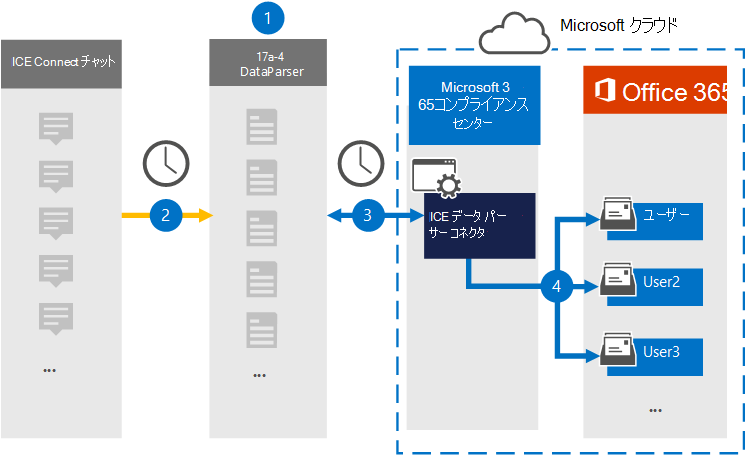

# ICE データとチャット データをアーカイブするConnect設定する

17a-4 LLC の[ICE DataParser](https://www.17a-4.com/ice-dataparser/)を使用して、ICE Connect Microsoft 365 チャットから組織内のユーザー メールボックスにデータをインポートおよびアーカイブします。 DataParser には、サード パーティ製のデータ ソースからアイテムをキャプチャし、それらのアイテムをデータ ソースにインポートするように構成された ICE Chat コネクタMicrosoft 365。 ICE DataParser コネクタは、ICE Connectチャット データを電子メール メッセージ形式に変換し、それらのアイテムをユーザー メールボックスにインポートMicrosoft 365。

ICE Connect チャット データがユーザー メールボックスに保存された後、訴訟ホールド、電子情報開示、保持ポリシーと保持ラベル、通信コンプライアンスなどの Microsoft 365 コンプライアンス機能を適用できます。 ICE DataParser コネクタを使用してデータをインポートおよびアーカイブMicrosoft 365、組織が政府機関および規制ポリシーに準拠しつ付けるのに役立ちます。

## ICE Chat データのアーカイブの概要

次の概要では、データ コネクタを使用して ICE データをアーカイブし、Connectチャット データをアーカイブMicrosoft 365。

1. 組織は 17a-4 を使用して ICE DataParser を設定および構成します。

2. 定期的に、ICE Connectは DataParser によって収集されます。 DataParser は、メッセージのコンテンツを電子メール メッセージ形式に変換します。

3. Microsoft 365 コンプライアンス センター で作成した ICE DataParser コネクタは、DataParser に接続し、Microsoft クラウド内のセキュリティで保護された Azure Storage場所にメッセージを転送します。

4. **ICE DataParser** という名前の受信トレイ フォルダー内のサブフォルダーがユーザー のメールボックスに作成され、ICE Connectチャット アイテムがそのフォルダーにインポートされます。 コネクタは *、Email* プロパティの値を使用してアイテムをインポートするメールボックスを決定します。 すべての ICE Connectチャット アイテムには、このプロパティが含まれるので、すべての参加者の電子メール アドレスが設定されます。

## コネクタをセットアップする前に

- Microsoft コネクタ用の DataParser アカウントを作成します。 これを行うには [、17a-4 LLC にお問い合わせください](https://www.17a-4.com/contact/)。 手順 1 でコネクタを作成する場合は、このアカウントにサインインする必要があります。

- 手順 1 で ICE DataParser コネクタを作成し (および手順 3 で完了する) ユーザーは、Exchange Online のメールボックスインポートエクスポートの役割に割り当てる必要があります。 この役割は、データ コネクタ ページの[データ コネクタ] ページにコネクタを追加Microsoft 365 コンプライアンス センター。 既定では、この役割はグループ内の役割グループExchange Online。 [メールボックスのインポートエクスポート] 役割は、組織の [組織の管理] 役割グループに追加Exchange Online。 または、役割グループを作成し、メールボックスインポートエクスポートの役割を割り当て、適切なユーザーをメンバーとして追加できます。 詳細については、「グループ内の[役割グループを](/Exchange/permissions-exo/role-groups#create-role-groups)管理する」の「役割グループの作成」または「役割グループの変更」セクションを参照Exchange Online。

- このデータ コネクタは、米国政府機関GCCのMicrosoft 365環境で使用できます。 サード パーティのアプリケーションとサービスには、Microsoft 365 インフラストラクチャの外部にあるサードパーティ システムに組織の顧客データを格納、送信、処理する必要がある場合があります。したがって、Microsoft 365 コンプライアンスとデータ保護のコミットメントの対象とはなってはいけなかっています。 Microsoft は、この製品を使用してサード パーティ製アプリケーションに接続する場合、これらのサード パーティ製アプリケーションが FEDRAMP に準拠しているという意味を示していません。

## 手順 1: ICE DataParser コネクタをセットアップする

最初の手順は、Microsoft 365 コンプライアンス センター の [データ コネクタ] ページにアクセスし、ICE Connect チャット データ用の 17a-4 コネクタを作成することです。

1. [データ コネクタ <https://compliance.microsoft.com> ICE   >  **DataParser] に移動し、[データ コネクタ] をクリックします**。

2. **[ICE DataParser 製品の説明] ページ** で、[コネクタの追加]**をクリックします**。

3. [サービス条件 **] ページで、[** 同意する] を **クリックします**。

4. コネクタを識別する一意の名前を入力し、[次へ] を **クリックします**。

5. 17a-4 アカウントにサインインし、ICE DataParser 接続ウィザードの手順を完了します。

## 手順 2: ICE DataParser コネクタを構成する

17a-4 サポートを使用して ICE DataParser コネクタを構成します。

## 手順 3: ユーザーをマップする

ICE DataParser コネクタは、ユーザーにデータをインポートする前Microsoft 365メール アドレスにユーザーを自動的にマップMicrosoft 365。

## 手順 4: ICE DataParser コネクタを監視する

ICE DataParser コネクタを作成した後は、コネクタの状態を [データ] Microsoft 365 コンプライアンス センター。

1. 左側の <https://compliance.microsoft.com> ナビゲーションで [ **データ コネクタ] に** 移動してクリックします。

2. [コネクタ **] タブをクリック** し、作成した ICE DataParser コネクタを選択して、コネクタのプロパティと情報を含むフライアウト ページを表示します。

3. [**ソースを含むコネクタの状態**] で、[ログのダウンロード] リンクをクリックして、コネクタの状態ログを開く (または保存) します。  このログには、Microsoft クラウドにインポートされたデータが含まれます。

## 既知の問題

現時点では、10 MB を超える添付ファイルやアイテムのインポートはサポートされていません。 大きいアイテムのサポートは、後日利用できます。
