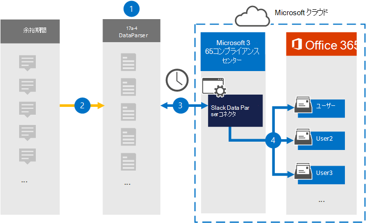

# Slack データをアーカイブするコネクタを設定する

[!include[Purview banner](../includes/purview-rebrand-banner.md)]

[17a-4 LLC の DataParser](https://www.17a-4.com/slack-dataparser/) を使用して、Slack プラットフォームからMicrosoft 365組織内のユーザー メールボックスにデータをインポートおよびアーカイブします。 DataParser には、サード パーティのデータ ソースからアイテムをキャプチャし、それらの項目をMicrosoft 365にインポートするように構成された Slack コネクタが含まれています。 Slack DataParser コネクタは、Slack データを電子メール メッセージ形式に変換し、それらのアイテムをMicrosoft 365のユーザー メールボックスにインポートします。

Slack データをユーザー メールボックスに格納した後、訴訟ホールド、電子情報開示、アイテム保持ポリシーと保持ラベル、通信コンプライアンスなどのMicrosoft Purview機能を適用できます。 Slack コネクタを使用してMicrosoft 365のデータをインポートおよびアーカイブすると、組織が政府および規制のポリシーに準拠し続けることができます。

## Slack データのアーカイブの概要

次の概要では、データ コネクタを使用してMicrosoft 365で Slack データをアーカイブするプロセスについて説明します。

1. 組織は 17a-4 と連携して、Slack DataParser を設定および構成します。

2. 定期的に、Slack アイテムは DataParser によって収集されます。 DataParser では、メッセージの内容も電子メール メッセージ形式に変換されます。

3. Microsoft Purview コンプライアンス ポータルで作成した Slack DataParser コネクタは DataParser に接続し、メッセージを Microsoft クラウド内の安全なAzure Storageの場所に転送します。

4. **Slack DataParser** という名前の受信トレイ フォルダー内のサブフォルダーがユーザー メールボックスに作成され、Slack アイテムがそのフォルダーにインポートされます。 コネクタは、 *Email* プロパティの値を使用して、アイテムをインポートするメールボックスを決定します。 すべての Slack アイテムには、すべての参加者のメール アドレスが設定されたこのプロパティが含まれています。

## コネクタを設定する前に

- Microsoft コネクタの DataParser アカウントを作成します。 これを行うには、 [17a-4 LLC](https://www.17a-4.com/contact/) にお問い合わせください。 手順 1 でコネクタを作成するときに、このアカウントにサインインする必要があります。

- 手順 1 で Slack DataParser コネクタを作成し、手順 3 で完了したユーザーには、Data Connector 管理者ロールを割り当てる必要があります。 このロールは、コンプライアンス ポータルの **[データ コネクタ** ] ページでコネクタを追加するために必要です。 このロールは、既定で複数の役割グループに追加されます。 これらの役割グループの一覧については、「セキュリティ & コンプライアンス センターのアクセス許可」の「 [セキュリティとコンプライアンス センターの](../security/office-365-security/permissions-in-the-security-and-compliance-center.md#roles-in-the-security--compliance-center)ロール」セクションを参照してください。 または、組織内の管理者は、カスタム役割グループを作成し、Data Connector 管理者ロールを割り当て、適切なユーザーをメンバーとして追加することもできます。 手順については、[Microsoft Purview コンプライアンス ポータルのアクセス許可](microsoft-365-compliance-center-permissions.md#create-a-custom-role-group)の「カスタム ロール グループの作成」セクションを参照してください。

- この 17a-4 データ コネクタは、Microsoft 365米国政府機関クラウドのGCC環境で使用できます。 サード パーティ製のアプリケーションとサービスには、組織の顧客データを、Microsoft 365 インフラストラクチャの外部にあるサード パーティ システムに格納、送信、処理する必要があるため、Microsoft Purviewおよびデータ保護のコミットメントの対象とされません。 Microsoft は、この製品を使用してサード パーティ製アプリケーションに接続することは、これらのサードパーティ アプリケーションが FEDRAMP に準拠していることを意味することを示しません。

## 手順 1: Slack DataParser コネクタを設定する

最初の手順では、コンプライアンス ポータルの [データ コネクタ] ページにアクセスし、Slack データ用の 17a-4 コネクタを作成します。

1. **データ コネクタSlack** >  **DataParser** に<https://compliance.microsoft.com>移動してクリックします。

2. **Slack DataParser 製品の** 説明ページで、[**コネクタの追加**] をクリックします。

3. [利用規約] ページ **で** 、[ **同意** する] をクリックします。

4. コネクタを識別する一意の名前を入力し、[ **次へ**] をクリックします。

5. 17a-4 アカウントにサインインし、Slack DataParser 接続ウィザードの手順を完了します。

## 手順 2: Slack DataParser コネクタを構成する

17a-4 サポートと連携して、Slack DataParser コネクタを構成します。

## 手順 3: ユーザーをマップする

Slack DataParser コネクタは、Microsoft 365にデータをインポートする前に、ユーザーをMicrosoft 365メール アドレスに自動的にマップします。

## 手順 4: Slack DataParser コネクタを監視する

Slack DataParser コネクタを作成した後、コンプライアンス ポータルでコネクタの状態を表示できます。

1. 左側の <https://compliance.microsoft.com> ナビゲーションにある **[データ コネクタ** ] に移動してクリックします。

2. [ **コネクタ** ] タブをクリックし、作成した Slack DataParser コネクタを選択して、コネクタに関するプロパティと情報を含むポップアップ ページを表示します。

3. **[コネクタの状態とソース**] で、[**ログのダウンロード**] リンクをクリックして、コネクタの状態ログを開く (または保存) します。 このログには、Microsoft クラウドにインポートされたデータに関する情報が含まれています。 詳細については、「 [データ コネクタの管理者ログを表示する」を](data-connector-admin-logs.md)参照してください。

## 既知の問題

現時点では、10 MB を超える添付ファイルやアイテムのインポートはサポートされていません。 より大きなアイテムのサポートは、後日提供される予定です。
