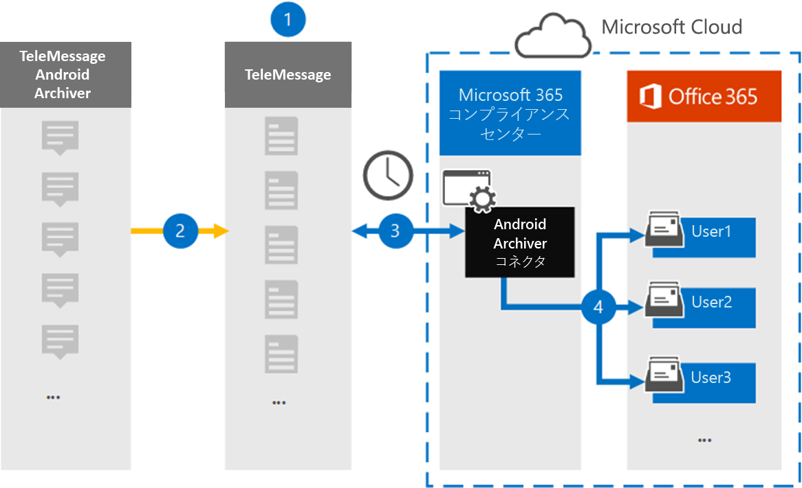

# Android モバイル データをアーカイブするコネクタを設定する

Microsoft Purview コンプライアンス ポータルの TeleMessage コネクタを使用して、Android 携帯電話から SMS、MMS、音声通話、通話ログをインポートおよびアーカイブします。 コネクタを設定して構成すると、組織の TeleMessage アカウントに毎日 1 回接続され、TeleMessage Android Archiver を使用する従業員のモバイル通信が Microsoft 365 のメールボックスにインポートされます。

Android 携帯電話のデータがユーザー メールボックスに格納された後、訴訟ホールド、コンテンツ検索、Microsoft 365 アイテム保持ポリシーなどの Microsoft Purview 機能を Android Archiver データに適用できます。 たとえば、コンテンツ検索を使用して Android Archiver モバイル通信を検索したり、Android Archiver コネクタ データを含むメールボックスを電子情報開示 (Premium) ケースのカストディアンに関連付けることができます。 Android Archiver コネクタを使用して Microsoft 365 のデータをインポートおよびアーカイブすると、組織が政府および規制ポリシーに準拠し続けることができます。

## Android モバイル データのアーカイブの概要

次の概要では、コネクタを使用して Microsoft 365 で Android モバイル データをアーカイブするプロセスについて説明します。

1. 組織は TeleMessage と連携して Android Archiver コネクタを設定します。 詳細については、「 [Android Archiver](https://www.telemessage.com/office365-activation-for-android-archiver/)」を参照してください。

2. リアルタイムでは、組織の Android 携帯電話からの SMS、MMS、音声通話、通話ログが TeleMessage サイトにコピーされます。

3. コンプライアンス ポータルで作成した Android Archiver コネクタは、TeleMessage サイトに毎日接続され、過去 24 時間の Android データを Microsoft クラウドの安全な Azure Storage の場所に転送します。 コネクタでは、Android データも電子メール メッセージ形式に変換されます。

4. コネクタは、モバイル通信アイテムを特定のユーザーのメールボックスにインポートします。 Android Archiver という名前の新しいフォルダーが特定のユーザーのメールボックスに作成され、アイテムがインポートされます。 コネクタは、 *ユーザーの電子メール アドレス* プロパティの値を使用してマッピングを行います。 すべての電子メール メッセージには、このプロパティが含まれています。このプロパティには、電子メール メッセージのすべての参加者の電子メール アドレスが設定されます。 *ユーザーの電子メール アドレス* プロパティの値を使用した自動ユーザー マッピングに加えて、CSV マッピング ファイルをアップロードしてカスタム マッピングを定義することもできます。 このマッピング ファイルには、各ユーザーの携帯電話番号と対応する Microsoft 365 メールボックス アドレスが含まれている必要があります。 自動ユーザー マッピングを有効にし、カスタム マッピングを指定する場合は、すべての電子メール アイテムについて、コネクタが最初にカスタム マッピング ファイルを確認します。 ユーザーの携帯電話番号に対応する有効な Microsoft 365 ユーザーが見つからない場合、コネクタは電子メール アイテムのユーザーの電子メール アドレス プロパティを使用します。 コネクタで、カスタム マッピング ファイルまたは電子メール アイテムの *ユーザーの電子メール アドレス* プロパティで有効な Microsoft 365 ユーザーが見つからない場合、アイテムはインポートされません。

## コネクタを設定する前に

Android 通信データをアーカイブするために必要な実装手順の一部は Microsoft 365 の外部にあり、コンプライアンス センターでコネクタを作成する前に完了する必要があります。

- [TeleMessage から Android Archiver サービス](https://www.telemessage.com/mobile-archiver/order-mobile-archiver-for-o365)を注文し、組織の有効な管理アカウントを取得します。 コネクタを作成するときに、このアカウントにサインインする必要があります。

- Android Archiver サービスを必要とするすべてのユーザーを TeleMessage アカウントに登録します。 ユーザーを登録するときは、Microsoft 365 アカウントで使用されているのと同じメール アドレスを使用してください。

- 従業員の携帯電話に TeleMessage Android Archiver アプリをインストールしてアクティブ化します。

- Android Archiver コネクタを作成するユーザーには、Data Connector 管理 ロールが割り当てられている必要があります。 このロールは、コンプライアンス ポータルの **[データ コネクタ** ] ページでコネクタを追加するために必要です。 このロールは、既定で複数の役割グループに追加されます。 これらの役割グループの一覧については、「セキュリティ & コンプライアンス センターのアクセス許可」の「 [セキュリティとコンプライアンス センターの](../security/office-365-security/permissions-in-the-security-and-compliance-center.md#roles-in-the-security--compliance-center)ロール」セクションを参照してください。 または、組織内の管理者がカスタムロール グループを作成し、Data Connector 管理ロールを割り当ててから、適切なユーザーをメンバーとして追加することもできます。 手順については、[Microsoft Purview コンプライアンス ポータルのアクセス許可](microsoft-365-compliance-center-permissions.md#create-a-custom-role-group)の「カスタム ロール グループの作成」セクションを参照してください。

- この TeleMessage データ コネクタは、Microsoft 365 US Government クラウドの GCC 環境で使用できます。 サード パーティのアプリケーションとサービスには、Microsoft 365 インフラストラクチャの外部にあり、Microsoft Purview およびデータ保護コミットメントの対象外であるサード パーティ システムに対する組織の顧客データの保存、送信、処理が含まれる場合があります。 Microsoft は、この製品を使用してサード パーティ製アプリケーションに接続することは、これらのサードパーティ アプリケーションが FEDRAMP に準拠していることを意味することを示しません。

## Android Archiver コネクタを作成する

最後の手順は、コンプライアンス ポータルで Android Archiver コネクタを作成することです。 コネクタは、指定した情報を使用して TeleMessage サイトに接続し、Microsoft 365 の対応するユーザー メールボックス ボックスに Android 通信を転送します。

1. **データ コネクタ** > **Android Archiver** に [https://compliance.microsoft.com](https://compliance.microsoft.com)移動してクリックします。

2. **Android Archiver** 製品の説明ページで、[**コネクタの追加**] をクリックします。

3. [利用規約] ページ **で** 、[ **同意** する] をクリックします。

4. [ **TeleMessage へのログイン** ] ページの [手順 3] で、次のボックスに必要な情報を入力し、[ **次へ**] をクリックします。

   - **名：** TeleMessage ユーザー名。

   - **パスワード：** TeleMessage のパスワード。

5. コネクタが作成されたら、ポップアップ ウィンドウを閉じて、[ **次へ**] をクリックします。

6. [ **ユーザー マッピング** ] ページで、自動ユーザー マッピングを有効にして、[ **次へ**] をクリックします。 カスタム マッピングで CSV ファイルをアップロードする必要がある場合は、[ **次へ**] をクリックします。

7. 設定を確認し、[ **完了]** をクリックしてコネクタを作成します。

8. **[データ コネクタ**] ページの [コネクタ] タブに移動して、新しいコネクタのインポート プロセスの進行状況を確認します。

## 既知の問題

- 現時点では、10 MB を超える添付ファイルやアイテムのインポートはサポートされていません。 より大きなアイテムのサポートは、後日提供される予定です。
