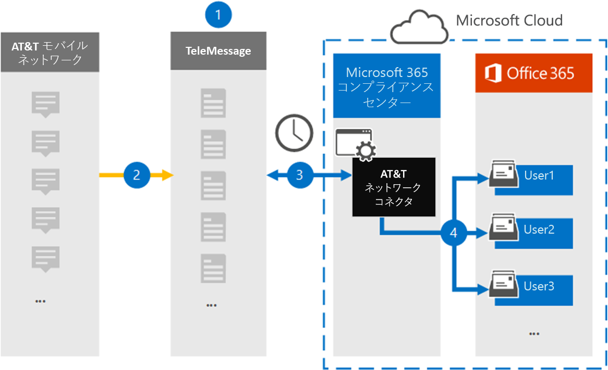

# T SMS/MMS データを使用して AT&をアーカイブするコネクタをセットアップする

T Mobile Network から SMS および MMS Microsoft 365 コンプライアンス センターをインポートおよびアーカイブするには、このインターフェイスの TeleMessage コネクタ&使用します。 コネクタをセットアップして構成した後、毎日 1 回、組織の AT&T ネットワークに接続し、SMS および MMS データを Microsoft 365 のメールボックスにインポートします。

SMS および MMS メッセージがユーザー メールボックスに保存された後、訴訟ホールド、コンテンツ検索、Microsoft 365 保持ポリシーなどの Microsoft 365 コンプライアンス機能を AT&T Network データに適用できます。 たとえば、コンテンツ検索を使用して AT&T Network データを検索したり、AT&T ネットワーク コネクタ データを含むメールボックスを、Advanced eDiscovery ケースの保管担当者に関連付Advanced eDiscoveryできます。 AT&T ネットワーク コネクタを使用して、データをインポートおよびアーカイブMicrosoft 365、組織が政府機関および規制ポリシーに準拠しつ付けるのに役立ちます。

## T ネットワーク データのアーカイブ AT&概要

次の概要では、コネクタを使用して、コネクタを使用して、T Network&をアーカイブするプロセスMicrosoft 365。

1. 組織は TeleMessage を使用して、T ネットワーク コネクタの AT&設定します。 詳細については [、「AT&T ネットワーク アーカイブ」を参照してください](https://www.telemessage.com/office365-activation-for-atnt-network-archiver/)。

2. リアルタイムで、組織の AT および T ネットワークからの SMS&MMS メッセージが TeleMessage サイトにコピーされます。

3. Microsoft 365 コンプライアンス センター で作成する AT&T ネットワーク コネクタは、毎日 TeleMessage サイトに接続し、過去 24 時間の SMS および MMS メッセージを Microsoft クラウド内の安全な Azure Storage 場所に転送します。 また、コネクタは SMS メッセージと MMS メッセージのコンテンツを電子メール メッセージ形式に変換します。

4. コネクタは、モバイル通信アイテムを特定のユーザーのメールボックスにインポートします。 **T SMS/MMS ネットワーク アーカイブ&AT** という名前の新しいフォルダーがユーザーのメールボックスに作成され、アイテムがインポートされます。 コネクタは、User の [電子メール アドレス] プロパティの値を使用して *、このマッピングを実行* します。 すべての SMS メッセージと MMS メッセージには、このプロパティが含まれるので、メッセージのすべての参加者の電子メール アドレスが設定されます。
 
   *User* の [電子メール アドレス] プロパティの値を使用した自動ユーザー マッピングに加えて、CSV マッピング ファイルをアップロードしてカスタム マッピングを定義できます。 このマッピング ファイルには、組織内のユーザーの携帯電話番号Microsoft 365対応するメール アドレスが含まれる。 自動ユーザー マッピングとカスタム マッピングの両方を有効にした場合、すべての電子メール アイテムについて、コネクタは最初にカスタム マッピング ファイルを確認します。 携帯電話番号に対応する有効な Microsoft 365 ユーザーが見つからなかった場合、コネクタはインポートしようとしているアイテムの電子メール アドレス プロパティの値を使用します。 コネクタがカスタム マッピング ファイルまたは電子メール アイテムの電子メール アドレス プロパティに有効な Microsoft 365 ユーザーを見つからなかった場合、アイテムはインポートされません。

## 開始する前に

AT&T Network データをアーカイブするために必要な実装手順の一部は Microsoft 365 の外部であり、コンプライアンス センターでコネクタを作成する前に完了する必要があります。

- [TeleMessage からモバイル アーカイブ サービスを注文し](https://www.telemessage.com/mobile-archiver/order-mobile-archiver-for-o365/)、組織の有効な管理アカウントを取得します。 コンプライアンス センターでコネクタを作成する場合は、このアカウントにサインインする必要があります。

- At&T アカウントと請求連絡先の詳細を取得して、TeleMessage オンボーディング フォームに入力し、AT&T からメッセージ アーカイブ サービスを注文できます。

- テレメッセージ アカウントで T SMS/MMS&AT を必要とするすべてのユーザーを登録します。 ユーザーを登録する場合は、ユーザーのアカウントに使用するメール アドレスと同じMicrosoft 365してください。

- 従業員は、T モバイル ネットワークの AT に企業所有および企業責任の携帯電話&必要があります。 ユーザーが所有Microsoft 365または "自分のデバイスを持ち込む (BYOD) デバイスでメッセージをアーカイブできません。

- T ネットワーク コネクタで AT&を作成するユーザーには、メールボックスのインポート エクスポートの役割が割り当てられている必要Exchange Online。 これは、データ コネクタ ページの[データ コネクタ] ページにコネクタを追加Microsoft 365 コンプライアンス センター。 既定では、この役割は Exchange Online のどの役割グループにも割り当てられていません。 [メールボックスのインポートエクスポート] 役割は、組織の [組織の管理] 役割グループに追加Exchange Online。 または、役割グループを作成し、メールボックスインポートエクスポートの役割を割り当て、適切なユーザーをメンバーとして追加できます。 詳細については、「グループ内の[役割グループを](/Exchange/permissions-exo/role-groups#create-role-groups)管理する」の「役割グループの作成」または「役割グループの変更」セクションを参照Exchange Online。

- このデータ コネクタは、米国政府機関GCCのMicrosoft 365環境で使用できます。 サード パーティのアプリケーションとサービスには、Microsoft 365 インフラストラクチャの外部にあるサードパーティ システムに組織の顧客データを格納、送信、処理する必要がある場合があります。したがって、Microsoft 365 コンプライアンスとデータ保護のコミットメントの対象とはなってはいけなかっています。 Microsoft は、この製品を使用してサード パーティ製アプリケーションに接続する場合、これらのサード パーティ製アプリケーションが FEDRAMP に準拠しているという意味を示していません。

## AT ネットワーク T&を作成する

前のセクションで説明した前提条件を完了したら、このセクションで AT&T Network コネクタを作成Microsoft 365 コンプライアンス センター。 コネクタは、指定した情報を使用して TeleMessage サイトに接続し、SMS メッセージと MMS メッセージを、メッセージ内の対応するユーザー メールボックス ボックスに転送Microsoft 365。

1. [T ネットワーク] に移動し、[データ コネクタ [https://compliance.microsoft.com](https://compliance.microsoft.com/)   \  **AT]&クリックします**。

2. **[AT**&T Network 製品の説明] ページで、[コネクタの追加]**をクリックします。**

3. [サービス条件 **] ページで、[** 同意する] を **クリックします**。

4. **[TeleMessage へのログイン]** ページの [手順 3] で、次のボックスに必要な情報を入力し、[次へ] を **クリックします**。

   - **ユーザー名:** TeleMessage ユーザー名。

   - **パスワード:** TeleMessage パスワード。

5. コネクタを作成したら、ポップアップ ウィンドウを閉じて次のページに移動できます。

6. [ユーザー マッピング **] ページで** 、自動ユーザー マッピングを有効にする。 カスタム マッピングを有効にするには、ユーザー マッピング情報を含む CSV ファイルをアップロードし、[次へ] を **クリックします**。

7. 設定を確認し、[完了] を **クリックして** コネクタを作成します。

8. コンプライアンス センターの **[データ** コネクタ] ページの [コネクタ] タブに移動して、新しいコネクタのインポート プロセスの進行状況を確認します。

## 既知の問題

- 現時点では、10 MB を超える添付ファイルやアイテムのインポートはサポートされていません。 大きいアイテムのサポートは、後日利用できます。
