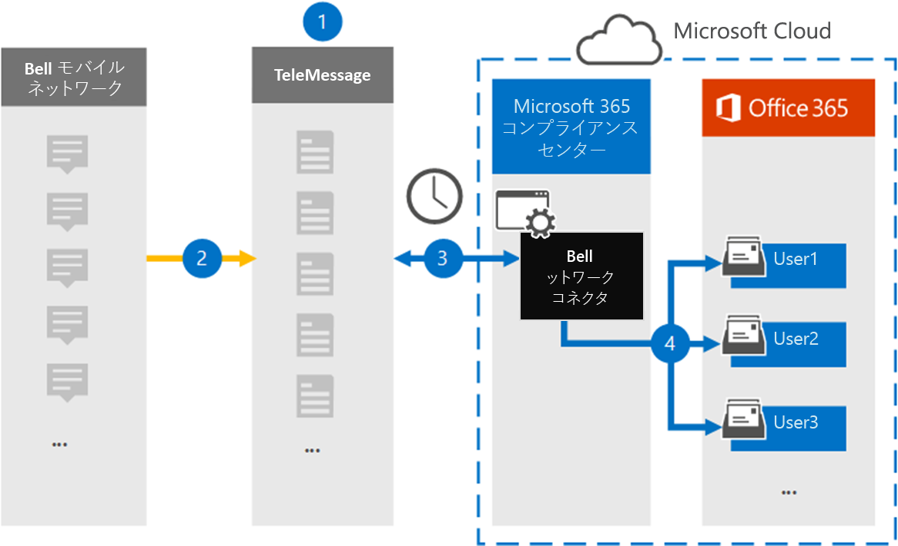

# ベル ネットワーク データをアーカイブするコネクタをセットアップする

ベル ネットワークからショート メッセージング サービス (SMS) およびマルチメディア メッセージング サービス (MMS) メッセージをインポートおよびアーカイブするには、Microsoft 365 コンプライアンス センター の TeleMessage コネクタを使用します。 コネクタをセットアップして構成した後、毎日 1 回、組織のベル ネットワークに接続し、SMS メッセージと MMS メッセージを Microsoft 365 のメールボックスにインポートします。

SMS メッセージと MMS メッセージをユーザー メールボックスに保存した後、訴訟ホールド、コンテンツ検索、Microsoft 365 保持ポリシーなどの Microsoft 365 コンプライアンス機能をベル ネットワーク データに適用できます。 たとえば、コンテンツ検索を使用してベル ネットワーク SMS/MMS を検索したり、ベル ネットワーク コネクタ データを含むメールボックスを管理担当者に関連付Advanced eDiscoveryできます。 ベル ネットワーク コネクタを使用してデータをインポートおよびアーカイブする方法は、Microsoft 365規制ポリシーに準拠し、組織を維持するのに役立ちます。

## ベル ネットワーク データのアーカイブの概要

次の概要では、コネクタを使用してベル ネットワーク のデータをアーカイブするプロセスについて説明Microsoft 365。

1. 組織は、TeleMessage と Bell を使用してベル ネットワーク コネクタをセットアップします。 詳細については、「 [Bell Network Archiver」を参照してください](https://www.telemessage.com/office365-activation-for-bell-network-archiver)。

2. リアルタイムで、組織のベル ネットワークからの SMS メッセージと MMS メッセージが TeleMessage サイトにコピーされます。

3. Microsoft 365 コンプライアンス センター で作成したベル ネットワーク コネクタは、毎日 TeleMessage サイトに接続し、過去 24 時間の SMS メッセージと MMS メッセージを Microsoft クラウド内の安全な Azure Storage 場所に転送します。 また、コネクタは SMS メッセージと MMS メッセージのコンテンツを電子メール メッセージ形式に変換します。

4. コネクタは、モバイル通信アイテムを特定のユーザーのメールボックスにインポートします。 **Bell SMS/MMS Network Archiver** という名前の新しいフォルダーが特定のユーザーのメールボックスに作成され、アイテムがインポートされます。 コネクタは、User の [電子メール アドレス] プロパティの値を使用して *、このマッピングを実行* します。 すべての SMS メッセージと MMS メッセージには、このプロパティが含まれるので、メッセージのすべての参加者の電子メール アドレスが設定されます。

   *User* の [電子メール アドレス] プロパティの値を使用した自動ユーザー マッピングに加えて、CSV マッピング ファイルをアップロードしてカスタム マッピングを定義できます。 このマッピング ファイルには、組織内のユーザーの携帯電話番号Microsoft 365対応するメール アドレスが含まれている。 自動ユーザー マッピングとカスタム マッピングの両方を有効にした場合、すべての Bell Network アイテムについて、コネクタは最初にカスタム マッピング ファイルを参照します。 ユーザーの携帯電話番号に対応する有効な Microsoft 365 ユーザーが見つからなかった場合、コネクタはインポートしようとしているアイテムの電子メール アドレス プロパティの値を使用します。 コネクタがカスタム マッピング ファイルまたは Bell Network アイテムの電子メール アドレス プロパティに有効な Microsoft 365 ユーザーを見つからなかった場合、アイテムはインポートされません。

## コネクタをセットアップする前に

Bell Network データのアーカイブに必要な実装手順の一部は、Microsoft 365 の外部であり、コンプライアンス センターにコネクタを作成する前に完了する必要があります。

- [TeleMessage から Bell Network Archiver サービスを注文し](https://www.telemessage.com/mobile-archiver/order-mobile-archiver-for-o365/)、組織の有効な管理アカウントを取得します。 コンプライアンス センターでコネクタを作成する場合は、このアカウントにサインインする必要があります。

- Bell Network アカウントと請求連絡先の詳細を取得して、TeleMessage オンボーディング フォームに入力し、Bell からメッセージ アーカイブ サービスを注文できます。

- TeleMessage アカウントにベル SMS/MMS ネットワーク アーカイブが必要なすべてのユーザーを登録します。 ユーザーを登録する場合は、ユーザーのアカウントに使用する電子メール アドレスと同じMicrosoft 365してください。

- 従業員は、Bell モバイル ネットワーク上に企業所有および企業責任の携帯電話を持っている必要があります。 ユーザーが所有Microsoft 365または "自分のデバイスを持ち込む (BYOD) デバイスでメッセージをアーカイブできません。

- ベル ネットワーク コネクタを作成するユーザーには、データ コネクタ管理者の役割が割り当てられている必要があります。 この役割は、データ コネクタ ページの [データ  コネクタ] ページにコネクタを追加Microsoft 365 コンプライアンス センター。 この役割は、既定で複数の役割グループに追加されます。 これらの役割グループの一覧については、「セキュリティ とコンプライアンス センターのアクセス許可」の「セキュリティとコンプライアンス センターの役割& [してください](../security/office-365-security/permissions-in-the-security-and-compliance-center.md#roles-in-the-security--compliance-center)。 または、組織内の管理者がカスタム役割グループを作成し、データ コネクタ管理者の役割を割り当て、適切なユーザーをメンバーとして追加することもできます。 手順については、「アクセス許可」の「カスタム役割グループを作成する」[セクションを参照Microsoft 365 コンプライアンス センター](microsoft-365-compliance-center-permissions.md#create-a-custom-role-group)。

- この TeleMessage データ コネクタは、米国政府機関GCC環境Microsoft 365使用できます。 サード パーティ製のアプリケーションとサービスには、Microsoft 365 インフラストラクチャの外部にある、Microsoft 365 コンプライアンスおよびデータ保護のコミットメントの対象となされていないサードパーティ システムに対して、組織の顧客データを保存、送信、および処理する必要があります。 Microsoft は、この製品を使用してサード パーティ製アプリケーションに接続する場合、これらのサード パーティ製アプリケーションが FEDRAMP に準拠しているという意味を示していません。

## ベル ネットワーク コネクタの作成

最後の手順は、ベル ネットワーク コネクタを新しいコネクタにMicrosoft 365 コンプライアンス センター。 コネクタは、指定した情報を使用して、TeleMessage サイトに接続し、SMS/MMS メッセージを、メッセージ内の対応するユーザー メールボックス ボックスに転送Microsoft 365。

1. に移動し [https://compliance.microsoft.com](https://compliance.microsoft.com)、[**データ コネクタ]** >  **[SMS/MMS ネットワーク アーカイブ] の順にクリックします**。

2. [Bell **Network 製品の説明]** ページで、[コネクタの追加] **をクリックします。**

3. [サービス条件 **] ページで、[** 同意する] を **クリックします**。

4. [ **TeleMessage へのログイン]** ページの [手順 3] で、次のボックスに必要な情報を入力し、[次へ] をクリック **します**。

   - **ユーザー名:** TeleMessage ユーザー名。

   - **パスワード:** TeleMessage パスワード。

5. コネクタを作成したら、ポップアップ ウィンドウを閉じて次のページに移動できます。

6. [ユーザー マッピング **] ページで** 、自動ユーザー マッピングを有効にする。 カスタム マッピングを有効にするには、ユーザー マッピング情報を含む CSV ファイルをアップロードし、[次へ] をクリック **します**。

7. 設定を確認し、[完了] を **クリックして** コネクタを作成します。

8. コンプライアンス センターの **[データ** コネクタ] ページの [コネクタ] タブに移動して、新しいコネクタのインポート プロセスの進行状況を確認します。

## 既知の問題

- 現時点では、10 MB を超える添付ファイルやアイテムのインポートはサポートされていません。 大きいアイテムのサポートは、後日利用できます。
