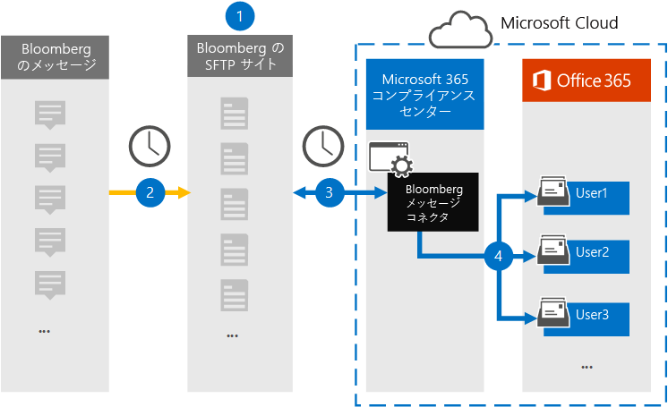
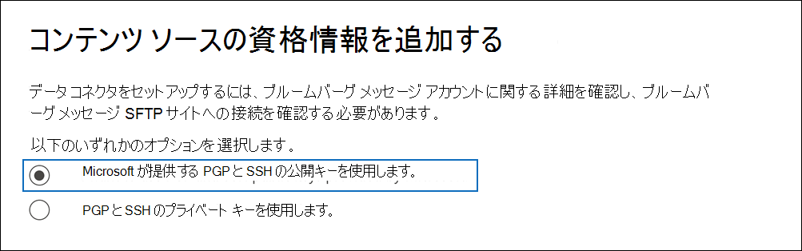
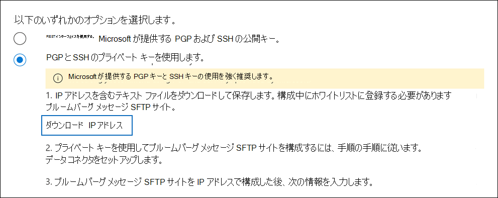
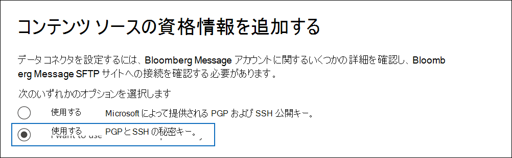

# ブルームバーグ メッセージ データをアーカイブするコネクタをセットアップする

ブルームバーグ メッセージ コラボレーション ツールからMicrosoft 365 コンプライアンス センターメール データをインポートおよびアーカイブするには、次のサイトのデータ [コネクタを](https://www.bloomberg.com/professional/product/collaboration/)使用します。 コネクタをセットアップして構成した後、組織の Bloomberg セキュア FTP (SFTP) サイトに毎日 1 回接続し、電子メール アイテムを Microsoft 365 のメールボックスにインポートします。

ブルームバーグ メッセージ データをユーザー メールボックスに格納した後、訴訟ホールド、コンテンツ検索、インプレイス アーカイブ、監査、コミュニケーション コンプライアンス、Microsoft 365 保持ポリシーなどの Microsoft 365 コンプライアンス機能をブルームバーグ メッセージ データに適用できます。 たとえば、コンテンツ検索ツールを使用してブルームバーグ メッセージメールを検索したり、ブルームバーグ メッセージ データを含むメールボックスを、Advanced eDiscovery ケースの保管担当者に関連付けできます。 ブルームバーグ メッセージ コネクタを使用して、Microsoft 365のデータをインポートおよびアーカイブすると、組織が政府および規制ポリシーに準拠しつ付けるのに役立ちます。

## ブルームバーグ メッセージ データのアーカイブの概要

次の概要では、コネクタを使用してブルームバーグ メッセージ データをアーカイブするプロセスについて説明Microsoft 365。

1. 組織はブルームバーグと一緒にブルームバーグ SFTP サイトをセットアップします。 また、ブルームバーグと一緒に、ブルームバーグ SFTP サイトに電子メール メッセージをコピーするブルームバーグ メッセージを構成します。

2. 24 時間に 1 回、ブルームバーグ メッセージからの電子メール メッセージがブルームバーグ SFTP サイトにコピーされます。

3. Microsoft 365 コンプライアンス センター で作成したブルームバーグ メッセージ コネクタは、毎日ブルームバーグ SFTP サイトに接続し、過去 24 時間の電子メール メッセージを Microsoft Cloud の安全な Azure Storage 領域に転送します。

4. コネクタは、電子メール メッセージ アイテムを特定のユーザーのメールボックスにインポートします。 BloombergMessage という名前の新しいフォルダーが特定のユーザーのメールボックスに作成され、アイテムがインポートされます。

   コネクタは、CorporateEmailAddress プロパティの値を使用してこれを行います。 すべての電子メール メッセージには、このプロパティが含まれるので、電子メール メッセージのすべての参加者の電子メール アドレスが設定されます。 *CorporateEmailAddress* プロパティの値を使用した自動ユーザー マッピングに加えて、CSV マッピング ファイルをアップロードしてカスタム マッピングを定義できます。 このマッピング ファイルには、組織内の各ユーザーのブルームバーグ UUID Microsoft 365対応するメールボックス アドレスが含まれる。 自動ユーザー マッピングを有効にしてカスタム マッピングを提供する場合、すべての電子メール アイテムについて、コネクタは最初にカスタム マッピング ファイルを確認します。 ユーザーの Bloomberg UUID に対応する有効な Microsoft 365 ユーザーが見つからなかった場合、コネクタは電子メール アイテムの *CorporateEmailAddress* プロパティを使用します。 カスタム マッピング ファイルまたは電子メール アイテムの *CorporateEmailAddress* プロパティに有効な Microsoft 365 ユーザーが見つからなかった場合、アイテムはインポートされません。

## コネクタをセットアップする前に

Bloomberg Message データのアーカイブに必要な実装手順の一部は、Microsoft 365 の外部であり、コンプライアンス センターでコネクタを作成する前に完了する必要があります。

- ブルームバーグ メッセージ コネクタをセットアップするには、プリティ グッド プライバシー (PGP) とセキュア シェル (SSH) のキーとキー パスフレーズを使用する必要があります。 これらのキーは、Bloomberg SFTP サイトを構成するために使用され、コネクタがブルームバーグ SFTP サイトに接続してデータをインポートするために使用Microsoft 365。 PGP キーは、ブルームバーグ SFTP サイトからデータに転送されるデータの暗号化を構成Microsoft 365。 SSH キーは、コネクタが Bloomberg SFTP サイトに接続するときに、セキュリティで保護されたリモート ログインを有効にするためのセキュリティで保護されたシェルを構成するために使用されます。

  コネクタを設定する場合は、Microsoft が提供する公開キーとキー パスフレーズを使用するか、独自のプライベート キーとパスフレーズを使用できます。 Microsoft が提供する公開キーを使用することをお勧めします。 ただし、組織がプライベート キーを使用してブルームバーグ SFTP サイトを既に構成している場合は、これらの同じプライベート キーを使用してコネクタを作成できます。

- ブルームバーグ [Anywhere にサブスクライブします](https://www.bloomberg.com/professional/product/remote-access/?bbgsum-page=DG-WS-PROF-PROD-BBA)。 これは、セットアップと構成が必要なブルームバーグ SFTP サイトにアクセスするために、ブルームバーグ Anywhere にログインするために必要です。

- Bloomberg SFTP (セキュア ファイル転送プロトコル) サイトをセットアップします。 ブルームバーグと一緒に SFTP サイトをセットアップした後、ブルームバーグ メッセージのデータは毎日 SFTP サイトにアップロードされます。 手順 2 で作成したコネクタは、この SFTP サイトに接続し、電子メール データをメールボックスMicrosoft 365します。 SFTP は、転送プロセス中にメールボックスに送信されるブルームバーグ メッセージ データも暗号化します。

  ブルームバーグ SFTP ( *BB-SFTP* とも呼ばれる) の詳細については、次の情報を参照してください。

  - ブルームバーグ サポートの「SFTP Connectivity Standards」 [ドキュメントを参照してください](https://www.bloomberg.com/professional/support/documentation/)。

  - [ブルームバーグのカスタマー サポートにお問い合わせください](https://service.bloomberg.com/portal/sessions/new?utm_source=bloomberg-menu&utm_medium=csc)。

- ブルームバーグを使用して SFTP サイトをセットアップした後、ブルームバーグの実装電子メール メッセージに応答した後、ブルームバーグが情報を提供します。 次の情報のコピーを保存します。 手順 3 でコネクタをセットアップするために使用します。

  - 組織の ID であり、ブルームバーグ SFTP サイトへのログインに使用される会社コード。

  - ブルームバーグ SFTP サイトのパスワード

  - Bloomberg SFTP サイトの URL (たとえば、sftp.bloomberg.com)。 また、ブルームバーグは、ブルームバーグ SFTP サイトに対応する IP アドレスを提供する場合もあります。コネクタのセットアップにも使用できます。

  - Bloomberg SFTP サイトのポート番号

- ブルームバーグ メッセージ コネクタは、1 日に合計 200,000 アイテムをインポートできます。 SFTP サイトに 200,000 件を超えるアイテムがある場合、これらのアイテムはいずれもこのサイトにMicrosoft 365。

- 手順 3 でブルームバーグ メッセージ コネクタを作成するユーザー (および手順 1 で公開キーと IP アドレスをダウンロードするユーザー) には、データ コネクタ管理者の役割が割り当てられている必要があります。 この役割は、データ コネクタ ページの [データ  コネクタ] ページにコネクタを追加Microsoft 365 コンプライアンス センター。 この役割は、既定で複数の役割グループに追加されます。 これらの役割グループの一覧については、「セキュリティ とコンプライアンス センターのアクセス許可」の「セキュリティとコンプライアンス センターの役割& [してください](../security/office-365-security/permissions-in-the-security-and-compliance-center.md#roles-in-the-security--compliance-center)。 または、組織内の管理者がカスタム役割グループを作成し、データ コネクタ管理者の役割を割り当て、適切なユーザーをメンバーとして追加することもできます。 手順については、「アクセス許可」の「カスタム役割グループを作成する」[セクションを参照Microsoft 365 コンプライアンス センター](microsoft-365-compliance-center-permissions.md#create-a-custom-role-group)。

## 公開キーを使用してコネクタをセットアップする

このセクションの手順では、プリティ グッド プライバシー (PGP) とセキュア シェル (SSH) の公開キーを使用してブルームバーグ メッセージ コネクタをセットアップする方法を示します。

### 手順 1: PGP と SSH の公開キーを取得する

最初の手順は、PGP および SSH 公開キーのコピーを取得します。 手順 2 のこれらのキーを使用して、コネクタ (手順 3 で作成した) が SFTP サイトに接続し、ブルームバーグ メッセージの電子メール データを Microsoft 365 メールボックスに転送することを許可するブルームバーグ SFTP サイトを構成します。 この手順では、ブルームバーグ SFTP サイトを構成するときに使用する IP アドレスも取得します。

1. 左側のナビゲーション <https://compliance.microsoft.com> で [ **データ コネクタ] に** 移動してクリックします。

2. [ブルームバーグ **メッセージ] の [** データ コネクタ] ページ **で、[** 表示] を **クリックします**。

3. ブルームバーグ **メッセージ製品の説明** ページで、[コネクタの追加] **をクリックします。**

4. [サービス条件 **] ページで、[** 同意する] を **クリックします**。

5. [コンテンツ **ソースの資格情報の追加] ページで** 、[Microsoft が提供する PGP および SSH 公開キーを使用 **する] をクリックします**。

   

6. 手順 1 で、[ **SSH** キーのダウンロード]、 **[PGP** キーのダウンロード]、および [ **IP** アドレスのダウンロード] リンクをクリックして、各ファイルのコピーをローカル コンピューターに保存します。

   

   これらのファイルには、手順 2 でブルームバーグ SFTP サイトを構成するために使用される次の項目が含まれています。

   - PGP 公開キー: このキーは、ブルームバーグ SFTP サイトからデータに転送されるデータの暗号化を構成Microsoft 365。

   - SSH 公開キー: このキーは、コネクタがブルームバーグ SFTP サイトに接続するときにセキュリティで保護されたリモート ログインを有効にするためのセキュリティで保護されたシェルを構成するために使用されます。

   - IP アドレス: ブルームバーグ SFTP サイトは、この IP アドレスからの接続要求を受け入れる構成です。 同じ IP アドレスをブルームバーグ メッセージ コネクタで使用して SFTP サイトに接続し、ブルームバーグ メッセージ データを他のユーザーにMicrosoft 365。

7. [キャンセル **] を** クリックしてウィザードを閉じます。 手順 3 でこのウィザードに戻り、コネクタを作成します。

### 手順 2: ブルームバーグ SFTP サイトを構成する

> [!NOTE]
> 組織が以前にブルームバーグ SFTP サイトをセットアップして、パブリック PGP キーと SSH キーを使用してインスタント ブルームバーグ データをアーカイブしている場合は、別のキーを設定する必要が生じかねない。 手順 3 でコネクタを作成するときに、同じ SFTP サイトを指定できます。

次の手順では、手順 1 で取得した PGP および SSH 公開キーと IP アドレスを使用して、ブルームバーグ SFTP サイトの PGP 暗号化と SSH 認証を構成します。 これにより、手順 3 で作成したブルームバーグ メッセージ コネクタがブルームバーグ SFTP サイトに接続し、ブルームバーグ メッセージ データを他のユーザーにMicrosoft 365。 ブルームバーグ SFTP サイトをセットアップするには、ブルームバーグのカスタマー サポートと一緒に作業する必要があります。 サポート [については、ブルームバーグのカスタマー サポートにお](https://service.bloomberg.com/portal/sessions/new?utm_source=bloomberg-menu&utm_medium=csc) 問い合わせください。

> [!IMPORTANT]
> Bloomberg では、手順 1 でダウンロードした 3 つのファイルを電子メール メッセージに添付し、ブルームバーグ SFTP サイトのセットアップに使用する際に、そのファイルを顧客サポート チームに送信することを推奨します。

### 手順 3: ブルームバーグ メッセージ コネクタを作成する

最後の手順は、ブルームバーグ メッセージ コネクタを作成する方法Microsoft 365 コンプライアンス センター。 コネクタは、指定した情報を使用してブルームバーグ SFTP サイトに接続し、メッセージ内の対応するユーザー メールボックス ボックスに電子メール メッセージをMicrosoft 365。

1. 左側のナビゲーション <https://compliance.microsoft.com> で [ **データ コネクタ] に** 移動してクリックします。

2. [ブルームバーグ **メッセージ] の [** データ コネクタ] ページ **で、[** 表示] を **クリックします**。

3. ブルームバーグ **メッセージ製品の説明** ページで、[コネクタの追加] **をクリックします。**

4. [サービス条件 **] ページで、[** 同意する] を **クリックします**。

5. [コンテンツ **ソースの資格情報の追加] ページで** 、[Microsoft が提供する PGP および SSH 公開キーを使用 **する] をクリックします**。

6. [手順 3] で、次のボックスに必要な情報を入力し、[接続の検証] **をクリックします**。

      - **名前:** コネクタの名前。 組織で一意である必要があります。

      - **会社コード:** ブルームバーグ SFTP サイトのユーザー名として使用される組織の ID。

      - **パスワード:** 組織の Bloomberg SFTP サイトのパスワード。

      - **SFTP URL:** Bloomberg SFTP サイトの URL (たとえば `sftp.bloomberg.com`)。 この値には IP アドレスを使用できます。

      - **SFTP ポート:** Bloomberg SFTP サイトのポート番号。 コネクタは、このポートを使用して SFTP サイトに接続します。

7. 接続が正常に検証された後、[次へ] を **クリックします**。

8. [ユーザーの **定義] ページ** で、データをインポートするユーザーを指定します。

     - **組織内のすべてのユーザー**。 すべてのユーザーのデータをインポートするには、このオプションを選択します。

     - **訴訟ホールドのユーザーのみ**。 メールボックスが訴訟ホールドに置かれたユーザーのデータのみをインポートするには、このオプションを選択します。 このオプションは、LitigationHoldEnabled プロパティが True に設定されているユーザー メールボックスにデータをインポートします。 詳細については、「訴訟ホールドの [作成」を参照してください](create-a-litigation-hold.md)。

9. [**Bloomberg Message ユーザーを** ユーザーにマップMicrosoft 365ページで、自動ユーザー マッピングを有効にし、必要に応じてカスタム ユーザー マッピングを提供します。

   > [!NOTE]
   > コネクタは、特定のユーザーのメールボックスにメッセージ アイテムをインポートします。 **BloombergMessage という名前の** 新しいフォルダーが特定のユーザーのメールボックスに作成され、アイテムがインポートされます。 コネクタは、 *CorporateEmailAddress プロパティの値を使用して行* います。 すべてのチャット メッセージには、このプロパティが含まれていると、プロパティには、チャット メッセージのすべての参加者の電子メール アドレスが設定されます。 *CorporateEmailAddress* プロパティの値を使用した自動ユーザー マッピングに加えて、CSV マッピング ファイルをアップロードしてカスタム マッピングを定義できます。 マッピング ファイルには、ブルームバーグ UUID と、各ユーザー Microsoft 365対応するメールボックス アドレスが含まれている必要があります。 自動ユーザー マッピングを有効にしてカスタム マッピングを提供する場合、すべてのメッセージ アイテムに対して、コネクタは最初にカスタム マッピング ファイルを確認します。 ユーザーの Bloomberg UUID に対応する有効な Microsoft 365 ユーザーが見つからなかった場合、コネクタはチャット アイテムの *CorporateEmailAddress* プロパティを使用します。 コネクタがカスタム マッピング ファイルまたはメッセージ アイテムの *CorporateEmailAddress* プロパティに有効な Microsoft 365 ユーザーを見つからなかった場合、アイテムはインポートされません。

10. [ **次へ**] をクリックし、設定を確認し、[ **完了] をクリックして** コネクタを作成します。

11. [データ コネクタ **] ページに移動** して、新しいコネクタのインポート プロセスの進行状況を確認します。 コネクタをクリックして、コネクタに関する情報を含むフライアウト ページを表示します。

## プライベート キーを使用してコネクタをセットアップする

このセクションの手順では、PGP と SSH のプライベート キーを使用してブルームバーグ メッセージ コネクタをセットアップする方法を示します。 このコネクタセットアップ オプションは、プライベート キーを使用してブルームバーグ SFTP サイトを既に構成している組織を対象とします。

### 手順 1: ブルームバーグ SFTP サイトを構成する IP アドレスを取得する

> [!NOTE]
> 組織が以前にブルームバーグ SFTP サイトを構成して、PGP と SSH のプライベート キーを使用してインスタント ブルームバーグ データをアーカイブした場合は、別のブルームバーグ データを構成する必要が生じ得ない。 手順 2 でコネクタを作成するときに、同じ SFTP サイトを指定できます。

組織で PGP と SSH のプライベート キーを使用してブルームバーグ SFTP サイトをセットアップしている場合は、IP アドレスを取得してブルームバーグのカスタマー サポートに提供する必要があります。 この IP アドレスからの接続要求を受け入れるブルームバーグ SFTP サイトを構成する必要があります。 同じ IP アドレスをブルームバーグ メッセージ コネクタで使用して SFTP サイトに接続し、ブルームバーグ メッセージ データを他のユーザーにMicrosoft 365。

IP アドレスを取得するには、次の方法を実行します。

1. 左側のナビゲーション <https://compliance.microsoft.com> で [ **データ コネクタ] に** 移動してクリックします。

2. [ブルームバーグ **メッセージ] の [** データ コネクタ] ページ **で、[** 表示] を **クリックします**。

3. ブルームバーグ **メッセージ製品の説明** ページで、[コネクタの追加] **をクリックします。**

4. [サービス条件 **] ページで、[** 同意する] を **クリックします**。

5. [コンテンツ **ソースの資格情報の追加] ページで** 、[PGP と SSH のプライベート キーを使用 **する] をクリックします**。

6. 手順 1 で、[IP アドレスのダウンロード **] をクリック** して、IP アドレス ファイルのコピーをローカル コンピューターに保存します。

   

7. [キャンセル **] を** クリックしてウィザードを閉じます。 手順 2 でこのウィザードに戻り、コネクタを作成します。

ブルームバーグのカスタマー サポートと一緒に、この IP アドレスからの接続要求を受け入れるブルームバーグ SFTP サイトを構成する必要があります。 サポート [については、ブルームバーグのカスタマー サポートにお](https://service.bloomberg.com/portal/sessions/new?utm_source=bloomberg-menu&utm_medium=csc) 問い合わせください。

### 手順 2: ブルームバーグ メッセージ コネクタを作成する

ブルームバーグ SFTP サイトを構成した後、次の手順は、ブルームバーグ メッセージ コネクタをサーバーに作成Microsoft 365 コンプライアンス センター。 コネクタは、指定した情報を使用してブルームバーグ SFTP サイトに接続し、メッセージ内の対応するユーザー メールボックス ボックスに電子メール メッセージをMicrosoft 365。 この手順を完了するには、ブルームバーグ SFTP サイトのセットアップに使用したのと同じプライベート キーとキー パスフレーズのコピーを必ず用意してください。

1. 左側のナビゲーション <https://compliance.microsoft.com> で [ **データ コネクタ] に** 移動してクリックします。

2. [ブルームバーグ **メッセージ] の [** データ コネクタ] ページ **で、[** 表示] を **クリックします**。

3. ブルームバーグ **メッセージ製品の説明** ページで、[コネクタの追加] **をクリックします。**

4. [サービス条件 **] ページで、[** 同意する] を **クリックします**。

5. [コンテンツ **ソースの資格情報の追加] ページで** 、[PGP と SSH のプライベート キーを使用 **する] をクリックします**。

   

6. [手順 3] で、次のボックスに必要な情報を入力し、[接続の検証] **をクリックします**。

      - **名前:** コネクタの名前。 組織で一意である必要があります。

      - **会社コード:** ブルームバーグ SFTP サイトのユーザー名として使用される組織の ID。

      - **パスワード:** 組織の Bloomberg SFTP サイトのパスワード。

      - **SFTP URL:** Bloomberg SFTP サイトの URL (たとえば `sftp.bloomberg.com`)。 この値には IP アドレスを使用できます。

      - **SFTP ポート:** Bloomberg SFTP サイトのポート番号。 コネクタは、このポートを使用して SFTP サイトに接続します。

      - **PGP のプライベート キー:** ブルームバーグ SFTP サイトの PGP プライベート キー。 キー ブロックの開始行と終了行を含む、プライベート キーの値全体を含める必要があります。

      - **PGP キー パスフレーズ:** PGP プライベート キーのパスフレーズ。

      - **SSH のプライベート キー:** ブルームバーグ SFTP サイトの SSH プライベート キー。 キー ブロックの開始行と終了行を含む、プライベート キーの値全体を含める必要があります。

      - **SSH キー パスフレーズ:** SSH プライベート キーのパスフレーズ。

7. 接続が正常に検証された後、[次へ] を **クリックします**。

8. [ユーザーの **定義] ページ** で、データをインポートするユーザーを指定します。

     - **組織内のすべてのユーザー**。 すべてのユーザーのデータをインポートするには、このオプションを選択します。

     - **訴訟ホールドのユーザーのみ**。 メールボックスが訴訟ホールドに置かれたユーザーのデータのみをインポートするには、このオプションを選択します。 このオプションは、LitigationHoldEnabled プロパティが True に設定されているユーザー メールボックスにデータをインポートします。 詳細については、「訴訟ホールドの [作成」を参照してください](create-a-litigation-hold.md)。

9. [**Bloomberg Message ユーザーを** ユーザーにマップMicrosoft 365ページで、自動ユーザー マッピングを有効にし、必要に応じてカスタム ユーザー マッピングを提供します。

   > [!NOTE]
   > コネクタは、特定のユーザーのメールボックスにメッセージ アイテムをインポートします。 **BloombergMessage という名前の** 新しいフォルダーが特定のユーザーのメールボックスに作成され、アイテムがインポートされます。 コネクタは、 *CorporateEmailAddress プロパティの値を使用して行* います。 すべてのチャット メッセージには、このプロパティが含まれていると、プロパティには、チャット メッセージのすべての参加者の電子メール アドレスが設定されます。 *CorporateEmailAddress* プロパティの値を使用した自動ユーザー マッピングに加えて、CSV マッピング ファイルをアップロードしてカスタム マッピングを定義できます。 マッピング ファイルには、ブルームバーグ UUID と、各ユーザー Microsoft 365対応するメールボックス アドレスが含まれている必要があります。 自動ユーザー マッピングを有効にしてカスタム マッピングを提供する場合、すべてのメッセージ アイテムに対して、コネクタは最初にカスタム マッピング ファイルを確認します。 ユーザーの Bloomberg UUID に対応する有効な Microsoft 365 ユーザーが見つからなかった場合、コネクタはチャット アイテムの *CorporateEmailAddress* プロパティを使用します。 コネクタがカスタム マッピング ファイルまたはメッセージ アイテムの *CorporateEmailAddress* プロパティに有効な Microsoft 365 ユーザーを見つからなかった場合、アイテムはインポートされません。

10. [ **次へ**] をクリックし、設定を確認し、[ **完了] をクリックして** コネクタを作成します。

11. [データ コネクタ **] ページに移動** して、新しいコネクタのインポート プロセスの進行状況を確認します。 コネクタをクリックして、コネクタに関する情報を含むフライアウト ページを表示します。

## 既知の問題

- ユーザーにインポートされた Bloomberg Message メールMicrosoft 365スレッドはサポートされていません。 個人に送信された個々のメッセージはインポートされますが、スレッドスレッドでは表示されません。 Microsoft は、ブルームバーグ メッセージ データ コネクタの以降のバージョンでのスレッド処理をサポートするために取り組み中です。
