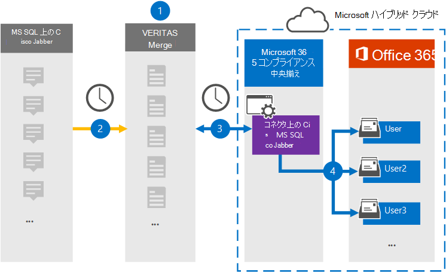

# MS データで Cisco Jabber をアーカイブするコネクタをSQLする

デバイスの Veritas コネクタを使用Microsoft 365 コンプライアンス センター、Cisco Jabber プラットフォームから組織のユーザー メールボックスにデータをインポートおよびアーカイブMicrosoft 365します。 Veritas は、1:1 チャット メッセージやグループ チャットなど、Jabber の MS SQL Database からアイテムをキャプチャし、それらのアイテムを Microsoft 365 にインポートするように構成された[Cisco Jabber](https://globanet.com/jabber/)コネクタを提供します。 コネクタは、Cisco Jabber の MS SQL Database からデータを取得し、処理し、コンテンツをユーザーの Cisco Jabber アカウントから電子メール メッセージ形式に変換し、Microsoft 365 のユーザーのメールボックスにそれらのアイテムをインポートします。

Cisco Jabber データをユーザー メールボックスに格納した後、訴訟ホールド、電子情報開示、保持ポリシーと保持ラベル、通信コンプライアンスなどの Microsoft 365 コンプライアンス機能を適用できます。 Cisco Jabber コネクタを使用してデータをインポートおよびアーカイブMicrosoft 365、組織が政府機関および規制ポリシーに準拠しつ付けるのに役立ちます。

## Cisco Jabber データのアーカイブの概要

次の概要では、コネクタを使用して、Ms 上の Cisco Jabber をアーカイブし、SQLデータをアーカイブMicrosoft 365。

1. 組織は、Cisco と一緒に MS サーバーで Cisco Jabber をセットアップおよび構成SQL Database。

2. 24 時間に 1 回、Cisco Jabber アイテムは MS SQL Database Veritas Merge1 サイトにコピーされます。 コネクタは、チャット メッセージのコンテンツを電子メール メッセージ形式に変換します。

3. Microsoft 365 コンプライアンス センター で作成する Cisco Jabber コネクタは、毎日 Veritas Merge1 サイトに接続し、Microsoft クラウド内の安全な Azure Storage 場所にアイテムを転送します。

4. コネクタとしての自動ユーザー マッピングは、手順 3 で説明されている *Email* プロパティの値を使用して、特定のユーザーのメールボックスにアイテム [をインポートします](#step-3-map-users-and-complete-the-connector-setup)。 MS SQL の **Cisco Jabber という** 名前の受信トレイ フォルダー内のサブフォルダーがユーザー メールボックスに作成され、そのフォルダーにメッセージ アイテムがインポートされます。 コネクタは *、Email* プロパティの値を使用してアイテムをインポートするメールボックスを決定します。 すべての Cisco Jabber アイテムには、このプロパティが含まれるので、すべての参加者の電子メール アドレスが設定されます。

## 始める前に

- Microsoft コネクタ用の Veritas Merge1 アカウントを作成します。 このアカウントを作成するには [、Veritas カスタマー サポートにお問い合わせください](https://www.veritas.com/content/support/)。 手順 1 でコネクタを作成するときに、このアカウントにサインインします。

- 手順 1 でコネクタSQL Databaseする前に、Jabber アイテムを取得する MS ファイルをセットアップします。 手順 2 で Cisco Jabber コネクタを構成するSQL Database MS インターフェイスの接続設定を指定します。 詳細については [、「Merge1 サードパーティ](https://docs.ms.merge1.globanetportal.com/Merge1%20Third-Party%20Connectors%20Cisco%20Jabber%20on%20MS%20SQL%20User%20Guide%20.pdf)コネクタ ユーザー ガイド」を参照してください。

- 手順 1 で Cisco Jabber コネクタを作成し (手順 3 で完了する) ユーザーは、Exchange Online のメールボックスインポートエクスポートの役割に割り当てる必要があります。 この役割は、データ コネクタ ページの[データ コネクタ] ページにコネクタを追加Microsoft 365 コンプライアンス センター。 既定では、この役割はグループ内の役割グループExchange Online。 [メールボックスのインポートエクスポート] 役割は、組織の [組織の管理] 役割グループに追加Exchange Online。 または、役割グループを作成し、メールボックスインポートエクスポートの役割を割り当て、適切なユーザーをメンバーとして追加できます。 詳細については、「グループ内の[役割グループを](/Exchange/permissions-exo/role-groups#create-role-groups)管理する」の「役割グループの作成」または「役割グループの変更」セクションを参照Exchange Online。

- この Veritas データ コネクタは、米国政府機関クラウドGCC環境Microsoft 365プレビュー中です。 サード パーティのアプリケーションとサービスには、Microsoft 365 インフラストラクチャの外部にあるサードパーティ システムに組織の顧客データを格納、送信、処理する必要がある場合があります。したがって、Microsoft 365 コンプライアンスとデータ保護のコミットメントの対象とはなってはいけなかっています。 Microsoft は、この製品を使用してサード パーティ製アプリケーションに接続する場合、これらのサード パーティ製アプリケーションが FEDRAMP に準拠しているという意味を示していません。

## 手順 1: MS インターフェイス コネクタで Cisco Jabber をSQLする

最初の手順は、データ インターフェイスのデータ コネクタにアクセスしMicrosoft 365 コンプライアンス センター MS データ上に Cisco Jabber 用のコネクタをSQLです。

1. MS の [https://compliance.microsoft.com](https://compliance.microsoft.com/) [データ コネクタ  >  **] の [Cisco Jabber] に移動してSQL。**

2. [MS の **Cisco Jabber SQL** 説明] ページで、[コネクタの追加]**をクリックします**。

3. [サービス条件 **] ページで、[** 同意する] を **クリックします**。

4. コネクタを識別する一意の名前を入力し、[次へ] を **クリックします**。

5. コネクタを構成するには、Merge1 アカウントにサインインします。

## 手順 2: Veritas Merge1 サイトの MS SQLコネクタで Cisco Jabber を構成する

2 番目の手順は、Veritas Merge1 サイトの MS SQLコネクタで Cisco Jabber を構成することです。 MS SQL コネクタで Cisco Jabber を構成する方法については[、「Merge1](https://docs.ms.merge1.globanetportal.com/Merge1%20Third-Party%20Connectors%20Cisco%20Jabber%20on%20MS%20SQL%20User%20Guide%20.pdf)サード パーティ コネクタ ユーザー ガイド」を参照してください。

[ファイルの **保存と&完了**] をクリックすると、コネクタ ウィザードの [ユーザー マッピング] ページが表示Microsoft 365 コンプライアンス センターされます。

## 手順 3: ユーザーをマップし、コネクタのセットアップを完了する

ユーザーをマップし、コネクタのセットアップを完了するには、次Microsoft 365 コンプライアンス センター手順を実行します。

1. [MS 上 **の Cisco Jabber をマップSQLユーザー** Microsoft 365に移動するには、自動ユーザー マッピングを有効にしてください。 MS の Cisco Jabber SQLには、組織内のユーザーの電子メール アドレスを含む *Email* というプロパティが含まれます。 コネクタでこのアドレスをユーザーに関連付Microsoft 365、アイテムはユーザーのメールボックスにインポートされます。

2. [**次へ**] をクリックし、設定を確認し、[データ コネクタ] ページに移動して、新しいコネクタのインポート プロセスの進行状況を確認します。

## 手順 4: Cisco Jabber コネクタを監視する

MS コネクタに Cisco Jabber をSQLした後、コネクタの状態を[コネクタ] Microsoft 365 コンプライアンス センター。

1. 左側の [https://compliance.microsoft.com](https://compliance.microsoft.com) ナビゲーションで [ **データ コネクタ] に** 移動してクリックします。

2. [コネクタ **] タブをクリック** し、MS コネクタの **Cisco Jabber** SQLして、フライアウト ページを表示します。 このページには、コネクタに関するプロパティと情報が含まれる。

3. [**ソースを含むコネクタの状態**] で、[ログのダウンロード] リンクをクリックして、コネクタの状態ログを開く (または保存) します。  このログには、Microsoft クラウドにインポートされたデータが含まれます。

## 既知の問題

- 現時点では、10 MB を超える添付ファイルやアイテムのインポートはサポートされていません。 大きいアイテムのサポートは、後日利用できます。
