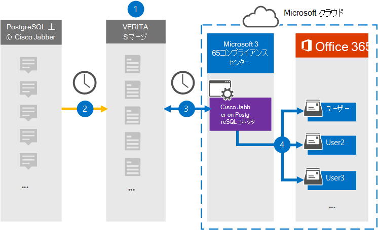

# PostgreSQL データで Cisco Jabber をアーカイブするコネクタをセットアップする

デバイスの Veritas コネクタを使用Microsoft 365 コンプライアンス センター、Cisco Jabber プラットフォームから組織のユーザー メールボックスにデータをインポートおよびアーカイブMicrosoft 365します。 Veritas は、サードパーティのデータ ソースからアイテムを (定期的に) キャプチャし、それらのアイテムを Microsoft 365 にインポートするように構成された、PostgreSQL コネクタ上の Cisco [Jabber](https://www.veritas.com/insights/merge1/jabber)を提供します。 コネクタは、メッセージ、チャット、共有コンテンツなどのコンテンツを、PostgreSQL の Cisco Jabber から電子メール メッセージ形式に変換し、それらのアイテムを Microsoft 365 のユーザーのメールボックスにインポートします。

PostgreSQL データの Cisco Jabber がユーザー メールボックスに格納された後、訴訟ホールド、電子情報開示、保持ポリシー、保持ラベルなどの Microsoft 365 コンプライアンス機能を適用できます。 PostgreSQL コネクタで Cisco Jabber を使用してデータをインポートおよびアーカイブすると、Microsoft 365規制ポリシーに準拠し、組織を支援できます。

## PostgreSQL データでの Cisco Jabber のアーカイブの概要

次の概要では、コネクタを使用して、Cisco Jabber on PostgreSQL データをアーカイブするプロセスMicrosoft 365。

1. 組織は、PostgreSQL の Cisco Jabber を使用して、PostgreSQL サイトで Cisco Jabber をセットアップおよび構成します。

2. 24 時間に 1 回、PostgreSQL アイテムの Cisco Jabber が Veritas Merge1 サイトにコピーされます。 また、このコネクタは、PostgreSQL アイテムの Cisco Jabber を電子メール メッセージ形式に変換します。

3. Microsoft 365 コンプライアンス センター で作成した PostgreSQL コネクタ上の Cisco Jabber は、毎日 Veritas Merge1 サイトに接続し、Jabber コンテンツを Microsoft クラウド内の安全な Azure Storage 場所に転送します。

4. コネクタは、手順 3 で説明したように、自動ユーザー マッピングの *Email* プロパティの値を使用して、変換されたアイテムを特定のユーザーのメールボックス [にインポートします](#step-3-map-users-and-complete-the-connector-setup)。 PostgreSQL の Cisco **Jabber** という名前の受信トレイ フォルダー内のサブフォルダーがユーザー メールボックスに作成され、アイテムがそのフォルダーにインポートされます。 コネクタは、Email プロパティの値を使用して *これを行* います。 すべての Jabber アイテムには、このプロパティが含まれるので、アイテムのすべての参加者の電子メール アドレスが設定されます。

## はじめに

- Microsoft コネクタ用の Merge1 アカウントを作成します。 これを行うには [、Veritas カスタマー サポートにお問い合わせください](https://www.veritas.com/content/support/en_US)。 手順 1 でコネクタを作成する場合は、このアカウントにサインインする必要があります。

- 手順 1 で PostgreSQL コネクタで Cisco Jabber を作成し (手順 3 で完了する) ユーザーは、Exchange Online のメールボックスインポートエクスポートの役割に割り当てる必要があります。 この役割は、データ コネクタ ページの[データ コネクタ] ページにコネクタを追加Microsoft 365 コンプライアンス センター。 既定では、この役割は、グループ内の任意の役割グループExchange Online。 [メールボックスのインポートエクスポート] 役割は、組織の [組織の管理] 役割グループに追加Exchange Online。 または、役割グループを作成し、メールボックスインポートエクスポートの役割を割り当て、適切なユーザーをメンバーとして追加できます。 詳細については、「グループ内の[役割グループを](/Exchange/permissions-exo/role-groups#create-role-groups)管理する」の「役割グループの作成」または「役割グループの変更」セクションを参照Exchange Online。

## 手順 1: PostgreSQL コネクタで Cisco Jabber をセットアップする

最初の手順は、次のページの [データ コネクタ] ページにアクセスしMicrosoft 365 コンプライアンス センタージャバー データのコネクタを作成することです。

1. PostgreSQL <https://compliance.microsoft.com> の [ **データ** コネクタ Cisco &gt; **Jabber] に移動し、[データ コネクタ] をクリックします**。

2. **[PostgreSQL 製品の説明] ページの [Cisco Jabber]** で、[コネクタの追加]**をクリックします**。

3. [サービス条件 **] ページで、[** 同意する] を **クリックします**。

4. コネクタを識別する一意の名前を入力し、[次へ] を **クリックします**。

5. コネクタを構成するには、Merge1 アカウントにサインインします。

## 手順 2: Veritas Merge1 サイトの PostgreSQL で Cisco Jabber を構成する

2 番目の手順は、Veritas Merge1 サイトの PostgreSQL コネクタで Cisco Jabber を構成することです。 PostgreSQL コネクタで Cisco Jabber を構成する方法については [、「Merge1 サードパーティ](https://docs.ms.merge1.globanetportal.com/Merge1%20Third-Party%20Connectors%20Cisco%20Jabber%20on%20PostgreSQL%20User%20Guide.pdf)コネクタ ユーザー ガイド」を参照してください。

[ファイルの **保存と&完了**] をクリックすると、コネクタ ウィザードの [ユーザー マッピング] ページが表示Microsoft 365 コンプライアンス センターされます。

## 手順 3: ユーザーをマップし、コネクタのセットアップを完了する

ユーザーをマップし、コネクタのセットアップを完了するには、次Microsoft 365 コンプライアンス センター手順を実行します。

1. **[PostgreSQL ユーザーに Cisco Jabber をマップして** ユーザー Microsoft 365する] ページで、自動ユーザー マッピングを有効にします。 PostgreSQL アイテムの Cisco Jabber には、組織内のユーザーの電子メール アドレスを含む *Email* というプロパティが含まれます。 コネクタでこのアドレスをユーザーに関連付Microsoft 365、アイテムはユーザーのメールボックスにインポートされます。

2. [**次へ**] をクリックし、設定を確認し、[データ コネクタ] ページに移動して、新しいコネクタのインポート プロセスの進行状況を確認します。

## 手順 4: PostgreSQL コネクタで Cisco Jabber を監視する

PostgreSQL コネクタで Cisco Jabber を作成した後は、コネクタの状態を[デバイス] Microsoft 365 コンプライアンス センター。

1. 左側の <https://compliance.microsoft.com/> ナビゲーションで [ **データ コネクタ] に** 移動してクリックします。

2. [コネクタ **] タブをクリック** し、PostgreSQL コネクタの **Cisco Jabber** を選択して、コネクタのプロパティと情報を含むフライアウト ページを表示します。

3. [**ソースを含むコネクタの状態**] で、[ログのダウンロード] リンクをクリックして、コネクタの状態ログを開く (または保存) します。  このログには、Microsoft クラウドにインポートされたデータが含まれます。

## 既知の問題

- 現時点では、10 MB を超える添付ファイルやアイテムのインポートはサポートされていません。 大きいアイテムのサポートは、後日利用できます。
