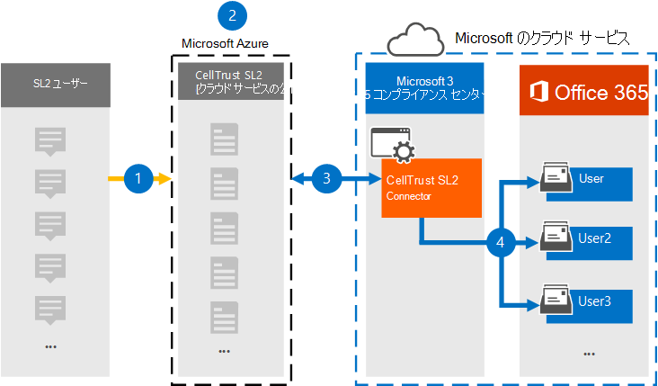
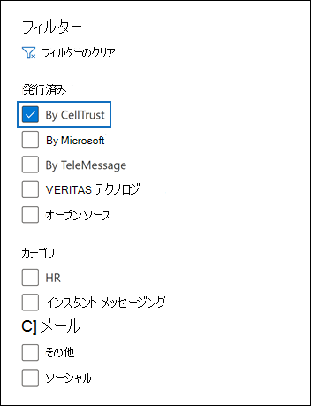

# CellTrust SL2 からデータをアーカイブMicrosoft 365

CellTrust SL2 はモバイル通信データをキャプチャし、主要なアーカイブ テクノロジと統合して、FINRA、HIPAA、FOIA、TCPA などの規制に関する電子的な検出要件を満たします。 SL2 データ コネクタは、モバイル通信アイテムをインポートして、Microsoft 365。 この記事では、アーカイブに CellTrust SL2 データ Microsoft 365を使用して SL2 とデータ を統合するプロセスについて説明します。 このプロセスを完了すると、CellTrust SL2 サービスをサブスクライブし、SL2 アーキテクチャに精通している必要があります。 CellTrust SL2 の詳細については、を参照してください <https://www.celltrust.com> 。

Microsoft 365 のユーザー メールボックスにデータをインポートした後、訴訟ホールド、電子情報開示、Microsoft 365 保持ポリシー、通信コンプライアンスなどの Microsoft 365 コンプライアンス機能を適用できます。 CellTrust SL2 Data Connector を使用してデータをインポートおよびアーカイブMicrosoft 365、組織が政府機関および規制ポリシーに準拠しつ付けるのに役立ちます。

## CellTrust SL2 データ コネクタを使用したアーカイブの概要

CellTrust の SL2 プラットフォームは、複数のソースからの通信データをキャプチャします。 SL2 データ ソースは、ユーザー間 (P2P) またはアプリケーション間 (A2P) のいずれかです。 この記事で説明するプロセスは、P2P データ ソースにのみ関係します。 すべての P2P データ ソースの場合、コラボレーションの少なくとも 1 つのパーティは、SL2 サービスをサブスクライブしている SL2 ユーザーです。 次の概要では、セルトラスト SL2 データ コネクタを使用するプロセスについて説明Microsoft 365。

1. SL2 ユーザーは、SL2 サービス間でデータを送受信Microsoft Azure。

2. 組織には、CellTrust の SL2 クラウド サービス環境に SL2 ドメインがあります。 ドメインには、1 つ以上の組織単位 (OUs) を持つ場合があります。 SL2 Cloud Service は、データを Microsoft Azure プラットフォーム内の高度にセキュリティ保護された領域に転送し、データが新しい環境Microsoft Azureします。 SL2 プラン (Enterprise、SMB、または政府機関) に応じて、ドメインはグローバルまたは政府機関Microsoft AzureホストMicrosoft Azureされます。

3. CellTrust SL2 データ コネクタを作成した後、ドメインと OUs (SL2 プランに関係なく) は、データの送信を開始Microsoft 365。 データ フィードは、データ ソース、OUs、またはドメイン自体に基づくレポートをサポートするために構成されています。 その結果、組織では、すべてのデータ ソースをデータ ソースにフィードするために必要なコネクタは 1 Microsoft 365。

4. コネクタは、マップされた各ユーザーの下に **、CellTrust SL2** というタイトルの適切なOffice 365フォルダーを作成します。 このマッピングは、電子メール アドレスを使用して、CellTrust SL2 ユーザー Office 365メールボックスに接続します。 CellTrust SL2 のユーザー ID に一致Office 365、ユーザーのデータはアーカイブされません。

## コネクタをセットアップする前に

- CellTrust SL2 クラウド サービス環境にドメインが設定されているのを確認します。 実稼働または試用版の SL2 ドメインの取得に関する追加情報については [、CellTrust にお問い合わせください](https://www.celltrust.com/contact-us/#form)。

- SL2 ドメインの管理者アカウントにアクセスするための資格情報を取得します。

- 手順 1 で CellTrust SL2 データ コネクタを作成し (手順 3 で完了する) ユーザーは、Exchange Online のメールボックスインポートエクスポートの役割に割り当てる必要があります。 この役割は、データ コネクタ ページの[データ コネクタ] ページにコネクタを追加Microsoft 365 コンプライアンス センター。 既定では、この役割はグループ内の役割グループExchange Online。 [メールボックスのインポートエクスポート] 役割は、組織の [組織の管理] 役割グループに追加Exchange Online。 または、役割グループを作成し、メールボックスインポートエクスポートの役割を割り当て、適切なユーザーをメンバーとして追加できます。 詳細については、「グループ内の[役割グループを](/Exchange/permissions-exo/role-groups#create-role-groups)管理する」の「役割グループの作成」または「役割グループの変更」セクションを参照Exchange Online。

## 手順 1: CellTrust SL2 コネクタを作成する

最初の手順は、データ コネクタをデータ コネクタに作成Microsoft 365 コンプライアンス センター。

1. 左側の <https://compliance.microsoft.com> ナビゲーション ウィンドウ **で [データ コネクタ]** に移動してクリックします。

2. [概要] **タブで** 、[フィルター] を **クリック** し **、[CellTrust** で] を選択し、フィルターを適用します。

   

3. **[CellTrust SL2] (プレビュー) をクリックします**。

4. **CellTrust SL2 (プレビュー**) 製品の説明ページで、[コネクタの追加]**をクリックします**。

5. [サービス条件 **] ページで、[** 同意する] を **クリックします**。

6. コネクタを識別する一意の名前を入力し、[次へ] を **クリックします**。 入力した名前は、作成後に [データ コネクタ] **ページのコネクタ** を識別します。

7. **[CellTrust アカウントへのサインイン] ページで、[CellTrust** に **サインイン] をクリックします**。 新しいブラウザー ウィンドウで **、CellTrust ポータルMicrosoft 365** にリダイレクトされます。

## 手順 2: アーカイブするドメインまたは OUs を選択する

次の手順では、CellTrust SL2 ドメインの管理者アカウントにサインインし、ドメインと OUs を選択して、このドメインにアーカイブMicrosoft 365。

1. [CellTrust **Microsoft 365 コネクタ]** ページで、SL2 クラウド サービスで環境を選択してサインイン ページを表示します。

   通常、環境を表すオプションが 1 つ表示されます。 ただし、複数の環境にドメインがある場合は、各環境のオプションが表示されます。 選択した後、SL2 ログイン ページにリダイレクトされます。

2. ドメインまたは OU 管理者アカウントの資格情報でサインインします。

   SL2 ドメイン管理者としてサインインすると、そのドメインのドメイン名と OUs が表示されます。 OUs を使用していない場合は、ドメインの名前だけが表示されます。 OU 管理者としてログインすると、OU の名前だけが表示されます。

3. アーカイブするビジネス ユニットを有効にする。 ドメインを選択すると、自動的に OUs が選択されません。 アーカイブするには、各 OU を個別に有効にする必要があります。

   

4. 選択が完了したら、ブラウザー ウィンドウを閉じて、ブラウザー ウィンドウのウィザード ページに戻Microsoft 365 コンプライアンス センター。 数秒後、ウィザードは自動的にユーザーのマッピングの次の手順に進みます。

## 手順 3: ユーザーをマップし、コネクタのセットアップを完了する

最後の手順では、ユーザーをマップし、コネクタのセットアップを完了Microsoft 365 コンプライアンス センター。

1. [ユーザー マッピング **] ページで**、[SL2] と [ユーザーマッピング] の両方でユーザーの電子メール アドレスが同じ場合は、[自動ユーザー マッピングを有効にする] をMicrosoft 365。  それ以外の場合は、ユーザーの SL2 アドレスをユーザーの住所にマップする CSV ファイルをアップロードして、電子メール アドレスを手動でMicrosoft 365する必要があります。

2. [ **次へ]** をクリックし、設定を確認し、[ **完了] をクリックして** コネクタを作成します。

   新しいコネクタが [データ コネクタ] ページの **一覧に追加** されます。

## CellTrust のヘルプを受ける

[CellTrust SL2 データ](https://www.celltrust.com/contact-us/#support)コネクタのセットアップに関するヘルプについては、CellTrust への問い合わせの詳細については、CellTrust カスタマー サポート ページを参照してください。

## 詳細

- ドメイン管理者は、そのドメインまたはそのドメイン内の任意の OUs のコネクタを設定できます。 OU 管理者アカウントを使用する場合は、その特定の OU のコネクタのみを設定できます。

- 上記の手順を正常に完了するには、ライセンスを割り当てMicrosoft 365 E5管理者権限を持Microsoft Officeがあります。

- 新しいコネクタをテストするには、SL2 モバイル アプリまたは SL2 ポータルからテキスト メッセージを送信します。 自分のメールボックスにMicrosoft 365し、受信トレイの **CellTrust SL2** フォルダーを開きます。 メールボックスにテキスト メッセージが表示されるには数分かかる場合があります。

- 多くの法律や規制では、電子通信を要求された場合に証拠として作成できるような方法で保存する必要があります。 電子情報開示 (電子情報開示) は、電子通信の生産に準拠するために使用されます。 Enterprise情報アーカイブ (EIA) ソリューションは、電子情報開示を実行し、保持ポリシー管理、データ分類、コンテンツ監督などの機能を提供するように設計されています。 Microsoft 365は、組織に影響を与える規制と標準に準拠する長期的な保持ソリューションを提供します。

- このドキュメント *で使用* されるアーカイブという用語は、EIA (情報アーカイブ) ソリューション内で使用されるコンテキストでのアーカイブEnterpriseを指します。 EIA ソリューションには、法的手続き、訴訟、監査、調査のためのドキュメントを生成する電子情報開示機能があります。 障害復旧とビジネス継続性に使用されるバックアップと復元のコンテキストでのアーカイブは、このドキュメント内の用語の意図した使用ではない。
