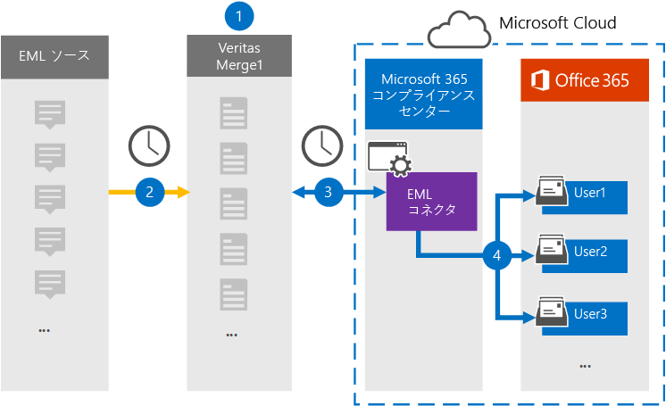

# EML データをアーカイブするコネクタをセットアップする

サーバーの Veritas コネクタを使用して、Microsoft 365 コンプライアンス センター組織のユーザー メールボックスに EML データをインポートおよびアーカイブMicrosoft 365します。 EML は、ファイルに保存された電子メール メッセージのファイル拡張子です。 コネクタは、アイテムのコンテンツをソース形式から電子メール メッセージ形式に変換し、そのアイテムをユーザー メールボックスにインポートします。

EML メッセージをユーザー メールボックスに保存した後、訴訟ホールド、電子情報開示、保持ポリシー Microsoft 365保持ラベルなどのコンプライアンス機能を適用できます。 EML コネクタを使用してデータをインポートおよびアーカイブMicrosoft 365、組織が政府機関および規制ポリシーに準拠しつ付けるのに役立ちます。

## EML データのアーカイブの概要

次の概要では、コネクタを使用して EML データをアーカイブするプロセスについて説明Microsoft 365。

1. 組織は EML ソースと一緒に EML サイトを設定および構成します。

2. 24 時間に 1 回、EML ソースのコンテンツ アイテムが Veritas Merge1 サイトにコピーされます。 このプロセスの間、EML ファイルのコンテンツは電子メール メッセージ形式に変換されます。

3. Microsoft 365 コンプライアンス センター で作成した EML コネクタは、毎日 Veritas Merge1 サイトに接続し、Microsoft クラウド内のセキュリティで保護された Azure Storage 場所にメッセージを転送します。

4. コネクタは、手順 3 で説明されている自動ユーザー マッピング プロセスの *Email* プロパティの値を使用して、変換されたメッセージ アイテムを特定のユーザーのメールボックス [にインポートします](#step-3-map-users-and-complete-the-connector-setup)。 このプロセスでは **、EML** という名前の受信トレイ フォルダー内のサブフォルダーがユーザー メールボックスに作成され、EML アイテムがそのフォルダーにインポートされます。 コネクタは *、Email* プロパティの値を使用してアイテムをインポートするメールボックスを決定します。 すべてのメッセージには、このプロパティが含まれるので、コンテンツ アイテムのすべての参加者の電子メール アドレスが設定されます。

## はじめに

- Microsoft コネクタ用の Veritas Merge1 アカウントを作成します。 アカウントを作成するには [、Veritas カスタマー サポートにお問い合わせください](https://globanet.com/ms-connectors-contact)。 手順 1 でコネクタを作成するときに、このアカウントにサインインします。

- 手順 1 で EML コネクタを作成し (および手順 3 で完了する) ユーザーは、Exchange Online のメールボックスインポートエクスポートの役割に割り当てる必要があります。 この役割は、データ コネクタ ページの[データ コネクタ] ページにコネクタを追加Microsoft 365 コンプライアンス センター。 既定では、この役割はグループ内の役割グループExchange Online。 [メールボックスのインポートエクスポート] 役割は、組織の [組織の管理] 役割グループに追加Exchange Online。 または、役割グループを作成し、メールボックスインポートエクスポートの役割を割り当て、適切なユーザーをメンバーとして追加できます。 詳細については、「グループ内の[役割グループを](/Exchange/permissions-exo/role-groups#create-role-groups)管理する」の「役割グループの作成」または「役割グループの変更」セクションを参照Exchange Online。

## 手順 1: EML コネクタをセットアップする

最初の手順は、EMLデータのコネクタを作成し、Microsoft 365 コンプライアンス センターの [データ コネクタ] ページにアクセスすることです。

1. [データ [https://compliance.microsoft.com](https://compliance.microsoft.com/) コネクタ EML] に移動し、[データ **コネクタ**  >  **] をクリックします**。

2. **[EML 製品の説明]** ページで、[コネクタの追加]**をクリックします**。

3. [サービス条件 **] ページで、[** 同意する] を **クリックします**。

4. コネクタを識別する一意の名前を入力し、[次へ] を **クリックします**。

5. コネクタを構成するには、Merge1 アカウントにサインインします。

## 手順 2: Veritas Merge1 サイトで EML コネクタを構成する

2 番目の手順は、Veritas Merge1 サイトで EML コネクタを構成することです。 EML コネクタの構成の詳細については [、「Merge1 サード](https://docs.ms.merge1.globanetportal.com/Merge1%20Third-Party%20Connectors%20EML%20User%20Guide%20.pdf)パーティ コネクタ ユーザー ガイド」を参照してください。

[ファイルの **保存と&完了**] をクリックすると、コネクタ ウィザードの [ユーザー マッピング] ページが表示Microsoft 365 コンプライアンス センターされます。

## 手順 3: ユーザーをマップし、コネクタのセットアップを完了する

ユーザーをマップし、コネクタのセットアップを完了するには、次Microsoft 365 コンプライアンス センター手順を実行します。

1. [外部ユーザー **をユーザーにマップMicrosoft 365] ページで**、自動ユーザー マッピングを有効にします。 EML ソース アイテムには、組織内のユーザーのメール アドレスを含む *Email* というプロパティが含まれます。 コネクタでこのアドレスをユーザーのユーザー Microsoft 365できる場合、EML アイテムは、そのユーザーのメールボックスにインポートされます。

2. [**次へ**] をクリックし、設定を確認し、[データ コネクタ] ページに移動して、新しいコネクタのインポート プロセスの進行状況を確認します。

## 手順 4: EML コネクタを監視する

EML コネクタを作成した後、コネクタの状態を [コネクタ] Microsoft 365 コンプライアンス センター。

1. 左側の [https://compliance.microsoft.com](https://compliance.microsoft.com) ナビゲーションで [ **データ コネクタ] に** 移動してクリックします。

2. [コネクタ **] タブをクリック** し **、EML** コネクタを選択して、フライアウト ページを表示します。 このページには、コネクタに関するプロパティと情報が含まれる。

3. [**ソースを含むコネクタの状態**] で、[ログのダウンロード] リンクをクリックして、コネクタの状態ログを開く (または保存) します。  このログには、Microsoft クラウドにインポートされたデータに関する情報が含まれます。

## 既知の問題

- 現時点では、10 MB を超える添付ファイルやアイテムのインポートはサポートされていません。 大きいアイテムのサポートは、後日利用できます。