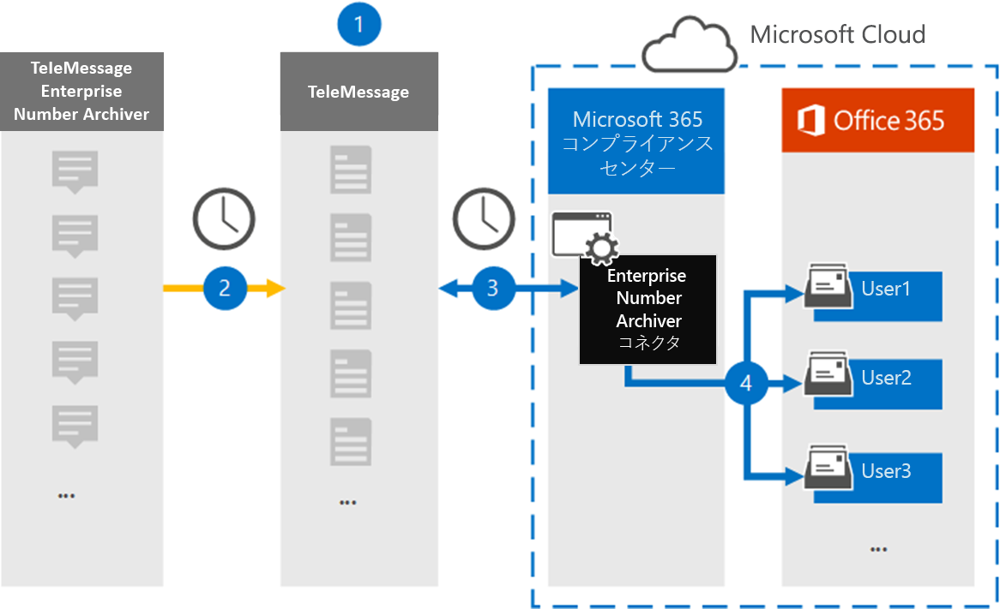

# Enterprise番号データをアーカイブするコネクタを設定する

[!include[Purview banner](../includes/purview-rebrand-banner.md)]

Microsoft Purview コンプライアンス ポータルの TeleMessage コネクタを使用して、ショート メッセージング サービス (SMS) とマルチメディア メッセージング サービス (MMS) メッセージ、チャット メッセージ、音声通話録音、および音声通話ログをEnterprise Number Archiver からインポートおよびアーカイブします。 コネクタを設定して構成すると、組織の TeleMessage アカウントに毎日 1 回接続され、TeleMessage Enterprise Number Archiver を使用して従業員のモバイル通信データがMicrosoft 365のメールボックスにインポートされます。

TeleMessage Enterprise Number Archiver コネクタ データがユーザー メールボックスに格納されたら、訴訟ホールド、コンテンツ検索、In-Placeアーカイブ、監査、通信コンプライアンス、Microsoft 365アイテム保持ポリシーなどの Microsoft Purview 機能を Number Archiver データのEnterpriseに適用できます。 たとえば、コンテンツ検索を使用して TeleMessage Enterprise Number Archiver SMS、MMS、音声通話を検索したり、Enterprise Number Archiver コネクタ データを含むメールボックスを電子情報開示 (プレミアム) ケースの保管担当者に関連付けることができます。 Enterprise Number Archiver コネクタを使用してMicrosoft 365でデータをインポートおよびアーカイブすると、組織が政府および規制のポリシーに準拠し続けるのに役立ちます。

## Enterprise番号データのアーカイブの概要

次の概要では、コネクタを使用してMicrosoft 365のネットワーク データEnterpriseアーカイブするプロセスについて説明します。

1. 組織は TeleMessage と連携して、Enterprise Number Archiver コネクタを設定します。 詳細については、 [こちらを](https://www.telemessage.com/office365-activation-for-enterprise-number-archiver/)参照してください。

2. コンプライアンス ポータルで作成するEnterprise番号アーカイブ コネクタは、TeleMessage サイトに毎日接続され、前の 24 時間のメール メッセージを Microsoft Cloud のセキュリティで保護されたAzure Storage領域に転送します。

3. コネクタは、モバイル通信アイテムを特定のユーザーのメールボックスにインポートします。 Enterprise Number Archiver という名前の新しいフォルダーが特定のユーザーのメールボックスに作成され、アイテムがインポートされます。 コネクタは、 *ユーザーの電子メール アドレス* プロパティの値を使用してマッピングを行います。 すべての電子メール メッセージには、このプロパティが含まれています。このプロパティには、電子メール メッセージのすべての参加者の電子メール アドレスが設定されます。 *ユーザーの電子メール アドレス* プロパティの値を使用した自動ユーザー マッピングに加えて、CSV マッピング ファイルをアップロードしてカスタム マッピングを定義することもできます。 このマッピング ファイルには、ユーザーの携帯電話番号と、各ユーザーの対応するMicrosoft 365メールボックス アドレスが含まれている必要があります。 自動ユーザー マッピングを有効にし、カスタム マッピングを指定する場合は、すべての電子メール アイテムについて、コネクタが最初にカスタム マッピング ファイルを確認します。 ユーザーの携帯電話番号に対応する有効なMicrosoft 365 ユーザーが見つからない場合、コネクタは電子メール アイテムのユーザーの電子メール アドレス プロパティを使用します。 コネクタで、カスタム マッピング ファイルまたは電子メール アイテムのユーザーの *電子メール アドレス* プロパティで有効なMicrosoft 365 ユーザーが見つからない場合、アイテムはインポートされません。

## コネクタを設定する前に

Number Archiver データEnterpriseアーカイブするために必要な実装手順の一部はMicrosoft 365外部であり、コンプライアンス センターでコネクタを作成する前に完了する必要があります。

- [TeleMessage から Enterprise Number Archiver サービス](https://www.telemessage.com/mobile-archiver/order-mobile-archiver-for-o365)を注文し、組織の有効な管理アカウントを取得します。 コンプライアンス センターでコネクタを作成するときは、このアカウントにサインインする必要があります。

- TeleMessage アカウントで Enterprise Number SMS/MMS Network アーカイブを必要とするすべてのユーザーを登録します。 ユーザーを登録するときは、Microsoft 365 アカウントに使用するのと同じメール アドレスを必ず使用してください。

- 従業員の携帯電話に TeleMessage Enterprise Number Archiver アプリをインストールしてアクティブ化します。

- Enterprise Number Archiver コネクタを作成するユーザーには、データ コネクタ管理者ロールが割り当てられている必要があります。 このロールは、コンプライアンス ポータルの **[データ コネクタ** ] ページでコネクタを追加するために必要です。 このロールは、既定で複数の役割グループに追加されます。 これらの役割グループの一覧については、「セキュリティ & コンプライアンス センターのアクセス許可」の「 [セキュリティとコンプライアンス センターの](../security/office-365-security/permissions-in-the-security-and-compliance-center.md#roles-in-the-security--compliance-center)ロール」セクションを参照してください。 または、組織内の管理者は、カスタム役割グループを作成し、Data Connector 管理者ロールを割り当て、適切なユーザーをメンバーとして追加することもできます。 手順については、 [Microsoft Purview コンプライアンス ポータル](microsoft-365-compliance-center-permissions.md#create-a-custom-role-group)のアクセス許可の「カスタム ロール グループの作成」セクションを参照してください。

- この TeleMessage データ コネクタは、Microsoft 365米国政府機関クラウドのGCC環境で使用できます。 サード パーティのアプリケーションとサービスには、組織の顧客データを、Microsoft 365 インフラストラクチャの外部にあるサード パーティ システムに格納、送信、処理する必要があるため、Microsoft Purview およびデータ保護のコミットメントの対象とされません。 Microsoft は、この製品を使用してサード パーティ製アプリケーションに接続することは、これらのサードパーティ アプリケーションが FEDRAMP に準拠していることを意味することを示しません。

## Enterprise Number Archiver コネクタを作成する

前のセクションで説明した前提条件を完了したら、コンプライアンス ポータルで Enterprise Number Archiver コネクタを作成できます。 コネクタは、指定した情報を使用して TeleMessage サイトに接続し、SMS、MMS、音声通話メッセージをMicrosoft 365の対応するユーザー メールボックス ボックスに転送します。

1. **Number Archiver** Enterprise [https://compliance.microsoft.com](https://compliance.microsoft.com/) **データ コネクタ**\>に移動してクリックします。

2. **[Enterprise Number Archiver** 製品の説明] ページで、[コネクタの **追加**] をクリックします。

3. [利用規約] ページ **で** 、[ **同意** する] をクリックします。

4. [ **TeleMessage へのログイン** ] ページの [手順 3] で、次のボックスに必要な情報を入力し、[ **次へ**] をクリックします。

   - **名：** TeleMessage ユーザー名。

   - **パスワード：** TeleMessage のパスワード。

5. コネクタが作成されたら、ポップアップ ウィンドウを閉じて次のページに移動できます。

6. [ **ユーザー マッピング** ] ページで、自動ユーザー マッピングを有効にします。 カスタム マッピングを有効にするには、ユーザー マッピング情報を含む CSV ファイルをアップロードし、[ **次へ**] をクリックします。

7. 設定を確認し、[ **完了]** をクリックしてコネクタを作成します。

8. **[データ コネクタ**] ページの [コネクタ] タブに移動して、新しいコネクタのインポート プロセスの進行状況を確認します。

## 既知の問題

- 現時点では、10 MB を超える添付ファイルやアイテムのインポートはサポートされていません。 より大きなアイテムのサポートは、後日提供される予定です。