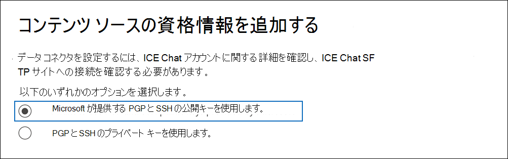

# ICE チャット データをアーカイブするコネクタを設定する

[!include[Purview banner](../includes/purview-rebrand-banner.md)]V

Microsoft Purview コンプライアンス ポータルのネイティブ コネクタを使用して、ICE チャット コラボレーション ツールから金融サービス チャット データをインポートおよびアーカイブします。 コネクタを設定して構成すると、組織の ICE Chat セキュリティで保護された FTP (SFTP) サイトに毎日 1 回接続し、チャット メッセージのコンテンツを電子メール メッセージ形式に変換してから、それらのアイテムをMicrosoft 365のメールボックスにインポートします。

ICE チャット データをユーザー メールボックスに格納した後、訴訟ホールド、電子情報開示、アーカイブ、監査、通信コンプライアンス、Microsoft 365アイテム保持ポリシーなどの Microsoft Purview 機能を ICE チャット データに適用できます。 たとえば、コンテンツ検索を使用して ICE チャット メッセージを検索したり、ICE チャット データを含むメールボックスを電子情報開示 (プレミアム) ケースのカストディアンに関連付けることができます。 ICE チャット コネクタを使用してMicrosoft 365のデータをインポートおよびアーカイブすると、組織が政府および規制のポリシーに準拠し続けることができます。

## ICE チャット データのアーカイブの概要

次の概要では、コネクタを使用してMicrosoft 365で ICE チャット データをアーカイブするプロセスについて説明します。

1. 組織は ICE チャットと連携して、ICE チャット SFTP サイトを設定します。 また、ICE チャットと連携して、ICE チャットの SFTP サイトにチャット メッセージをコピーするように ICE チャットを構成します。

2. 24 時間に 1 回、ICE チャットからのチャット メッセージが ICE チャット SFTP サイトにコピーされます。

3. コンプライアンス ポータルで作成した ICE チャット コネクタは、毎日 ICE Chat SFTP サイトに接続し、過去 24 時間のチャット メッセージを Microsoft クラウド内の安全なAzure Storageの場所に転送します。 また、コネクタは、チャット の会話の内容を電子メール メッセージ形式に変換します。

4. コネクタは、チャット メッセージアイテムを特定のユーザーのメールボックスにインポートします。 **ICE Chat** という名前の新しいフォルダーがユーザー メールボックスに作成され、チャット メッセージ アイテムがそのフォルダーにインポートされます。 コネクタでは、 *SenderEmail* プロパティと *RecipientEmail* プロパティの値を使用します。 すべてのチャット メッセージにはこれらのプロパティが含まれています。これには、送信者の電子メール アドレスと、チャット メッセージのすべての受信者/参加者が入力されます。

   *SenderEmail* プロパティと *RecipientEmail* プロパティの値を使用する自動ユーザー マッピング (つまり、コネクタが送信者のメールボックスとすべての受信者のメールボックスにチャット メッセージをインポートすることを意味する) に加えて、CSV マッピング ファイルをアップロードしてカスタム ユーザー マッピングを定義することもできます。 このマッピング ファイルには、組織内のすべてのユーザーの ICE Chat *ImId* と対応するMicrosoft 365メールボックス アドレスが含まれています。 自動ユーザー マッピングを有効にし、カスタム マッピング ファイルを指定する場合、すべてのチャット 項目について、コネクタは最初にカスタム マッピング ファイルを確認します。 ユーザーの ICE Chat ImId に対応する有効なMicrosoft 365 ユーザー アカウントが見つからない場合、コネクタはチャット アイテムの *SenderEmail* プロパティと *RecipientEmail* プロパティを使用して、アイテムをチャット参加者のメールボックスにインポートします。 コネクタで、カスタム マッピング ファイルまたは *SenderEmail* プロパティと *RecipientEmail* プロパティで有効なMicrosoft 365 ユーザーが見つからない場合、アイテムはインポートされません。

## コネクタを設定する前に

ICE Chat データをアーカイブするために必要な実装手順の一部はMicrosoft 365外部にあり、コンプライアンス センターでコネクタを作成する前に完了する必要があります。

- ICE チャットでは、外部コンプライアンスに対する料金が顧客に課金されます。 組織は、ICE Chat の販売グループに問い合わせて話し合い、ICE Chat データ サービス契約に署名する必要があります。これは、以下で [https://www.theice.com/publicdocs/agreements/ICE\_Data\_Services\_Agreement.pdf](https://www.theice.com/publicdocs/agreements/ICE\_Data\_Services\_Agreement.pdf)入手できます。 この契約は ICE チャットと組織の間で行われ、Microsoft は関与しません。 手順 2 で ICE Chat SFTP サイトを設定した後、ICE Chat は FTP 資格情報を組織に直接提供します。 次に、手順 3 でコネクタを設定するときに、Microsoft にこれらの資格情報を提供するユーザー。

- 手順 3. でコネクタを作成する前に、ICE Chat SFTP サイトを設定する必要があります。 ICE Chat を使用して SFTP サイトを設定した後、ICE Chat のデータは毎日 SFTP サイトにアップロードされます。 手順 3 で作成したコネクタは、この SFTP サイトに接続し、チャット データをMicrosoft 365メールボックスに転送します。 SFTP では、転送プロセス中にメールボックスに送信される ICE チャット データも暗号化されます。

- ICE チャット コネクタを設定するには、Pretty Good Privacy (PGP) と Secure Shell (SSH) のキーとキー パスフレーズを使用する必要があります。 これらのキーは、ICE Chat SFTP サイトを構成するために使用され、コネクタが ICE Chat SFTP サイトに接続してデータをMicrosoft 365にインポートするために使用されます。 PGP キーは、ICE Chat SFTP サイトからMicrosoft 365に転送されるデータの暗号化を構成するために使用されます。 SSH キーは、コネクタが ICE Chat SFTP サイトに接続するときにセキュリティで保護されたリモート ログインを有効にするようにセキュリティで保護されたシェルを構成するために使用されます。

  コネクタを設定するときは、Microsoft が提供する公開キーとキー パスフレーズを使用するか、独自の秘密キーとパスフレーズを使用することができます。 Microsoft が提供する公開キーを使用することをお勧めします。 ただし、組織で秘密キーを使用して ICE Chat SFTP サイトが既に構成されている場合は、同じ秘密キーを使用してコネクタを作成できます。

- ICE チャット コネクタは、1 日に合計 200,000 アイテムをインポートできます。 SFTP サイトに 200,000 を超えるアイテムがある場合、これらの項目はMicrosoft 365にインポートされません。

- 手順 3 で ICE チャット コネクタを作成し、手順 1 で公開キーと IP アドレスをダウンロードする管理者には、Data Connector 管理者ロールを割り当てる必要があります。 このロールは、コンプライアンス ポータルの **[データ コネクタ** ] ページでコネクタを追加するために必要です。 このロールは、既定で複数の役割グループに追加されます。 これらの役割グループの一覧については、「セキュリティ & コンプライアンス センターのアクセス許可」の「 [セキュリティとコンプライアンス センターの](../security/office-365-security/permissions-in-the-security-and-compliance-center.md#roles-in-the-security--compliance-center)ロール」セクションを参照してください。 または、組織内の管理者は、カスタム役割グループを作成し、Data Connector 管理者ロールを割り当て、適切なユーザーをメンバーとして追加することもできます。 手順については、 [Microsoft Purview コンプライアンス ポータル](microsoft-365-compliance-center-permissions.md#create-a-custom-role-group)のアクセス許可の「カスタム ロール グループの作成」セクションを参照してください。

## 公開キーを使用してコネクタを設定する

このセクションの手順では、Pretty Good Privacy (PGP) と Secure Shell (SSH) の公開キーを使用して ICE チャット コネクタを設定する方法について説明します。

### 手順 1: PGP と SSH の公開キーを取得する

最初の手順は、Pretty Good Privacy (PGP) と Secure Shell (SSH) の公開キーのコピーを取得することです。 手順 2 のこれらのキーを使用して、(手順 3 で作成した) コネクタが SFTP サイトに接続し、ICE チャット データを Microsoft 365メールボックスに転送できるように ICE Chat SFTP サイトを構成します。 この手順では、ICE Chat SFTP サイトを構成するときに使用する IP アドレスも取得します。

1. 左側の [https://compliance.microsoft.com](https://compliance.microsoft.com) ナビゲーションにある **[データ コネクタ** ] に移動してクリックします。

2. **ICE チャット** の [**データ コネクタ**] ページで、[**表示**] をクリックします。

3. **ICE チャット** ページで、[コネクタの **追加**] をクリックします。

4. [利用規約] ページ **で** 、[ **同意** する] をクリックします。

5. [ **コンテンツ ソースの資格情報の追加]** ページ **で、[Microsoft が提供する PGP および SSH 公開キーを使用する**] をクリックします。

   

6. 手順 1 で、 **SSH キーのダウンロード**、 **PGP キーのダウンロード**、 **および IP アドレスのダウンロード** のリンクをクリックして、各ファイルのコピーをローカル コンピューターに保存します。

   

   これらのファイルには、手順 2 で ICE Chat SFTP サイトを構成するために使用される次の項目が含まれています。

   - PGP 公開キー: このキーは、ICE Chat SFTP サイトからMicrosoft 365に転送されるデータの暗号化を構成するために使用されます。

   - SSH 公開キー: このキーは、コネクタが ICE Chat SFTP サイトに接続するときにセキュリティで保護されたリモート ログインを有効にするように Secure SSH を構成するために使用されます。

   - IP アドレス: ICE Chat SFTP サイトは、この IP アドレスからのみ接続要求を受け入れるように構成されています。これは、手順 3. で作成した ICE チャット コネクタによって使用されます。

7. [ **キャンセル] を** クリックしてウィザードを閉じます。 手順 3 でこのウィザードに戻り、コネクタを作成します。

### 手順 2: ICE Chat SFTP サイトを構成する

次の手順では、PGP と SSH の公開キーと、手順 1 で取得した IP アドレスを使用して、ICE Chat SFTP サイトの PGP 暗号化と SSH 認証を構成します。 これにより、手順 3 で作成した ICE チャット コネクタを ICE Chat SFTP サイトに接続し、ICE チャット データをMicrosoft 365に転送できます。 ICE Chat SFTP サイトを設定するには、ICE Chat カスタマー サポートと連携する必要があります。

### 手順 3: ICE チャット コネクタを作成する

最後の手順は、コンプライアンス ポータルで ICE チャット コネクタを作成することです。 コネクタは、指定した情報を使用して ICE Chat SFTP サイトに接続し、チャット メッセージをMicrosoft 365の対応するユーザー メールボックス ボックスに転送します。

1. 左側の [https://compliance.microsoft.com](https://compliance.microsoft.com) ナビゲーションにある **[データ コネクタ** ] に移動してクリックします。

2. **ICE チャット** の [**データ コネクタ**] ページで、[**表示**] をクリックします。

3. **ICE チャット** ページで、[コネクタの **追加**] をクリックします。

4. [利用規約] ページ **で** 、[ **同意** する] をクリックします。

5. [ **コンテンツ ソースの資格情報の追加]** ページで、[ **PGP と SSH の公開キーを使用する**] をクリックします。

6. 手順 3 で、次のボックスに必要な情報を入力し、[接続の **検証**] をクリックします。

   - **会社コード:** 組織の ID。これは、ICE Chat SFTP サイトのユーザー名として使用されます。

   - **パスワード：** ICE Chat SFTP サイトのパスワード。

   - **SFTP URL:** ICE Chat SFTP サイトの URL (たとえば)。 `sftp.theice.com` この値には IP アドレスを使用することもできます。

   - **SFTP ポート:** ICE Chat SFTP サイトのポート番号。 コネクタは、このポートを使用して SFTP サイトに接続します。

7. 接続が正常に検証されたら、[ **次へ**] をクリックします。

8. [ **ユーザーの定義]** ページで、データをインポートするユーザーを指定します。

     - **組織内のすべてのユーザー**。 すべてのユーザーのデータをインポートするには、このオプションを選択します。

     - **訴訟ホールドのユーザーのみ**。 メールボックスが訴訟ホールドに置かれているユーザーに対してのみデータをインポートするには、このオプションを選択します。 このオプションは、LitigationHoldEnabled プロパティが True に設定されているユーザー メールボックスにデータをインポートします。 詳細については、「 [訴訟ホールドの作成](create-a-litigation-hold.md)」を参照してください。

9. [**外部ユーザーを Microsoft 365 ユーザーにマップ** する] ページで、自動ユーザー マッピングを有効にし、必要に応じてカスタム ユーザー マッピングを提供します。 このページでは、ユーザー マッピング CSV ファイルのコピーをダウンロードできます。 ユーザー マッピングをファイルに追加してからアップロードできます。

   > [!NOTE]
   > 前に説明したように、カスタム マッピング ファイル CSV ファイルには、ICE Chat imid と各ユーザーの対応するMicrosoft 365メールボックス アドレスが含まれています。 自動ユーザー マッピングを有効にし、カスタム マッピングを指定した場合、すべてのチャット アイテムについて、コネクタは最初にカスタム マッピング ファイルを確認します。 ユーザーの ICE チャット imid に対応する有効なMicrosoft 365 ユーザーが見つからない場合、コネクタは、チャット アイテムの *SenderEmail* プロパティと *RecipientEmail* プロパティで指定されたユーザーのメールボックスにアイテムをインポートします。 コネクタが自動ユーザー マッピングまたはカスタム ユーザー マッピングによって有効なMicrosoft 365 ユーザーを見つけられない場合、アイテムはインポートされません。

10. [ **次へ**] をクリックし、設定を確認し、[ **完了]** をクリックしてコネクタを作成します。

11. **[データ コネクタ**] ページに移動して、新しいコネクタのインポート プロセスの進行状況を確認します。

## 秘密キーを使用してコネクタを設定する

このセクションの手順では、PGP と SSH 秘密キーを使用して ICE チャット コネクタを設定する方法について説明します。 このコネクタセットアップ オプションは、秘密キーを使用して ICE Chat SFTP サイトを既に構成している組織を対象としています。

### 手順 1: ICE Chat SFTP サイトを構成する IP アドレスを取得する

組織が PGP と SSH 秘密キーを使用して ICE Chat SFTP サイトを設定した場合は、IP アドレスを取得し、ICE Chat カスタマー サポートに提供する必要があります。 この IP アドレスからの接続要求を受け入れるように、ICE Chat SFTP サイトを構成する必要があります。 ICE チャット コネクタは、同じ IP アドレスを使用して SFTP サイトに接続し、ICE チャット データをMicrosoft 365に転送します。

IP アドレスを取得するには、

1. 左側の <https://compliance.microsoft.com> ナビゲーションにある **[データ コネクタ** ] に移動してクリックします。

2. **ICE チャット** の [**データ コネクタ**] ページで、[**表示**] をクリックします。

3. **ICE チャット** 製品の説明ページで、[**コネクタの追加**] をクリックします。

4. [利用規約] ページ **で** 、[ **同意** する] をクリックします。

5. [ **コンテンツ ソースの資格情報の追加]** ページで、[ **PGP と SSH の秘密キーを使用する**] をクリックします。

   

6. 手順 1 で [ **IP アドレスのダウンロード** ] をクリックして、IP アドレス ファイルのコピーをローカル コンピューターに保存します。

   

7. [ **キャンセル] を** クリックしてウィザードを閉じます。 手順 2 でこのウィザードに戻り、コネクタを作成します。

この IP アドレスからの接続要求を受け入れるように ICE Chat SFTP サイトを構成するには、ICE Chat カスタマー サポートと連携する必要があります。

### 手順 2: ICE チャット コネクタを作成する

ICE Chat SFTP サイトが構成されたら、次の手順では、コンプライアンス ポータルで ICE チャット コネクタを作成します。 コネクタは、指定した情報を使用して ICE Chat SFTP サイトに接続し、Microsoft 365の対応するユーザー メールボックス ボックスに電子メール メッセージを転送します。 この手順を完了するには、ICE Chat SFTP サイトのセットアップに使用したのと同じ秘密キーとキー パスフレーズのコピーを必ず作成してください。

1. 左側の <https://compliance.microsoft.com> ナビゲーションにある **[データ コネクタ** ] に移動してクリックします。

2. **ICE チャット** の [**データ コネクタ**] ページで、[**表示**] をクリックします。

3. **ICE チャット** 製品の説明ページで、[**コネクタの追加**] をクリックします。

4. [利用規約] ページ **で** 、[ **同意** する] をクリックします。

5. [ **コンテンツ ソースの資格情報の追加]** ページで、[ **PGP と SSH の秘密キーを使用する**] をクリックします。

6. 手順 3 で、次のボックスに必要な情報を入力し、[接続の **検証**] をクリックします。

      - **名前：** コネクタの名前。 組織内で一意である必要があります。

      - **会社コード:** ICE Chat SFTP サイトのユーザー名として使用される組織の ID。

      - **パスワード：** 組織の ICE Chat SFTP サイトのパスワード。

      - **SFTP URL:** ICE Chat SFTP サイトの URL (たとえば)。 `sftp.theice.com` この値には IP アドレスを使用することもできます。

      - **SFTP ポート:** ICE Chat SFTP サイトのポート番号。 コネクタは、このポートを使用して SFTP サイトに接続します。

      - **PGP 秘密キー:** ICE Chat SFTP サイトの PGP 秘密キー。 キー ブロックの開始行と終了行を含め、秘密キーの値全体を必ず含めます。

      - **PGP キー パスフレーズ:** PGP 秘密キーのパスフレーズ。

      - **SSH 秘密キー:** ICE Chat SFTP サイトの SSH 秘密キー。 キー ブロックの開始行と終了行を含め、秘密キーの値全体を必ず含めます。

      - **SSH キーパスフレーズ:** SSH 秘密キーのパスフレーズ。

7. 接続が正常に検証されたら、[ **次へ**] をクリックします。

8. [ **ユーザーの定義]** ページで、データをインポートするユーザーを指定します。

     - **組織内のすべてのユーザー**。 すべてのユーザーのデータをインポートするには、このオプションを選択します。

     - **訴訟ホールドのユーザーのみ**。 メールボックスが訴訟ホールドに置かれているユーザーに対してのみデータをインポートするには、このオプションを選択します。 このオプションは、LitigationHoldEnabled プロパティが True に設定されているユーザー メールボックスにデータをインポートします。 詳細については、「 [訴訟ホールドの作成](create-a-litigation-hold.md)」を参照してください。

9. **[ICE チャット ユーザーをMicrosoft 365ユーザーにマップ** する] ページで、自動ユーザー マッピングを有効にし、必要に応じてカスタム ユーザー マッピングを提供します。

   > [!NOTE]
   > 前に説明したように、カスタム マッピング ファイル CSV ファイルには、ICE Chat imid と各ユーザーの対応するMicrosoft 365メールボックス アドレスが含まれています。 自動ユーザー マッピングを有効にし、カスタム マッピングを指定した場合、すべてのチャット アイテムについて、コネクタは最初にカスタム マッピング ファイルを確認します。 ユーザーの ICE チャット imid に対応する有効なMicrosoft 365 ユーザーが見つからない場合、コネクタは、チャット アイテムの *SenderEmail* プロパティと *RecipientEmail* プロパティで指定されたユーザーのメールボックスにアイテムをインポートします。 コネクタが自動ユーザー マッピングまたはカスタム ユーザー マッピングによって有効なMicrosoft 365 ユーザーを見つけられない場合、アイテムはインポートされません。

10. [ **次へ**] をクリックし、設定を確認し、[ **完了]** をクリックしてコネクタを作成します。

11. **[データ コネクタ**] ページに移動して、新しいコネクタのインポート プロセスの進行状況を確認します。 コネクタをクリックすると、コネクタに関する情報が含まれるポップアップ ページが表示されます。
