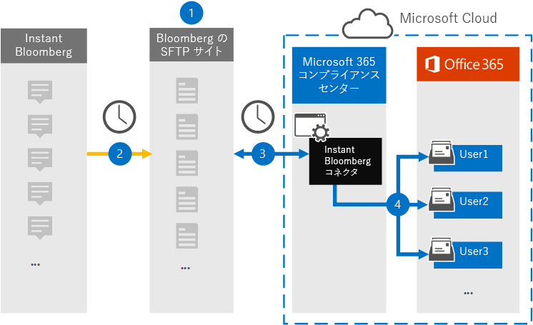
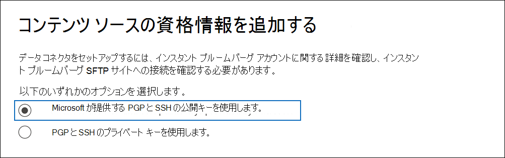
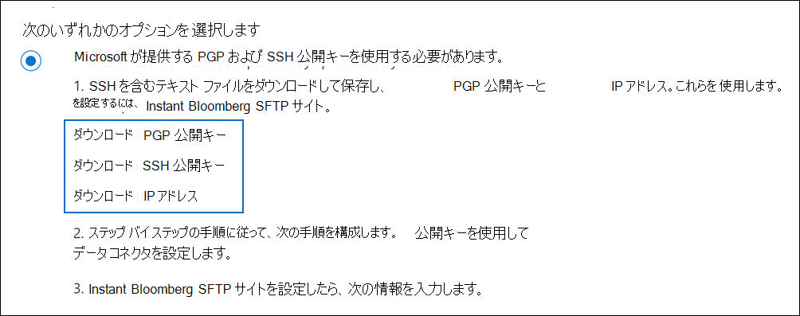
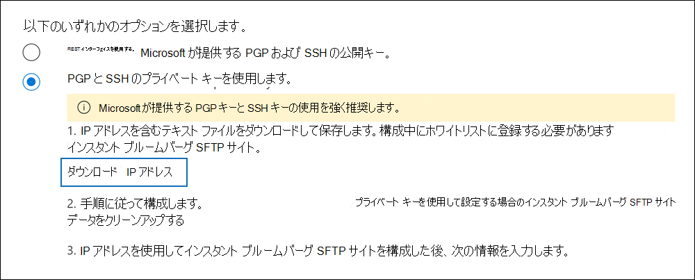

# コネクタをセットアップしてインスタント ブルームバーグ データをアーカイブする

[!include[Purview banner](../includes/purview-rebrand-banner.md)]

Microsoft Purview コンプライアンス ポータルのネイティブ コネクタを使用して、 [Instant Bloomberg](https://www.bloomberg.com/professional/product/collaboration/) コラボレーション ツールから金融サービス チャット データをインポートおよびアーカイブします。 コネクタを設定して構成すると、組織の Bloomberg セキュリティで保護された FTP サイト (SFTP) に毎日 1 回接続され、チャット メッセージのコンテンツが電子メール メッセージ形式に変換され、それらのアイテムがMicrosoft 365のメールボックスにインポートされます。

Instant Bloomberg データをユーザー メールボックスに格納した後、訴訟ホールド、コンテンツ検索、In-Placeアーカイブ、監査、通信コンプライアンス、Microsoft 365アイテム保持ポリシーなどの Microsoft Purview 機能をインスタント ブルームベルグ データに適用できます。 たとえば、コンテンツ検索を使用して Instant Bloomberg チャット メッセージを検索したり、インスタント ブルームベルグ データを含むメールボックスを Microsoft Purview 電子情報開示 (プレミアム) ケースのカストディアンに関連付けることができます。 Instant Bloomberg コネクタを使用してMicrosoft 365のデータをインポートおよびアーカイブすると、組織が政府および規制のポリシーに準拠し続けるのに役立ちます。

## Instant Bloomberg データのアーカイブの概要

次の概要では、コネクタを使用してMicrosoft 365のインスタント ブルームバーク チャット データをアーカイブするプロセスについて説明します。 

1. 組織は Bloomberg と連携して、Bloomberg SFTP サイトを設定します。 また、Bloomberg と連携して、チャット メッセージを Bloomberg SFTP サイトにコピーするように Instant Bloomberg を構成します。

2. 24 時間に 1 回、Instant Bloomberg からのチャット メッセージが Bloomberg SFTP サイトにコピーされます。

3. コンプライアンス ポータルで作成した Instant Bloomberg コネクタは、毎日 Bloomberg SFTP サイトに接続され、前の 24 時間のチャット メッセージを Microsoft Cloud のセキュリティで保護されたAzure Storage領域に転送します。 また、コネクタは、チャット の会話の内容を電子メール メッセージ形式に変換します。

4. コネクタは、チャット メッセージ アイテムを特定のユーザーのメールボックスにインポートします。 InstantBloomberg という名前の新しいフォルダーが特定のユーザーのメールボックスに作成され、アイテムがインポートされます。 コネクタは、 *CorporateEmailAddress* プロパティの値を使用してこれを行います。 すべてのチャット メッセージにはこのプロパティが含まれています。このプロパティには、チャット メッセージのすべての参加者の電子メール アドレスが入力されます。 *CorporateEmailAddress* プロパティの値を使用した自動ユーザー マッピングに加えて、CSV マッピング ファイルをアップロードしてカスタム マッピングを定義することもできます。 このマッピング ファイルには、Bloomberg UUID と、各ユーザーに対応するMicrosoft 365メールボックス アドレスが含まれている必要があります。 自動ユーザー マッピングを有効にし、カスタム マッピングを指定する場合は、すべてのチャット 項目について、コネクタが最初にカスタム マッピング ファイルを確認します。 ユーザーの Bloomberg UUID に対応する有効なMicrosoft 365 ユーザーが見つからない場合、コネクタはチャット アイテムの *CorporateEmailAddress* プロパティを使用します。 カスタム マッピング ファイルまたはチャット アイテムの *CorporateEmailAddress* プロパティで有効なMicrosoft 365 ユーザーがコネクタで見つからない場合、アイテムはインポートされません。

## コネクタを設定する前に

Instant Bloomberg データをアーカイブするために必要な実装手順の一部はMicrosoft 365外部にあり、コンプライアンス センターでコネクタを作成する前に完了する必要があります。

- Instant Bloomberg コネクタを設定するには、Pretty Good Privacy (PGP) と Secure Shell (SSH) にキーとキー パスフレーズを使用する必要があります。 これらのキーは、Bloomberg SFTP サイトを構成するために使用され、コネクタが Bloomberg SFTP サイトに接続してデータをMicrosoft 365にインポートするために使用されます。 PGP キーは、Bloomberg SFTP サイトからMicrosoft 365に転送されるデータの暗号化を構成するために使用されます。 SSH キーは、コネクタが Bloomberg SFTP サイトに接続するときにセキュリティで保護されたリモート ログインを有効にするようにセキュリティで保護されたシェルを構成するために使用されます。

  コネクタを設定するときは、Microsoft が提供する公開キーとキー パスフレーズを使用するか、独自の秘密キーとパスフレーズを使用することができます。 Microsoft が提供する公開キーを使用することをお勧めします。 ただし、組織で既に秘密キーを使用して Bloomberg SFTP サイトを構成している場合は、同じ秘密キーを使用してコネクタを作成できます。

- [Bloomberg Anywhere](https://www.bloomberg.com/professional/product/remote-access/?bbgsum-page=DG-WS-PROF-PROD-BBA) をサブスクライブします。 これは、設定および構成する必要がある Bloomberg SFTP サイトにアクセスするために、Bloomberg Anywhere にログインするために必要です。

- Bloomberg SFTP (セキュリティで保護されたファイル転送プロトコル) サイトを設定します。 Bloomberg と連携して SFTP サイトを設定した後、Instant Bloomberg のデータは毎日 SFTP サイトにアップロードされます。 手順 2 で作成したコネクタは、この SFTP サイトに接続し、チャット データをMicrosoft 365メールボックスに転送します。 SFTP では、転送プロセス中にメールボックスに送信されるインスタント ブルームベルグ チャット データも暗号化されます。

  Bloomberg SFTP ( *BB-SFTP* とも呼ばれる) の詳細については、以下を参照してください。

  - [Bloomberg サポート](https://www.bloomberg.com/professional/support/documentation/)の「SFTP 接続標準」ドキュメントを参照してください。

  - [Bloomberg カスタマー サポート](https://service.bloomberg.com/portal/sessions/new?utm_source=bloomberg-menu&utm_medium=csc)にお問い合わせください。

  Bloomberg と連携して SFTP サイトを設定した後、Bloomberg 実装の電子メール メッセージに応答した後に、一部の情報が提供されます。 次の情報のコピーを保存します。 これを使用して、手順 3. でコネクタを設定します。

  - 組織の ID であり、Bloomberg SFTP サイトへのログインに使用される会社コード。

  - Bloomberg SFTP サイトのパスワード

  - Bloomberg SFTP サイトの URL (sftp.bloomberg.com など)

  - Bloomberg SFTP サイトのポート番号

- Instant Bloomberg コネクタは、1 日に合計 200,000 個のアイテムをインポートできます。 SFTP サイトに 200,000 を超えるアイテムがある場合、これらの項目はMicrosoft 365にインポートされません。

- 手順 3 で Instant Bloomberg コネクタを作成し、手順 1 で公開キーと IP アドレスをダウンロードするユーザーには、Data Connector 管理者ロールを割り当てる必要があります。 このロールは、コンプライアンス ポータルの **[データ コネクタ** ] ページでコネクタを追加するために必要です。 このロールは、既定で複数の役割グループに追加されます。 これらの役割グループの一覧については、「セキュリティ & コンプライアンス センターのアクセス許可」の「 [セキュリティとコンプライアンス センターの](../security/office-365-security/permissions-in-the-security-and-compliance-center.md#roles-in-the-security--compliance-center)ロール」セクションを参照してください。 または、組織内の管理者は、カスタム役割グループを作成し、Data Connector 管理者ロールを割り当て、適切なユーザーをメンバーとして追加することもできます。 手順については、 [Microsoft Purview コンプライアンス ポータル](microsoft-365-compliance-center-permissions.md#create-a-custom-role-group)のアクセス許可の「カスタム ロール グループの作成」セクションを参照してください。

## 公開キーを使用してコネクタを設定する

このセクションの手順では、Pretty Good Privacy (PGP) と Secure Shell (SSH) の公開キーを使用して、Instant Bloomberg コネクタを設定する方法について説明します。

### 手順 1: PGP と SSH と公開キーを取得する

最初の手順は、Pretty Good Privacy (PGP) と Secure Shell (SSH) の公開キーのコピーを取得することです。 手順 2 のこれらのキーを使用して、(手順 3 で作成した) コネクタが SFTP サイトに接続し、インスタント ブルーム山チャット データを Microsoft 365メールボックスに転送できるように、Bloomberg SFTP サイトを構成します。 また、この手順では、Bloomberg SFTP サイトを構成するときに使用する IP アドレスも取得します。

1. 左側の <https://compliance.microsoft.com> ナビゲーションにある **[データ コネクタ** ] に移動してクリックします。

2. [データ **コネクタ** ] ページの [ **インスタント ブルームベルグ**] で、[ **表示**] をクリックします。

3. **Instant Bloomberg** 製品の説明ページで、[**コネクタの追加**] をクリックします。

4. [利用規約] ページ **で** 、[ **同意** する] をクリックします。

5. [ **コンテンツ ソースの資格情報の追加]** ページ **で、[Microsoft が提供する PGP および SSH 公開キーを使用する**] をクリックします。

   

6. 手順 1 で、 **SSH キーのダウンロード**、 **PGP キーのダウンロード**、 **および IP アドレスのダウンロード** のリンクをクリックして、各ファイルのコピーをローカル コンピューターに保存します。

   

   これらのファイルには、手順 2 で Bloomberg SFTP サイトを構成するために使用される次の項目が含まれています。

   - PGP 公開キー: このキーは、Bloomberg SFTP サイトからMicrosoft 365に転送されるデータの暗号化を構成するために使用されます。

   - SSH 公開キー: このキーは、コネクタが Bloomberg SFTP サイトに接続するときに、セキュリティで保護されたリモート ログインを有効にするようにセキュリティで保護されたシェルを構成するために使用されます。

   - IP アドレス: Bloomberg SFTP サイトは、この IP アドレスからの接続要求を受け入れるように構成されています。 SFTP サイトに接続し、Instant Bloomberg データをMicrosoft 365に転送するために、インスタント ブルームベルグ コネクタで同じ IP アドレスが使用されます。

7. [ **キャンセル] を** クリックしてウィザードを閉じます。 手順 3 でこのウィザードに戻り、コネクタを作成します。

### 手順 2: Bloomberg SFTP サイトを構成する

次の手順では、PGP と SSH の公開キーと手順 1 で取得した IP アドレスを使用して、Bloomberg SFTP サイトの PGP 暗号化と SSH 認証を構成します。 これにより、手順 3 で作成した Instant Bloomberg コネクタを Bloomberg SFTP サイトに接続し、インスタント ブルームベルグ データをMicrosoft 365に転送できます。 Bloomberg SFTP サイトを設定するには、Bloomberg カスタマー サポートと連携する必要があります。 [サポートについては、Bloomberg カスタマー サポート](https://service.bloomberg.com/portal/sessions/new?utm_source=bloomberg-menu&utm_medium=csc)にお問い合わせください。 

> [!IMPORTANT]
> Bloomberg では、手順 1 でダウンロードした 3 つのファイルを電子メール メッセージに添付し、それらを使用して Bloomberg SFTP サイトを設定するときにカスタマー サポート チームに送信することをお勧めします。

### 手順 3: Instant Bloomberg コネクタを作成する

最後の手順は、コンプライアンス ポータルでインスタント ブルームベルグ コネクタを作成することです。 コネクタは、指定した情報を使用して、Bloomberg SFTP サイトに接続し、チャット メッセージをMicrosoft 365の対応するユーザー メールボックス ボックスに転送します。

1. **Data connectorsInstant** >  **Bloomberg** に<https://compliance.microsoft.com>移動してクリックします。

2. **Instant Bloomberg** 製品の説明ページで、[**コネクタの追加**] をクリックします。

3. [利用規約] ページ **で** 、[ **同意** する] をクリックします。

4. **[Bloomberg SFTP サイトの資格情報の追加] ページ** の [手順 3] で、次のボックスに必要な情報を入力し、[**次へ**] をクリックします。

    - **会社コード:** Bloomberg SFTP サイトのユーザー名として使用される組織の ID。

    - **パスワード：** Bloomberg SFTP サイトのパスワード。

    - **SFTP URL:** Bloomberg SFTP サイトの URL (たとえば)。 `sftp.bloomberg.com` この値には IP アドレスを使用することもできます。

    - **SFTP ポート:** Bloomberg SFTP サイトのポート番号。 コネクタは、このポートを使用して SFTP サイトに接続します。

5. [ **ユーザーの定義** ] ページで、次のいずれかのオプションを選択して、データをインポートするユーザーを指定します。

    - **組織内のすべてのユーザー**。 すべてのユーザーのデータをインポートするには、このオプションを選択します。

    - **訴訟ホールドのユーザーのみ**。 メールボックスが訴訟ホールドに置かれているユーザーに対してのみデータをインポートするには、このオプションを選択します。 このオプションは、LitigationHoldEnabled プロパティが True に設定されているユーザー メールボックスにデータをインポートします。 詳細については、「 [訴訟ホールドの作成](create-a-litigation-hold.md)」を参照してください。

6. [ **インポートするデータ型の選択]** ページで、メッセージとは別にインポートする必要なデータ型を選択 **します**

7. **[ユーザーにインスタント Bloomberg ユーザーをマップする] ページ Microsoft 365で**、自動ユーザー マッピングを有効にし、必要に応じてカスタム ユーザー マッピングを提供します

   > [!NOTE]
   > コネクタは、チャット メッセージ アイテムを特定のユーザーのメールボックスにインポートします。 **InstantBloomberg** という名前の新しいフォルダーが特定のユーザーのメールボックスに作成され、アイテムがインポートされます。 コネクタは、 *CorporateEmailAddress* プロパティの値を使用して行います。 すべてのチャット メッセージにはこのプロパティが含まれており、プロパティにはチャット メッセージのすべての参加者の電子メール アドレスが設定されます。 *CorporateEmailAddress* プロパティの値を使用した自動ユーザー マッピングに加えて、CSV マッピング ファイルをアップロードしてカスタム マッピングを定義することもできます。 マッピング ファイルには、Bloomberg UUID と、各ユーザーに対応するMicrosoft 365メールボックス アドレスが含まれている必要があります。 自動ユーザー マッピングを有効にし、カスタム マッピングを指定した場合、すべてのチャット 項目について、コネクタは最初にカスタム マッピング ファイルを確認します。 ユーザーの Bloomberg UUID に対応する有効なMicrosoft 365 ユーザーが見つからない場合、コネクタはチャット アイテムの *CorporateEmailAddress* プロパティを使用します。 カスタム マッピング ファイルまたはチャット アイテムの *CorporateEmailAddress* プロパティで有効なMicrosoft 365 ユーザーがコネクタで見つからない場合、アイテムはインポートされません。

7. [ **次へ**] をクリックし、設定を確認し、[ **完了]** をクリックしてコネクタを作成します。

8. **[データ コネクタ**] ページに移動して、新しいコネクタのインポート プロセスの進行状況を確認します。 コネクタをクリックすると、コネクタに関する情報が含まれるポップアップ ページが表示されます。

## 秘密キーを使用してコネクタを設定する

このセクションの手順では、PGP および SSH 秘密キーを使用して Instant Bloomberg コネクタを設定する方法について説明します。 このコネクタセットアップ オプションは、秘密キーを使用して既に Bloomberg SFTP サイトを構成している組織を対象としています。

### 手順 1: Bloomberg SFTP サイトを構成する IP アドレスを取得する

> [!NOTE]
> 組織が以前に、PGP と SSH 秘密キーを使用して Bloomberg Message データをアーカイブするように Bloomberg SFTP サイトを構成している場合は、別のサイトを構成する必要はありません。 手順 2. でコネクタを作成するときに、同じ SFTP サイトを指定できます。

組織が PGP と SSH 秘密キーを使用して Bloomberg SFTP サイトを設定した場合は、IP アドレスを取得し、それを Bloomberg カスタマー サポートに提供する必要があります。 この IP アドレスからの接続要求を受け入れるように、Bloomberg SFTP サイトを構成する必要があります。 SFTP サイトに接続し、Instant Bloomberg データをMicrosoft 365に転送するために、インスタント ブルームベルグ コネクタで同じ IP アドレスが使用されます。

IP アドレスを取得するには、

1. 左側の <https://compliance.microsoft.com> ナビゲーションにある **[データ コネクタ** ] に移動してクリックします。

2. [データ **コネクタ** ] ページの [ **インスタント ブルームベルグ**] で、[ **表示**] をクリックします。

3. **Instant Bloomberg** 製品の説明ページで、[**コネクタの追加**] をクリックします。

4. [利用規約] ページ **で** 、[ **同意** する] をクリックします。

5. [ **コンテンツ ソースの資格情報の追加]** ページで、[ **PGP と SSH の秘密キーを使用する**] をクリックします。

6. 手順 1 で [ **IP アドレスのダウンロード** ] をクリックして、IP アドレス ファイルのコピーをローカル コンピューターに保存します。

   

7. [ **キャンセル] を** クリックしてウィザードを閉じます。 手順 2 でこのウィザードに戻り、コネクタを作成します。

この IP アドレスからの接続要求を受け入れるように Bloomberg SFTP サイトを構成するには、Bloomberg カスタマー サポートと連携する必要があります。 [サポートについては、Bloomberg カスタマー サポート](https://service.bloomberg.com/portal/sessions/new?utm_source=bloomberg-menu&utm_medium=csc)にお問い合わせください。

### 手順 2: Instant Bloomberg コネクタを作成する

Bloomberg SFTP サイトを構成した後、次の手順では、コンプライアンス ポータルでインスタント ブルームベルグ コネクタを作成します。 コネクタは、指定した情報を使用して、Bloomberg SFTP サイトに接続し、Microsoft 365の対応するユーザー メールボックス ボックスに電子メール メッセージを転送します。 この手順を完了するには、Bloomberg SFTP サイトのセットアップに使用したのと同じ秘密キーとキー パスフレーズのコピーを必ず作成してください。

1. 左側の <https://compliance.microsoft.com> ナビゲーションにある **[データ コネクタ** ] に移動してクリックします。

2. [データ **コネクタ** ] ページの [ **インスタント ブルームベルグ**] で、[ **表示**] をクリックします。

3. **Instant Bloomberg** 製品の説明ページで、[**コネクタの追加**] をクリックします。

4. [利用規約] ページ **で** 、[ **同意** する] をクリックします。

5. [ **コンテンツ ソースの資格情報の追加]** ページで、[ **PGP と SSH の秘密キーを使用する**] をクリックします。

   

6. 手順 3 で、次のボックスに必要な情報を入力し、[接続の **検証**] をクリックします。

      - **名前：** コネクタの名前。 組織内で一意である必要があります。

      - **会社コード:** Bloomberg SFTP サイトのユーザー名として使用される組織の ID。

      - **パスワード：** 組織の Bloomberg SFTP サイトのパスワード。

      - **SFTP URL:** Bloomberg SFTP サイトの URL (たとえば)。 `sftp.bloomberg.com` この値には IP アドレスを使用することもできます。

      - **SFTP ポート:** Bloomberg SFTP サイトのポート番号。 コネクタは、このポートを使用して SFTP サイトに接続します。

      - **PGP 秘密キー:** Bloomberg SFTP サイトの PGP 秘密キー。 キー ブロックの開始行と終了行を含め、秘密キーの値全体を必ず含めます。

      - **PGP キー パスフレーズ:** PGP 秘密キーのパスフレーズ。

      - **SSH 秘密キー:** Bloomberg SFTP サイトの SSH 秘密キー。 キー ブロックの開始行と終了行を含め、秘密キーの値全体を必ず含めます。

      - **SSH キーパスフレーズ:** SSH 秘密キーのパスフレーズ。

7. 接続が正常に検証されたら、[ **次へ**] をクリックします。

8. [ **ユーザーの定義** ] ページで、次のいずれかのオプションを選択して、データをインポートするユーザーを指定します。

    - **組織内のすべてのユーザー**。 すべてのユーザーのデータをインポートするには、このオプションを選択します。

    - **訴訟ホールドのユーザーのみ**。 メールボックスが訴訟ホールドに置かれているユーザーに対してのみデータをインポートするには、このオプションを選択します。 このオプションは、LitigationHoldEnabled プロパティが True に設定されているユーザー メールボックスにデータをインポートします。 詳細については、「 [訴訟ホールドの作成](create-a-litigation-hold.md)」を参照してください。

9. **[ユーザーをMicrosoft 365にマップする**] ページで、自動ユーザー マッピングを有効にし、必要に応じてカスタム ユーザー マッピングを提供します。

   > [!NOTE]
   > コネクタは、チャット メッセージ アイテムを特定のユーザーのメールボックスにインポートします。 **InstantBloomberg** という名前の新しいフォルダーが特定のユーザーのメールボックスに作成され、アイテムがインポートされます。 コネクタは、 *CorporateEmailAddress* プロパティの値を使用して行います。 すべてのチャット メッセージにはこのプロパティが含まれており、プロパティにはチャット メッセージのすべての参加者の電子メール アドレスが設定されます。 *CorporateEmailAddress* プロパティの値を使用した自動ユーザー マッピングに加えて、CSV マッピング ファイルをアップロードしてカスタム マッピングを定義することもできます。 マッピング ファイルには、Bloomberg UUID と、各ユーザーに対応するMicrosoft 365メールボックス アドレスが含まれている必要があります。 自動ユーザー マッピングを有効にし、カスタム マッピングを指定した場合、すべてのチャット 項目について、コネクタは最初にカスタム マッピング ファイルを確認します。 ユーザーの Bloomberg UUID に対応する有効なMicrosoft 365 ユーザーが見つからない場合、コネクタはチャット アイテムの *CorporateEmailAddress* プロパティを使用します。 カスタム マッピング ファイルまたはチャット アイテムの *CorporateEmailAddress* プロパティで有効なMicrosoft 365 ユーザーがコネクタで見つからない場合、アイテムはインポートされません。

10. [ **次へ**] をクリックし、設定を確認し、[ **完了]** をクリックしてコネクタを作成します。

11. **[データ コネクタ**] ページに移動して、新しいコネクタのインポート プロセスの進行状況を確認します。 コネクタをクリックすると、コネクタに関する情報が含まれるポップアップ ページが表示されます。
