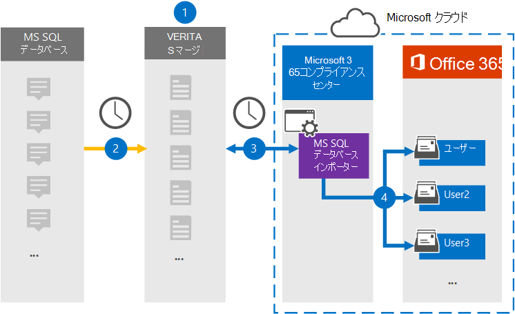

# MS サーバーからデータをアーカイブするコネクタをSQL Database

サーバーの Veritas コネクタをMicrosoft 365 コンプライアンス センター、MS SQL Databaseから組織のユーザー メールボックスにデータをMicrosoft 365します。 Veritas は、XML 構成ファイルを使用してデータベースからアイテムをキャプチャし、それらのアイテムを Microsoft 365 にインポートするように構成された MS SQL Database Importer コネクタを提供します。 コネクタは、MS ファイルからメール メッセージSQL Database形式にコンテンツを変換し、それらのアイテムをユーザー メールボックスにインポートMicrosoft 365。

ユーザー メールボックスに保存されている MS SQL Databaseコンテンツの後、訴訟ホールド、電子情報開示、保持ポリシー、保持ラベルなどのMicrosoft 365コンプライアンス機能を適用できます。 MS SQL Databaseコネクタを使用して、Microsoft 365のデータをインポートおよびアーカイブすると、組織が政府と規制のポリシーに準拠しつ付けるのに役立ちます。

## MS データのアーカイブSQL概要

次の概要では、コネクタを使用して MS データをアーカイブするプロセスSQL説明Microsoft 365。

1. 組織は、MS SQL DatabaseプロバイダーとSQL Databaseします。

2. 24 時間に 1 回、MS SQL Databaseは Veritas Merge1 サイトにコピーされます。 コネクタは、このコンテンツを電子メール メッセージ形式に変換します。

3. Microsoft 365 コンプライアンス センター で作成する MS SQL Database インポート コネクタは、毎日 Veritas Merge1 サイトに接続し、Microsoft クラウド内のセキュリティで保護された Azure Storage 場所にメッセージを転送します。

4. コネクタは、手順 3 で説明したように、自動ユーザー マッピングの *Email* プロパティの値を使用して、変換された MS SQL Database アイテムを特定のユーザーのメールボックス [にインポートします](#step-3-map-users-and-complete-the-connector-setup)。 MS という名前の受信トレイ フォルダーのサブフォルダー **SQL Databaseユーザー** メールボックスにインポートツールが作成され、そのフォルダーにアイテムがインポートされます。 コネクタは *、Email* プロパティの値を使用してアイテムをインポートするメールボックスを決定します。 MS サーバーからのすべてのアイテムSQL Databaseこのプロパティが含まれる。このプロパティには、アイテムのすべての参加者の電子メール アドレスが設定されます。

## 始める前に

- Microsoft コネクタ用の Veritas Merge1 アカウントを作成します。 アカウントを作成するには [、Veritas カスタマー サポートにお問い合わせください](https://www.veritas.com/content/support/)。 手順 1 でコネクタを作成する場合は、このアカウントにサインインする必要があります。

- 手順 1 で MS SQL Database Importer コネクタを作成し (および手順 3 で完了する) ユーザーは、Exchange Online のメールボックスインポートエクスポートの役割に割り当てる必要があります。 この役割は、データ コネクタ ページの [データ コネクタ] ページにコネクタを追加Microsoft 365 コンプライアンス センター。 既定では、この役割は、グループ内の任意の役割グループExchange Online。 [メールボックスのインポートエクスポート] 役割は、組織の [組織の管理] 役割グループに追加Exchange Online。 または、役割グループを作成し、メールボックスインポートエクスポートの役割を割り当て、適切なユーザーをメンバーとして追加できます。 詳細については、「グループ内の[役割グループを](/Exchange/permissions-exo/role-groups#create-role-groups)管理する」の「役割グループの作成」または「役割グループの変更」セクションを参照Exchange Online。

## 手順 1: MS インポート コネクタをSQL Databaseする

最初の手順は、サーバーの [**データ** コネクタ] ページにアクセスしMicrosoft 365 コンプライアンス センター MS コネクタのコネクタを作成SQL Database。

1. に移動し [https://compliance.microsoft.com](https://compliance.microsoft.com) 、[データ コネクタ]   >  **[MS SQL Database] をクリックします**。

2. **[MS ファイルのインポートSQL Database] ページ** で、[新しいコネクタの追加 **] をクリックします**。

3. [サービス条件 **] ページで、[** 同意する] を **クリックします**。

4. コネクタを識別する一意の名前を入力し、[次へ] を **クリックします**。

5. コネクタを構成するには、Merge1 アカウントにサインインします。

## 手順 2: Veritas Merge1 サイトで MS SQL Databaseインバー コネクタを構成する

2 番目の手順は、Merge1 サイトSQL Database MS コネクタを構成することです。 MS コネクタ を Importer で構成するSQL Databaseについては[、「Merge1 サード](https://docs.ms.merge1.globanetportal.com/Merge1%20Third-Party%20Connectors%20MS%20SQL%20Database%20Importer%20User%20Guide%20.pdf)パーティ コネクタ ユーザー ガイド」を参照してください。

[ファイルの **保存と&完了**] をクリックすると、コネクタ ウィザードの [ユーザー マッピング] ページが表示Microsoft 365 コンプライアンス センターされます。

## 手順 3: ユーザーをマップし、コネクタのセットアップを完了する

ユーザーをマップし、コネクタのセットアップを完了するには、次の手順を実行します。

1. [**ユーザーをユーザーにSQL Databaseする MS** Microsoft 365マップ] ページで、自動ユーザー マッピングを有効にします。 MS SQL Databaseには、組織内のユーザーの電子メール アドレスを含む *Email* というプロパティが含まれます。 コネクタでこのアドレスをユーザーに関連付Microsoft 365、アイテムはユーザーのメールボックスにインポートされます。

2. [**次へ**] をクリックし、設定を確認し、[データ コネクタ] ページに移動して、新しいコネクタのインポート プロセスの進行状況を確認します。

## 手順 4: MS データ インポートSQL Database監視する

MS インポート コネクタを作成SQL Database、コネクタの状態を [アプリケーション] で表示Microsoft 365 コンプライアンス センター。

1. 左側の <https://compliance.microsoft.com/> ナビゲーションで [ **データ コネクタ] に** 移動してクリックします。

2. [コネクタ **] タブを** クリックし **、MS** SQL Database **Importer** コネクタを選択して、コネクタのプロパティと情報を含むフライアウト ページを表示します。

3. [**ソースを含むコネクタの状態**] で、[ログのダウンロード] リンクをクリックして、コネクタの状態ログを開く (または保存) します。  このログには、Microsoft クラウドにインポートされたデータが含まれます。

## 既知の問題

- 現時点では、10 MB を超える添付ファイルやアイテムのインポートはサポートされていません。 大きいアイテムのサポートは、後日利用できます。