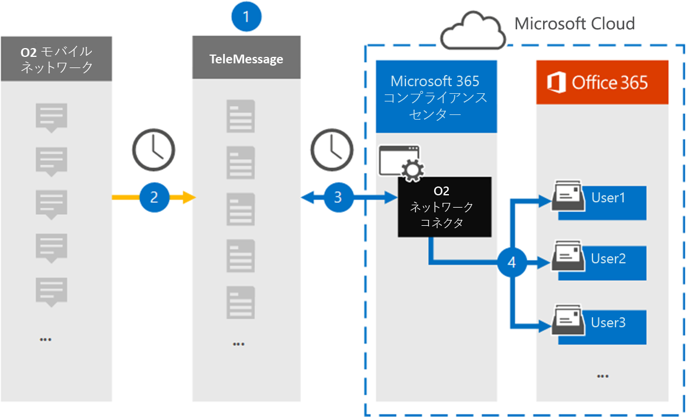

# O2 ネットワーク データをアーカイブするコネクタを設定する

[!include[Purview banner](../includes/purview-rebrand-banner.md)]

Microsoft Purview コンプライアンス ポータルの TeleMessage コネクタを使用して、O2 モバイル ネットワークからのショート メッセージング サービス (SMS) メッセージと音声通話をインポートおよびアーカイブします。 コネクタを設定して構成すると、組織の O2 ネットワークに毎日 1 回接続され、MICROSOFT 365内のメールボックスに SMS と音声通話がインポートされます。

SMS メッセージと音声通話がユーザー メールボックスに保存された後、訴訟ホールド、コンテンツ検索、Microsoft 365アイテム保持ポリシーなどの Microsoft Purview 機能を O2 Network データに適用できます。 たとえば、コンテンツ検索を使用して O2 ネットワーク SMS メッセージと音声通話を検索したり、O2 ネットワーク データを含むメールボックスを電子情報開示 (プレミアム) ケースのカストディアンに関連付けることができます。 O2 ネットワーク コネクタを使用してMicrosoft 365のデータをインポートおよびアーカイブすると、組織が政府および規制のポリシーに準拠し続けることができます。

## O2 ネットワーク データのアーカイブの概要

次の概要では、コネクタを使用して Microsoft 365で O2 ネットワーク データをアーカイブするプロセスについて説明します。

1. 組織は TeleMessage と O2 と連携して、O2 ネットワーク コネクタを設定します。 詳細については、「 [O2 Network Archiver](https://www.telemessage.com/office365-activation-for-o2-network-archiver)」を参照してください。

2. 24 時間ごとに、組織の O2 ネットワークからの SMS メッセージと音声通話が TeleMessage サイトにコピーされます。

3. コンプライアンス ポータルで作成した O2 ネットワーク コネクタは、毎日 TeleMessage サイトに接続し、過去 24 時間の SMS メッセージと音声通話を Microsoft クラウド内の安全なAzure Storageの場所に転送します。 また、コネクタは、SMS メッセージと音声通話のコンテンツを電子メール メッセージ形式に変換します。

4. コネクタは、モバイル通信アイテムを特定のユーザーのメールボックスにインポートします。 **O2 SMS と Voice Network Archiver** という名前の新しいフォルダーが特定のユーザーのメールボックスに作成され、アイテムがインポートされます。 コネクタは、 *ユーザーの電子メール アドレス* プロパティの値を使用してこのマッピングを行います。 すべての SMS メッセージと音声通話には、このプロパティが含まれています。このプロパティには、メッセージのすべての参加者の電子メール アドレスが入力されます。

   *ユーザーの電子メール アドレス* プロパティの値を使用した自動ユーザー マッピングに加えて、CSV マッピング ファイルをアップロードしてカスタム マッピングを定義することもできます。 このマッピング ファイルには、組織内のユーザーの携帯電話番号と対応するMicrosoft 365電子メール アドレスが含まれています。 自動ユーザー マッピングとカスタム マッピングの両方を有効にした場合、すべての O2 アイテムについて、コネクタは最初にカスタム マッピング ファイルを参照します。 ユーザーの携帯電話番号に対応する有効なMicrosoft 365ユーザーが見つからない場合、コネクタはインポートしようとしているアイテムの電子メール アドレス プロパティの値を使用します。 コネクタで、カスタム マッピング ファイルまたは O2 アイテムのメール アドレス プロパティで有効なMicrosoft 365 ユーザーが見つからない場合、アイテムはインポートされません。

## コネクタを設定する前に

O2 ネットワーク データをアーカイブするために必要な実装手順の一部はMicrosoft 365外部にあり、コンプライアンス センターでコネクタを作成する前に完了する必要があります。

- [TeleMessage から O2 Network Archiver サービス](https://www.telemessage.com/mobile-archiver/order-mobile-archiver-for-o365/)を注文し、組織の有効な管理アカウントを取得します。 コンプライアンス センターでコネクタを作成するときは、このアカウントにサインインする必要があります。

- TeleMessage オンボード フォームに入力し、O2 からメッセージ アーカイブ サービスを注文できるように、O2 ネットワーク アカウントと課金連絡先の詳細を取得します。

- TeleMessage アカウントで O2 SMS と Voice Network のアーカイブを必要とするすべてのユーザーを登録します。 ユーザーを登録するときは、Microsoft 365 アカウントに使用するのと同じメール アドレスを必ず使用してください。

- 従業員は、O2 モバイル ネットワーク上に会社所有の携帯電話と会社の責任を負う携帯電話を持っている必要があります。 Microsoft 365のメッセージのアーカイブは、従業員所有のデバイスまたは "Bring Your Own Devices (BYOD) デバイスでは使用できません。

- O2 ネットワーク コネクタを作成するユーザーには、データ コネクタ管理者ロールが割り当てられている必要があります。 このロールは、コンプライアンス ポータルの **[データ コネクタ** ] ページでコネクタを追加するために必要です。 このロールは、既定で複数の役割グループに追加されます。 これらの役割グループの一覧については、「セキュリティ & コンプライアンス センターのアクセス許可」の「 [セキュリティとコンプライアンス センターの](../security/office-365-security/permissions-in-the-security-and-compliance-center.md#roles-in-the-security--compliance-center)ロール」セクションを参照してください。 または、組織内の管理者は、カスタム役割グループを作成し、Data Connector 管理者ロールを割り当て、適切なユーザーをメンバーとして追加することもできます。 手順については、 [Microsoft Purview コンプライアンス ポータル](microsoft-365-compliance-center-permissions.md#create-a-custom-role-group)のアクセス許可の「カスタム ロール グループの作成」セクションを参照してください。

- この TeleMessage データ コネクタは、Microsoft 365米国政府機関クラウドのGCC環境で使用できます。 サード パーティのアプリケーションとサービスには、組織の顧客データを、Microsoft 365 インフラストラクチャの外部にあるサード パーティ システムに格納、送信、処理する必要があるため、Microsoft Purview およびデータ保護のコミットメントの対象とされません。 Microsoft は、この製品を使用してサード パーティ製アプリケーションに接続することは、これらのサードパーティ アプリケーションが FEDRAMP に準拠していることを意味することを示しません。

## O2 ネットワーク コネクタを作成する

前のセクションで説明した前提条件を完了したら、コンプライアンス ポータルで O2 ネットワーク コネクタを作成できます。 コネクタは、指定した情報を使用して TeleMessage サイトに接続し、SMS メッセージと音声通話をMicrosoft 365の対応するユーザー メールボックス ボックスに転送します。

1. [https://compliance.microsoft.com](https://compliance.microsoft.com/)[**データ コネクタ** \> **O2 ネットワーク**] に移動してクリックします。

2. **O2 ネットワーク** 製品の説明ページで、[**コネクタの追加**] をクリックします。

3. [利用規約] ページ **で** 、[ **同意** する] をクリックします。

4. [ **TeleMessage へのログイン** ] ページの [手順 3] で、次のボックスに必要な情報を入力し、[ **次へ**] をクリックします。

   - **名：** TeleMessage ユーザー名。

   - **パスワード：** TeleMessage のパスワード。

5. コネクタが作成されたら、ポップアップ ウィンドウを閉じて次のページに移動できます。

6. [ **ユーザー マッピング** ] ページで、自動ユーザー マッピングを有効にして、[ **次へ**] をクリックします。 カスタム マッピングで CSV ファイルをアップロードする必要がある場合は、[ **次へ**] をクリックします。

7. 設定を確認し、[ **完了]** をクリックしてコネクタを作成します。

8. **[データ コネクタ**] ページの [コネクタ] タブに移動して、新しいコネクタのインポート プロセスの進行状況を確認します。

## 既知の問題

- 現時点では、10 MB を超える添付ファイルやアイテムのインポートはサポートされていません。 より大きなアイテムのサポートは、後日提供される予定です。