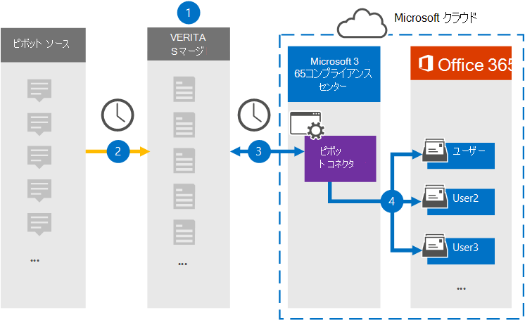

# ピボット データをアーカイブするコネクタをセットアップする

ピボット プラットフォームからデータをインポートおよびアーカイブするには、Microsoft 365 コンプライアンス センターの Veritas コネクタを使用して、組織のユーザー メールボックスMicrosoft 365します。 Veritas は、サードパーティのデータ ソースからアイテムを (定期的に) キャプチャし、それらのアイテムを Microsoft 365 にインポートするように構成されたピボット コネクタを提供します。 Pivot は、金融市場参加者とのコラボレーションを可能にするインスタント メッセージング プラットフォームです。 コネクタは、チャット メッセージなどのアイテムをユーザーのピボット アカウントから電子メール メッセージ形式に変換し、それらのアイテムを Microsoft 365 のユーザー メールボックスにインポートします。

ピボット データをユーザー メールボックスに格納した後、訴訟ホールド、電子情報開示、保持ポリシーと保持ラベル、通信コンプライアンスなどのコンプライアンス機能Microsoft 365を適用できます。 ピボット コネクタを使用してデータをインポートおよびアーカイブMicrosoft 365、組織が政府機関および規制ポリシーに準拠しつ付けるのに役立ちます。

## ピボット データのアーカイブの概要

次の概要では、コネクタを使用してピボット データをアーカイブするプロセスについて説明Microsoft 365。

1. 組織はピボットを使用してピボット ソース サイトを設定および構成します。

2. 24 時間に 1 回、ピボット アイテムは Veritas Merge1 サイトにコピーされます。 コネクタは、ピボットアイテムを電子メール メッセージ形式に変換します。

3. Microsoft 365 コンプライアンス センター で作成したピボット コネクタは、毎日 Veritas Merge1 サイトに接続し、ピボット アイテムを Microsoft クラウドの安全な Azure Storage 場所に転送します。

4. コネクタは、手順 3 で説明したように、自動ユーザー マッピングの *Email* プロパティの値を使用して、ピボット アイテムを特定のユーザーのメールボックス [にインポートします](#step-3-map-users-and-complete-the-connector-setup)。 Pivot という名前の受信トレイフォルダー内のサブフォルダーがユーザー メールボックスに作成され、アイテムがそのフォルダーにインポートされます。 コネクタは、Email プロパティの値を使用して *これを行* います。 すべてのピボット アイテムには、このプロパティが含まれるので、アイテムのすべての参加者の電子メール アドレスが設定されます。

## 始める前に

- Microsoft コネクタ用の Veritas Merge1 アカウントを作成します。 このアカウントを作成するには [、Veritas カスタマー サポートにお問い合わせください](https://www.veritas.com/content/support/)。 手順 1 でコネクタを作成するときに、このアカウントにサインインします。

- 手順 1 でピボット コネクタを作成し (および手順 3 で完了する) ユーザーは、次の手順のメールボックスインポートエクスポートの役割に割り当Exchange Online。 この役割は、データ コネクタ ページの [データ コネクタ] ページにコネクタを追加Microsoft 365 コンプライアンス センター。 既定では、この役割はグループ内の役割グループExchange Online。 [メールボックスのインポートエクスポート] 役割は、組織の [組織の管理] 役割グループに追加Exchange Online。 または、役割グループを作成し、メールボックスインポートエクスポートの役割を割り当て、適切なユーザーをメンバーとして追加できます。 詳細については、「グループ内の[役割グループを](/Exchange/permissions-exo/role-groups#create-role-groups)管理する」の「役割グループの作成」または「役割グループの変更」セクションを参照Exchange Online。

- この Veritas データ コネクタは、米国政府機関クラウドGCC環境Microsoft 365プレビュー中です。 サード パーティのアプリケーションとサービスには、Microsoft 365 インフラストラクチャの外部にあるサードパーティ システムに組織の顧客データを格納、送信、処理する必要がある場合があります。したがって、Microsoft 365 コンプライアンスとデータ保護のコミットメントの対象とはなってはいけなかっています。 Microsoft は、この製品を使用してサード パーティ製アプリケーションに接続する場合、これらのサード パーティ製アプリケーションが FEDRAMP に準拠しているという意味を示していません。

## 手順 1: ピボット コネクタをセットアップする

最初の手順は、Microsoft コンプライアンスセンターの [データ コネクタ] ページにアクセスし、ピボット データ用のコネクタを作成することです。

1. [データ コネクタ [https://compliance.microsoft.com](https://compliance.microsoft.com/) ピボット] に移動 **し、[データ コネクタ]**  >  **をクリックします**。

2. [ピボット製品 **の説明]** ページで、[コネクタの追加] **をクリックします**。

3. [サービス条件 **] ページで、[** 同意する] を **クリックします**。

4. コネクタを識別する一意の名前を入力し、[次へ] を **クリックします**。

5. コネクタを構成するには、Merge1 アカウントにサインインします。

## 手順 2: Veritas Merge1 サイトでピボット コネクタを構成する

2 番目の手順は、Merge1 サイトでピボット コネクタを構成することです。 Veritas Merge1 サイトでピボット コネクタを構成する方法については [、「Merge1 サード](https://docs.ms.merge1.globanetportal.com/Merge1%20Third-Party%20Connectors%20Pivot%20User%20Guide%20.pdf)パーティ コネクタ ユーザー ガイド」を参照してください。

[ファイルの **保存と&完了**] をクリックすると、コネクタ ウィザードの [ユーザー マッピング] ページが表示Microsoft 365 コンプライアンス センターされます。

## 手順 3: ユーザーをマップし、コネクタのセットアップを完了する

Microsoft 356 コンプライアンス センターでユーザーをマップし、コネクタのセットアップを完了するには、次の手順を実行します。

1. [ピボット **ユーザーをユーザーにマップMicrosoft 365] ページで**、自動ユーザー マッピングを有効にします。 ピボット アイテムには、組織内のユーザーのメール アドレスを含む *Email* というプロパティが含まれます。 コネクタでこのアドレスをユーザーに関連付Microsoft 365、アイテムはユーザーのメールボックスにインポートされます。

2. [**次へ**] をクリックし、設定を確認し、[データ コネクタ] ページに移動して、新しいコネクタのインポート プロセスの進行状況を確認します。

## 手順 4: ピボット コネクタを監視する

ピボット コネクタを作成した後、コネクタの状態を [ピボット コネクタ] Microsoft 365 コンプライアンス センター。

1. 左側の [https://compliance.microsoft.com](https://compliance.microsoft.com) ナビゲーションで [ **データ コネクタ] に** 移動してクリックします。

2. [コネクタ **] タブをクリック** し、ピボット **コネクタを** 選択して、フライアウト ページを表示します。 このページには、コネクタに関するプロパティと情報が含まれる。

3. [**ソースを含むコネクタの状態**] で、[ログのダウンロード] リンクをクリックして、コネクタの状態ログを開く (または保存) します。  このログには、Microsoft クラウドにインポートされたデータが含まれます。

## 既知の問題

- 現時点では、10 MB を超える添付ファイルやアイテムのインポートはサポートされていません。 大きいアイテムのサポートは、後日利用できます。