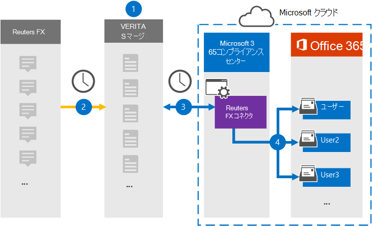

# Reuters FX データをアーカイブするコネクタを設定する

[!include[Purview banner](../includes/purview-rebrand-banner.md)]

Microsoft Purview コンプライアンス ポータルの Veritas コネクタを使用して、Reuters FX プラットフォームからMicrosoft 365組織内のユーザー メールボックスにデータをインポートしてアーカイブします。 Veritas には、サードパーティのデータ ソースからアイテムを (定期的に) キャプチャし、それらの項目をMicrosoft 365にインポートするように構成された[、Reuters FX](https://globanet.com/reuters-fx/) コネクタが用意されています。 コネクタは、通貨と FX レートを Reuters FX アカウントから電子メール メッセージ形式に変換し、それらのアイテムをMicrosoft 365のユーザーのメールボックスにインポートします。

ユーザー メールボックスに Reuters FX データが格納された後、訴訟ホールド、電子情報開示、アイテム保持ポリシーと保持ラベル、通信コンプライアンスなどの Microsoft Purview 機能を適用できます。 Microsoft 365でデータをインポートおよびアーカイブするために、Reuters FX コネクタを使用すると、組織が政府および規制のポリシーに準拠し続けることができます。

## Reuters FX データのアーカイブの概要

次の概要では、コネクタを使用して、Microsoft 365で Reuters FX データをアーカイブするプロセスについて説明します。

1. 組織は、Reuters FX と連携して、Reuters FX サイトを設定および構成します。

2. 24 時間に 1 回、Reuters FX アイテムは Veritas Merge1 サイトにコピーされます。 また、コネクタはアイテムを電子メール メッセージ形式に変換します。

3. コンプライアンス ポータルで作成した Reuters FX コネクタは、毎日 Veritas Merge1 サイトに接続し、Microsoft クラウド内の安全なAzure Storageの場所にコンテンツを転送します。

4. コネクタは、[手順 3](#step-3-map-users-and-complete-the-connector-setup). の説明に従って、自動ユーザー マッピングの *Email* プロパティの値を使用して、特定のユーザーのメールボックスにアイテムをインポートします。 ユーザー メールボックスに **Reuters FX** という名前の受信トレイ フォルダー内のサブフォルダーが作成され、そのフォルダーにアイテムがインポートされます。 コネクタは、 *Email* プロパティの値を使用して、アイテムをインポートするメールボックスを決定します。 すべての Reuters FX アイテムにはこのプロパティが含まれています。このプロパティには、アイテムのすべての参加者の電子メール アドレスが入力されます。

## はじめに

- Microsoft コネクタの Veritas Merge1 アカウントを作成します。 アカウントを作成するには、 [Veritas カスタマー サポート](https://globanet.com/contact-us)にお問い合わせください。 手順 1 でコネクタを作成するときに、このアカウントにサインインする必要があります。

- 手順 1 で Reuters FX コネクタを作成し、手順 3 で完了したユーザーには、Data Connector 管理者ロールを割り当てる必要があります。 このロールは、コンプライアンス ポータルの **[データ コネクタ** ] ページでコネクタを追加するために必要です。 このロールは、既定で複数の役割グループに追加されます。 これらの役割グループの一覧については、「セキュリティ & コンプライアンス センターのアクセス許可」の「 [セキュリティとコンプライアンス センターの](../security/office-365-security/permissions-in-the-security-and-compliance-center.md#roles-in-the-security--compliance-center)ロール」セクションを参照してください。 または、組織内の管理者は、カスタム役割グループを作成し、Data Connector 管理者ロールを割り当て、適切なユーザーをメンバーとして追加することもできます。 手順については、 [Microsoft Purview コンプライアンス ポータル](microsoft-365-compliance-center-permissions.md#create-a-custom-role-group)のアクセス許可の「カスタム ロール グループの作成」セクションを参照してください。

- この Veritas データ コネクタは、Microsoft 365米国政府機関クラウドのGCC環境でパブリック プレビュー段階にあります。 サード パーティのアプリケーションとサービスには、組織の顧客データを、Microsoft 365 インフラストラクチャの外部にあるサード パーティ システムに格納、送信、処理する必要があるため、Microsoft Purview およびデータ保護のコミットメントの対象とされません。 Microsoft は、この製品を使用してサード パーティ製アプリケーションに接続することは、これらのサードパーティ アプリケーションが FEDRAMP に準拠していることを意味することを示しません。

## 手順 1: Reuters FX コネクタを設定する

最初の手順は、Microsoft 365の **[データ コネクタ**] ページにアクセスし、Reuters FX データ用のコネクタを作成することです。

1. **Data connectorsReuters** >  **FX** に [https://compliance.microsoft.com](https://compliance.microsoft.com/)移動してクリックします。

2. **[Reuters FX 製品の** 説明] ページで、[**コネクタの追加**] をクリックします。

3. [利用規約] ページ **で** 、[ **同意** する] をクリックします。

4. コネクタを識別する一意の名前を入力し、[ **次へ**] をクリックします。

5. Merge1 アカウントにサインインしてコネクタを構成します。

## 手順 2: Veritas Merge1 サイトで Reuters FX コネクタを構成する

2 番目の手順は、Veritas Merge1 サイトで Reuters FX コネクタを構成することです。 Reuters FX コネクタの構成の詳細については、「 [Merge1 Third-Party Connectors ユーザー ガイド」を](https://docs.ms.merge1.globanetportal.com/Merge1%20Third-Party%20Connectors%20Reuters%20FX%20User%20Guide%20.pdf)参照してください。

[ **保存&完了**] をクリックすると、コンプライアンス ポータルのコネクタ ウィザードの **[ユーザー マッピング** ] ページが表示されます。

## 手順 3: ユーザーをマップし、コネクタのセットアップを完了する

ユーザーをマップし、コンプライアンス ポータルでコネクタのセットアップを完了するには、次の手順に従います。

1. [**Map Reuters FX users to Microsoft 365 users**] ページで、自動ユーザー マッピングを有効にします。

   Reuters FX アイテム *には、組織内* のユーザーの電子メール アドレスを含む Email というプロパティが含まれています。 コネクタがこのアドレスをMicrosoft 365 ユーザーに関連付けることができる場合、アイテムはそのユーザーのメールボックスにインポートされます。

2. [ **次へ**] をクリックして設定を確認し、[ **データ コネクタ** ] ページに移動して、新しいコネクタのインポート プロセスの進行状況を確認します。

## 手順 4: Reuters FX コネクタを監視する

Reuters FX コネクタを作成した後、コンプライアンス ポータルでコネクタの状態を表示できます。

1. 左側の <https://compliance.microsoft.com/> ナビゲーションにある **[データ コネクタ** ] に移動してクリックします。

2. [ **コネクタ** ] タブをクリックし、 **Reuters FX** コネクタを選択して、コネクタに関するプロパティと情報を含むポップアップ ページを表示します。

3. **[コネクタの状態とソース**] で、[**ログのダウンロード**] リンクをクリックして、コネクタの状態ログを開く (または保存) します。 このログには、Microsoft クラウドにインポートされたデータが含まれています。

## 既知の問題

- 現時点では、10 MB を超える添付ファイルやアイテムのインポートはサポートされていません。 より大きなアイテムのサポートは、後日提供される予定です。