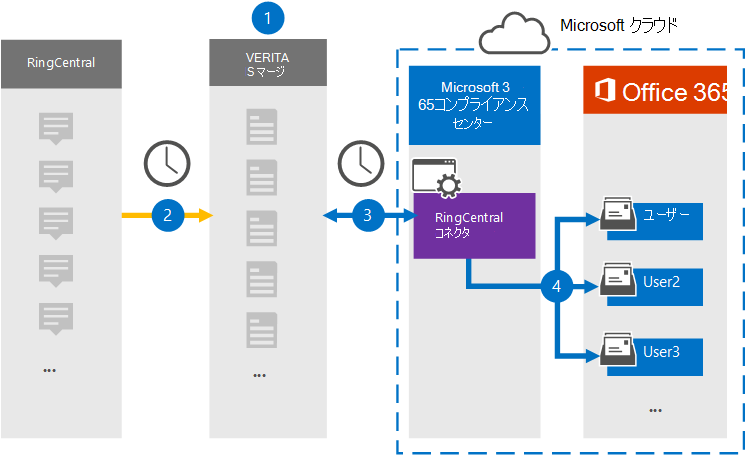

# RingCentral データをアーカイブするコネクタを設定する

[!include[Purview banner](../includes/purview-rebrand-banner.md)]

Microsoft Purview コンプライアンス ポータルの Veritas コネクタを使用して、RingCentral プラットフォームからMicrosoft 365組織内のユーザー メールボックスにデータをインポートしてアーカイブします。 Veritas には、サードパーティのデータ ソースからアイテムをキャプチャし、それらの項目をMicrosoft 365にインポートするように構成された [RingCentral](https://www.veritas.com/insights/merge1/ringcentral) コネクタが用意されています。 コネクタは、チャット、添付ファイル、タスク、メモ、投稿などのコンテンツを RingCentral から電子メール メッセージ形式に変換し、それらのアイテムをMicrosoft 365のユーザー メールボックスにインポートします。

RingCentral データがユーザー メールボックスに格納された後、訴訟ホールド、電子情報開示、アイテム保持ポリシー、保持ラベルなどの Microsoft Purview 機能を適用できます。 RingCentral コネクタを使用してMicrosoft 365のデータをインポートおよびアーカイブすると、組織が政府および規制のポリシーに準拠し続けることができます。

## RingCentral データのアーカイブの概要

次の概要では、コネクタを使用して、Microsoft 365で RingCentral データをアーカイブするプロセスについて説明します。

1. 組織は RingCentral と連携して、RingCentral サイトを設定および構成します。

2. 24 時間に 1 回、RingCentral アイテムは Veritas Merge1 サイトにコピーされます。 コネクタでは、RingCentral アイテムも電子メール メッセージ形式に変換されます。

3. コンプライアンス ポータルで作成した RingCentral コネクタは、毎日 Veritas Merge1 サイトに接続し、RingCentral コンテンツを Microsoft クラウド内の安全なAzure Storageの場所に転送します。

4. コネクタは、[手順 3](#step-3-map-users-and-complete-the-connector-setup). で説明したように、自動ユーザー マッピングの *Email* プロパティの値を使用して、変換されたアイテムを特定のユーザーのメールボックスにインポートします。 **RingCentral** という名前の受信トレイ フォルダー内のサブフォルダーがユーザー メールボックスに作成され、アイテムがそのフォルダーにインポートされます。 コネクタは、 *Email* プロパティの値を使用して、アイテムをインポートするメールボックスを決定します。 すべての RingCentral アイテムにはこのプロパティが含まれています。このプロパティには、アイテムのすべての参加者の電子メール アドレスが入力されます。

## コネクタを設定する前に

- Microsoft コネクタの Merge1 アカウントを作成します。 このアカウントを作成するには、 [Veritas カスタマー サポート](https://www.veritas.com/form/requestacall/ms-connectors-contact)にお問い合わせください。 手順 1 でコネクタを作成するときに、このアカウントにサインインする必要があります。

- RingCentral アカウントからデータをフェッチする RingCentral アプリケーションを作成します。 アプリケーションの作成に関する詳細な手順については、「 [Merge1 サード パーティ コネクタ ユーザー ガイド」を](https://docs.ms.merge1.globanetportal.com/Merge1%20Third-Party%20Connectors%20RingCentral%20User%20Guide.pdf)参照してください。

- 手順 1 で RingCentral コネクタを作成し、手順 3 で完了したユーザーには、Data Connector 管理者ロールを割り当てる必要があります。 このロールは、コンプライアンス ポータルの **[データ コネクタ** ] ページでコネクタを追加するために必要です。 このロールは、既定で複数の役割グループに追加されます。 これらの役割グループの一覧については、「セキュリティ & コンプライアンス センターのアクセス許可」の「 [セキュリティとコンプライアンス センターの](../security/office-365-security/permissions-in-the-security-and-compliance-center.md#roles-in-the-security--compliance-center)ロール」セクションを参照してください。 または、組織内の管理者は、カスタム役割グループを作成し、Data Connector 管理者ロールを割り当て、適切なユーザーをメンバーとして追加することもできます。 手順については、 [Microsoft Purview コンプライアンス ポータル](microsoft-365-compliance-center-permissions.md#create-a-custom-role-group)のアクセス許可の「カスタム ロール グループの作成」セクションを参照してください。

- この Veritas データ コネクタは、Microsoft 365米国政府機関クラウドのGCC環境でパブリック プレビュー段階にあります。 サード パーティのアプリケーションとサービスには、組織の顧客データを、Microsoft 365 インフラストラクチャの外部にあるサード パーティ システムに格納、送信、処理する必要があるため、Microsoft Purview およびデータ保護のコミットメントの対象とされません。 Microsoft は、この製品を使用してサード パーティ製アプリケーションに接続することは、これらのサードパーティ アプリケーションが FEDRAMP に準拠していることを意味することを示しません。

## 手順 1: RingCentral コネクタを設定する

最初の手順では、コンプライアンス ポータルの **[データ コネクタ** ] ページにアクセスし、RingCentral データ用のコネクタを作成します。

1. **データ コネクタ** > **RingCentral** に<https://compliance.microsoft.com>移動してクリックします。

2. **RingCentral** 製品の説明ページで、[**コネクタの追加**] をクリックします。

3. [利用規約] ページ **で** 、[ **同意** する] をクリックします。

4. コネクタを識別する一意の名前を入力し、[ **次へ**] をクリックします。

5. Merge1 アカウントにサインインしてコネクタを構成します。

## 手順 2: Veritas Merge1 サイトで RingCentral を構成する

2 番目の手順では、Veritas Merge1 サイトで RingCentral コネクタを構成します。 RingCentral コネクタを構成する方法については、「 [Merge1 サード パーティ コネクタ ユーザー ガイド」を](https://docs.ms.merge1.globanetportal.com/Merge1%20Third-Party%20Connectors%20RingCentral%20User%20Guide.pdf)参照してください。

[ **保存&完了** ] をクリックすると、コンプライアンス ポータルのコネクタ ウィザードの **[ユーザー マッピング** ] ページが表示されます。

## 手順 3: ユーザーをマップし、コネクタのセットアップを完了する

ユーザーをマップし、コンプライアンス ポータルでコネクタのセットアップを完了するには、次の手順に従います。

1. **[RingCentral ユーザーをユーザーにマップする] ページMicrosoft 365**、自動ユーザー マッピングを有効にします。 RingCentral アイテム *には、組織内* のユーザーの電子メール アドレスを含む Email というプロパティが含まれます。 コネクタがこのアドレスをMicrosoft 365 ユーザーに関連付けることができる場合、アイテムはそのユーザーのメールボックスにインポートされます。

2. [ **次へ**] をクリックして設定を確認し、[ **データ コネクタ** ] ページに移動して、新しいコネクタのインポート プロセスの進行状況を確認します。

## 手順 4: RingCentral コネクタを監視する

RingCentral コネクタを作成した後、コンプライアンス ポータルでコネクタの状態を表示できます。

1. 左側の <https://compliance.microsoft.com/> ナビゲーションにある **[データ コネクタ** ] に移動してクリックします。

2. [ **コネクタ** ] タブをクリックし、 **RingCentral** コネクタを選択して、コネクタに関するプロパティと情報を含むポップアップ ページを表示します。

3. **[コネクタの状態とソース**] で、[**ログのダウンロード**] リンクをクリックして、コネクタの状態ログを開く (または保存) します。 このログには、Microsoft クラウドにインポートされたデータが含まれています。

## 既知の問題

- 現時点では、10 MB を超える添付ファイルやアイテムのインポートはサポートされていません。 より大きなアイテムのサポートは、後日提供される予定です。
