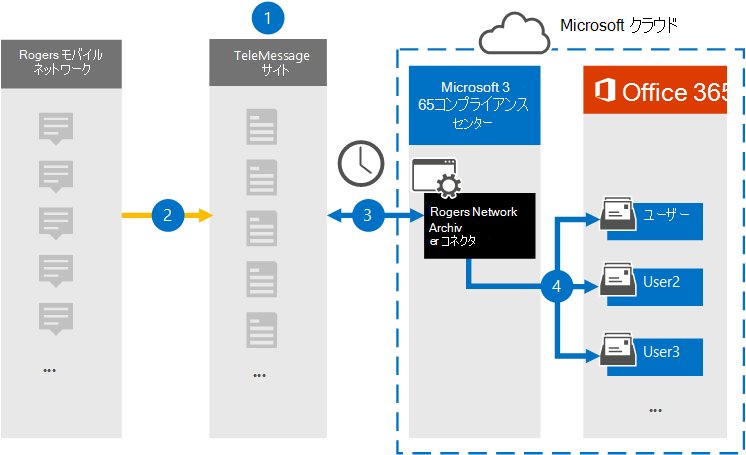

# ロジャース ネットワーク データをアーカイブするコネクタをセットアップする

ロジャース モバイル ネットワークから SMS Microsoft 365 コンプライアンス センター MMS データをインポートおよびアーカイブするには、次のコマンドの TeleMessage コネクタを使用します。 [ロ](https://www.telemessage.com/mobile-archiver/network-archiver/rogers/)ジャーズ ネットワーク アーカイブ コネクタをセットアップして構成した後、組織のロジャース モバイル ネットワークに接続し、SMS および MMS データを Microsoft 365 のメールボックスにインポートします。

ロジャース モバイル ネットワークのデータがユーザー メールボックスに保存された後、訴訟ホールド、コンテンツ検索、Microsoft 365 保持ポリシーなどの Microsoft 365 コンプライアンス機能をデータに適用できます。 たとえば、コンテンツ検索または Core 電子情報開示ケースに関連付けられた検索を使用して、ロジャース モバイル ネットワークから SMS メッセージと MMS メッセージを検索できます。 ロジャーズ ネットワーク アーカイブ コネクタを使用して、Microsoft 365のデータをインポートおよびアーカイブすると、組織がコーポレート ガバナンス規制や規制ポリシーに準拠しつ付けるのに役立ちます。

## ロジャース モバイル ネットワーク データのアーカイブの概要

次の概要では、コネクタを使用して、ロジャースの SMS および MMS データをアーカイブするプロセスについて説明Microsoft 365。

1. 組織は TeleMessage と一緒にロジャーズ ネットワーク アーカイブ コネクタをセットアップします。 詳細については、「[TeleMessage Rogers Network Archiver for the TeleMessage Rogers Network Archiver for Microsoft 365](https://www.telemessage.com/microsoft-365-activation-for-the-rogers-network-archiver/)。

2. リアルタイムで、組織のロジャース モバイル ネットワーク データが TeleMessage サイトにコピーされます。

3. Microsoft 365 コンプライアンス センター で作成したロジャーズ ネットワーク アーカイブ コネクタは、毎日 TeleMessage サイトに接続し、過去 24 時間の電子メール メッセージを Microsoft Cloud の安全な Azure Storage 領域に転送します。

4. コネクタは、モバイル通信アイテムを特定のユーザーのメールボックスにインポートします。 特定のユーザーのメールボックスに、ロジャース SMS/MMS ネットワーク アーカイブという名前の新しいフォルダーが作成され、アイテムがインポートされます。 コネクタは、User の [電子メール アドレス] プロパティの値を使用 *してマッピングを実行* します。 すべての電子メール メッセージには、このプロパティが含まれるので、電子メール メッセージのすべての参加者の電子メール アドレスが設定されます。

   *User* の [電子メール アドレス] プロパティの値を使用した自動ユーザー マッピングに加えて、CSV マッピング ファイルをアップロードしてカスタム マッピングを定義できます。 このマッピング ファイルには、ユーザーのモバイル番号と、各ユーザー Microsoft 365対応するメールボックス アドレスが含まれている必要があります。 自動ユーザー マッピングを有効にしてカスタム マッピングを提供する場合、すべての電子メール アイテムについて、コネクタは最初にカスタム マッピング ファイルを確認します。 ユーザーの携帯電話番号に対応する有効な Microsoft 365 ユーザーが見つからなかった場合、コネクタは電子メール アイテムのユーザーの電子メール アドレス プロパティを使用します。 コネクタがカスタム マッピング ファイルまたは電子メール アイテムのユーザーの電子メール アドレス プロパティに有効な Microsoft 365 ユーザーを見つからなかった場合、アイテムはインポートされません。

## コネクタをセットアップする前に

- [TeleMessage からロジャーズ ネットワーク アーカイブ サービス](https://www.telemessage.com/mobile-archiver/order-mobile-archiver-for-o365/)を注文し、組織の有効な管理アカウントを取得します。 コンプライアンス センターでコネクタを作成する場合は、このアカウントにサインインする必要があります。

- TeleMessage アカウントで、ロジャース ネットワークのアーカイブが必要なすべてのユーザーを登録します。 ユーザーを登録する場合は、ユーザーのアカウントに使用する電子メール アドレスと同じMicrosoft 365してください。

- 従業員は、O2 モバイル ネットワーク上に企業所有および企業責任の携帯電話を持っている必要があります。 ユーザーが所有Microsoft 365または "自分のデバイスを持ち込む (BYOD) デバイスでメッセージをアーカイブできません。

- オンボーディング フォームを完了し、ロジャースからメッセージ アーカイブ サービスを注文できるよう、組織のロジャーズ アカウントと請求連絡先の詳細を取得します。

- 手順 3 でロジャーズ ネットワーク アーカイブ コネクタを作成するユーザーには、データ コネクタ管理者の役割が割り当てられている必要があります。 この役割は、データ コネクタ ページの [データ  コネクタ] ページにコネクタを追加Microsoft 365 コンプライアンス センター。 この役割は、既定で複数の役割グループに追加されます。 これらの役割グループの一覧については、「セキュリティ とコンプライアンス センターのアクセス許可」の「セキュリティとコンプライアンス センターの役割& [してください](../security/office-365-security/permissions-in-the-security-and-compliance-center.md#roles-in-the-security--compliance-center)。 または、組織内の管理者がカスタム役割グループを作成し、データ コネクタ管理者の役割を割り当て、適切なユーザーをメンバーとして追加することもできます。 手順については、「アクセス許可」の「カスタム役割グループを作成する」[セクションを参照Microsoft 365 コンプライアンス センター](microsoft-365-compliance-center-permissions.md#create-a-custom-role-group)。

- この TeleMessage データ コネクタは、米国政府機関GCC環境Microsoft 365使用できます。 サード パーティ製のアプリケーションとサービスには、Microsoft 365 インフラストラクチャの外部にある、Microsoft 365 コンプライアンスおよびデータ保護のコミットメントの対象となされていないサードパーティ システムに対して、組織の顧客データを保存、送信、および処理する必要があります。 Microsoft は、この製品を使用してサード パーティ製アプリケーションに接続する場合、これらのサード パーティ製アプリケーションが FEDRAMP に準拠しているという意味を示していません。

## ロジャーズ ネットワーク アーカイブ コネクタを作成する

前のセクションで説明した前提条件を完了したら、次のセクションでロジャーズ ネットワーク アーカイブ コネクタを作成Microsoft 365 コンプライアンス センター。 コネクタは、指定した情報を使用して、TeleMessage サイトに接続し、ロジャースの SMS/MMS データを、サーバー内の対応するユーザー メールボックス ボックスに転送Microsoft 365。

1. に移動し <https://compliance.microsoft.com> 、[ **データ コネクタ** > **] [Rogers Network Archiver] をクリックします**。

2. [ **ロジャーズ ネットワーク アーカイブ製品の説明] ページ** で、[コネクタの追加] **をクリックします**。

3. [サービス条件 **] ページで、[** 同意する] を **クリックします**。

4. [ **TeleMessage へのログイン]** ページの [手順 3] で、次のボックスに必要な情報を入力し、[次へ] をクリック **します**。

    - **ユーザー名:** TeleMessage ユーザー名。

    - **パスワード:** TeleMessage パスワード。

5. コネクタを作成したら、ポップアップ ウィンドウを閉じて次のページに移動できます。

6. [ユーザー マッピング **] ページで** 、自動ユーザー マッピングを有効にする。 カスタム マッピングを有効にするには、ユーザー マッピング情報を含む CSV ファイルをアップロードし、[次へ] をクリック **します**。

7. 設定を確認し、[完了] を **クリックして** コネクタを作成します。

8. [データ コネクタ] ページの [ **コネクタ] タブに移動** して、新しいコネクタのインポート プロセスの進行状況を確認します。

## 既知の問題

- 現時点では、10 MB を超える添付ファイルやアイテムのインポートはサポートされていません。 大きいアイテムのサポートは、後日利用できます。
