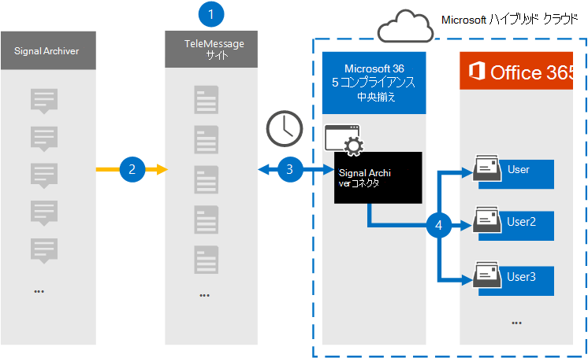

# シグナル通信データをアーカイブするコネクタを設定する

Microsoft Purview コンプライアンス ポータルの TeleMessage コネクタを使用して、Signal チャット、添付ファイル、ファイル、削除されたメッセージと通話をインポートおよびアーカイブします。 コネクタを設定して構成すると、組織の TeleMessage アカウントに接続され、TeleMessage Signal Archiver を使用して従業員のモバイル通信が Microsoft 365 のメールボックスにインポートされます。

Signal Archiver コネクタ データがユーザー メールボックスに格納された後、訴訟ホールド、コンテンツ検索、Microsoft 365 アイテム保持ポリシーなどの Microsoft Purview 機能を Signal Communication データに適用できます。 たとえば、コンテンツ検索を使用してシグナル通信を検索したり、Signal Archiver コネクタ データを含むメールボックスを電子情報開示 (Premium) ケースのカストディアンに関連付けることができます。 Signal Archiver コネクタを使用して Microsoft 365 のデータをインポートおよびアーカイブすると、組織が企業ガバナンス規制や規制ポリシーに準拠し続けることができます。

## シグナル通信データのアーカイブの概要

次の概要では、コネクタを使用して Microsoft 365 でシグナル通信データをアーカイブするプロセスについて説明します。

1. 組織は TeleMessage と連携して Signal Archiver コネクタを設定します。 詳細については、「 [Microsoft 365 用 TeleMessage Signal Archiver のアクティブ化」を](https://www.telemessage.com/microsoft-365-activation-for-signal-archiver/)参照してください。

2. リアルタイムで、組織の Signal データが TeleMessage サイトにコピーされます。

3. コンプライアンス ポータルで作成した Signal Archiver コネクタは、毎日 TeleMessage サイトに接続し、前の 24 時間のメール メッセージを Microsoft Cloud のセキュリティで保護された Azure Storage 領域に転送します。

4. コネクタは、モバイル通信アイテムを特定のユーザーのメールボックスにインポートします。 Signal Archiver という名前の新しいフォルダーが特定のユーザーのメールボックスに作成され、アイテムがインポートされます。 コネクタは、 *ユーザーの電子メール アドレス* プロパティの値を使用してマッピングを行います。 すべての電子メール メッセージには、このプロパティが含まれています。このプロパティには、電子メール メッセージのすべての参加者の電子メール アドレスが設定されます。

   *ユーザーの電子メール アドレス* プロパティの値を使用した自動ユーザー マッピングに加えて、CSV マッピング ファイルをアップロードしてカスタム マッピングを定義することもできます。 このマッピング ファイルには、ユーザーの携帯電話番号と、各ユーザーの対応する Microsoft 365 メールボックス アドレスが含まれている必要があります。 自動ユーザー マッピングを有効にし、カスタム マッピングを指定する場合は、すべての電子メール アイテムについて、コネクタが最初にカスタム マッピング ファイルを確認します。 ユーザーの携帯電話番号に対応する有効な Microsoft 365 ユーザーが見つからない場合、コネクタは電子メール アイテムのユーザーの電子メール アドレス プロパティを使用します。 カスタム マッピング ファイルまたは電子メール アイテムのユーザーの *電子メール アドレス* プロパティで有効な Microsoft 365 ユーザーがコネクタで見つからない場合、アイテムはインポートされません。

## コネクタを設定する前に

- [TeleMessage から Signal Archiver サービス](https://www.telemessage.com/mobile-archiver/order-mobile-archiver-for-o365/)を注文し、組織の有効な管理アカウントを取得します。 コンプライアンス センターでコネクタを作成するときは、このアカウントにサインインする必要があります。

- Signal アーカイブを必要とするすべてのユーザーを TeleMessage アカウントに登録します。 ユーザーを登録するときは、Microsoft 365 アカウントで使用されているのと同じメール アドレスを使用してください。

- Signal Archiver アプリを従業員の携帯電話にインストールし、アクティブ化します。 Signal Archiver アプリを使用すると、他の Signal ユーザーと通信したりチャットしたりできます。

- 手順 3 で Signal Archiver コネクタを作成するユーザーには、Data Connector 管理 ロールを割り当てる必要があります。 このロールは、コンプライアンス ポータルの **[データ コネクタ** ] ページでコネクタを追加するために必要です。 このロールは、既定で複数の役割グループに追加されます。 これらの役割グループの一覧については、「セキュリティ & コンプライアンス センターのアクセス許可」の「 [セキュリティとコンプライアンス センターの](../security/office-365-security/permissions-in-the-security-and-compliance-center.md#roles-in-the-security--compliance-center)ロール」セクションを参照してください。 または、組織内の管理者がカスタムロール グループを作成し、Data Connector 管理ロールを割り当ててから、適切なユーザーをメンバーとして追加することもできます。 手順については、[Microsoft Purview コンプライアンス ポータルのアクセス許可](microsoft-365-compliance-center-permissions.md#create-a-custom-role-group)の「カスタム ロール グループの作成」セクションを参照してください。

- この TeleMessage データ コネクタは、Microsoft 365 US Government クラウドの GCC 環境で使用できます。 サード パーティのアプリケーションとサービスには、Microsoft 365 インフラストラクチャの外部にあり、Microsoft Purview およびデータ保護コミットメントの対象外であるサード パーティ システムに対する組織の顧客データの保存、送信、処理が含まれる場合があります。 Microsoft は、この製品を使用してサード パーティ製アプリケーションに接続することは、これらのサードパーティ アプリケーションが FEDRAMP に準拠していることを意味することを示しません。

## Signal Archiver コネクタを作成する

前のセクションで説明した前提条件を完了したら、コンプライアンス ポータルで Signal Archiver コネクタを作成できます。 コネクタは、指定した情報を使用して TeleMessage サイトに接続し、Signal 通信データを Microsoft 365 の対応するユーザー メールボックス ボックスに転送します。

1. **[データ コネクタ** > **] の [Signal Archiver**] に<https://compliance.microsoft.com>移動してクリックします。

2. **Signal Archiver** 製品の説明ページで、[**コネクタの追加**] をクリックします。

3. [利用規約] ページ **で** 、[ **同意** する] をクリックします。

4. [ **TeleMessage へのログイン** ] ページの [手順 3] で、次のボックスに必要な情報を入力し、[ **次へ**] をクリックします。

    - **名：** TeleMessage ユーザー名。

    - **パスワード：** TeleMessage のパスワード。

5. コネクタが作成されたら、ポップアップ ウィンドウを閉じて次のページに移動できます。

6. [ **ユーザー マッピング** ] ページで、自動ユーザー マッピングを有効にします。 カスタム マッピングを有効にするには、ユーザー マッピング情報を含む CSV ファイルをアップロードし、[ **次へ**] をクリックします。

7. 設定を確認し、[ **完了]** をクリックしてコネクタを作成します。

8. **[データ コネクタ**] ページの [コネクタ] タブに移動して、新しいコネクタのインポート プロセスの進行状況を確認します。

## 既知の問題

- 現時点では、10 MB を超える添付ファイルやアイテムのインポートはサポートされていません。 より大きなアイテムのサポートは、後日提供される予定です。
