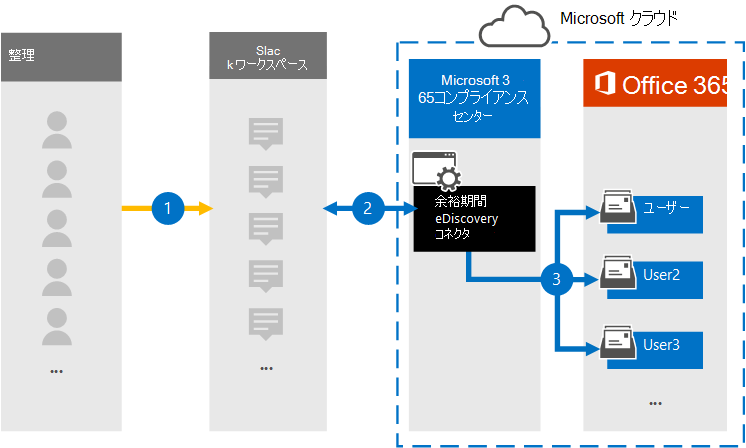

# Slack 電子情報開示データをアーカイブするコネクタをセットアップする (プレビュー)

Microsoft が提供する Slack 電子情報開示データ コネクタを使用すると、インスタント メッセージング データ (メッセージ、添付ファイル、リンク、リビジョンなど) を組織の Slack ワークスペースから Microsoft 365 にインポートおよびアーカイブできます。 データ コネクタは、Slack API からデータを取得し、それを電子メール メッセージ形式に変換し、それらのアイテムをユーザー のメールボックスにインポートMicrosoft 365。 Slack データをインポートした後、訴訟ホールド、Advanced eDiscovery、コミュニケーションコンプライアンス、保持設定などのコンプライアンス ソリューションを Slack コンテンツに適用できます。 Slack の電子情報開示データ コネクタを使用して、Microsoft 365データをインポートおよびアーカイブすると、組織が政府機関および規制ポリシーに準拠しつ付けるのに役立ちます。

## Slack 電子情報開示データのアーカイブの概要

次の概要では、Microsoft データ コネクタを使用して Slack データをアーカイブするプロセスについて説明Microsoft 365。

1. 組織は Slack を使用して Slack ワークスペースを設定および構成します。

2. データ コネクタをセットアップすると、組織の Slack ワークスペースからのメッセージが、組織のユーザー メールボックスにコピー Microsoft 365。 また、データ コネクタは、チャット メッセージの内容を電子メール メッセージ形式に変換します。

3. コネクタは、変換されたチャット メッセージを特定のユーザーのメールボックスにインポートします。 **Slack eDiscovery** という名前の受信トレイ フォルダー内のサブフォルダーがユーザー メールボックスに作成され、チャット メッセージ アイテムがそのフォルダーにインポートされます。

## コネクタをセットアップする前に

- 組織では、Slack Enterprise Grid サブスクリプションが必要です。 詳細については、「Slack サブスクリプションと [機能」を参照してください](https://slack.com/intl/en-gb/help/articles/115003205446-Slack-subscriptions-and-features-)。

- データ コネクタを作成するユーザーには、Slack 組織の **組織の組織** 所有者アプリケーションの役割が割り当てられている必要があります。 詳細については、「Slack の [役割の種類」を参照してください](https://slack.com/intl/en-gb/help/articles/360018112273-Types-of-roles-in-Slack)。

- 組織の Slack エンタープライズ アカウントのユーザー名とパスワードを取得します。 これらの資格情報を使用して、データ コネクタを作成するときにこのアカウントにサインインします。 また、Slack 組織でシングル サインオン (SSO) を使用するように構成された自動ユーザー プロビジョニングを行う必要があります。 [セキュリティ コンプライアンス センター&役割](../security/office-365-security/permissions-in-the-security-and-compliance-center.md#roles-in-the-security--compliance-center)

- Slack 電子情報開示コネクタを作成するユーザーには、データ コネクタ管理者の役割が割り当てられている必要があります。 この役割は、データ コネクタ ページの [データ  コネクタ] ページにコネクタを追加Microsoft 365 コンプライアンス センター。 この役割は、既定で複数の役割グループに追加されます。 これらの役割グループの一覧については、「セキュリティ とコンプライアンス センターのアクセス許可」の「セキュリティとコンプライアンス センターの役割& [してください](../security/office-365-security/permissions-in-the-security-and-compliance-center.md#roles-in-the-security--compliance-center)。 または、組織内の管理者がカスタム役割グループを作成し、データ コネクタ管理者の役割を割り当て、適切なユーザーをメンバーとして追加することもできます。 手順については、「アクセス許可」の「カスタム役割グループを作成する」[セクションを参照Microsoft 365 コンプライアンス センター](microsoft-365-compliance-center-permissions.md#create-a-custom-role-group)。

## 手順 1: Slack 電子情報開示コネクタを作成する

1. 左側のナビゲーション <https://compliance.microsoft.com> ウィンドウ **で [データ コネクタ]** に移動してクリックします。

2. [概要] **タブで** 、[フィルター] **をクリック** して [ **Microsoft] を選択** し、フィルターを適用します。

3. [ **Slack 電子情報開示 ](プレビュー)をクリックします**。

4. Slack 電子 **情報開示 (プレビュー) 製品の説明ページ** で、[コネクタの追加] **をクリックします**。

5. [サービス条件 **ウィザード] ページで、[** 同意する] を **クリックします**。

6. コネクタを識別する一意の名前を入力し、[次へ] を **クリックします**。 入力した名前は、作成後に [データ コネクタ] **ページのコネクタ** を識別します。

## 手順 2: Slack 組織にサインインする

1. [Slack に **サインイン] ウィザード ページで** 、[ **Slack** にサインイン] をクリックして組織の Slack ワークスペースにサインインします。

2. [Slack **Sign to your workspace]** ページで、データをアーカイブするワークスペースの名前を入力し、[続行] をクリック **します**。

   Slack ワークスペースの名前とサインインのプロンプトが表示されたページが表示されます。

3. [組織の所有者がサインインできる] という文字列 **のリンクをクリックします**。

4. [ワークスペース サインイン] ページで、組織の Slack エンタープライズ アカウントのメール アドレスとパスワードを入力し、[サインイン] **をクリックします**。

   正常にサインインすると、コネクタ アプリによって Slack 組織にアクセスするためのアクセス許可を要求するページが表示されます。

5. [ **許可] を** クリックして、アプリによる組織の管理を許可します。

   [許可] **をクリック** すると、Slack ページが閉じ、コネクタ ウィザードMicrosoft 365に Slack 電子情報開示ユーザーをマップするページが表示されます。

## 手順 3: ユーザーをマップし、インポートするデータ型を選択する

1. Slack ユーザーを自分のメールボックスにマップするために、次のオプションの 1 つMicrosoft 365構成します。

   - **自動ユーザー マッピング**。 Slack ユーザー名をメールボックスに自動的にマップするには、このMicrosoft 365選択します。 コネクタは、すべての Slack メッセージまたはアイテムに含まれる *Email* プロパティの値を使用して行います。 このプロパティには、メッセージのすべての参加者の電子メール アドレスが設定されます。 コネクタが対応するユーザーに電子メール アドレスを関連Microsoft 365場合、アイテムはそれらのユーザーの Microsoft 365メールボックスにインポートされます。 このオプションを使用するには、Slack 組織用に SSO が構成されている必要があります。

   - **カスタム ユーザー マッピング**。 また、自動ユーザー マッピングの代わりに(またはそれに加えて)カスタム ユーザー マッピングを使用することもできます。 このオプションでは、ユーザーの Slack メンバー ID を自分のメール アドレスにマップする CSV ファイルを作成Microsoft 365する必要があります。 これを行うには、[**CSV** マッピング テンプレートのダウンロード] をクリックし、組織内のすべてのユーザーの Slack メンバー ID と Microsoft 365 メール アドレスを CSV ファイルに入力し、CSV ファイルを選択してウィザードにアップロードします。 CSV ファイル内の列見出しは必ず変更してください。 CSV マッピング ファイルの例を次に示します。

     |**ExternalUserId**  | **O365UserMailbox**   |
     |:-------------------|:-----------------------|
     | U01MDTF0QV6        | alexjones@contoso.onmicrosoft.com |
     | U02MDTF1RW7| pilarp@contoso.onmicrosoft.com|
     | U03MDTF2SX8 | sarad@contoso.onmicrosoft.com|
     |||

   > [!TIP]
   > ユーザーのメンバーの ID は、..をクリックすると取得できます。ユーザーのプロファイルの [その他] ボタンをクリックし、[メンバー **ID のコピー] を選択します**。 また、Slack [users.list API](https://api.slack.com/methods/users.list) メソッドを使用して、Slack チームのすべてのメンバーの ID を取得することもできます。

   自動ユーザー マッピングを有効にしてカスタム マッピング ファイルを提供する場合、コネクタは最初にカスタム マッピング ファイルを参照して Slack ユーザーを特定のメールボックスMicrosoft 365します。 Slack ユーザーに対応する有効なユーザー Microsoft 365コネクタが見つからなかった場合、コネクタは Slack アイテムの *Email* プロパティを使用します。 カスタム マッピング ファイルまたはメッセージ アイテムの email プロパティMicrosoft 365有効なユーザーがコネクタに見つからなかった場合、アイテムはインポートされません。

2. [インポート **するデータ型の選択] ウィザード ページ** で、インポートする Slack データ型を選択します。 すべてのチャネルからメッセージをインポートする場合は、すべてのオプションを選択します。 それ以外の場合は、インポートするデータ型のみを選択します。

     Slack メッセージに加えて、他の種類の Slack コンテンツを指定して、ユーザーにインポートMicrosoft 365。 

3. インポートするデータ型を構成したら、[次へ] をクリック **し、コネクタ** の設定を確認し、[ **完了** ] をクリックしてコネクタを作成します。

## 手順 4: Slack 電子情報開示コネクタを監視する

Slack 電子情報開示コネクタを作成した後、コネクタの状態を [メール] Microsoft 365 コンプライアンス センター。

1. 左側のナビゲーション [https://compliance.microsoft.com](https://compliance.microsoft.com/) で [ **データ コネクタ] に** 移動してクリックします。

2. [コネクタ **] タブをクリック** し、 **Slack 電子** 情報開示コネクタを選択して、コネクタのプロパティと情報を含むフライアウト ページを表示します。

3. [**ソースを含むコネクタの** 状態] で、[ログのダウンロード] リンクをクリックして、コネクタの状態ログを開く (または保存) します。 このログには、Microsoft クラウドにインポートされたデータが含まれます。

## 既知の問題

- 現時点では、10 MB を超える添付ファイルやアイテムのインポートはサポートされていません。 大きいアイテムのサポートは、後日利用できます。
