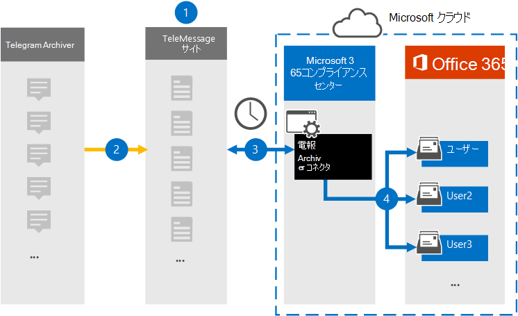

# テレグラム通信データをアーカイブするコネクタをセットアップするSet up a connector to archive Telegram communications data

テレグラム チャット、添付ファイル、ファイル、および削除されたメッセージと呼び出しをインポートおよびアーカイブするには、Microsoft 365 コンプライアンス センターの TeleMessage コネクタを使用します。Use the TeleMessage connector in the Microsoft 365 compliance center to import and archive Telegram chats, attachments, files, and deleted messages and calls. コネクタを設定して構成すると、そのコネクタは組織の TeleMessage アカウントに接続し、テレグラム アーカイブを使用する従業員のモバイル通信を Microsoft 365 のメールボックスにインポートします。After you set up and configure a connector, it connects to your organization's TeleMessage account, and imports the mobile communication of employees using the Telegram Archiver to mailboxes in Microsoft 365.

Telegram Archiver コネクタ データをユーザー メールボックスに格納した後、訴訟ホールド、コンテンツ検索、Microsoft 365 保持ポリシーなどの Microsoft 365 コンプライアンス機能をテレグラム通信データに適用できます。After Telegram Archiver connector data is stored in user mailboxes, you can apply Microsoft 365 compliance features such as Litigation Hold, Content search, and Microsoft 365 retention policies to Telegram communication data. たとえば、コンテンツ検索を使用してテレグラム通信を検索したり、Telegram Archiver コネクタ データを含むメールボックスを保管担当者に関連付Advanced eDiscoveryできます。For example, you can search Telegram communication using Content Search or associate the mailbox that contains the Telegram Archiver connector data with a custodian in an Advanced eDiscovery case. Telegram Archiver コネクタを使用してデータをインポートおよびアーカイブMicrosoft 365、組織がコーポレート ガバナンス規制や規制ポリシーに準拠しつ付けるのに役立ちます。Using a Telegram Archiver connector to import and archive data in Microsoft 365 can help your organization stay compliant with corporate governance regulations and regulatory policies.

## テレグラム通信データのアーカイブの概要Overview of archiving Telegram communications data

次の概要では、コネクタを使用してテレグラム通信データをアーカイブするプロセスについて説明Microsoft 365。The following overview explains the process of using a connector to archive  Telegram communications data in Microsoft 365.

1. 組織は TeleMessage と一緒にテレグラム アーカイブ コネクタをセットアップします。Your organization works with TeleMessage to set up a Telegram Archiver connector. 詳細については[、「TeleMessage Telegram Archiver for the TeleMessage Archiver](https://www.telemessage.com/microsoft-365-activation-for-telegram-archiver/)for Microsoft 365」 を参照してください。For more information, see [Activating the TeleMessage Telegram Archiver for Microsoft 365](https://www.telemessage.com/microsoft-365-activation-for-telegram-archiver/).

2. リアルタイムで、組織の Telegram データが TeleMessage サイトにコピーされます。In real time, your organization's Telegram data is copied to the TeleMessage site.

3. Microsoft 365 コンプライアンス センター で作成した Telegram Archiver コネクタは、毎日 TeleMessage サイトに接続し、過去 24 時間の電子メール メッセージを Microsoft Cloud の安全な Azure Storage 領域に転送します。The Telegram Archiver connector that you create in the Microsoft 365 compliance center connects to the TeleMessage site every day and transfers the email messages from the previous 24 hours to a secure Azure Storage area in the Microsoft Cloud.

4. コネクタは、モバイル通信アイテムを特定のユーザーのメールボックスにインポートします。The connector imports the mobile communication items to the mailbox of a specific user. Telegram Archiver という名前の新しいフォルダーが特定のユーザーのメールボックスに作成され、アイテムがインポートされます。A new folder named Telegram Archiver will be created in the specific user's mailbox and the items will be imported to it. コネクタは、User の [電子メール アドレス] プロパティの値を使用して *、このマッピングを実行* します。The connector does this mapping by using the value of the *User's Email address* property. すべての電子メール メッセージには、このプロパティが含まれるので、電子メール メッセージのすべての参加者の電子メール アドレスが設定されます。Every email message contains this property, which is populated with the email address of every participant of the email message.

> *User* の [電子メール アドレス] プロパティの値を使用した自動ユーザー マッピングに加えて、CSV マッピング ファイルをアップロードしてカスタム マッピングを定義できます。In addition to automatic user mapping using the value of the *User's Email address* property, you can also define a custom mapping by uploading a CSV mapping file. このマッピング ファイルには、ユーザーのモバイル番号と、各ユーザー Microsoft 365対応するメールボックス アドレスが含まれている必要があります。This mapping file should contain User's mobile Number and the corresponding Microsoft 365 mailbox address for each user. 自動ユーザー マッピングを有効にしてカスタム マッピングを提供する場合、すべての電子メール アイテムについて、コネクタは最初にカスタム マッピング ファイルを確認します。If you enable automatic user mapping and provide a custom mapping, for every email item the connector will first look at custom mapping file. ユーザーの携帯電話番号に対応する有効な Microsoft 365 ユーザーが見つからなかった場合、コネクタは電子メール アイテムのユーザーの電子メール アドレス プロパティを使用します。If it doesn't find a valid Microsoft 365 user that corresponds to a user's mobile number, the connector will use the User ‘s email address property of the email item. コネクタがカスタム マッピング ファイルまたは電子メール アイテムのユーザーの電子メール アドレス プロパティに有効な Microsoft 365 ユーザーを見つからなかった場合、アイテムはインポートされません。If the connector doesn't find a valid Microsoft 365 user in either the custom mapping file or the *user's email address* property of the email item, the item won't be imported.

## コネクタをセットアップする前にBefore you set up a connector

- [Telegram アーカイブ サービスを TeleMessage から注文し](https://www.telemessage.com/mobile-archiver/order-mobile-archiver-for-o365/)、組織の有効な管理アカウントを取得します。Order the [Telegram archiving service from TeleMessage](https://www.telemessage.com/mobile-archiver/order-mobile-archiver-for-o365/) and get a valid administration account for your organization. コンプライアンス センターでコネクタを作成する場合は、このアカウントにサインインする必要があります。You'll need to sign into this account when you create the connector in the compliance center.

- TeleMessage アカウントで Telegram アーカイブが必要なすべてのユーザーを登録します。Register all users that require Telegram archiving in the TeleMessage account. ユーザーを登録する場合は、ユーザーのアカウントに使用するメール アドレスと同じMicrosoft 365してください。When registering users, be sure to use the same email address that's used for their Microsoft 365 account.

- 従業員の携帯電話に Telegram Archiver アプリをインストールし、アクティブ化します。Install the Telegram Archiver app on the mobile phones of your employees and activate it. Telegram Archiver アプリを使用すると、他の Telegram ユーザーと通信してチャットできます。The Telegram Archiver app allows them to communicate and chat with other Telegram users.

- 手順 3 で Telegram Archiver コネクタを作成するユーザーには、メールボックスのインポート エクスポートの役割が割り当てられている必要Exchange Online。The user who creates a Telegram Archiver connector in Step 3 must be assigned the Mailbox Import Export role in Exchange Online. これは、データ コネクタ ページの[データ コネクタ] ページにコネクタを追加Microsoft 365 コンプライアンス センター。This is required to add connectors in the **Data connectors** page in the Microsoft 365 compliance center. 既定では、この役割は Exchange Online のどの役割グループにも割り当てられていません。By default, this role isn't assigned to any role group in Exchange Online. [メールボックスのインポートエクスポート] 役割は、組織の [組織の管理] 役割グループに追加Exchange Online。You can add the Mailbox Import Export role to the Organization Management role group in Exchange Online. または、役割グループを作成し、メールボックスインポートエクスポートの役割を割り当て、適切なユーザーをメンバーとして追加できます。Or you can create a role group, assign the Mailbox Import Export role, and then add the appropriate users as members. 詳細については、「グループ内の[役割グループを](/Exchange/permissions-exo/role-groups#create-role-groups)管理する」の「役割グループの作成」または「役割グループの変更」セクションを参照Exchange Online。For more information, see the [Create role groups](/Exchange/permissions-exo/role-groups#create-role-groups) or [Modify role groups](/Exchange/permissions-exo/role-groups#modify-role-groups) sections in the article "Manage role groups in Exchange Online".

## テレグラム アーカイブ コネクタの作成Create a Telegram Archiver connector

前のセクションで説明した前提条件を完了したら、次のセクションで Telegram Archiver コネクタを作成Microsoft 365 コンプライアンス センター。After you've completed the prerequisites described in the previous section, you can create the Telegram Archiver connector in the Microsoft 365 compliance center. コネクタは、指定した情報を使用して、TeleMessage サイトに接続し、テレグラム通信データをネットワーク内の対応するユーザー メールボックス ボックスに転送Microsoft 365。The connector uses the information you provide to connect to the TeleMessage site and transfers Telegram communications data to the corresponding user mailbox boxes in Microsoft 365.

1. [T <https://compliance.microsoft.com> **elegram Archiver]** の [**データ**>] をクリックします。Go to <https://compliance.microsoft.com> and then click **Data connectors** > T **elegram Archiver**.

2. **[Telegram Archiver 製品の説明] ページ** で、[コネクタの追加]**をクリックします**。On the **Telegram Archiver** product description page, click **Add connector**.

3. [サービス条件 **] ページで、[** 同意する] を **クリックします**。On the **Terms of service** page, click **Accept**.

4. **[TeleMessage へのログイン]** ページの [手順 3] で、次のボックスに必要な情報を入力し、[次へ] を **クリックします**。On the **Login to TeleMessage** page, under Step 3, enter the required information in the following boxes and then click **Next**.

    - **ユーザー名:** TeleMessage ユーザー名。**Username:** Your TeleMessage username.

    - **パスワード:** TeleMessage パスワード。**Password:** Your TeleMessage password.

5. コネクタを作成したら、ポップアップ ウィンドウを閉じて次のページに移動できます。After the connector is created, you can close the pop-up window and go to the next page.

6. [ユーザー マッピング **] ページで** 、自動ユーザー マッピングを有効にする。On the **User mapping** page, enable automatic user mapping. カスタム マッピングを有効にするには、ユーザー マッピング情報を含む CSV ファイルをアップロードし、[次へ] を **クリックします**。To enable custom mapping, upload a CSV file that contains the user mapping information, and then click **Next**.

7. 設定を確認し、[完了] を **クリックして** コネクタを作成します。Review your settings, and then click **Finish** to create the connector.

8. [データ コネクタ] ページの [コネクタ] **タブに移動** して、新しいコネクタのインポート プロセスの進行状況を確認します。Go to the Connectors tab in **Data connectors** page to see the progress of the import process for the new connector.

## 既知の問題Known issues

- 現時点では、10 MB を超える添付ファイルやアイテムのインポートはサポートされていません。At this time, we don't support importing attachments or items that are larger than 10 MB. 大きいアイテムのサポートは、後日利用できます。Support for larger items will be available at a later date.
