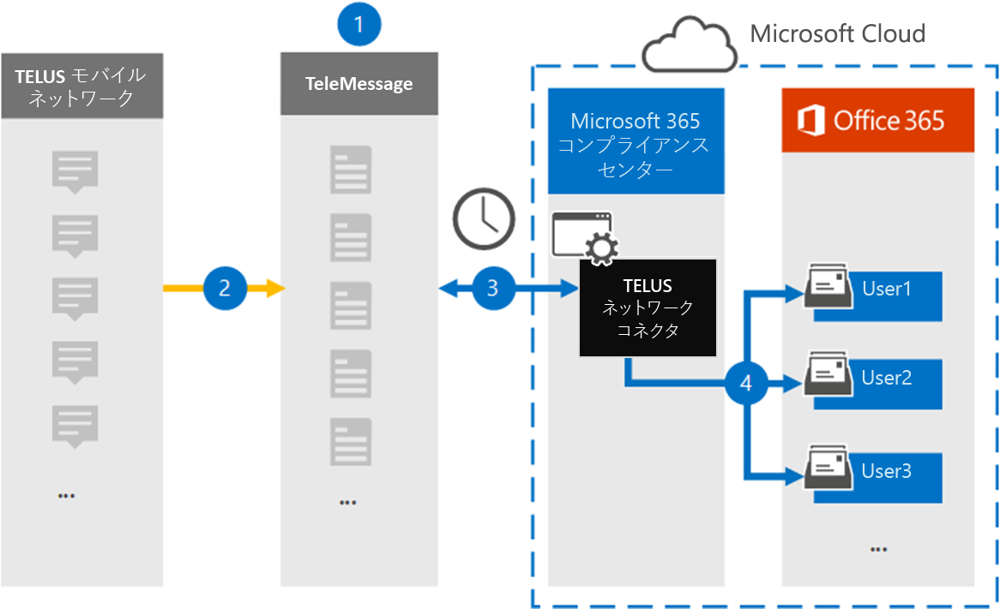

# TELUS ネットワーク データをアーカイブするコネクタをセットアップするSet up a connector to archive TELUS Network data

Microsoft 365 コンプライアンス センターの TeleMessage コネクタを使用して、組織の TELUS ネットワークからショート メッセージング サービス (SMS) データをインポートおよびアーカイブします。Use the TeleMessage connector in the Microsoft 365 compliance center to import and archive Short Messaging Service (SMS) data from your organization's TELUS Network. コネクタをセットアップして構成した後、組織の TELUS ネットワークに毎日 1 回接続し、SMS データを Microsoft 365 のメールボックスにインポートします。After you set up and configure a connector, it connects to your organization's TELUS Network once every day, and imports SMS data to mailboxes in Microsoft 365.

SMS メッセージをユーザー メールボックスに保存した後、訴訟ホールド、コンテンツ検索、Microsoft 365 保持ポリシーなどの Microsoft 365 コンプライアンス機能を TELUS データに適用できます。After SMS messages are stored in user mailboxes, you can apply Microsoft 365 compliance features such as Litigation Hold, Content Search, and Microsoft 365 retention policies to TELUS data. たとえば、コンテンツ検索を使用して TELUS SMS メッセージを検索したり、高度な電子情報開示ケースで TELUS データを含むメールボックスを保管担当者に関連付けできます。For example, you can search TELUS SMS messages using Content Search or associate the mailbox that contains the TELUS data with a custodian in an Advanced eDiscovery case. TELUS ネットワーク コネクタを使用して Microsoft 365 のデータをインポートおよびアーカイブすると、組織が政府機関および規制ポリシーに準拠しつ付けるのに役立ちます。Using a TELUS Network connector to import and archive data in Microsoft 365 can help your organization stay compliant with government and regulatory policies.

## TELUS ネットワーク データのアーカイブの概要Overview of archiving TELUS Network data

次の概要では、コネクタを使用して Microsoft 365 の TELUS Network データをアーカイブするプロセスについて説明します。The following overview explains the process of using a connector to archive TELUS Network data in Microsoft 365.

1. 組織は、TeleMessage と TELUS を使用して TELUS ネットワーク コネクタをセットアップします。Your organization works with TeleMessage and TELUS to set up a TELUS Network connector. 詳細については [、「TELUS Network Archiver」を参照してください](https://www.telemessage.com/office365-activation-for-telus-network-archiver/)。For more information, see [TELUS Network Archiver](https://www.telemessage.com/office365-activation-for-telus-network-archiver/).

2. 24 時間に 1 回、組織の TELUS ネットワークからの SMS メッセージが TeleMessage サイトにコピーされます。Once every 24 hours, SMS messages from your organization’s TELUS Network are copied to the TeleMessage site.

3. Microsoft 365 コンプライアンス センターで作成した TELUS ネットワーク コネクタは、毎日 TeleMessage サイトに接続し、過去 24 時間の SMS メッセージを Microsoft Cloud の安全な Azure Storage の場所に転送します。The TELUS Network connector that you create in the Microsoft 365 compliance center connects to the TeleMessage site every day and transfers the SMS messages from the previous 24 hours to a secure Azure Storage location in the Microsoft Cloud. また、コネクタは SMS メッセージのコンテンツを電子メール メッセージ形式に変換します。The connector also converts the content of SMS messages to an email message format.

4. コネクタは、モバイル通信アイテムを特定のユーザーのメールボックスにインポートします。The connector imports the mobile communication items to the mailbox of a specific user. **TELUS SMS Network Archiver** という名前の新しいフォルダーが特定のユーザーのメールボックスに作成され、アイテムがインポートされます。A new folder named **TELUS SMS Network Archiver** is created in the specific user's mailbox and the items are imported to it. コネクタは、User の [電子メール アドレス] プロパティの値を使用 *してマッピングを行* います。The connector does mapping by using the value of the *User’s Email address* property. すべての SMS メッセージには、このプロパティが含まれるので、SMS メッセージのすべての参加者の電子メール アドレスが設定されます。Every SMS message contains this property, which is populated with the email address of every participant of the SMS message.

   *User* の [電子メール アドレス] プロパティの値を使用した自動ユーザー マッピングに加えて、CSV マッピング ファイルをアップロードしてカスタム マッピングを実装できます。In addition to automatic user mapping using the value of the *User’s Email address* property, you can also implement custom mapping by uploading a CSV mapping file. このマッピング ファイルには、組織内のユーザーの携帯電話番号と対応する Microsoft 365 メール アドレスが含まれる。This mapping file contains the mobile phone number and corresponding Microsoft 365 email address for users in your organization. 自動ユーザー マッピングとカスタム マッピングの両方を有効にした場合、すべての TELUS アイテムについて、コネクタは最初にカスタム マッピング ファイルを参照します。If you enable both automatic user mapping and custom mapping, for every TELUS item the connector first looks at custom mapping file. ユーザーの携帯電話番号に対応する有効な Microsoft 365 ユーザーが見つからなかった場合、コネクタはインポートしようとしているアイテムの電子メール アドレス プロパティの値を使用します。If it doesn't find a valid Microsoft 365 user that corresponds to a user's mobile phone number, the connector will use the values in the email address property of the item it's trying to import. コネクタがカスタム マッピング ファイルまたは TELUS アイテムのメール アドレス プロパティに有効な Microsoft 365 ユーザーを見つからなかった場合、アイテムはインポートされません。If the connector doesn't find a valid Microsoft 365 user in either the custom mapping file or in the email address property of the TELUS item, the item won't be imported.

## はじめにBefore you begin

TELUS Network データのアーカイブに必要な実装手順の一部は、Microsoft 365 の外部であり、コンプライアンス センターにコネクタを作成する前に完了する必要があります。Some of the implementation steps required to archive TELUS Network data are external to Microsoft 365 and must be completed before you can create a connector in the compliance center.

- [TeleMessage から TELUS Network Archiver サービス](https://www.telemessage.com/mobile-archiver/order-mobile-archiver-for-o365)を注文し、組織の有効な管理アカウントを取得します。Order the [TELUS Network Archiver service from TeleMessage](https://www.telemessage.com/mobile-archiver/order-mobile-archiver-for-o365) and get a valid administration account for your organization. コンプライアンス センターでコネクタを作成する場合は、このアカウントにサインインする必要があります。You'll need to sign into this account when you create the connector in the compliance center.

- TELUS ネットワーク アカウントと請求連絡先の詳細を取得して、TeleMessage オンボーディング フォームに入力し、TELUS からメッセージ アーカイブ サービスを注文できます。Obtain your TELUS Network account and billing contact details so you can fill-out the TeleMessage onboarding forms and order the message archiving service from TELUS.

- TELUS SMS ネットワークのアーカイブを必要とするすべてのユーザーを TeleMessage アカウントに登録します。Register all users that require TELUS SMS Network archiving in the TeleMessage account. ユーザーを登録する場合は、Microsoft 365 アカウントに使用されているのと同じメール アドレスを使用してください。When registering users, be sure to use the same email address that's used for their Microsoft 365 account.

- 従業員がTELUS モバイル ネットワーク上に企業所有および企業責任を持つ携帯電話を持っている必要があります。Your employees must have corporate-owned and corporate-liable mobile phones on theTELUS mobile network. Microsoft 365 のアーカイブ メッセージは、従業員が所有するデバイスまたは自分のデバイスを持ち込む (BYOD) デバイスでは使用できません。Archiving messages in Microsoft 365 isn't available for employee-owned or Bring Your Own Devices (BYOD) devices.

- TELUS ネットワーク コネクタを作成するユーザーには、Exchange Online のメールボックスインポートエクスポートの役割が割り当てられている必要があります。The user who creates a TELUS Network connector must be assigned the Mailbox Import Export role in Exchange Online. これは、Microsoft 365 コンプライアンス センターの **[** データ コネクタ] ページにコネクタを追加するために必要です。This is required to add connectors in the **Data connectors** page in the Microsoft 365 compliance center. 既定では、この役割は Exchange Online のどの役割グループにも割り当てられていません。By default, this role isn't assigned to any role group in Exchange Online. Exchange Online の [組織の管理] 役割グループにメールボックスインポートエクスポート役割を追加できます。You can add the Mailbox Import Export role to the Organization Management role group in Exchange Online. または、役割グループを作成し、メールボックスインポートエクスポートの役割を割り当て、適切なユーザーをメンバーとして追加できます。Or you can create a role group, assign the Mailbox Import Export role, and then add the appropriate users as members. 詳細については、「Exchange Online[で役割](/Exchange/permissions-exo/role-groups#create-role-groups)グループを管理する」の記事の「役割グループの作成」または「役割グループの変更」セクションを参照してください。For more information, see the [Create role groups](/Exchange/permissions-exo/role-groups#create-role-groups) or [Modify role groups](/Exchange/permissions-exo/role-groups#modify-role-groups) sections in the article "Manage role groups in Exchange Online".

## TELUS ネットワーク コネクタの作成Create a TELUS Network connector

前のセクションで説明した前提条件を完了したら、Microsoft 365 コンプライアンス センターで TELUS Network コネクタを作成できます。After you've completed the prerequisites described in the previous section, you can create TELUS Network connector in the Microsoft 365 compliance center. コネクタは、指定した情報を使用して、TeleMessage サイトに接続し、SMS メッセージを Microsoft 365 の対応するユーザー メールボックス ボックスに転送します。The connector uses the information you provide to connect to the TeleMessage site and transfer SMS messages to the corresponding user mailbox boxes in Microsoft 365.

1. [データ コネクタ [https://compliance.microsoft.com](https://compliance.microsoft.com/) TELUS ネットワーク] に移動し、[データ **コネクタ**  >  **] をクリックします**。Go to [https://compliance.microsoft.com](https://compliance.microsoft.com/) and then click **Data connectors** > **TELUS Network**.

2. **[TELUS ネットワーク製品の説明]** ページで、[コネクタの追加]**をクリックします。**On the **TELUS Network** product description page, click **Add connector**

3. [サービス条件 **] ページで、[** 同意する] を **クリックします**。On the **Terms of service** page, click **Accept**.

4. **[TeleMessage へのログイン]** ページの [手順 3] で、次のボックスに必要な情報を入力し、[次へ] を **クリックします**。On the **Login to TeleMessage** page, under Step 3, enter the required information in the following boxes and then click **Next**.

   - **ユーザー名:** TeleMessage ユーザー名。**Username:** Your TeleMessage username.

   - **パスワード:** TeleMessage パスワード。**Password:** Your TeleMessage password.

5. コネクタを作成したら、ポップアップ ウィンドウを閉じて次のページに移動できます。After the connector is created, you can close the pop-up window and go to the next page.

6. [ユーザー マッピング **] ページで** 、自動ユーザー マッピングを有効にして、[次へ] を **クリックします**。On the **User mapping** page, enable automatic user mapping and click **Next**. カスタム マッピングが必要な場合は、CSV ファイルをアップロードし、[次へ] を **クリックします**。In case you need custom mapping upload a CSV file, and click **Next**.

7. 設定を確認し、[完了] を **クリックして** コネクタを作成します。Review your settings, and then click **Finish** to create the connector.

8. [データ コネクタ] ページの [コネクタ] **タブに移動** して、新しいコネクタのインポート プロセスの進行状況を確認します。Go to the Connectors tab in **Data connectors** page to see the progress of the import process for the new connector.

## 既知の問題Known issues

- 現時点では、10 MB を超える添付ファイルやアイテムのインポートはサポートされていません。At this time, we don't support importing attachments or items that are larger than 10 MB. 大きいアイテムのサポートは、後日利用できます。Support for larger items will be available at a later date.