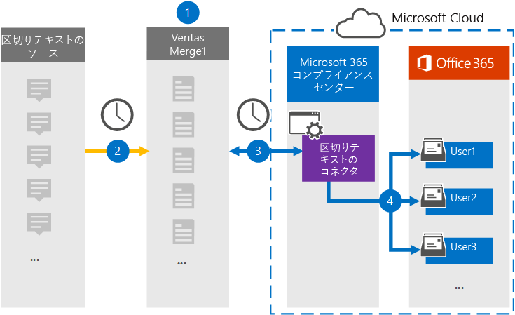

# テキスト区切りデータをアーカイブするコネクタをセットアップする

テキスト区切りデータをインポートおよびアーカイブするには、Microsoft 365 コンプライアンス センターの Veritas コネクタを使用して、組織内のユーザー メールボックスMicrosoft 365します。 Veritas には、サードパーティのデータ ソースからアイテムを (定期的に) キャプチャし、それらのアイテムを Microsoft 365 にインポートするように構成されたテキスト区切りコネクタが提供されています。 コネクタは、テキストで区切られたデータ ソースから電子メール メッセージ形式にコンテンツを変換し、それらのアイテムをユーザーのメールボックスにインポートMicrosoft 365。

テキストで区切られたデータをユーザー メールボックスに格納した後、訴訟ホールド、電子情報開示、保持ポリシー、保持ラベルなどの Microsoft 365 コンプライアンス機能を適用できます。 テキストで区切られたデータ コネクタを使用してデータをインポートおよびアーカイブする方法は、Microsoft 365規制ポリシーに準拠し、組織を維持するのに役立ちます。

## テキスト区切りデータのアーカイブの概要

次の概要では、コネクタを使用してテキストで区切られたソース情報をアーカイブするプロセスについて説明Microsoft 365。

1. 組織は、テキストで区切られたソースを使用して、テキストで区切られたサイトを設定および構成します。

2. 24 時間に 1 回、テキストで区切られたソースからのチャット メッセージが Veritas Merge1 サイトにコピーされます。 コネクタは、コンテンツを電子メール メッセージ形式に変換します。

3. Microsoft 365 コンプライアンス センター で作成するテキスト区切りコネクタは、毎日 Veritas Merge1 サイトに接続し、Microsoft クラウド内のセキュリティで保護された Azure Storage 場所にメッセージを転送します。

4. コネクタは、手順 3 で説明したように、自動ユーザー マッピングの *Email* プロパティの値を使用して、変換されたメッセージ アイテムを特定のユーザーのメールボックスにインポートします。 Text- **Delimited** という名前の受信トレイ フォルダー内の新しいサブフォルダーがユーザー のメールボックスに作成され、メッセージ アイテムがそのフォルダーにインポートされます。 コネクタは *、Email* プロパティの値を使用してアイテムをインポートするメールボックスを決定します。 すべてのメッセージには、このプロパティが含まれるので、すべての参加者の電子メール アドレスが設定されます。

## はじめに

- Microsoft コネクタ用の Veritas Merge1 アカウントを作成します。 このアカウントを作成するには [、Veritas カスタマー サポートにお問い合わせください](https://globanet.com/ms-connectors-contact)。 手順 1 でコネクタを作成するときに、このアカウントにサインインします。

- 手順 1 でテキスト区切りコネクタを作成し (手順 3 で完了する) ユーザーは、Exchange Online のメールボックスインポートエクスポートの役割に割り当てる必要があります。 この役割は、データ コネクタ ページの[データ コネクタ] ページにコネクタを追加Microsoft 365 コンプライアンス センター。 既定では、この役割はグループ内の役割グループExchange Online。 [メールボックスのインポートエクスポート] 役割は、組織の [組織の管理] 役割グループに追加Exchange Online。 または、役割グループを作成し、メールボックスインポートエクスポートの役割を割り当て、適切なユーザーをメンバーとして追加できます。 詳細については、「グループ内の[役割グループを](/Exchange/permissions-exo/role-groups#create-role-groups)管理する」の「役割グループの作成」または「役割グループの変更」セクションを参照Exchange Online。

## 手順 1: テキスト区切りコネクタを設定する

最初の手順は、ページの[データ コネクタ] ページにアクセスしMicrosoft 365 コンプライアンス センター区切られたデータのコネクタを作成することです。

1. [データ コネクタ [https://compliance.microsoft.com](https://compliance.microsoft.com/) テキスト区切り] に移動  >  **し、[データ コネクタ] をクリックします**。

2. [テキストで **区切られた製品の説明] ページ** で、[コネクタの追加] **をクリックします**。

3. [サービス条件 **] ページで、[** 同意する] を **クリックします**。

4. コネクタを識別する一意の名前を入力し、[次へ] を **クリックします**。

5. コネクタを構成するには、Merge1 アカウントにサインインします。

## 手順 2: Veritas Merge1 サイトでテキスト区切りコネクタを構成する

2 番目の手順は、Merge1 サイトでテキスト区切りコネクタを構成することです。 Veritas Merge1 サイトでテキスト区切りコネクタを構成する方法については [、「Merge1 サード](https://docs.ms.merge1.globanetportal.com/Merge1%20Third-Party%20Connectors%20text-delimited%20User%20Guide%20.pdf)パーティ コネクタ ユーザー ガイド」を参照してください。

[ファイルの **保存と&完了**] をクリックすると、コネクタ ウィザードの [ユーザー マッピング] ページが表示Microsoft 365 コンプライアンス センターされます。

## 手順 3: ユーザーをマップし、コネクタのセットアップを完了する

ユーザーをマップし、コネクタのセットアップを完了するには、次Microsoft 365 コンプライアンス センター手順を実行します。

1. [外部ユーザー **をユーザーにマップMicrosoft 365] ページで**、自動ユーザー マッピングを有効にします。 テキスト区切りソース アイテムには、組織内のユーザーの電子メール アドレスを含む *Email* というプロパティが含まれます。 コネクタでこのアドレスをユーザーに関連付Microsoft 365、アイテムはユーザーのメールボックスにインポートされます。

2. [**次へ**] をクリックし、設定を確認し、[データ コネクタ] ページに移動して、新しいコネクタのインポート プロセスの進行状況を確認します。

## 手順 4: テキスト区切りコネクタを監視する

テキスト区切りコネクタを作成した後、コネクタの状態を [テキスト区切り] Microsoft 365 コンプライアンス センター。

1. 左側の [https://compliance.microsoft.com](https://compliance.microsoft.com) ナビゲーションで [ **データ コネクタ] に** 移動してクリックします。

2. [コネクタ **] タブをクリック** し、[ **テキスト区切りコネクタ]** を選択して、フライアウト ページを表示します。 このページには、コネクタに関するプロパティと情報が含まれる。

3. [**ソースを含むコネクタの状態**] で、[ログのダウンロード] リンクをクリックして、コネクタの状態ログを開く (または保存) します。  このログには、Microsoft クラウドにインポートされたデータに関する情報が含まれます。

## 既知の問題

- 現時点では、10 MB を超える添付ファイルやアイテムのインポートはサポートされていません。 大きいアイテムのサポートは、後日利用できます。