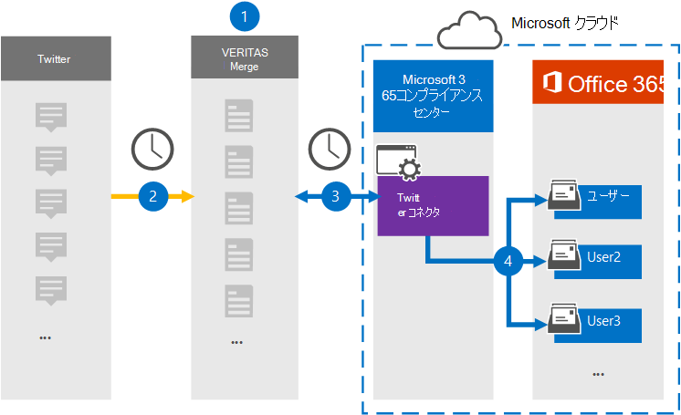

# Twitter データをアーカイブするコネクタを設定する (プレビュー)

Microsoft 365 コンプライアンス センターの Veritas コネクタを使用して、Twitter プラットフォームからMicrosoft 365組織内のユーザー メールボックスにデータをインポートおよびアーカイブします。 Veritas には、サードパーティのデータ ソースからアイテムをキャプチャし、それらのアイテムをMicrosoft 365にインポートするように構成された [Twitter](https://www.veritas.com/insights/merge1/twitter) コネクタが用意されています。 コネクタは、ツイート、リツイート、コメントなどのコンテンツを Twitter から電子メール メッセージ形式に変換し、それらのアイテムをMicrosoft 365のユーザー メールボックスにインポートします。

Twitter データをユーザー メールボックスに格納した後、訴訟ホールド、電子情報開示、アイテム保持ポリシー、保持ラベルなどのMicrosoft 365コンプライアンス機能を適用できます。 Twitter コネクタを使用してMicrosoft 365にデータをインポートおよびアーカイブすると、組織が政府および規制のポリシーに準拠し続けることができます。

## Twitter データのアーカイブの概要

次の概要では、コネクタを使用して Microsoft 365で Twitter データをアーカイブするプロセスについて説明します。

1. 組織は Twitter と連携して、Twitter サイトを設定および構成します。 また、組織は Veritas と連携して Merge1 サイトを設定します。

2. 24 時間に 1 回、Twitter アイテムは Veritas Merge1 サイトにコピーされます。 また、コネクタは Twitter アイテムを電子メール メッセージ形式に変換します。

3. Microsoft 365 コンプライアンス センターで作成した Twitter コネクタは、毎日 Veritas Merge1 サイトに接続し、Twitter コンテンツを Microsoft クラウド内の安全なAzure Storageの場所に転送します。

4. コネクタは、[手順 3](#step-3-map-users-and-complete-the-connector-setup). で説明したように、自動ユーザー マッピングの *Email* プロパティの値を使用して、変換されたアイテムを特定のユーザーのメールボックスにインポートします。 **Twitter** という名前の受信トレイ フォルダー内のサブフォルダーがユーザー メールボックスに作成され、アイテムがそのフォルダーにインポートされます。 コネクタは、 *Email* プロパティの値を使用して、アイテムをインポートするメールボックスを決定します。 すべての Twitter アイテムにはこのプロパティが含まれています。このプロパティには、アイテムのすべての参加者のメール アドレスが入力されます。

## コネクタを設定する前に

- Microsoft コネクタの Merge1 アカウントを作成します。 このアカウントを作成するには、 [Veritas カスタマー サポート](https://www.veritas.com/form/requestacall/ms-connectors-contact)にお問い合わせください。 手順 1 でコネクタを作成するときに、このアカウントにサインインする必要があります。

- Twitter アカウントからデータをフェッチする Twitter アプリケーション <https://developer.twitter.com> を作成します。 アプリケーションの作成に関する詳細な手順については、「 [Merge1 サード パーティ コネクタ ユーザー ガイド」を](https://docs.ms.merge1.globanetportal.com/Merge1%20Third-Party%20Connectors%20Twitter%20User%20Guide.pdf)参照してください。

- 手順 1 で YouTube コネクタを作成し、手順 3 で完了したユーザーには、Data Connector 管理者ロールを割り当てる必要があります。 このロールは、Microsoft 365 コンプライアンス センターの **[データ コネクタ**] ページにコネクタを追加するために必要です。 このロールは、既定で複数の役割グループに追加されます。 これらの役割グループの一覧については、「セキュリティ & コンプライアンス センターのアクセス許可」の「 [セキュリティとコンプライアンス センターの](../security/office-365-security/permissions-in-the-security-and-compliance-center.md#roles-in-the-security--compliance-center)ロール」セクションを参照してください。 または、組織内の管理者は、カスタム役割グループを作成し、Data Connector 管理者ロールを割り当て、適切なユーザーをメンバーとして追加することもできます。 手順については、[Microsoft 365 コンプライアンス センターのアクセス許可](microsoft-365-compliance-center-permissions.md#create-a-custom-role-group)の「カスタム ロール グループの作成」セクションを参照してください。

- この Veritas データ コネクタは、Microsoft 365米国政府機関クラウドのGCC環境でパブリック プレビュー段階にあります。 サード パーティのアプリケーションとサービスには、組織の顧客データを、Microsoft 365 インフラストラクチャの外部にあるサード パーティ システムに格納、送信、処理する必要があるため、Microsoft 365コンプライアンスとデータ保護のコミットメントの対象とされません。 Microsoft は、この製品を使用してサード パーティ製アプリケーションに接続することは、これらのサードパーティ アプリケーションが FEDRAMP に準拠していることを意味することを示しません。

## 手順 1: Twitter コネクタを設定する

最初の手順では、Microsoft 365 コンプライアンス センターの **[データ コネクタ**] ページにアクセスし、Twitter データ用のコネクタを作成します。

1. **[Data connectorsTwitter** > ] に<https://compliance.microsoft.com>移動し、[データ コネクタ] をクリックします。

2. **Twitter** 製品の説明ページで、[**コネクタの追加**] をクリックします。

3. [利用規約] ページ **で** 、[ **同意** する] をクリックします。

4. コネクタを識別する一意の名前を入力し、[ **次へ**] をクリックします。

5. Merge1 アカウントにサインインしてコネクタを構成します。

## 手順 2: Veritas Merge1 サイトで Twitter を構成する

2 番目の手順は、Veritas Merge1 サイトで Twitter コネクタを構成することです。 Twitter コネクタを構成する方法については、「 [Merge1 Third-Party Connectors ユーザー ガイド」を](https://docs.ms.merge1.globanetportal.com/Merge1%20Third-Party%20Connectors%20Twitter%20User%20Guide.pdf)参照してください。

[**保存&完了**] をクリックすると、Microsoft 365 コンプライアンス センターのコネクタ ウィザードの **[ユーザー マッピング**] ページが表示されます。

## 手順 3: ユーザーをマップし、コネクタのセットアップを完了する

ユーザーをマップし、Microsoft 365 コンプライアンス センターでコネクタの設定を完了するには、次の手順に従います。

1. [**Twitter ユーザーを Microsoft 365 ユーザーにマップ** する] ページで、自動ユーザー マッピングを有効にします。 Twitter アイテム *には、組織内* のユーザーのメール アドレスを含む Email というプロパティが含まれています。 コネクタがこのアドレスをMicrosoft 365 ユーザーに関連付けることができる場合、アイテムはそのユーザーのメールボックスにインポートされます。

2. [ **次へ**] をクリックして設定を確認し、[ **データ コネクタ** ] ページに移動して、新しいコネクタのインポート プロセスの進行状況を確認します。

## 手順 4: Twitter コネクタを監視する

Twitter コネクタを作成した後、Microsoft 365 コンプライアンス センターでコネクタの状態を表示できます。

1. 左側の <https://compliance.microsoft.com/> ナビゲーションにある **[データ コネクタ** ] に移動してクリックします。

2. [ **コネクタ** ] タブをクリックし、 **Twitter** コネクタを選択してポップアップ ページを表示します。このページには、コネクタに関するプロパティと情報が表示されます。

3. **[コネクタの状態とソース**] で、[**ログのダウンロード**] リンクをクリックして、コネクタの状態ログを開く (または保存) します。 このログには、Microsoft クラウドにインポートされたデータが含まれています。

## 既知の問題

- 現時点では、10 MB を超える添付ファイルやアイテムのインポートはサポートされていません。 より大きなアイテムのサポートは、後日提供される予定です。
