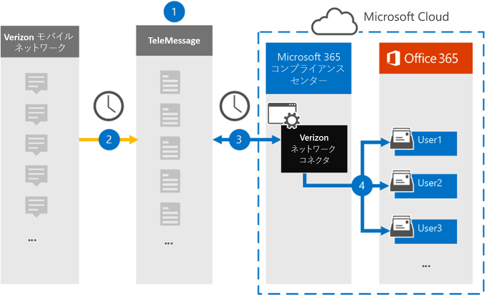

# Verizon Network データをアーカイブするコネクタをセットアップする

Microsoft 365 コンプライアンス センターの TeleMessage コネクタを使用して、Verizon Network からショート メッセージング サービス (SMS) およびマルチメディア メッセージング サービス (MMS) データをインポートおよびアーカイブします。 コネクタをセットアップして構成した後、毎日 1 回、組織の Verizon Network に接続し、SMS および MMS データを Microsoft 365 のメールボックスにインポートします。

Verizon Network コネクタ データをユーザー メールボックスに格納した後、訴訟ホールド、コンテンツ検索、Microsoft 365 保持ポリシーなどの Microsoft 365 コンプライアンス機能を Verizon データに適用できます。 たとえば、コンテンツ検索を使用して Verizon SMS および MMS メッセージを検索したり、高度な電子情報開示ケースで Verizon Network データを含むメールボックスを保管担当者に関連付けできます。 Verizon Network コネクタを使用して Microsoft 365 でデータをインポートおよびアーカイブすると、組織が政府および規制ポリシーに準拠しつ付けるのに役立ちます。

## Verizon Network データのアーカイブの概要

次の概要では、コネクタを使用して Microsoft 365 で Verizon Network データをアーカイブするプロセスについて説明します。

1. 組織は、TeleMessage と Verizon を使用して Verizon ネットワーク コネクタをセットアップします。 詳細については、「 [Verizon Network Archiver」を参照してください](https://www.telemessage.com/office365-activation-for-verizon-network-archiver/)。

2. 24 時間に 1 回、組織の Verizon Network からの SMS メッセージと MMS メッセージが TeleMessage サイトにコピーされます。

3. Microsoft 365 コンプライアンス センターで作成する Verizon ネットワーク コネクタは、毎日 TeleMessage サイトに接続し、過去 24 時間の SMS および MMS メッセージを Microsoft クラウド内の安全な Azure Storage の場所に転送します。 また、コネクタは SMS メッセージと MMS メッセージのコンテンツを電子メール メッセージ形式に変換します。

4. コネクタは、モバイル通信アイテムを特定のユーザーのメールボックスにインポートします。 **Verizon SMS/MMS Network Archiver** という名前の新しいフォルダーが特定のユーザーのメールボックスに作成され、アイテムがインポートされます。 コネクタは、User の [電子メール アドレス] プロパティの値を使用して *、このマッピングを実行* します。 すべての SMS メッセージと MMS メッセージには、このプロパティが含まれるので、メッセージのすべての参加者の電子メール アドレスが設定されます。

   *User* の [電子メール アドレス] プロパティの値を使用した自動ユーザー マッピングに加えて、CSV マッピング ファイルをアップロードしてカスタム マッピングを実装できます。 このマッピング ファイルには、組織内のユーザーの携帯電話番号と対応する Microsoft 365 メール アドレスが含まれる。 自動ユーザー マッピングとカスタム マッピングの両方を有効にした場合、すべての Verizon アイテムに対して、コネクタは最初にカスタム マッピング ファイルを参照します。 ユーザーの携帯電話番号に対応する有効な Microsoft 365 ユーザーが見つからなかった場合、コネクタはインポートしようとしているアイテムの電子メール アドレス プロパティの値を使用します。 コネクタがカスタム マッピング ファイルまたは Verizon アイテムのメール アドレス プロパティに有効な Microsoft 365 ユーザーを見つからなかった場合、アイテムはインポートされません。

## コネクタをセットアップする前に

Verizon Network データのアーカイブに必要な実装手順の一部は、Microsoft 365 の外部であり、コンプライアンス センターにコネクタを作成する前に完了する必要があります。

- [TeleMessage から Verizon Network Archiver サービス](https://www.telemessage.com/mobile-archiver/order-mobile-archiver-for-o365)を注文し、組織の有効な管理アカウントを取得します。 コンプライアンス センターでコネクタを作成する場合は、このアカウントにサインインする必要があります。

- Verizon Network アカウントと請求連絡先の詳細を取得して、TeleMessage オンボーディング フォームに入力し、Verizon からメッセージ アーカイブ サービスを注文できます。

- TeleMessage アカウントに Verizon SMS と MMS アーカイブが必要なすべてのユーザーを登録します。 ユーザーを登録する場合は、Microsoft 365 アカウントに使用されているのと同じメール アドレスを使用してください。

- 従業員は、Verizon モバイル ネットワーク上に企業所有および企業責任の携帯電話を持っている必要があります。 Microsoft 365 のアーカイブ メッセージは、従業員が所有するデバイスまたは自分のデバイスを持ち込む (BYOD) デバイスでは使用できません。

- Verizon ネットワーク コネクタを作成するユーザーには、データ コネクタ管理者の役割が割り当てられている必要があります。 Microsoft 365 コンプライアンス センターの [ **データ** コネクタ] ページにコネクタを追加するには、この役割が必要です。 この役割は、既定で複数の役割グループに追加されます。 これらの役割グループの一覧については、「セキュリティ とコンプライアンス センターのアクセス許可」の「セキュリティとコンプライアンス センターの役割& [してください](../security/office-365-security/permissions-in-the-security-and-compliance-center.md#roles-in-the-security--compliance-center)。 または、組織内の管理者がカスタム役割グループを作成し、データ コネクタ管理者の役割を割り当て、適切なユーザーをメンバーとして追加することもできます。 手順については、「Microsoft 365 コンプライアンス センターのアクセス許可」の「カスタム役割グループの作成」 [セクションを参照してください](microsoft-365-compliance-center-permissions.md#create-a-custom-role-group)。

- この TeleMessage データ コネクタは、Microsoft 365 US Government クラウドの GCC 環境で使用できます。 サード パーティ製のアプリケーションとサービスには、Microsoft 365 インフラストラクチャの外部にあるサードパーティ 製システムに組織の顧客データを保存、送信、処理する必要がある場合があります。そのため、Microsoft 365 コンプライアンスおよびデータ保護のコミットメントの対象とはなってない場合があります。 Microsoft は、この製品を使用してサード パーティ製アプリケーションに接続する場合、これらのサード パーティ製アプリケーションが FEDRAMP に準拠しているという意味を示していません。

## Verizon ネットワーク コネクタの作成

前のセクションで説明した前提条件を完了したら、Microsoft 365 コンプライアンス センターで Verizon Network コネクタを作成できます。 コネクタは、指定した情報を使用して TeleMessage サイトに接続し、SMS メッセージと MMS メッセージを Microsoft 365 の対応するユーザー メールボックス ボックスに転送します。

1. に移動し [https://compliance.microsoft.com](https://compliance.microsoft.com)、[**データ** >  コネクタ **Verizon Network] をクリックします**。

2. [ **Verizon Network 製品の説明] ページ** で、[コネクタの追加] **をクリックします。**

3. [サービス条件 **] ページで、[** 同意する] を **クリックします**。

4. [ **TeleMessage へのログイン]** ページの [手順 3] で、次のボックスに必要な情報を入力し、[次へ] をクリック **します**。
  
   - **ユーザー名:** TeleMessage ユーザー名。

   - **パスワード:** TeleMessage パスワード。

5. コネクタを作成したら、ポップアップ ウィンドウを閉じて次のページに移動できます。

6. [ユーザー マッピング **] ページで** 、自動ユーザー マッピングを有効にして、[次へ] を **クリックします**。 カスタム マッピングが必要な場合は、CSV ファイルをアップロードし、[次へ] を **クリックします**。

7. 設定を確認し、[完了] を **クリックして** コネクタを作成します。

8. [データ コネクタ] ページの [ **コネクタ] タブに移動** して、新しいコネクタのインポート プロセスの進行状況を確認します。

## 既知の問題

- 現時点では、10 MB を超える添付ファイルやアイテムのインポートはサポートされていません。 大きいアイテムのサポートは、後日利用できます。