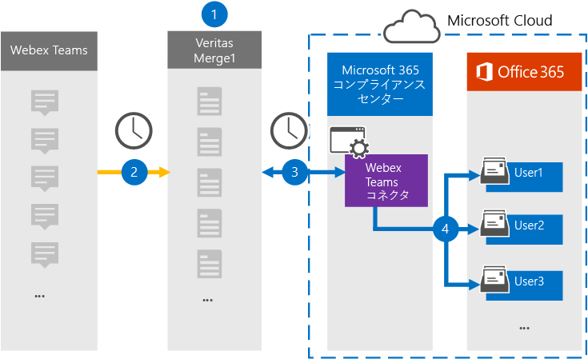

# Webex データをアーカイブするコネクタをTeamsする

Webex サーバーからデータをインポートおよびアーカイブするには、Microsoft 365 コンプライアンス センターの Veritas コネクタを使用して、Teams組織内のユーザー メールボックスMicrosoft 365します。 Veritas には[、Webex](https://globanet.com/webex-teams/) Teams通信アイテムをキャプチャし、それらをインポートするように構成された Webex Teams コネクタがMicrosoft 365。 コネクタは、組織の Webex Teams アカウントからの 1:1 チャット、グループ会話、チャネル会話、添付ファイルなどのコンテンツを Webex Teams から電子メール メッセージ形式に変換し、それらのアイテムを Microsoft 365 のユーザーのメールボックスにインポートします。

Webex Teamsデータがユーザー メールボックスに保存された後、訴訟ホールド、電子情報開示、保持ポリシーと保持ラベル、通信コンプライアンスなどの Microsoft 365 コンプライアンス機能を適用できます。 Webex Teamsコネクタを使用してデータをインポートおよびアーカイブMicrosoft 365、組織が政府機関および規制ポリシーに準拠しつ付けるのに役立ちます。

## Webex データのアーカイブTeams概要

次の概要では、コネクタを使用して Webex データをアーカイブするプロセスTeams説明Microsoft 365。

1. 組織は Webex Teamsを使用して Webex サイトをTeamsします。

2. 24 時間に 1 回、Webex Teamsは Veritas Merge1 サイトにコピーされます。 また、コネクタは Webex ファイルTeams電子メール メッセージ形式に変換します。

3. Microsoft 365 コンプライアンス センター で作成した Webex Teams コネクタは、毎日 Veritas Merge1 に接続し、Webex Teams アイテムを Microsoft クラウド内の安全な Azure Storage 場所に転送します。

4. コネクタは、手順 3 で説明したように、自動ユーザー マッピングの *Email* プロパティの値を使用して、特定のユーザーのメールボックスにアイテム [をインポートします](#step-3-map-users-and-complete-the-connector-setup)。 ユーザー のメールボックスに **Webex Teams** という名前の受信トレイ フォルダー内のサブフォルダーが作成され、そのフォルダーにアイテムがインポートされます。 コネクタは、Email プロパティの値を使用して *これを行* います。 すべての Webex Teamsには、このプロパティが含まれるので、アイテムのすべての参加者の電子メール アドレスが設定されます。

## 始める前に

- Microsoft コネクタ用の Veritas Merge1 アカウントを作成します。 このアカウントを作成するには、 [Veritas カスタマー サポートにお問い合わせください](https://globanet.com/ms-connectors-contact)。 手順 1 でコネクタを作成するときに、このアカウントにサインインします。

- Webex アカウントからデータ[https://developer.webex.com/](https://developer.webex.com)をフェッチするアプリケーションをTeamsします。 アプリケーションの作成の手順については、「Merge1 サード パーティ コネクタ ユーザー [ガイド」を参照してください。](https://docs.ms.merge1.globanetportal.com/Merge1%20Third-Party%20Connectors%20Webex%20Teams%20User%20Guide%20.pdf)

   このアプリケーションを作成すると、Webex プラットフォームは一意の資格情報のセットを生成します。 これらの資格情報は、グローバル Merge1 サイトで Webex Teamsコネクタを構成するときに、手順 2 で使用されます。

- 手順 1 で Webex Teamsコネクタを作成し 、手順 3 で完了するユーザーには、データ コネクタ管理者の役割が割り当てられている必要があります。 この役割は、データ コネクタ ページの [データ  コネクタ] ページにコネクタを追加Microsoft 365 コンプライアンス センター。 この役割は、既定で複数の役割グループに追加されます。 これらの役割グループの一覧については、「セキュリティ とコンプライアンス センターのアクセス許可」の「セキュリティとコンプライアンス センターの役割& [してください](../security/office-365-security/permissions-in-the-security-and-compliance-center.md#roles-in-the-security--compliance-center)。 または、組織内の管理者がカスタム役割グループを作成し、データ コネクタ管理者の役割を割り当て、適切なユーザーをメンバーとして追加することもできます。 手順については、「アクセス許可」の「カスタム役割グループを作成する」[セクションを参照Microsoft 365 コンプライアンス センター](microsoft-365-compliance-center-permissions.md#create-a-custom-role-group)。

- この Veritas データ コネクタは、米国政府機関クラウドGCC環境Microsoft 365プレビュー中です。 サード パーティ製のアプリケーションとサービスには、Microsoft 365 インフラストラクチャの外部にある、Microsoft 365 コンプライアンスおよびデータ保護のコミットメントの対象となされていないサードパーティ システムに対して、組織の顧客データを保存、送信、および処理する必要があります。 Microsoft は、この製品を使用してサード パーティ製アプリケーションに接続する場合、これらのサード パーティ製アプリケーションが FEDRAMP に準拠しているという意味を示していません。

## 手順 1: Webex コネクタをTeamsする

最初の手順は、データ コネクタにアクセスし、[Webex](https://globanet.com/webex-teams/) コネクタをセットアップTeamsです。

1. に移動し [https://compliance.microsoft.com](https://compliance.microsoft.com/)、[**データ** >  コネクタ **Webex] をクリックTeams**。

2. [**Webex Teams** 説明] ページで、[コネクタの追加] **をクリックします**。

3. [サービス条件 **] ページで、[** 同意する] を **クリックします**。

4. コネクタを識別する一意の名前を入力し、[次へ] を **クリックします**。

5. コネクタを構成するには、Merge1 アカウントにサインインします。

## 手順 2: Veritas Merge1 サイトTeams Webex コネクタを構成する

2 番目の手順は、Merge1 サイトTeams Webex コネクタを構成することです。 Webex コネクタを構成する方法Teams [Merge1 サードパーティ コネクタ ユーザー ガイドを参照してください](https://docs.ms.merge1.globanetportal.com/Merge1%20Third-Party%20Connectors%20Webex%20Teams%20User%20Guide%20.pdf)。

[ファイルの **保存と&完了**] をクリックすると、コネクタ ウィザードの [ユーザー マッピング] ページが表示Microsoft 365 コンプライアンス センターされます。

## 手順 3: ユーザーをマップし、コネクタのセットアップを完了する

ユーザーをマップし、コネクタのセットアップを完了するには、次Microsoft 365 コンプライアンス センター手順を実行します。

1. [**Webex をユーザーにTeamsするMicrosoft 365**] ページで、自動ユーザー マッピングを有効にします。 Webex Teamsには、組織内のユーザーの電子メール アドレスを含む *Email* というプロパティが含まれます。 コネクタでこのアドレスをユーザーに関連付Microsoft 365、アイテムはユーザーのメールボックスにインポートされます。

2. [**次へ**] をクリックし、設定を確認し、[データ コネクタ] ページに移動して、新しいコネクタのインポート プロセスの進行状況を確認します。

## 手順 4: Webex コネクタをTeamsする

Webex Teamsコネクタを作成した後、コネクタの状態を [コネクタ] Microsoft 365 コンプライアンス センター。

1. 左側のナビゲーション [https://compliance.microsoft.com](https://compliance.microsoft.com) で [ **データ コネクタ] に** 移動してクリックします。

2. [コネクタ **] タブをクリック** し、**Webex** Teamsを選択して、フライアウト ページを表示します。 このページには、コネクタに関するプロパティと情報が含まれる。

3. [**ソースを含むコネクタの** 状態] で、[ログのダウンロード] リンクをクリックして、コネクタの状態ログを開く (または保存) します。 このログには、Microsoft クラウドにインポートされたデータに関する情報が含まれます。

## 既知の問題

- 現時点では、10 MB を超える添付ファイルやアイテムのインポートはサポートされていません。 大きいアイテムのサポートは、後日利用できます。