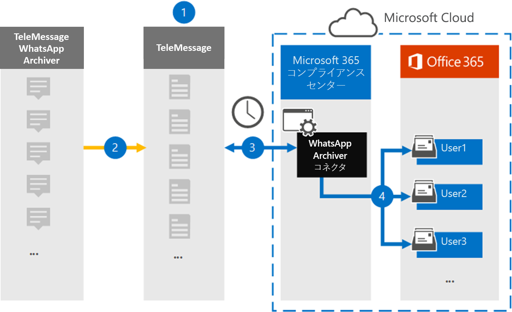

# WhatsApp データをアーカイブするコネクタをセットアップする

WhatsApp 呼び出しMicrosoft 365 コンプライアンス センター、添付ファイル、ファイル、および削除されたメッセージをインポートおよびアーカイブするには、次の手順で TeleMessage コネクタを使用します。 コネクタをセットアップして構成した後、組織の TeleMessage アカウントに毎日 1 回接続し、TeleMessage WhatsApp 電話 Archiver または TeleMessage WhatsApp Cloud Archiver を使用して従業員のモバイル通信を Microsoft 365 のメールボックスにインポートします。

WhatsApp データをユーザー メールボックスに格納した後、訴訟ホールド、コンテンツ検索、Microsoft 365 保持ポリシーなどの Microsoft 365 コンプライアンス機能を WhatsApp データに適用できます。 たとえば、コンテンツ検索を使用して WhatsApp メッセージを検索したり、WhatsApp メッセージを含むメールボックスを管理担当者に関連付Advanced eDiscoveryできます。 WhatsApp コネクタを使用してデータをインポートおよびアーカイブMicrosoft 365、組織が政府機関および規制ポリシーに準拠しつ付けるのに役立ちます。

## WhatsApp データのアーカイブの概要

次の概要では、コネクタを使用して WhatsApp データをアーカイブするプロセスについて説明Microsoft 365。

1. 組織は TeleMessage を使用して WhatsApp Archiver コネクタをセットアップします。 詳細については、「 [WhatsApp Archiver」を参照してください](https://www.telemessage.com/office365-activation-for-whatsapp-archiver)。

2. リアルタイムで、組織の WhatsApp データが TeleMessage サイトにコピーされます。

3. Microsoft 365 コンプライアンス センター で作成する WhatsApp コネクタは、毎日 TeleMessage サイトに接続し、WhatsApp データを過去 24 時間から Microsoft クラウドの安全な Azure Storage 場所に転送します。 また、コネクタはコンテンツ WhatsApp データを電子メール メッセージ形式に変換します。

4. コネクタは、WhatsApp データを特定のユーザーのメールボックスにインポートします。 **WhatsApp Archiver という名前の新** しいフォルダーが特定のユーザーのメールボックスに作成され、アイテムがインポートされます。 コネクタは、User の [電子メール アドレス] プロパティの値を使用して *、このマッピングを実行* します。 すべての WhatsApp メッセージには、このプロパティが含まれるので、メッセージのすべての参加者の電子メール アドレスが設定されます。

   *User* の [電子メール アドレス] プロパティの値を使用した自動ユーザー マッピングに加えて、CSV マッピング ファイルをアップロードしてカスタム マッピングを実装できます。 このマッピング ファイルには、組織内のユーザーの携帯電話番号Microsoft 365対応するメール アドレスが含まれている。 自動ユーザー マッピングとカスタム マッピングの両方を有効にした場合、すべての WhatsApp アイテムについて、コネクタは最初にカスタム マッピング ファイルを参照します。 ユーザーの携帯電話番号に対応する有効な Microsoft 365 ユーザーが見つからなかった場合、コネクタはインポートしようとしているアイテムの電子メール アドレス プロパティの値を使用します。 カスタム マッピング ファイルまたは WhatsApp アイテムの電子メール アドレス プロパティに有効な Microsoft 365 ユーザーがコネクタで見つからなかった場合、アイテムはインポートされません。

## コネクタをセットアップする前に

WhatsApp 通信データをアーカイブするために必要な実装手順の一部は、Microsoft 365 の外部であり、コンプライアンス センターでコネクタを作成する前に完了する必要があります。

- [TeleMessage から WhatsApp Archiver サービス](https://www.telemessage.com/mobile-archiver/order-mobile-archiver-for-o365)を注文し、組織の有効な管理アカウントを取得します。 コンプライアンス センターでコネクタを作成する場合は、このアカウントにサインインする必要があります。

- TeleMessage アカウントに WhatsApp アーカイブが必要なすべてのユーザーを登録します。 ユーザーを登録する場合は、ユーザーのアカウントに使用する電子メール アドレスと同じMicrosoft 365してください。

- 従業員の携帯電話に [TeleMessage WhatsApp 電話アーカイブ](https://www.telemessage.com/mobile-archiver/whatsapp-phone-archiver-2/) アプリをインストールし、アクティブ化します。 または、従業員の携帯電話に通常の WhatsApp または WhatsApp Business アプリをインストールし、TeleMessage Web サイトで QR コードをスキャンして WhatsApp Cloud Archiver サービスをアクティブ化することもできます。 詳細については、「 [WhatsApp Cloud Archiver」を参照してください](https://www.telemessage.com/mobile-archiver/whatsapp-archiver/whatsapp-cloud-archiver/)。

- Verizon ネットワーク コネクタを作成するユーザーには、データ コネクタ管理者の役割が割り当てられている必要があります。 この役割は、データ コネクタ ページの [データ  コネクタ] ページにコネクタを追加Microsoft 365 コンプライアンス センター。 この役割は、既定で複数の役割グループに追加されます。 これらの役割グループの一覧については、「セキュリティ とコンプライアンス センターのアクセス許可」の「セキュリティとコンプライアンス センターの役割& [してください](../security/office-365-security/permissions-in-the-security-and-compliance-center.md#roles-in-the-security--compliance-center)。 または、組織内の管理者がカスタム役割グループを作成し、データ コネクタ管理者の役割を割り当て、適切なユーザーをメンバーとして追加することもできます。 手順については、「アクセス許可」の「カスタム役割グループを作成する」[セクションを参照Microsoft 365 コンプライアンス センター](microsoft-365-compliance-center-permissions.md#create-a-custom-role-group)。

- この TeleMessage データ コネクタは、米国政府機関GCC環境Microsoft 365使用できます。 サード パーティ製のアプリケーションとサービスには、Microsoft 365 インフラストラクチャの外部にある、Microsoft 365 コンプライアンスおよびデータ保護のコミットメントの対象となされていないサードパーティ システムに対して、組織の顧客データを保存、送信、および処理する必要があります。 Microsoft は、この製品を使用してサード パーティ製アプリケーションに接続する場合、これらのサード パーティ製アプリケーションが FEDRAMP に準拠しているという意味を示していません。

## WhatsApp Archiver コネクタの作成

前のセクションで説明した前提条件を完了したら、次のセクションで WhatsApp コネクタを作成Microsoft 365 コンプライアンス センター。 コネクタは、指定した情報を使用して、TeleMessage サイトに接続し、WhatsApp データをユーザー のメールボックス ボックスに転送Microsoft 365。

1. [データ コネクタ [https://compliance.microsoft.com](https://compliance.microsoft.com/)]**WhatsApp Archiver に移動し、[データ コネクタ] をクリックします**。 > 

2. **[WhatsApp Archiver 製品の説明] ページ** で、[コネクタの追加] **をクリックします。**

3. [サービス条件 **] ページで、[** 同意する] を **クリックします**。

4. [ **TeleMessage へのログイン]** ページの [手順 3] で、次のボックスに必要な情報を入力し、[次へ] をクリック **します**。

   - **ユーザー名:** TeleMessage ユーザー名。

   - **パスワード:** TeleMessage パスワード。

5. コネクタを作成したら、ポップアップ ウィンドウを閉じて次のページに移動できます。

6. [ユーザー マッピング **] ページで** 、自動ユーザー マッピングを有効にして、[次へ] を **クリックします**。 カスタム マッピングが必要な場合は、CSV ファイルをアップロードし、[次へ] を **クリックします**。

7. 設定を確認し、[完了] を **クリックして** コネクタを作成します。

8. [データ コネクタ] ページの [ **コネクタ] タブに移動** して、新しいコネクタのインポート プロセスの進行状況を確認します。

## 既知の問題

- 現時点では、10 MB を超える添付ファイルやアイテムのインポートはサポートされていません。 大きいアイテムのサポートは、後日利用できます。
