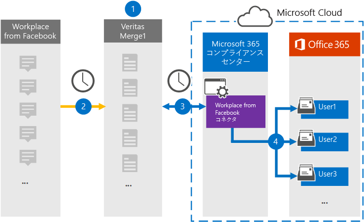

# Facebook データから Workplace をアーカイブするコネクタをセットアップする

組織内のユーザー メールボックスに、Microsoft 365 コンプライアンス センターから Workplace からデータをインポートおよびアーカイブするには、このページの Veritas コネクタをMicrosoft 365します。 Veritas は、サードパーティのデータ ソースからアイテムを (定期的に) キャプチャし、それらのアイテムを Microsoft 365 にインポートするように構成された Facebook コネクタから Workplace を提供します。 コネクタは、チャット、添付ファイル、投稿、ビデオなどのコンテンツを Workplace から電子メール メッセージ形式に変換し、それらのアイテムを Microsoft 365 のユーザー メールボックスにインポートします。

Workplace データをユーザー メールボックスに格納した後、訴訟ホールド、電子情報開示、保持ポリシーと保持ラベル、通信コンプライアンスなどのコンプライアンス機能Microsoft 365を適用できます。 Facebook コネクタから Workplace を使用してデータをインポートおよびアーカイブMicrosoft 365、組織が政府および規制ポリシーに準拠しつ付けるのに役立ちます。

## Facebook データからの Workplace のアーカイブの概要

次の概要では、コネクタを使用してワークプレース データをアーカイブするプロセスについてMicrosoft 365。

1. 組織は、Facebook の Workplace を使用して Workplace サイトを設定および構成します。

2. 24 時間に 1 回、Workplace のアイテムが Veritas Merge1 サイトにコピーされます。 コネクタは、これらのアイテムのコンテンツを電子メール メッセージ形式に変換します。

3. Microsoft 365 コンプライアンス センター で作成した Facebook コネクタからの Workplace は、毎日 Veritas Merge1 に接続し、Workplace アイテムを Microsoft クラウド内の安全な Azure Storage 場所に転送します。

4. コネクタは、手順 3 で説明したように、自動ユーザー マッピングの *Email* プロパティの値を使用して、変換されたアイテムを特定のユーザーのメールボックスにインポートします。 Facebook の Workplace という名前の **受信** トレイ フォルダー内にサブフォルダーが作成され、Workplace アイテムがそのフォルダーにインポートされます。 コネクタは、Email プロパティの値を使用して *これを行* います。 すべての Workplace アイテムには、このプロパティが含まれているので、すべてのチャットまたは参加者のメール アドレスが入力されます。

## 始める前に

- Microsoft コネクタ用の Veritas Merge1 アカウントを作成します。 このアカウントを作成するには [、Veritas カスタマー サポートにお問い合わせください](https://globanet.com/ms-connectors-contact)。 手順 1 でコネクタを作成するときに、このアカウントにサインインします。

- コンプライアンスと電子情報開示の目的で API を介して Workplace からデータを取得するカスタム https://my.workplace.com/work/admin/apps/ 統合を作成します。

   統合を作成すると、Workplace プラットフォームは、認証に使用されるトークンを生成するために使用される一意の資格情報のセットを生成します。 これらのトークンは、手順 2 の Facebook コネクタ構成ウィザードの Workplace で使用されます。 アプリケーションを作成する方法の詳細な手順については [、「Merge1 サード](https://docs.ms.merge1.globanetportal.com/Merge1%20Third-Party%20Connectors%20Workplace%20from%20Facebook%20User%20Guide%20.pdf)パーティ コネクタ ユーザー ガイド」を参照してください。

- 手順 1 で Facebook コネクタから Workplace を作成し (手順 3 で完了する) ユーザーは、管理者のメールボックスインポートエクスポートの役割に割り当てる必要Exchange Online。 この役割は、データ コネクタ ページの[データ コネクタ] ページにコネクタを追加Microsoft 365 コンプライアンス センター。 既定では、この役割はグループ内の役割グループExchange Online。 [メールボックスのインポートエクスポート] 役割は、組織の [組織の管理] 役割グループに追加Exchange Online。 または、役割グループを作成し、メールボックスインポートエクスポートの役割を割り当て、適切なユーザーをメンバーとして追加できます。 詳細については、「グループ内の[役割グループを](/Exchange/permissions-exo/role-groups#create-role-groups)管理する」の「役割グループの作成」または「役割グループの変更」セクションを参照Exchange Online。

## 手順 1: Facebook コネクタから Workplace をセットアップする

最初の手順は、ワークプレースの [データ コネクタ] ページにアクセスし、workplace Microsoft 365 コンプライアンス センターコネクタを作成することです。

1. [Facebook からデータ コネクタ Workplace] に移動 [https://compliance.microsoft.com](https://compliance.microsoft.com/) し、[データ  >  **コネクタ] をクリックします**。

2. [Facebook 製品 **の説明からのワークプレース** ] ページで、[コネクタの追加] **をクリックします**。

3. [サービス条件 **] ページで、[** 同意する] を **クリックします**。

4. コネクタを識別する一意の名前を入力し、[次へ] を **クリックします**。

5. コネクタを構成するには、Merge1 アカウントにサインインします。

## 手順 2: Veritas Merge1 サイトの Facebook コネクタから Workplace を構成する

2 番目の手順は、Merge1 サイトの Facebook コネクタから Workplace を構成することです。 Facebook コネクタから Workplace を構成する方法については [、「Merge1 サードパーティ](https://docs.ms.merge1.globanetportal.com/Merge1%20Third-Party%20Connectors%20Workplace%20from%20Facebook%20User%20Guide%20.pdf)コネクタ ユーザー ガイド」を参照してください。

[ファイルの **保存と&完了**] をクリックすると、コネクタ ウィザードの [ユーザー マッピング] ページが表示Microsoft 365 コンプライアンス センターされます。

## 手順 3: ユーザーをマップし、コネクタのセットアップを完了する

ユーザーをマップし、コネクタのセットアップを完了するには、次Microsoft 365 コンプライアンス センター手順を実行します。

1. [外部ユーザー **をユーザーにマップMicrosoft 365] ページで**、自動ユーザー マッピングを有効にします。 Workplace アイテムには、組織内のユーザーのメール アドレスを含む *Email* というプロパティが含まれます。 コネクタでこのアドレスをユーザーに関連付Microsoft 365、アイテムはユーザーのメールボックスにインポートされます。

2. [**次へ**] をクリックし、設定を確認し、[データ コネクタ] ページに移動して、新しいコネクタのインポート プロセスの進行状況を確認します。

## 手順 4: Facebook コネクタから Workplace を監視する

Facebook コネクタから Workplace を作成した後は、コネクタの状態を [プロファイル] Microsoft 365 コンプライアンス センター。

1. 左側の [https://compliance.microsoft.com](https://compliance.microsoft.com) ナビゲーションで [ **データ コネクタ] に** 移動してクリックします。

2. [コネクタ **] タブをクリック** し **、Facebook** コネクタから Workplace を選択して、フライアウト ページを表示します。 このページには、コネクタに関するプロパティと情報が含まれる。

3. [**ソースを含むコネクタの状態**] で、[ログのダウンロード] リンクをクリックして、コネクタの状態ログを開く (または保存) します。  このログには、Microsoft クラウドにインポートされたデータに関する情報が含まれます。

## 既知の問題

- 現時点では、10 MB を超える添付ファイルやアイテムのインポートはサポートされていません。 大きいアイテムのサポートは、後日利用できます。