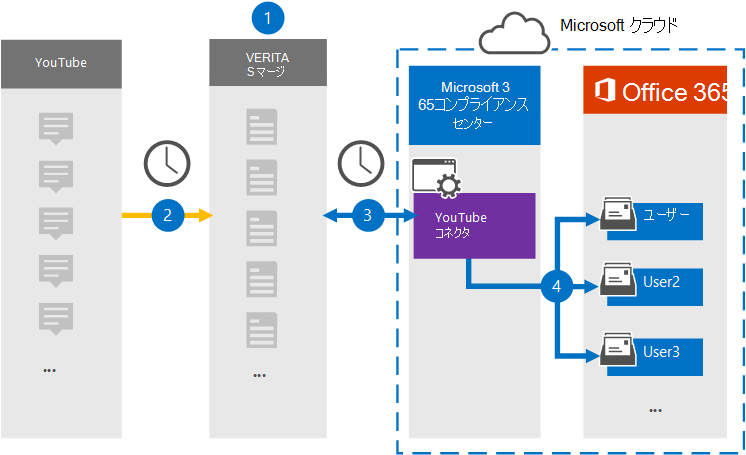

# YouTube データをアーカイブするコネクタをセットアップする (プレビュー)

YouTube からデータをインポートおよびアーカイブするには、Microsoft 365 コンプライアンス センターの Veritas コネクタを使用して、組織のユーザー メールボックスMicrosoft 365します。 Veritas には、サードパーティのデータ ソースからアイテムをキャプチャし、それらのアイテムをデータ ソースにインポートするように構成されたコネクタMicrosoft 365。 コネクタは、チャット、添付ファイル、タスク、メモ、投稿などのコンテンツを YouTube から電子メール メッセージ形式に変換し、それらのアイテムを Microsoft 365 のユーザー メールボックスにインポートします。

YouTube データをユーザー メールボックスに保存した後、訴訟ホールド、電子情報開示、保持ポリシー、保持ラベルMicrosoft 365コンプライアンス機能を適用できます。 YouTube コネクタを使用してデータをインポートおよびアーカイブMicrosoft 365、組織が政府および規制ポリシーに準拠しつ付けるのに役立ちます。

## YouTube データのアーカイブの概要

次の概要では、コネクタを使用して YouTube データをアーカイブするプロセスについて説明Microsoft 365。

1. 組織は YouTube と共同で YouTube サイトを設定および構成します。

2. 24 時間に 1 回、YouTube アイテムは Veritas Merge1 サイトにコピーされます。 また、コネクタは YouTube アイテムを電子メール メッセージ形式に変換します。

3. Microsoft 365 コンプライアンス センター で作成した YouTube コネクタは、毎日 Veritas Merge1 サイトに接続し、YouTube コンテンツを Microsoft クラウド内の安全な Azure Storage 場所に転送します。

4. コネクタは、手順 3 で説明したように、自動ユーザー マッピングの *Email* プロパティの値を使用して、変換されたアイテムを特定のユーザーのメールボックス [にインポートします](#step-3-map-users-and-complete-the-connector-setup)。 **YouTube** という名前の受信トレイ フォルダー内のサブフォルダーがユーザー のメールボックスに作成され、アイテムがそのフォルダーにインポートされます。 コネクタは *、Email* プロパティの値を使用してアイテムをインポートするメールボックスを決定します。 すべての YouTube アイテムにはこのプロパティが含まれるので、アイテムのすべての参加者のメール アドレスが設定されます。

## コネクタをセットアップする前に

- Microsoft コネクタ用の Merge1 アカウントを作成します。 このアカウントを作成するには [、Veritas カスタマー サポートにお問い合わせください](https://www.veritas.com/form/requestacall/ms-connectors-contact)。 手順 1 でコネクタを作成する場合は、このアカウントにサインインする必要があります。

- YouTube アカウントからデータを取得する YouTube アプリケーションを作成します。 アプリケーションの作成の手順については [、「Merge1 サード](https://docs.ms.merge1.globanetportal.com/Merge1%20Third-Party%20Connectors%20YouTube%20User%20Guide.pdf)パーティ コネクタ ユーザー ガイド」を参照してください。

- 手順 1 で YouTube コネクタを作成し (手順 3 で完了する) ユーザーは、次の手順でメールボックスインポートエクスポートの役割に割り当てる必要Exchange Online。 この役割は、データ コネクタ ページの[データ コネクタ] ページにコネクタを追加Microsoft 365 コンプライアンス センター。 既定では、この役割は、グループ内の任意の役割グループExchange Online。 [メールボックスのインポートエクスポート] 役割は、組織の [組織の管理] 役割グループに追加Exchange Online。 または、役割グループを作成し、メールボックスインポートエクスポートの役割を割り当て、適切なユーザーをメンバーとして追加できます。 詳細については、「グループ内の[役割グループを](/Exchange/permissions-exo/role-groups#create-role-groups)管理する」の「役割グループの作成」または「役割グループの変更」セクションを参照Exchange Online。

## 手順 1: YouTube コネクタをセットアップする

最初の手順は、アプリの[データ コネクタ] ページにアクセスしMicrosoft 365 コンプライアンス センター YouTube データのコネクタを作成することです。

1. [データ <https://compliance.microsoft.com> コネクタ] YouTube に移動 **し、[データ コネクタ**  >  **] をクリックします**。

2. **[YouTube 製品の説明]** ページで、[コネクタの追加]**をクリックします**。

3. [サービス条件 **] ページで、[** 同意する] を **クリックします**。

4. コネクタを識別する一意の名前を入力し、[次へ] を **クリックします**。

5. コネクタを構成するには、Merge1 アカウントにサインインします。

## 手順 2: Veritas Merge1 サイトで YouTube を構成する

2 番目の手順は、Veritas Merge1 サイトで YouTube コネクタを構成することです。 YouTube コネクタを構成する方法の詳細については [、「Merge1 サード](https://docs.ms.merge1.globanetportal.com/Merge1%20Third-Party%20Connectors%20YouTube%20User%20Guide.pdf)パーティ コネクタ ユーザー ガイド」を参照してください。

[ファイルの **保存と&完了]** をクリックすると、コネクタ ウィザードの [ユーザー マッピング] ページが表示Microsoft 365 コンプライアンス センターされます。

## 手順 3: ユーザーをマップし、コネクタのセットアップを完了する

ユーザーをマップし、コネクタのセットアップを完了するには、次Microsoft 365 コンプライアンス センター手順を実行します。

1. **[YouTube ユーザーをユーザーにマップMicrosoft 365]** ページで、自動ユーザー マッピングを有効にします。 YouTube アイテムには、組織内のユーザーのメール アドレスを含む *Email* というプロパティが含まれます。 コネクタでこのアドレスをユーザーに関連付Microsoft 365、アイテムはユーザーのメールボックスにインポートされます。

2. [**次へ**] をクリックし、設定を確認し、[データ コネクタ] ページに移動して、新しいコネクタのインポート プロセスの進行状況を確認します。

## 手順 4: YouTube コネクタを監視する

YouTube コネクタを作成した後、コネクタの状態を [コネクタ] ページMicrosoft 365 コンプライアンス センター。

1. 左側の <https://compliance.microsoft.com/> ナビゲーションで [ **データ コネクタ] に** 移動してクリックします。

2. [コネクタ **] タブをクリック** し **、YouTube** コネクタを選択して、コネクタのプロパティと情報を含むフライアウト ページを表示します。

3. [**ソースを含むコネクタの状態**] で、[ログのダウンロード] リンクをクリックして、コネクタの状態ログを開く (または保存) します。  このログには、Microsoft クラウドにインポートされたデータが含まれます。

## 既知の問題

- 現時点では、10 MB を超える添付ファイルやアイテムのインポートはサポートされていません。 大きいアイテムのサポートは、後日利用できます。
