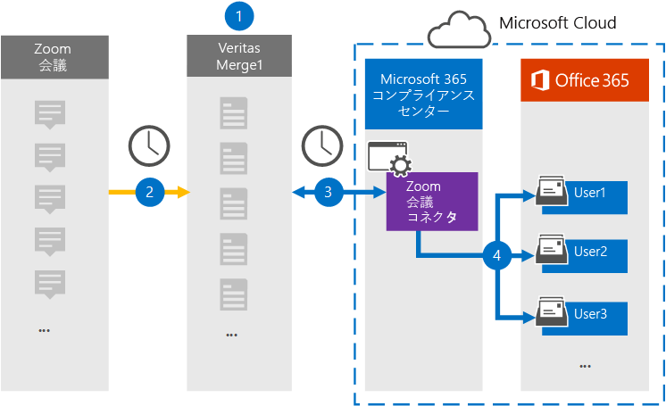

# Zoom Meetings データをアーカイブするコネクタを設定する

[!include[Purview banner](../includes/purview-rebrand-banner.md)]

Microsoft Purview コンプライアンス ポータルの Veritas コネクタを使用して、Zoom Meetings からMicrosoft 365組織内のユーザー メールボックスにデータをインポートおよびアーカイブします。 Veritas には、サード パーティのデータ ソースからアイテムを (定期的に) キャプチャし、それらのアイテムをMicrosoft 365にインポートするように構成された [Zoom Meetings](https://globanet.com/zoom/) コネクタが用意されています。 コネクタは、会議のコンテンツ (チャット、記録されたファイル、メタデータを含む) を Zoom Meetings アカウントから電子メール メッセージ形式に変換し、それらのアイテムをMicrosoft 365のユーザー メールボックスにインポートします。

Zoom Meetings データがユーザー メールボックスに格納された後、訴訟ホールド、電子情報開示、アイテム保持ポリシーと保持ラベル、通信コンプライアンスなどのMicrosoft Purview機能を適用できます。 Zoom Meetings コネクタを使用してMicrosoft 365のデータをインポートおよびアーカイブすると、組織が政府および規制のポリシーに準拠し続けることができます。

## Zoom Meetings データのアーカイブの概要

次の概要では、コネクタを使用して Zoom Meetings データをMicrosoft 365にアーカイブするプロセスについて説明します。

1. 組織は Zoom Meetings と連携して、Zoom Meetings サイトを設定および構成します。

2. 24 時間に 1 回、Zoom Meetings の会議アイテムが Veritas Merge1 サイトにコピーされます。 また、コネクタは会議の内容を電子メール メッセージ形式に変換します。

3. コンプライアンス ポータルで作成した Zoom Meetings コネクタは、毎日 Veritas Merge1 に接続し、会議メッセージを Microsoft クラウド内の安全なAzure Storageの場所に転送します。

4. コネクタは、手順 3. の説明に従って、 *電子メール* プロパティの値と自動ユーザー マッピングを使用して、変換された会議アイテムを特定のユーザーのメールボックスにインポートします。 **Zoom Meetings** という名前の受信トレイ フォルダー内の新しいサブフォルダーがユーザー メールボックスに作成され、会議アイテムがそのフォルダーにインポートされます。 コネクタは、 *Email* プロパティの値を使用してこれを行います。 すべての会議アイテムにはこのプロパティが含まれています。このプロパティには、会議のすべての参加者のメール アドレスが入力されます。

## はじめに

- Microsoft コネクタの Veritas Merge1 アカウントを作成します。 このアカウントを作成するには、 [Veritas カスタマー サポート](https://globanet.com/ms-connectors-contact)にお問い合わせください。 手順 1 でコネクタを作成するときに、このアカウントにサインインします。

- 組織の Zoom Business または Zoom Enterprise アカウントのユーザー名とパスワードを取得します。 Zoom Meetings コネクタを構成するときは、手順 2. でこのアカウントにサインインする必要があります。

- [Zoom Marketplace](https://marketplace.zoom.us) で次のアプリケーションを作成します。

  - OAuth アプリケーション

  - JWT アプリケーション

  これらのアプリケーションを作成すると、Zoom プラットフォームはトークンの生成に使用される一意の資格情報のセットを生成します。 これらのトークンは、Zoom アカウントに接続し、項目を Merge1 サイトにコピーするときにコネクタを認証するために使用されます。 これらのトークンは、手順 2 で Zoom コネクタを構成するときに使用します。

  OAuth および JWT アプリケーションを作成する方法の詳細な手順については、「 [Merge1 サード パーティ コネクタ ユーザー ガイド」を](https://docs.ms.merge1.globanetportal.com/Merge1%20Third-Party%20Connectors%20Zoom%20Meetings%20User%20Guide%20.pdf)参照してください。

- 手順 1 で Zoom Meetings コネクタを作成し、手順 3 で完了したユーザーには、Data Connector 管理者ロールを割り当てる必要があります。 このロールは、コンプライアンス ポータルの **[データ コネクタ** ] ページでコネクタを追加するために必要です。 このロールは、既定で複数の役割グループに追加されます。 これらの役割グループの一覧については、「セキュリティ & コンプライアンス センターのアクセス許可」の「 [セキュリティとコンプライアンス センターの](../security/office-365-security/permissions-in-the-security-and-compliance-center.md#roles-in-the-security--compliance-center)ロール」セクションを参照してください。 または、組織内の管理者は、カスタム役割グループを作成し、Data Connector 管理者ロールを割り当て、適切なユーザーをメンバーとして追加することもできます。 手順については、[Microsoft Purview コンプライアンス ポータルのアクセス許可](microsoft-365-compliance-center-permissions.md#create-a-custom-role-group)の「カスタム ロール グループの作成」セクションを参照してください。

- この Veritas データ コネクタは、Microsoft 365米国政府機関クラウドのGCC環境でパブリック プレビュー段階にあります。 サード パーティ製のアプリケーションとサービスには、組織の顧客データを、Microsoft 365 インフラストラクチャの外部にあるサード パーティ システムに格納、送信、処理する必要があるため、Microsoft Purviewおよびデータ保護のコミットメントの対象とされません。 Microsoft は、この製品を使用してサード パーティ製アプリケーションに接続することは、これらのサードパーティ アプリケーションが FEDRAMP に準拠していることを意味することを示しません。

## 手順 1: Zoom Meetings コネクタを設定する

最初の手順では、コンプライアンス ポータルで **データ コネクタ** にアクセスし、Zoom Meetings コネクタを作成します。

1. **Data connectorsZoom Meetings** >  に [https://compliance.microsoft.com](https://compliance.microsoft.com/)移動してクリックします。

2. Zoom **Meetings 製品の** 説明ページで、[ **コネクタの追加**] をクリックします。

3. [利用規約] ページ **で** 、[ **同意** する] をクリックします。

4. コネクタを識別する一意の名前を入力し、[ **次へ**] をクリックします。

5. Merge1 アカウントにサインインしてコネクタを構成します。

## 手順 2: Zoom Meetings コネクタを構成する

2 番目の手順は、Merge1 サイトで Zoom Meetings コネクタを構成することです。 Veritas Merge1 サイトで Zoom Meetings コネクタを構成する方法の詳細については、「 [Merge1 サード パーティ コネクタ ユーザー ガイド」を](https://docs.ms.merge1.globanetportal.com/Merge1%20Third-Party%20Connectors%20Zoom%20Meetings%20User%20Guide%20.pdf)参照してください。

[ **保存&完了**] をクリックすると、コンプライアンス ポータルのコネクタ ウィザードの **[ユーザー マッピング** ] ページが表示されます。

## 手順 3: ユーザーをマップし、コネクタのセットアップを完了する

1. [**外部ユーザーを Microsoft 365 ユーザーにマップ** する] ページで、自動ユーザー マッピングを有効にします。

   Zoom Meetings アイテムには、組織内のユーザーのメール *アドレスを含* む Email というプロパティが含まれます。 コネクタがこのアドレスをMicrosoft 365 ユーザーに関連付けることができる場合、アイテムはそのユーザーのメールボックスにインポートされます。

2. [ **次へ**] をクリックして設定を確認し、[ **データ コネクタ** ] ページに移動して、新しいコネクタのインポート プロセスの進行状況を確認します。

## 手順 4: Zoom Meetings コネクタを監視する

Zoom Meetings コネクタを作成した後、コンプライアンス ポータルでコネクタの状態を表示できます。

1. 左側の [https://compliance.microsoft.com](https://compliance.microsoft.com) ナビゲーションにある **[データ コネクタ** ] に移動してクリックします。

2. [ **コネクタ** ] タブをクリックし、[ **会議のズーム** ] コネクタを選択してポップアップ ページを表示します。 このページには、コネクタに関するプロパティと情報が含まれています。

3. **[コネクタの状態とソース**] で、[**ログのダウンロード**] リンクをクリックして、コネクタの状態ログを開く (または保存) します。 このログには、Microsoft クラウドにインポートされたデータに関する情報が含まれています。 詳細については、「 [データ コネクタの管理者ログを表示する」を](data-connector-admin-logs.md)参照してください。

## 既知の問題

- 現時点では、10 MB を超える添付ファイルやアイテムのインポートはサポートされていません。 より大きなアイテムのサポートは、後日提供される予定です。

- Zoom Meetings コネクタを機能させるには、Zoom Meetings を設定するときに録音を有効にする必要があります。