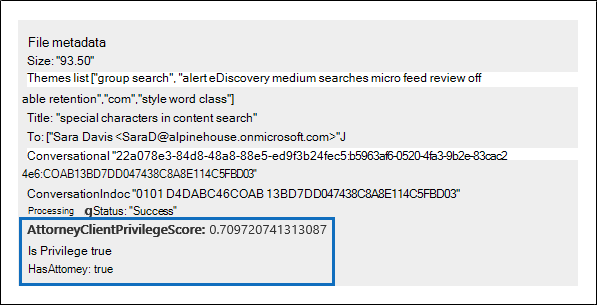

# 電子情報開示 (プレミアム) で弁護士とクライアントの特権の検出を設定する

電子情報開示プロセスのレビュー フェーズの主でコストのかかる側面は、特権コンテンツのドキュメントを確認することです。 Microsoft Purview 電子情報開示 (プレミアム) は、このプロセスをより効率的にするために、特権コンテンツの機械学習ベースの検出を提供します。 この機能は、 *弁護士とクライアントの特権の検出* と呼ばれます。

## どのような仕組みですか?

弁護士とクライアントの特権の検出が有効になっている場合、レビュー セット内のすべてのドキュメントは、レビュー セット内の [データを分析](analyzing-data-in-review-set.md) するときに、弁護士とクライアントの特権検出モデルによって処理されます。 このモデルでは、次の 2 つのことが検索されます。

- 特権コンテンツ – モデルは機械学習を使用して、本質的に法的なコンテンツがドキュメントに含まれている可能性を判断します。

- 参加者 – 弁護士とクライアントの特権検出を設定する一環として、組織の弁護士の一覧を送信する必要があります。 これを行うと、検出モデルはドキュメントの参加者と弁護士のリストを比較し、ドキュメントに 1 人以上の弁護士の参加者がいるかどうかを判断します。

このモデルでは、ドキュメントごとに次の 3 つのプロパティが生成されます。

- **AttorneyClientPrivilegeScore:** ドキュメントが本質的に法的である可能性。スコアの値は **0** ~ **1 です**。

- **HasAttorney:** このプロパティは、ドキュメント参加者の 1 つが弁護士リストに一覧表示されている場合は **true** に設定されます。それ以外の場合、値は **false です**。 組織が弁護士リストをアップロードしていない場合も、値は **false** に設定されます。

- **IsPrivilege:** このプロパティは、**AttorneyClientPrivilegeScore** の値がしきい値を超えている場合 *、または* ドキュメントに弁護士参加者が含まれている場合は **true** に設定されます。それ以外の場合、値は false に設定 **されます**。

これらのプロパティ (および対応する値) は、次のスクリーンショットに示すように、レビュー セット内のドキュメントのファイル メタデータに追加されます。

これら 3 つのプロパティは、レビュー セット内でも検索できます。 詳細については、「 [レビュー セット内のデータのクエリ](review-set-search.md)」を参照してください。

## 弁護士とクライアントの特権検出モデルを設定する

弁護士とクライアントの特権検出モデルを有効にするには、組織で有効にしてから、弁護士リストをアップロードする必要があります。

### 手順 1: 弁護士とクライアントの特権の検出を有効にする

組織内の電子情報開示管理者 (電子情報開示マネージャー役割グループの電子情報開示管理者サブグループのメンバー) であるユーザーは、電子情報開示 (プレミアム) ケースでモデルを使用できるようにする必要があります。

1. Microsoft Purview コンプライアンス ポータルで、[電子情報開示 (プレミアム)](https://go.microsoft.com/fwlink/p/?linkid=2173764) に移動し、**電子情報開示 (プレミアム) 設定** をクリックします。

   

2. **[設定**] ページで [**分析**] タブを選択し、[**弁護士とクライアントの特権の検出**] トグルを [オン] に切り替えます。

   ![[オフ] をクリックして、弁護士とクライアントの特権の検出を有効にします。](..\media\TurnOnAttorneyClientPrivilegeDetection.png)

3. **[保存]** をクリックして変更を保存します。

### 手順 2: 弁護士の一覧をアップロードする (省略可能)

弁護士とクライアントの特権検出モデルを最大限に活用し、前に説明した **Has Attorney** または **Potentially Privileged** 検出の結果を使用するには、組織で働く弁護士と法務担当者の電子メール アドレスの一覧をアップロードすることをお勧めします。

弁護士とクライアントの特権検出モデルで使用する弁護士リストをアップロードするには:

1. .csvファイル (ヘッダー行を含まない) を作成し、メール アドレスを各行に分かれた対応するユーザーに追加します。このファイルをローカル コンピューターに保存します。

2. 電子情報開示 (プレミアム) **設定** ページで、[**分析**] タブを選択します。

   **[弁護士とクライアントの特権**] ページが表示され、[**弁護士とクライアントの特権の検出**] トグルがオンになっています。

   ![[弁護士とクライアントの特権ポップアップ] ページ](..\media\AeDUploadAttorneyList1.png)

3. [ **ファイルの選択] を選択** し、手順 1. で作成した.csv ファイルを見つけて選択します。

4. [ **保存] を** 選択して、弁護士リストをアップロードします。

## 弁護士とクライアントの特権検出モデルを使用する

このセクションの手順に従って、レビュー セット内のドキュメントに対して弁護士とクライアントの特権の検出を使用します。

### 手順 1: 弁護士/クライアント特権検出モデルを使用してスマート タグ グループを作成する

レビュー プロセスで弁護士/依頼人特権の検出結果を確認する主な方法の 1 つは、スマート タグ グループを使用することです。 スマート タグ グループは、弁護士/依頼人特権の検出結果を示し、スマート タグ グループ内のタグの横に、結果をインラインで表示します。 これにより、ドキュメントのレビュー中に特権を持つ可能性のあるドキュメントをすばやく識別できます。 また、スマート タグ グループ内のタグを使用して、ドキュメントに特権付き、または特権なしのタグを付けることもできます。 スマート タグの詳細については、「[電子情報開示でのスマート タグの設定 (プレミアム)](smart-tags.md)」を参照してください。

1. 手順 1 で分析したドキュメントを含むレビュー セットで、[ **レビュー セットの管理** ] を選択し、[ **タグの管理**] を選択します。

2. [ **タグ**] で、[ **グループの追加** ] の横にあるプルダウンを選択し、[ **スマート タグ グループの追加]** を選択します。

   ![[スマート タグ グループの追加] を選択します。](../media/AeDCreateSmartTag.png)

3. [**スマート タグのモデルの選択]** ページで、[**弁護士とクライアントの特権**] の横にある **[選択]** を選択します。

   **Attorney-client 特権** という名前のタグ グループが表示されます。 これには、モデルによって生成される可能性のある結果に対応する **、Positive** と **Negative** という名前の 2 つの子タグが含まれています。

   

3. レビューに適したタグ グループとタグの名前を変更します。 たとえば、 **Positive** を **Privileged** に、 **負の** 名前を **[特権なし]** に変更できます。

### 手順 2: レビュー セットを分析する

レビュー セット内のドキュメントを分析すると、弁護士とクライアントの特権検出モデルも実行され、対応するプロパティ (「 [動作](#how-does-it-work)方法」で説明) がレビュー セット内のすべてのドキュメントに追加されます。 レビュー セット内のデータの分析の詳細については、「[電子情報開示 (プレミアム) でレビュー セット内のデータを分析する」](analyzing-data-in-review-set.md)を参照してください。

### 手順 3: 特権コンテンツのレビューにスマート タグ グループを使用する

レビュー セットを分析し、スマート タグを設定した後、次の手順ではドキュメントを確認します。 モデルでドキュメントが特権の可能性があると判断した場合、[ **タグ付け] パネル** の対応するスマート タグは、弁護士とクライアントの特権検出によって生成された次の結果を示します。

- ドキュメントに正当なコンテンツがある場合は、対応するスマート タグ (この場合は既定の **正** のタグ) の横に **[法的コンテンツ**] というラベルが表示されます。

- ドキュメントに組織の弁護士リストに含まれる参加者がいる場合は、対応するスマート タグの横に **[弁護士** ] というラベルが表示されます (この場合は、既定の **正** のタグでもあります)。

- ドキュメントに本質的に法的な可能性のあるコンテンツ *があり* 、弁護士リストに参加者が含まれている場合は、 **法的コンテンツ**  と **弁護士** ラベルの両方が表示されます。 

モデルが、ドキュメントに本質的に有効なコンテンツが含まれていないか、弁護士リストの参加者が含まれていないと判断した場合、どちらのラベルもタグ付けパネルに表示されません。

たとえば、次のスクリーンショットは 2 つのドキュメントを示しています。 最初のコンテンツには、本質的に法的な内容が含まれており、代理人の一覧に参加者が含まれています。 2 つ目にはどちらも含まれていないため、ラベルは表示されません。

ドキュメントに特権コンテンツが含まれているかどうかを確認したら、ドキュメントに適切なタグを付けることができます。
