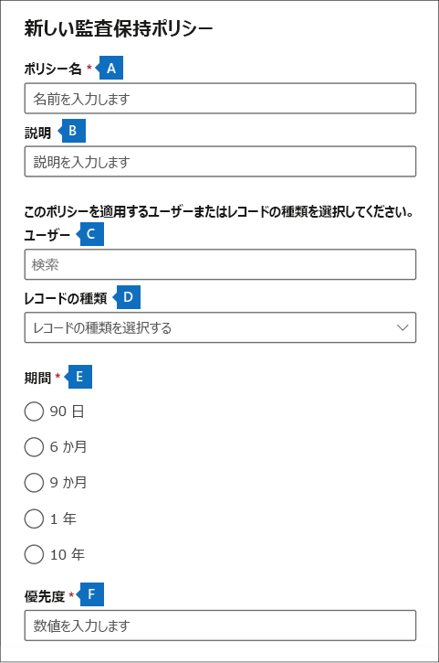

# <a name="manage-audit-log-retention-policies"></a>監査ログの保持ポリシーを管理する

[!include[Purview banner](../includes/purview-rebrand-banner.md)]

Microsoft Purview コンプライアンス ポータルで監査ログの保持ポリシーを作成および管理できます。 監査ログの保持ポリシーは、新しい Microsoft Purview 監査 (プレミアム) 機能の一部です。 監査ログの保持ポリシーでは、組織の監査ログを保持する期間を指定できます。 監査ログは、最大 10 年間保持できます。 次の条件を基にしてポリシーを作成できます。

- 1 つまたは複数の Microsoft 365 サービスのすべてのアクティビティ
- すべてのユーザーまたは特定のユーザーによって実行された (Microsoft 365 サービス内の) 特定のアクティビティ
- 優先度レベルは、組織内に複数のポリシーがある場合に、どのポリシーが優先されるかを指定する

## <a name="default-audit-log-retention-policy"></a>既定の監査ログの保持ポリシー

Microsoft 365 の監査 (プレミアム) には、すべての組織の既定の監査ログの保持ポリシーが用意されています。 このポリシーは、Exchange Online、SharePoint Online、OneDrive for Business、および Azure Active Directory のすべての監査レコードを 1 年間保持します。 この既定のポリシーは、**Workload** プロパティ (アクティビティが発生したサービス) の **Exchange**、**SharePoint**、**OneDrive**、**AzureActiveDirectory** の値を含む監査レコードを保持します。 既定のポリシーは変更できません。 既定のポリシーに含まれている各ワークロードのレコード種類の一覧については、この記事の「[詳細情報](#more-information)」を参照してください。

> [!NOTE]
> 既定の監査ログの保持ポリシーは、Office 365 または Microsoft 365 E5 ライセンスが割り当てられているユーザー、または Microsoft 365 E5 コンプライアンスまたは Microsoft 365 E5 eDiscovery and Audit アドオン ライセンスを持つユーザーが実行したアクティビティの監査レコードにのみ適用されます。 組織に E5 以外のユーザーまたはゲスト ユーザーがいる場合、こうしたユーザーに対応する監査レコードは 90 日間保持されます。

## <a name="before-you-create-an-audit-log-retention-policy"></a>監査ログの保持ポリシーを作成する前に

- 監査保持ポリシーを作成または変更するには、コンプライアンス ポータルの組織構成の役割を割り当てる必要があります。

- 組織では、最大 50 個の監査ログの保持ポリシーを設定できます。

- 監査ログを 90 日以上 (最大 1 年) 保持するには、(監査されるアクティビティの実行により) 監査ログを生成したユーザーに Office 365 E5 または Microsoft 365 E5 ライセンスを割り当てるか、または Microsoft 365 E5 Compliance または E5 eDiscovery および監査アドオン ライセンスが必要です。 監査ログを 10 年間保持するには、監査ログを生成するユーザーに対して、E5 ライセンスに加えて、10 年間の監査ログ保持のアドオン ライセンスも割り当てられる必要があります。

- 組織によって作成されるすべてのカスタム監査ログの保持ポリシーは、既定の保持ポリシーよりも優先されます。たとえば、保持期間が 1 年未満の Exchange メールボックス アクティビティに対して監査ログの保持ポリシーを作成すると、Exchange メールボックス アクティビティの監査レコードは、カスタム ポリシーで指定されている短い期間保持されます。

## <a name="create-an-audit-log-retention-policy"></a>監査ログの保持ポリシーを作成する

1. <https://compliance.microsoft.com> に移動し、コンプライアンス ポータルの [アクセス許可] ページで組織構成の役割が割り当てられているユーザー アカウントでサインインします。

2. コンプライアンス ポータルの左側のウィンドウで、**[監査]** をクリックします。

3. **[監査保持ポリシー]** タブをクリックします。

4. [**監査保持ポリシーの作成**] をクリックし、ポップアップ ページの次のフィールドに入力します。

   

   1. **ポリシー名:** 監査ログの保持ポリシーの名前です。 この名前は組織内で一意である必要があり、ポリシーの作成後に変更することはできません。

   2. **説明:** 省略可能ですが、レコードの種類やワークロード、ポリシーで指定されたユーザー、期間など、ポリシーに関する情報を提供するのに役立ちます。

   3. **ユーザー:** ポリシーを適用する 1 人以上のユーザーを選択します。 このボックスを空白のままにすると、ポリシーがすべてのユーザーに適用されます。 **レコードの種類** を空白のままにする場合は、ユーザーを選択する必要があります。

   4. **レコードの種類:** ポリシーの適用対象となる監査レコードの種類です。 このプロパティを空白のままにする場合は、[**ユーザー**] ボックスでユーザーを選択する必要があります。 1 つまたは複数のレコードの種類を選択できます。
      - 単一のレコードの種類を選択した場合は、[**アクティビティ**] フィールドが動的に表示されます。 ドロップダウン リストを使用して、選択したレコードの種類からポリシーを適用するアクティビティを選択できます。 特定のアクティビティを選択しない場合は、選択したレコードの種類のすべてのアクティビティにポリシーが適用されます。
      - 複数のレコードの種類を選択した場合、アクティビティを選択することはできません。 選択したレコードの種類のすべてのアクティビティにポリシーが適用されます。

   5. **期間:** ポリシーの条件を満たす監査ログの保持期間です。

   6. **ポリシー:** この値は、組織内の監査ログの保持ポリシーが処理される順序を決定します。 値が小さいほど、高い優先度を示します。 有効な優先度は、**1** から **10000** までの数値です。 値 **1** が最高の優先度であり、値 **10000** が最低の優先度です。 たとえば、値が **5** のポリシーは、値が **10** のポリシーよりも優先されます。 前述のとおり、カスタム監査ログの保持ポリシーは、組織の既定ポリシーよりも優先されます。

5. [**保存**] をクリックして新しい監査ログの保持ポリシーを作成します。

新しいポリシーは、**[監査保持ポリシー]** タブの一覧に表示されます。

## <a name="manage-audit-log-retention-policies-in-the-compliance-portal"></a>コンプライアンス ポータルで監査ログの保持ポリシーを管理する

監査ログの保持ポリシーは、**[監査保持ポリシー]** タブ (*ダッシュボード* とも呼ばれる) に一覧表示されます。 ダッシュボードを使用して、監査保持ポリシーを表示、編集、および削除できます。

### <a name="view-policies-in-the-dashboard"></a>ダッシュボードでポリシーを表示する

監査ログの保持ポリシーはダッシュボードに一覧表示されます。 ダッシュボードにポリシーを表示する利点の 1 つは、**[優先度]** 列をクリックして、ポリシーが適用されている優先度のポリシーを一覧表示できることです。 前に説明したように、値が低いほど、高い優先度を示します。

![監査保持ポリシー ダッシュボードの [優先度] 列。](../media/AuditLogRetentionDashboardPriority.png)

また、ポリシーを選択して、その設定をポップアップ ページに表示することもできます。

> [!NOTE]
> 組織の既定の監査ログの保持ポリシーはダッシュボードに表示されません。

### <a name="edit-policies-in-the-dashboard"></a>ダッシュボードでポリシーを編集する

ポリシーを編集するには、ポリシーを選択してポップアップ ページを表示します。 1 つ以上の設定を変更してから、変更を保存できます。

> [!IMPORTANT]
>
> **New-UnifiedAuditLogRetentionPolicy** コマンドレットを使用すると、ダッシュボードの **[監査保持ポリシーの作成]** ツールでは使用できないレコードの種類またはアクティビティの監査ログ保持ポリシーを作成できます。 この場合、**[監査保持ポリシー]** ダッシュボードからポリシーを編集 (保持期間の変更やアクティビティの追加と削除など) することはできません。 コンプライアンス センターでは、ポリシーを表示したり、削除したりすることはできません。 ポリシーを編集するには、セキュリティ/コンプライアンス センターの PowerShell で [Set-UnifiedAuditLogRetentionPolicy](/powershell/module/exchange/set-unifiedauditlogretentionpolicy) コマンドレットを使用します。
>
> **ヒント:** PowerShell を使用して編集する必要があるポリシーのメッセージがポップアップ ページの上部に表示されます。

### <a name="delete-policies-in-the-dashboard"></a>ダッシュボードでポリシーを削除する

ポリシーを削除するには、**[削除]** ![[削除アイコン]](../media/92a9f8e0-d469-48da-addb-69365e7ffb6f.jpg) を クリックします。 その後ポリシーの削除を確定します。 ポリシーはダッシュボードから削除されますが、ポリシーが組織から削除されるまでに最大 30 分かかる場合があります。

## <a name="create-and-manage-audit-log-retention-policies-in-powershell"></a>PowerShell で監査ログの保持ポリシーを作成して管理する

セキュリティ/コンプライアンス センターの PowerShell を使用して監査ログの保持ポリシーを作成して管理することもできます。 PowerShell を使用する理由の 1 つは、UI で使用できないレコードの種類またはアクティビティのポリシーを作成することです。

### <a name="create-an-audit-log-retention-policy-in-powershell"></a>PowerShell で監査ログの保持ポリシーを作成する

PowerShell で監査ログの保持ポリシーを作成するには、次の手順を実行します。

1. [セキュリティ/コンプライアンス センター PowerShell に接続します](/powershell/exchange/connect-to-scc-powershell)。

2. 次のコマンドを実行して監査ログの保持ポリーを作成します。

   ```powershell
   New-UnifiedAuditLogRetentionPolicy -Name "Microsoft Teams Audit Policy" -Description "One year retention policy for all Microsoft Teams activities" -RecordTypes MicrosoftTeams -RetentionDuration TenYears -Priority 100
   ```

   この例では、次の設定を使用して「Microsoft Teams 監査ポリシー」という名前の監査ログの保持ポリシーを作成します。

   - ポリシーの説明。
   - Microsoft Teams のすべてのアクティビティ (*RecordType* パラメーターで定義) を保持します。
   - Microsoft Teams 監査ログを 10 年間保持します。
   - 優先度が 100 の場合。

監査ログの保持ポリシーを作成するもう 1 つの例を示します。 このポリシーには、ユーザー「admin@contoso.onmicrosoft.com」の 6 か月間の「ユーザー ログイン」アクティビティの監査ログが保持されます。

```powershell
New-UnifiedAuditLogRetentionPolicy -Name "SixMonth retention for admin logons" -RecordTypes AzureActiveDirectoryStsLogon -Operations UserLoggedIn -UserIds admin@contoso.onmicrosoft.com -RetentionDuration SixMonths -Priority 25
```

詳細については、「[New-UnifiedAuditLogRetentionPolicy](/powershell/module/exchange/new-unifiedauditlogretentionpolicy)」を参照してください。

### <a name="view-policies-in-powershell"></a>PowerShell でポリシーを表示する

セキュリティ/コンプライアンス センターの PowerShell で [Get-UnifiedAuditLogRetentionPolicy](/powershell/module/exchange/get-unifiedauditlogretentionpolicy) コマンドレットを使用して、監査ログの保持ポリシーを表示します。

組織においてすべての監査ログの保持ポリシーの設定を表示するコマンドの例を以下に示します。 このコマンドを実行すると、ポリシーが優先度の高い順に並べ替えられます。

```powershell
Get-UnifiedAuditLogRetentionPolicy | Sort-Object -Property Priority -Descending | FL Priority,Name,Description,RecordTypes,Operations,UserIds,RetentionDuration
```

> [!NOTE]
> **Get-UnifiedAuditLogRetentionPolicy** コマンドレットは、組織の既定の監査ログの保持ポリシーを返しません。

### <a name="edit-policies-in-powershell"></a>PowerShell でポリシーを編集する

セキュリティ/コンプライアンス センターの PowerShell で[Set-UnifiedAuditLogRetentionPolicy](/powershell/module/exchange/set-unifiedauditlogretentionpolicy) コマンドレットを使用して、既存の監査ログの保持ポリシーを編集します。

### <a name="delete-policies-in-powershell"></a>PowerShell でポリシーを削除する

セキュリティ/コンプライアンス センターの PowerShell で[Remove-UnifiedAuditLogRetentionPolicy](/powershell/module/exchange/remove-unifiedauditlogretentionpolicy) コマンドレットを使用して、監査ログの保持ポリシーを削除します。 組織からポリシーが削除されるまで、最大 30 分かかる場合があります。

## <a name="more-information"></a>詳細情報

前述のように、Azure Active Directory、Exchange Online、SharePoint Online、および OneDrive for Business での運用に関する監査レコードは、既定で 1 年間保持されます。 次の表に、既定の監査ログの保持ポリシーに含まれるすべてのレコードの種類 (これらのサービスごと) を示します。 つまり、特定のレコードの種類、動作、またはユーザーに対してカスタム監査ログの保持ポリシーが優先されない限り、このレコードの種類の動作の監査ログは 1 年間保持されます。 各レコードの種類の Enum 値 (監査レコード内の RecordType プロパティの値として表示される) はかっこ内に表示されます。

<br>

****

|AzureActiveDirectory|Exchange |SharePoint または OneDrive|
|---|---|---|
|AzureActiveDirectory (8)|ExchangeAdmin (1)|ComplianceDLPSharePoint (11)|
|AzureActiveDirectoryAccountLogon (9)|ExchangeItem (2)|ComplianceDLPSharePointClassification (33)|
|AzureActiveDirectoryStsLogon (15)|Campaign (62)|Project (35)|
||ComplianceDLPExchange (13)|SharePoint (4)|
||ComplianceSupervisionExchange (68)|SharePointCommentOperation (37)|
||CustomerKeyServiceEncryption (69)|SharePointContentTypeOperation (55)|
||ExchangeAggregatedOperation (19)|SharePointFieldOperation (56)|
||ExchangeItemAggregated (50)|SharePointFileOperation (6)|
||ExchangeItemGroup (3)|SharePointListOperation (36)|
||InformationBarrierPolicyApplication (53)|SharePointSharingOperation (14)|
||||
