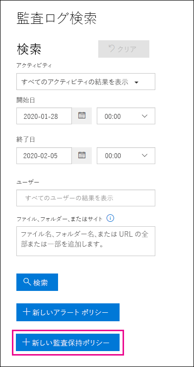
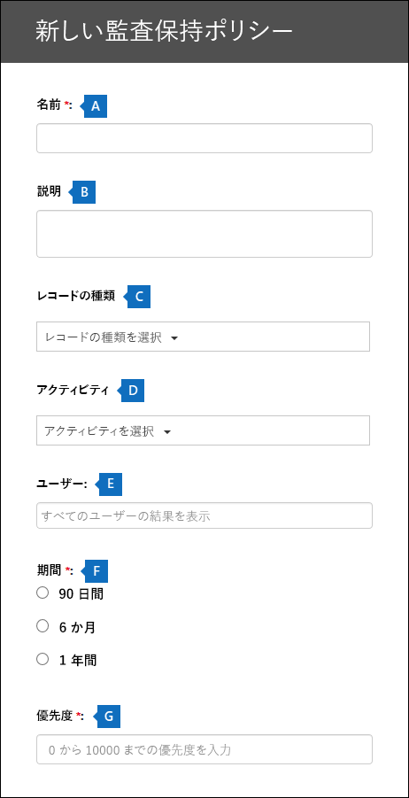

# <a name="manage-audit-log-retention-policies"></a>監査ログの保持ポリシーを管理する

セキュリティ/コンプライアンス センターで監査ログの保持ポリシーを作成および管理できます。 監査ログの保持ポリシーは、Microsoft 365 の新しい高度な監査機能の一部です。 監査ログの保持ポリシーでは、組織の監査ログを保持する期間を指定できます。 監査ログは、最大 1 年間保持できます。 次の条件を基にしてポリシーを作成できます。

- 1 つまたは複数の Microsoft 365 サービスのすべてのアクティビティ

- すべてのユーザーまたは特定のユーザーによって実行された (特定のサービスの) 特定のアクティビティ

- 優先度レベルは、組織内に複数のポリシーがある場合に、どのポリシーが優先されるかを指定する

## <a name="default-audit-log-retention-policy"></a>既定の監査ログの保持ポリシー

Microsoft 365 の高度な監査には、すべての組織の既定の監査ログの保持ポリシーが用意されています。 このポリシーでは、Exchange、SharePoint、および Azure Active Directory の監査レコードを 1 年間保持します。 この既定のポリシーは、**ワークロード** プロパティ (アクティビティが発生したサービス) の **AzureActiveDirectory**、**Exchange**、または **SharePoint** の値を含む監査レコードを保持します。 既定のポリシーは変更できません。 既定のポリシーに含まれている各ワークロードのレコード種類の一覧については、この記事の「[詳細情報](#more-information)」を参照してください。

> [!NOTE]
> 既定の監査ログの保持ポリシーは、Office 365 または Microsoft 365 E5 ライセンスが割り当てられているユーザー、または Microsoft 365 E5 コンプライアンス アドオン ライセンスを持つユーザーが実行したアクティビティの監査レコードにのみ適用されます。 組織に E5 以外のユーザーがいる場合、対応する監査レコードは 90 日間保持されます。

## <a name="before-you-begin"></a>はじめに

- 監査保持ポリシーを作成または変更するには、セキュリティ/コンプライアンス センターの組織構成の役割を割り当てる必要があります。

- 組織では、最大 50 個の監査ログの保持ポリシーを設定できます。

- 監査ログを 90 日以上保持するには、監査ログを生成したユーザーに Office 365 または Microsoft 365 E5 ライセンスを割り当てるか、または Microsoft 365 E5 コンプライアンス アドオン ライセンスが必要です。

- 組織によって作成されるすべてのカスタム監査ログの保持ポリシーでは、既定の保持ポリシーが優先されます。 たとえば、保持期間が 1 年未満の Exchange メールボックス アクティビティに対して監査ログの保持ポリシーを作成すると、Exchange メールボックス アクティビティの監査レコードは、カスタム ポリシーで指定されている短い期間保持されます。

## <a name="create-an-audit-log-retention-policy-in-the-security--compliance-center"></a>セキュリティ/コンプライアンス センターで監査ログの保持ポリシーを作成します。

1. [https://protection.office.com](https://protection.office.com) に移動し、セキュリティ/コンプライアンス センターで組織構成の役割が割り当てられているユーザー アカウントでサインインします。 

2. セキュリティ/コンプライアンス センターの左側のウィンドウで、[**検索**]  >  [**監査ログの検索**] の順にクリックします。

    [**監査ログの検索**] ページが表示されます。

    

3. [**アイテム保持ポリシーの新規作成**] をクリックし、ポップアップ ページの次のフィールドに入力します。

    

   a.  **名前:** 監査ログの保持ポリシーの名前です。 この名前は組織内で一意である必要があります。
   
   b.  **説明:** 省略可能ですが、レコードの種類やワークロード、ポリシーで指定されたユーザー、期間など、ポリシーに関する情報を提供するのに役立ちます。

   c. **レコードの種類:** ポリシーの適用対象となる監査レコードの種類です。 複数のレコードの種類を選択した場合は、選択したレコードの種類のすべてのアクティビティにポリシーが適用されるため、アクティビティを選択できません。 また、このプロパティを空白のままにする場合は、[**ユーザー**] ボックスでユーザーを選択する必要があります。

   d. **アクティビティ:** このボックスを使用して、選択したレコードの種類からアクティビティを選択します。 ポリシーを適用する特定のアクティビティを選択することができます。 特定のアクティビティを選択しない場合は、選択したレコードの種類のすべてのアクティビティにポリシーが適用されます。

   e.  **ユーザー:** ポリシーを適用する 1 人以上のユーザーを選択します。 このボックスを空白のままにすると、ポリシーがすべてのユーザーに適用されます。 **レコードの種類**を空白のままにする場合は、ユーザーを選択する必要があります。

   f. **期間:** ポリシーの条件を満たす監査ログの保持期間です。

   g.  **ポリシー:** この値は、組織内の監査ログの保持ポリシーが処理される順序を決定します。 値が高いほど、高い優先度を示します。 たとえば、優先度の値が **5** のポリシーは、優先度の値が **0** のポリシーよりも優先されます。 前述のとおり、カスタム監査ログの保持ポリシーは、組織の既定ポリシーよりも優先されます。

6. [**保存**] をクリックして新しい監査ログの保持ポリシーを作成します。 

現時点では、保持ポリシーが正常に作成されたことを示すものはありません。 監査ログの保持ポリシーのプロパティの表示については、次のセクションを参照してください。

## <a name="create-an-audit-log-retention-policy-in-powershell"></a>PowerShell で監査ログの保持ポリシーを作成する

Office 365 セキュリティ/コンプライアンス センターの PowerShell を使用して監査ログの保持ポリシーを作成することもできます。 

1. [セキュリティ/コンプライアンス センターの PowerShell に接続する](https://docs.microsoft.com/powershell/exchange/office-365-scc/connect-to-scc-powershell/connect-to-scc-powershell)。

2. 次のコマンドを実行して監査ログの保持ポリーを作成します。 

   ```powershell
   New-UnifiedAuditLogRetentionPolicy -Name "Microsoft Teams Audit Policy" -Description "One year retention policy for all Microsoft Teams activities" -RecordTypes MicrosoftTeams -RetentionDuration TwelveMonths -Priority 100
   ```
    
    この例では、次の設定を使用して「Microsoft Teams 監査ポリシー」という名前の監査ログの保持ポリシーを作成します。

   - ポリシーの説明。

   - Microsoft Teams のすべてのアクティビティ (*RecordType* パラメーターで定義) を保持します。

   - Microsoft Teams 監査ログを 1 年間保持します。

   - 優先度が 100 の場合。

監査ログの保持ポリシーを作成するもう 1 つの例を示します。 このポリシーには、ユーザー「admin@contoso.onmicrosoft.com」の 6 か月間の「ユーザー ログイン」アクティビティの監査ログが保持されます。

```powershell
New-UnifiedAuditLogRetentionPolicy -Name "SixMonth retention for admin logons" -RecordTypes AzureActiveDirectoryStsLogon -Operations UserLoggedIn -UserIds admin@contoso.onmicrosoft.com -RetentionDuration SixMonths -Priority 25
```

詳細については、「[New-UnifiedAuditLogRetentionPolicy](https://docs.microsoft.com/powershell/module/exchange/policy-and-compliance-audit/new-unifiedauditlogretentionpolicy)」を参照してください。

## <a name="view-audit-log-retention-policies"></a>監査ログの保持ポリシーを表示する

現時点では、カスタム監査ログの保持ポリシーを表示する唯一の方法は、セキュリティ センターとコンプライアンス センターの PowerShell で **Get-UnifiedAuditRetentionPolicy** コマンドレットを使用することです。 組織の監査ログの保持ポリシーの設定 (前の手順で構成済み) を表示するサンプル コマンドを示します。 このコマンドを実行すると、ポリシーが優先度の高い順に並べ替えられます。

```powershell
Get-UnifiedAuditLogRetentionPolicy | Sort-Object -Property Priority -Descending | FL Priority,Name,Description,RecordTypes,Operations,UserIds,RetentionDuration
```

> [!NOTE]
> 現時点では、**Get-UnifiedAuditLogRetentionPolicy** コマンドレットは、組織の既定の監査ログのポリシーを返しません。

詳細については、「[Get-UnifiedAuditLogRetentionPolicy](https://docs.microsoft.com/powershell/module/exchange/policy-and-compliance-audit/get-unifiedauditlogretentionpolicy)」を参照してください。

## <a name="more-information"></a>詳細情報

- セキュリティ センターとコンプライアンス センターの PowerShell で**Set-UnifiedAuditLogRetentionPolicy** コマンドレットを使用して、既存の監査ログの保持ポリシーを変更します。 詳細については、「[Set-UnifiedAuditLogRetentionPolicy](https://docs.microsoft.com/powershell/module/exchange/policy-and-compliance-audit/set-unifiedauditlogretentionpolicy)」を参照してください。

- セキュリティ センターとコンプライアンス センターの PowerShell で**Remove-UnifiedAuditLogRetentionPolicy** コマンドレットを使用して、監査ログの保持ポリシーを削除します。 ポリシーが完全に削除されるまで、最大 30 分かかる場合があります。 詳細については、「[Remove-UnifiedAuditLogRetentionPolicy](https://docs.microsoft.com/powershell/module/exchange/policy-and-compliance-audit/remove-unifiedauditlogretentionpolicy)」を参照してください。

- 前に説明したように、Azure Active Directory、Exchange、および SharePoint の運用に関する監査レコードは 1 年間保持されます。 次の表に、既定の監査ログの保持ポリシーに含まれるすべてのレコードの種類 (これらのサービスごと) を示します。 つまり、特定のレコードの種類、動作、またはユーザーに対してカスタム監査ログの保持ポリシーが優先されない限り、このレコードの種類の動作の監査ログは 1 年間保持されます。 各レコードの種類の Enum 値 (監査レコード内の RecordType プロパティの値として表示される) はかっこ内に表示されます。

   |AzureActiveDirectory |Exchange  |SharePoint|
   |:---------|:---------|:---------|
   |AzureActiveDirectory (8)|ExchangeAdmin (1)|ComplianceDLPSharePoint (11)|
   |AzureActiveDirectoryAccountLogon (9)|ExchangeItem (2)|ComplianceDLPSharePointClassification (33)|
   |AzureActiveDirectoryStsLogon (15)|Campaign (62)|Project (35)|
   ||ComplianceDLPExchange (13)|SharePoint (4)|
   ||ComplianceSupervisionExchange (68)|SharePointCommentOperation (37)|
   ||CustomerKeyServiceEncryption (69)|SharePointContentTypeOperation (55)|
   ||ExchangeAggregatedOperation (19)|SharePointFieldOperation (56)|
   ||ExchangeItemAggregated (50)|SharePointFileOperation (6)|
   ||ExchangeItemGroup (3)|SharePointListOperation (36)|
   ||InformationBarrierPolicyApplication (53)|SharePointSharingOperation (14)|
   ||||
