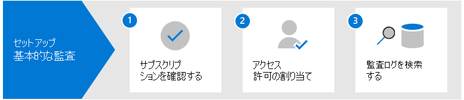
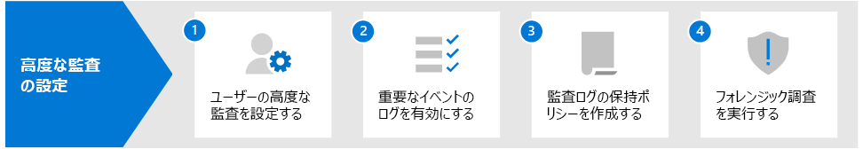

# Microsoft 365 での監査ソリューション

Microsoft 365 監査ソリューションは、セキュリティ イベント、フォレンジック調査、内部調査、コンプライアンス義務に組織が効果的に対応するための統合ソリューションが用意されています。 何十もの Microsoft 365 サービスやソリューションで実行された何千ものユーザーや管理者の操作は、組織の統一された監査ログにキャプチャされ、記録されて保持されます。 これらのイベントの監査記録は、組織内のセキュリティ オペレーション、IT 管理者、インサイダー リスク チーム、コンプライアンスや法務調査担当者が検索できます。 この機能により、Microsoft 365 の組織全体で行われているアクティビティを可視化することができます。

## Microsoft 365 監査ソリューション

Microsoft 365 には、基本的な監査と高度な監査の 2 つの監査ソリューションが用意されています。

### 基本的な監査

基本的な監査では、監査されたアクティビティのログや検索を行い、フォレンジック調査、IT 調査、コンプライアンス調査、法務調査などに役立てることができます。

- **既定で有効**。 基本的な監査は、適切なサブスクリプションを持つすべての組織で既定でオンになります。 つまり、監査されたアクティビティの記録がキャプチャされ、検索可能になるということです。 必要な設定は、監査ログ検索ツール (および対応するコマンドレット) にアクセスするために必要なアクセス許可を割り当て、ユーザーに [高度な監査] 機能の正しいライセンスが割り当てられていることを確認することだけです。
- **検索可能な数千件の監査イベント**。 組織内のほとんどの Microsoft 365 のサービスで発生する、幅広く監査されるアクティビティを検索することができます。 検索可能なアクティビティの一部のリストについては、「[監査されるアクティビティ](search-the-audit-log-in-security-and-compliance.md#audited-activities)」を参照してください。 監査活動をサポートするサービスや機能のリストについては、「[監査ログ記録タイプ](/office/office-365-management-api/office-365-management-activity-api-schema#auditlogrecordtype)」を参照してください。
- **Microsoft 365 コンプライアンス センターの監査ログ検索ツール**。 Microsoft 365 コンプライアンス センターで監査ログ検索ツールを使用して監査記録を検索します。 特定のアクティビティ、特定のユーザーが行ったアクティビティ、日付の範囲内で発生したアクティビティを検索できます。 こちらは、コンプライアンス センターの監査検索ツールのスクリーンショットです。

   

- **Search-UnifiedAuditLog コマンドレット**。 Exchange Online PowerShell の **Search-UnifiedAuditLog** コマンドレット (検索ツールの基礎となるコマンドレット) を使用して、監査イベントを検索したり、スクリプトで使用したりすることができます。 詳細については、以下を参照してください。

  - [Search-UnifiedAuditLog コマンドレットのリファレンス](/powershell/module/exchange/search-unifiedauditlog)
  - [PowerShell スクリプトを使用して監査ログを検索する](audit-log-search-script.md)

- **監査記録を CSV ファイルにエクスポートします**。 コンプライアンス センターで監査ログ検索ツールを実行した後、検索で返された監査記録を CSV ファイルにエクスポートすることができます。 これにより、Microsoft Excel を使用して、異なる監査レコードのプロパティで並べ替えやフィルター処理を行うことができます。 また、Excel Power Query の変換機能を使って、AuditData JSON オブジェクトの各プロパティを個別の列に分割することもできます。 これにより、異なるイベントの類似データを効果的に表示し、比較することができます。 詳細については、「[監査ログ レコードをエクスポート、構成、表示する](export-view-audit-log-records.md)」を参照してください。

- **Office 365 マネージメント アクティビティ API を介した監査ログにアクセスします**。 監査記録にアクセスして取得する 3 つ目の方法は、Office 365 マネージメント アクティビティ API を使用することです。 これにより、企業は監査データを既定の 90 日よりも長い期間保持し、監査データを SIEM ソリューションにインポートすることができます。 詳細については、「[Office 365 管理アクティビティ API のリファレンス](/office/office-365-management-api/office-365-management-activity-api-reference)」を参照してください。

- **90 日間の監査ログの保持**。 監査されたアクティビティがユーザーや管理者によって実行されると、監査記録が生成され、組織の監査ログに保存されます。 基本的な監査では、記録は 90 日間保持されるため、過去 3 か月以内に発生したアクティビティを検索することができます。

### 高度な監査

高度な監査は、基本的な監査の機能をベースに、監査ログの保持ポリシー、監査記録の長期保持、価値の高い重要なイベント、Office 365 マネージメント アクティビティ API への高い帯域幅でのアクセスが用意されています。

- **監査ログの保持ポリシー**。 カスタマイズした監査ログの保持ポリシーを作成すれば、最大 1 年間 (必要なアドオン ライセンスを持つユーザーは最大 10 年間)、長期にわたって監査レコードを保持できます。 監査されたアクティビティが発生するサービス、特定の監査されたアクティビティ、または監査されたアクティビティを実行するユーザーに基づいて、監査記録を保持するポリシーを作成することができます。

- **監査記録の長期保持**。 Exchange、SharePoint、および Azure Active Directory の監査レコードは、既定で 1 年間保持されます。 その他のアクティビティの監査記録は、既定では 90 日間保持されますが、監査ログの保持ポリシーを使用して、より長い保持期間を構成することができます。

- **価値の高い重要な高度な監査イベント**。 重要なイベントの監査記録は、いつメール項目がアクセスされたか、いつメール項目が返信されたか、または転送されたか、ユーザーがいつ何を Exchange Online や SharePoint Online で検索したかなどの可視性を提供することで、組織によるフォレンジック調査やコンプライアンス調査の実施をサポートします。 これらの重要なイベントは、起こりうる侵害を調査し、侵害の範囲を決定するのに役立ちます。

- **Office 365 管理アクティビティ API への高帯域幅**。 高度な監査は、組織が Office 365 マネージメント アクティビティ API を通じて監査ログにアクセスするための帯域幅を増やします。 すべての組織 (基本的な監査または高度な監査を使用している組織) には、最初に 1 分あたり 2,000 リクエストの基準値が割り当てられますが、この制限は、組織のシート数とライセンス サブスクリプションに応じて動的に増加します。 この結果、高度な監査を導入した組織は、基本的な監査を導入した組織の約 2 倍の帯域幅を得ることができます。

高度な監査機能の詳細については、「[Microsoft 365 の高度な監査](advanced-audit.md)」を参照してください。

## 主要機能の比較

次の表は、基本的な監査と高度な監査で使用できる主な機能を比較したものです。 基本的な監査機能はすべて高度な監査に含まれています。

|機能|基本的な監査|高度な監査|
|:------|:-------------|:-------------|
|既定で有効|||
|検索可能な数千件の監査イベント|||
|Microsoft 365 コンプライアンス センターの監査検索ツール|||
|Search-UnifiedAuditLog コマンドレット|||
|監査記録を CSV ファイルにエクスポートします|||
|Office 365 マネージメント アクティビティ API 1 を介した監査ログにアクセスする|||
|90 日間の監査ログの保持|||
|1 年間の監査ログの保持|||
|10 年間の監査ログの保持 2|||
|監査ログの保持ポリシー|||
|価値の高い、重要なイベント|||
||||
> [!NOTE]
> 1 高度な監査には、Office 365 マネージメント アクティビティ API へのより高い帯域幅のアクセスが含まれており、監査データへのアクセスが高速化されます。 2 高度な監査に必要なライセンス (次のセクションで説明) に加えて、監査記録を 10 年間保持するためには、ユーザーはライセンスに 10 年監査ログ保持を割り当てる必要があります。

## ライセンスの要件

以下のセクションでは、基本的な監査と高度な監査のライセンス要件を特定します。 基本的な監査機能は高度な監査に含まれています。

### 基本的な監査

- Microsoft 365 Enterprise E3 サブスクリプション
- Microsoft 365 Business Premium
- Microsoft 365 Education A3 サブスクリプション
- Microsoft 365 Government G3 サブスクリプション
- Microsoft 365 Government G1 サブスクリプション
- Office 365 Enterprise E3 サブスクリプション
- Office 365 Enterprise E1 サブスクリプション
- Office 365 Education A1 サブスクリプション
- Office 365 Education A3 サブスクリプション

### 高度な監査

- Microsoft 365 Enterprise E5 サブスクリプション
- Microsoft 365 E5 コンプライアンス アドオンが含まれている Microsoft 365 Enterprise E3 サブスクリプション
- Microsoft 365 E5 電子情報開示および監査アドオンが含まれている Microsoft 365 Enterprise E3 サブスクリプション
- Microsoft 365 Education A5 サブスクリプション
- Microsoft 365 A5 コンプライアンス アドオンが含まれている Microsoft 365 Education A3 サブスクリプション
- Microsoft 365 A5 電子情報開示および監査アドオンが含まれている Microsoft 365 Education A3 サブスクリプション
- Microsoft 365 Government G5 サブスクリプション
- Microsoft 365 G5 コンプライアンス アドオンが含まれている Microsoft 365 Government G5 サブスクリプション
- Microsoft 365 G5 電子情報開示および監査アドオンが含まれている Microsoft 365 Government G5 サブスクリプション
- Office 365 Enterprise E5 サブスクリプション
- Office 365 Education A5 サブスクリプション
- Office 365 Advanced Compliance アドオンが含まれている Office 365 Enterprise E3 サブスクリプション (新しいサブスクリプションでは利用できなくなりました)

## Microsoft 365 監査ソリューションの設定

Microsoft 365 の監査ソリューションの使用を開始するには、以下のセットアップ ガイダンスを参照してください。

### 基本的な監査の設定

最初の手順は、基本的な監査を設定し、監査ログ検索を開始します。

1. 基本的な監査をサポートするサブスクリプションと、必要に応じて高度な監査をサポートするサブスクリプションが組織にあることを確認します。

2. Microsoft 365 コンプライアンス センターの監査ログ検索ツールまたは **Search-UnifiedAuditLog** コマンドレットを使用する組織内のユーザーに、Exchange Online でアクセス許可を割り当てます。 具体的には、ユーザーは Exchange Online で閲覧限定の監査ログまたは監査ログの役割が割り当てられている必要があります。

3. 監査ログを検索します。手順 1 と手順 2 が完了したら、組織内のユーザーは監査ログ検索ツール (または対応するコマンドレット) を使用して、監査されたアクティビティを検索することができます。

詳しい説明は、「[基本的な監査の設定](set-up-basic-audit.md)」をご覧ください。

### 高度な監査の設定

高度な監査をサポートするサブスクリプションがある場合は、以下の手順で高度な監査の追加機能を設定し、使用することができます。

1. ユーザーの高度な監査を設定します。 この手順は、次のタスクで構成されています。

   - ユーザーに高度な監査の適切なライセンスまたはアドオン・ライセンスが割り当てられていることを確認します。
  
   - それらのユーザーに対して高度な監査アプリ/サービス プランを有効にします。
  
   - 重要なイベントの監査を有効にして、そのユーザーに高度な監査アプリやサービス プランをオンにします。

2. ユーザーが Exchange Online や SharePoint Online で検索を行った場合に、重要なイベントをログに記録することができます。

3. 監査ログの保持ポリシーを設定します。Exchange、SharePoint、および Azure AD の監査記録を 1 年間保持する既定のポリシーに加えて、組織のセキュリティ運用チーム、IT チーム、およびコンプライアンス チームの要件に合わせて、監査ログの保持ポリシーを追加で作成することができます。

4. フォレンジック調査を行う場合の、重要なイベントやその他のアクティビティの重要な高度検索。手順 1 と手順 2 が完了したら、侵害されたアカウントのフォレンジック調査や、その他の種類のセキュリティ調査やコンプライアンス調査を行う場合に、重要なイベントやその他のアクティビティの監査ログを検索することができます。

詳しい説明は、「[高度な監査の設定](set-up-advanced-audit.md)」をご覧ください。

## トレーニング

セキュリティ運用チーム、IT 管理者、コンプライアンス調査チームに基本的な監査と高度な監査の基礎についてトレーニングを行うことで、組織がより迅速に監査を利用して調査に役立てることができます。 Microsoft 365 は、組織内のこれらのユーザーが監査を始めるのに役立つ以下のリソースを提供します: [Microsoft 365 の電子情報開示と監査機能を説明する](/learn/modules/describe-ediscovery-capabilities-of-microsoft-365)。
