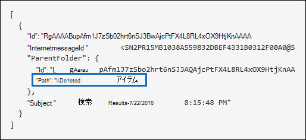
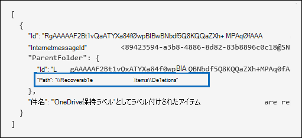

# <a name="search-the-audit-log-to-investigate-common-support-issues"></a>監査ログを検索して、一般的なサポートの問題を調査する

この記事では、監査ログ検索ツールを使用して、一般的なサポートの問題を調査する方法について説明します。 これには、監査ログを使用して次の内容を実行できます。

- 侵害されたアカウントにアクセスするために使用されたコンピューターの IP アドレスを見つける
- 誰がメールボックスの電子メール転送を設定したかを判別する
- あるユーザーが自分のメールボックスのメール項目を削除したかどうかを判別する
- ユーザーが受信トレイ ルールを作成したかどうかを判別する
- 組織外のユーザーによるログインが成功した理由を調査する
- E5 以外のライセンスを持つユーザーが実行するメールボックス アクティビティを検索する
- 代理人ユーザーが実行するメールボックス アクティビティの検索

## <a name="using-the-audit-log-search-tool"></a>監査ログ検索ツールの使用

この記事で説明する各トラブルシューティング シナリオは、監査ログ検索ツールの使用に基づいてMicrosoft 365 コンプライアンス センター。 このセクションでは、監査ログの検索に必要なアクセス許可と、監査ログ検索にアクセスして実行する手順について説明します。 各シナリオ セクションでは、監査ログ検索クエリを構成する方法と、検索条件に一致する監査レコードの詳細情報で検索する内容について説明します。

### <a name="permissions-required-to-use-the-audit-log-search-tool"></a>監査ログ検索ツールを使用するために必要なアクセス許可

監査ログを検索するには、View-Only監査ログまたは監査ログの役割Exchange Online割り当てる必要があります。 既定では、これらの役割は Exchange 管理センターの [**アクセス許可**] ページでコンプライアンス管理役割グループまたは組織管理役割グループに割り当てられています。 Office 365 および Microsoft 365 のグローバル管理者は自動的に、組織管理役割グループのメンバーとして Exchange Online に追加されます。 詳細については、「[Exchange Online で役割グループを管理する](/Exchange/permissions-exo/role-groups)」を参照してください。

### <a name="running-audit-log-searches"></a>監査ログ検索の実行

このセクションでは、監査ログ検索の作成と実行の基本について説明します。 この記事の各トラブルシューティング シナリオの開始点として、次の手順を使用します。 詳細な手順については、「監査ログの検索 [」を参照してください](search-the-audit-log-in-security-and-compliance.md#step-1-run-an-audit-log-search)。

1. <https://compliance.microsoft.com/auditlogsearch>に移動し、職場または学校アカウントを使用してサインインします。
  
    [**監査**] ページが表示されます。
  
    ![条件を構成し、[検索] を選択して検索を実行します。](../media/AuditLogSearchPage1.png)
  
2. 次の検索条件を構成できます。 この記事の各トラブルシューティング シナリオでは、これらのフィールドを構成するための具体的なガイダンスをお勧めします。
  
   a. **開始日と****終了日:** 日付と時刻の範囲を選択して、その期間に発生したイベントを表示します。 既定では、最後の 7 日間が選択されています。 日付と時間は、協定世界時 (UTC) 形式で指定します。 指定できる日付範囲は最大 90 日です。

   b. **アクティビティ:** ドロップダウン リストを選択して、検索できるアクティビティを表示します。 検索の実行後、選択したアクティビティの監査ログ エントリのみが表示されます。 [すべてのアクティビティ **の結果を表示する] を選択すると** 、他の検索条件を満たすすべてのアクティビティの結果が表示されます。 また、一部のトラブルシューティング シナリオでは、このフィールドを空白のままにしておく必要があります。
  
    c. **ユーザー:** このボックスをクリックし、検索結果を表示する 1 人または複数のユーザーを選択します。 このボックスで選択したユーザーが実行した選択したアクティビティの監査レコードが、結果の一覧に表示されます。 組織のすべてのユーザー (およびサービス アカウント) のエントリを返すには、このボックスを空白のままにします。
  
    d. **ファイル、フォルダー、またはサイト:** 指定したキーワードを含むフォルダーのファイルに関連するアクティビティを検索するには、ファイル名またはフォルダー名の一部またはすべてを入力します。 ファイルまたはフォルダーの URL を指定することもできます。 URL を使用する場合は、完全な URL パスを入力するか、URL の一部のみを入力する場合は、特殊文字やスペースを含めることはできません。 組織内のすべてのファイルおよびフォルダーのエントリを返すには、このボックスを空白のままにします。 この記事のすべてのトラブルシューティング シナリオでは、このフィールドは空白のままです。
  
3. [ **検索] を** 選択して、検索条件を使用して検索を実行します。
  
    検索結果が読み込まれ、しばらくすると監査ログ検索ツールのページに表示されます。 この記事の各セクションでは、特定のトラブルシューティング シナリオのコンテキストで探す必要がある情報について説明します。

    監査ログ検索結果の表示とエクスポートの詳細については、以下を参照してください。

    - [検索結果を表示する](search-the-audit-log-in-security-and-compliance.md#step-2-view-the-search-results)
  
    - [検索結果をエクスポートする](search-the-audit-log-in-security-and-compliance.md#step-3-export-the-search-results-to-a-file)

## <a name="find-the-ip-address-of-the-computer-used-to-access-a-compromised-account"></a>侵害されたアカウントにアクセスするために使用されたコンピューターの IP アドレスを見つける

ほとんどの監査レコードには、任意のユーザーによって実行されたアクティビティに対応する IP アドレスが含まれています。また、使用されたクライアントについての情報も監査レコードにも含まれます。

このシナリオで監査ログの検索クエリを構成する方法は次のとおりです。

**アクティビティ:** ケースに関連する場合は、検索する特定のアクティビティを選択します。 侵害されたアカウントのトラブルシューティングを行う場合は、[ユーザーがメールボックス アクティビティにサインインしたユーザー] を選択Exchange **検討してください**。 これにより、メールボックスへのサインイン時に使用された IP アドレスを示す監査レコードが返されます。 それ以外の場合は、すべてのアクティビティの監査レコードを返す場合は、このフィールドを空白のままにします。 

> [!TIP]
> このフィールドを空白のままにすると **、UserLoggedIn** アクティビティが返されます。これは、ユーザー がユーザー アカウントにサインインAzure Active Directoryを示すアクティビティです。 検索結果でフィルター処理を使用して **、UserLoggedIn 監査レコードを** 表示します。

**開始日と****終了日:** 調査に適用できる日付範囲を選択します。

**ユーザー:** 侵害されたアカウントを調査している場合は、アカウントが侵害されたユーザーを選択します。 これにより、そのユーザー アカウントによって実行されたアクティビティの監査レコードが返されます。

**ファイル、フォルダー、またはサイト:** このフィールドは空白のままにします。

検索を実行すると、検索結果の **[IP** アドレス] 列に各アクティビティの IP アドレスが表示されます。 検索結果のレコードを選択して、詳細な情報をフライアウト ページに表示します。

## <a name="determine-who-set-up-email-forwarding-for-a-mailbox"></a>誰がメールボックスの電子メール転送を設定したかを判別する

あるメールボックスの電子メール転送が構成されている場合、メールボックスに送られた電子メール メッセージは別のメールボックスに転送されます。組織の内部ユーザーと外部ユーザーのどちらにもメッセージが転送される可能性があります。メールボックスで電子メール転送が設定されると、基盤となる Exchange Online cmdlet の **Set-Mailbox** が使用されます。

このシナリオで監査ログの検索クエリを構成する方法は次のとおりです。

**アクティビティ:** 検索がすべてのアクティビティの監査レコードを返す場合は、このフィールドを空白のままにします。 これは、Set-Mailbox コマンドレットに関連する監査レコード **を返す場合に必要** です。

**開始日と****終了日:** 調査に適用できる日付範囲を選択します。

**ユーザー:** 特定のユーザーのメール転送の問題を調査する場合をしない限り、このフィールドは空白のままにします。 これにより、メール転送が任意のユーザーに対して設定されたのか確認できます。

**ファイル、フォルダー、またはサイト:** このフィールドは空白のままにします。

検索を実行した後、検索結果ページ **で [結果の** フィルター] を選択します。 [アクティビティ] 列ヘッダー **の下** のボックスに **「Set-Mailbox」** と入力し **、Set-Mailbox** コマンドレットに関連する監査レコードだけが表示されます。


この時点で、各監査レコードの詳細を確認して、アクティビティがメール転送に関連しているかどうかを判断する必要があります。 監査レコードを選択して [ **詳細]** フライアウト ページを表示し、[詳細情報] **を選択します**。 次のスクリーンショットと説明では、メールボックスで電子メール転送が設定されたと示す情報が強調表示されます。


a. [**ObjectId**] フィールドに、電子メール転送が設定されたメールボックスのエイリアスが表示されます。また、このメールボックスは検索結果ページの [**項目**] 列にも表示されます。

b. [パラメーター **] フィールド** の値 *ForwardingSmtpAddress は* 、メール転送がメールボックスに設定されたかどうかを示します。 この例では、メールは組織の外部にある mike@contoso.com メール アドレスに alpinehouse.onmicrosoft.com されます。

c. *DeliverToMailboxAndForward* パラメーターの True 値は、メッセージのコピーが sarad@alpinehouse.onmicrosoft.com に配信され *、ForwardingSmtpAddress* パラメーターで指定された電子メール アドレスに転送され、この例では mike@contoso.com です。   *DeliverToMailboxAndForward* パラメーターの値が *False* に設定されている場合、Email は *ForwardingSmtpAddress* パラメーターで指定されたアドレスにのみ転送されます。 ObjectId フィールドで指定されたメールボックスには **配信** されません。

d. UserId **フィールドは、ObjectId** フィールドで指定されたメールボックスにメール転送を設定したユーザー **を示** します。 このユーザーは、検索結果ページ **の [ユーザー** ] 列にも表示されます。 この場合、メールボックスの所有者は自分のメールボックスにメール転送を設定しているようです。

メールボックスのメール転送を設定すべきでないと判断される場合は、Exchange Online PowerShell で次のコマンドを実行して、この設定を削除できます:

```powershell
Set-Mailbox <mailbox alias> -ForwardingSmtpAddress $null 
```

メール転送に関連するパラメーターの詳細については [、「Set-Mailbox」の記事を参照](/powershell/module/exchange/set-mailbox) してください。

## <a name="determine-if-a-user-deleted-email-items"></a>ユーザーが電子メール アイテムを削除したかどうかを確認する

2019 年 1 月から、Microsoft はすべての組織で既定でメールボックス監査ログOffice 365オンになっています。 つまり、メールボックス所有者によって実行される特定のアクションは自動的にログに記録され、対応するメールボックス監査レコードはメールボックス監査ログで検索するときに使用できます。 既定でメールボックス監査を有効にする前に、組織内のすべてのユーザー メールボックスに対して手動で有効にする必要があります。 

既定でログに記録されるメールボックスアクションには、メールボックス所有者によって実行される SoftDelete および HardDelete メールボックス アクションが含まれます。 つまり、次の手順を使用して、削除された電子メール アイテムに関連するイベントの監査ログを検索できます。 既定でのメールボックス監査の詳細については、「メールボックス監査の管理 [」を参照してください](enable-mailbox-auditing.md)。

このシナリオで監査ログの検索クエリを構成する方法は次のとおりです。

**アクティビティ:**[**メールボックスExchange] で**、次のアクティビティの 1 つまたは両方を選択します。

- **[削除済みアイテム] フォルダーから削除されたメッセージ:** このアクティビティは **、SoftDelete メールボックス監査アクション** に対応します。 このアクティビティは、ユーザーがアイテムを選択して Shift + Delete キーを押してアイテムを完全に削除 **した場合にもログに記録されます**。 アイテムが完全に削除された後、削除されたアイテムの保持期間が経過するまで、ユーザーはアイテムを回復できます。

- **メールボックスから削除されたメッセージ:** このアクティビティは **、HardDelete** メールボックス監査アクションに対応します。 これは、ユーザーが回復可能なアイテム フォルダーからアイテムを削除するとログに記録されます。 管理者は、セキュリティとコンプライアンス センターのコンテンツ検索ツールを使用して、ユーザーのメールボックスが保持されている場合に削除済みアイテムの保持期間が経過するまで、削除済みアイテムを検索して回復できます。

**開始日と****終了日:** 調査に適用できる日付範囲を選択します。

**ユーザー:** このフィールドでユーザーを選択すると、監査ログ検索ツールは、指定したユーザーによって削除されたメール アイテム (SoftDeleted または HardDeleted) の監査レコードを返します。 メールを削除するユーザーがメールボックスの所有者ではない場合があります。

**ファイル、フォルダー、またはサイト:** このフィールドは空白のままにします。

検索を実行した後、検索結果をフィルター処理して、ソフト削除されたアイテムまたはハード削除されたアイテムの監査レコードを表示できます。 監査レコードを選択して [ **詳細]** フライアウト ページを表示し、[詳細情報] **を選択します**。 削除された項目に関する追加情報(件名、項目が削除されたときの場所など) は、 [**対象アイテム**] フィールドに表示されます。 次のスクリーンショットは、ソフト削除されたアイテムとハード削除されたアイテムの **AffectedItems** フィールドの例を示しています。

**ソフト削除された項目の AffectedItems フィールドの例**



**ハード削除された項目の AffectedItems フィールドの例**



### <a name="recover-deleted-email-items"></a>削除されたメール アイテムを復元する

削除済みアイテムの保持期間が経過していない場合、ユーザーは削除済みアイテムを回復できます。 このExchange Online、削除済みアイテムの既定の保持期間は 14 日ですが、管理者は、この設定を最大 30 日間に増やします。 削除済みアイテムを[回復](https://support.office.com/article/Recover-deleted-items-or-email-in-Outlook-Web-App-C3D8FC15-EEEF-4F1C-81DF-E27964B7EDD4)する手順については、Outlook on the webの [削除済みアイテムまたは電子メールを回復する] をポイントします。

前に説明したように、削除済みアイテムの保持期間が経過しない場合、またはメールボックスが保持されている場合は、保持期間が経過するまでアイテムが保持されている場合、管理者は削除されたアイテムを回復できます。 コンテンツ検索を実行すると、回復可能なアイテム フォルダー内のソフト削除済みアイテムとハード削除されたアイテムが、検索クエリと一致する場合、検索結果に返されます。 コンテンツ検索の実行の詳細については、「コンテンツ検索」を参照[Office 365。](content-search.md)

> [!TIP]
> 削除済み電子メール項目を検索するには、監査レコードの [**AffectedItems**] フィールドに表示されている件名行の全体または一部を検索します。

## <a name="determine-if-a-user-created-an-inbox-rule"></a>ユーザーが受信トレイ ルールを作成したかどうかを判別する

ユーザーが自分の Exchange Online メールボックスの受信トレイ ルールを作成すると、それに対応する監査レコードが監査ログに保存されます。受信トレイ ルールの詳細については、次を参照してください:

- [Web 上の Outlook で受信トレイ ルールを使用する](https://support.office.com/article/use-inbox-rules-in-outlook-on-the-web-8400435c-f14e-4272-9004-1548bb1848f2)
- [Outlook でルールを使用してメール メッセージを管理する](https://support.office.com/article/Manage-email-messages-by-using-rules-C24F5DEA-9465-4DF4-AD17-A50704D66C59)

このシナリオで監査ログの検索クエリを構成する方法は次のとおりです。

**アクティビティ:**[メールボックス **Exchange] で****、[New-InboxRule] [受信トレイルールの作成/変更/有効化/無効化] を選択します**。

**開始日と****終了日:** 調査に適用できる日付範囲を選択します。

**ユーザー:** 特定のユーザーを調査しない限り、このフィールドは空白のままにします。 これにより、任意のユーザーが設定した新しい受信トレイ ルールを特定できます。

**ファイル、フォルダー、またはサイト:** このフィールドは空白のままにします。

検索を実行すると、このアクティビティのすべての監査レコードが検索結果に表示されます。 監査レコードを選択して [ **詳細]** フライアウト ページを表示し、[詳細情報] **を選択します**。 受信トレイのルール設定に関する情報は、**[パラメーター]** フィールドに表示されます。 次のスクリーンショットと説明では、受信トレイ ルールに関する情報を強調表示します。


a. [**ObjectId**] フィールドに受信トレイ ルールの完全な名前が表示されます。この名前には、ユーザーのメールボックスのエイリアス (たとえば SaraD) と受信トレイ ルールの名前 (たとえば「管理者からのメッセージを移動」) が含まれます。

b. [**パラメーター**] フィールドには受信トレイ ルールの条件が表示されます。この例では、[*送信者*] パラメーターによって条件が指定されます。[*送信者*] パラメーターに定義された値は、admin@alpinehouse.onmicrosoft.com から送られた電子メールを受信トレイ ルールで処理することを示しています。受信トレイ ルールの条件の定義に使用できるパラメーターの完全なリストについては、「[New-InboxRule](/powershell/module/exchange/new-inboxrule)」の記事を参照してください。

c. *MoveToFolder パラメーターは*、受信トレイ ルールのアクションを指定します。 この例では、管理者から受信したメッセージ admin@alpinehouse.onmicrosoft.com AdminSearch という名前のフォルダー *に移動します*。 受信トレイ ルールのアクションを定義するために使用できるパラメーターの完全な一覧については [、「New-InboxRule」](/powershell/module/exchange/new-inboxrule) の記事も参照してください。

d. UserId **フィールドは、ObjectId** フィールドで指定された受信トレイ ルールを作成したユーザー **を示** します。 このユーザーは、検索結果ページ **の [ユーザー** ] 列にも表示されます。

## <a name="investigate-why-there-was-a-successful-login-by-a-user-outside-your-organization"></a>組織外のユーザーによるログインが成功した理由を調査する

監査ログで監査レコードを確認すると、外部ユーザーが Azure Active Directory によって認証され、組織に正常にログインされたことを示すレコードが表示される場合があります。 たとえば、contoso.onmicrosoft.com の管理者に、別の組織のユーザー (fabrikam.onmicrosoft.com など) が正常に contoso.onmicrosoft.com にログインしたという監査レコードが表示される場合があります。 同様に、microsoft アカウント (MSA) を持つユーザー (Outlook.com や Live.com など) を持つユーザーが組織に正常にログインされたことを示す監査レコードが表示される場合があります。 このような状況では、監査されたアクティビティは User **logged In です**。 

この動作は仕様です。 Azure Active Directory (Azure AD) は、外部ユーザーが組織内の SharePointサイトまたは OneDrive の場所にアクセスしようとするときに、パススルー認証と呼ばれるものを許可します。 外部ユーザーがこれを実行しようとすると、資格情報の入力を求めるメッセージが表示されます。 Azure ADは、資格情報を使用してユーザーを認証します。つまり、Azure ADユーザーが自分の資格情報を確認する必要があります。 監査レコードで正常にログインされたことを示すのは、Azure がユーザーを認証AD結果です。 ログインが成功しても、ユーザーが組織内のリソースにアクセスしたり、その他の操作を実行できたという意味で、ユーザーは実行できるとは言えなかねない。 これは、ユーザーが Azure サーバーによって認証されたAD。 パススルー ユーザーが SharePoint または OneDrive リソースにアクセスするには、組織内のユーザーが共有の招待または匿名共有リンクを送信して、リソースを外部ユーザーと明示的に共有する必要があります。 

> [!NOTE]
> Azure ADでは、ファースト パーティ アプリケーション (オンラインやオンライン など) に対SharePointパススルー認証OneDrive for Business。 他のサード パーティ製アプリケーションでは許可されません。

パススルー認証の結果であるユーザーログインの監査レコード内の関連プロパティの例と説明を次に示します。 監査レコードを選択して [ **詳細]** フライアウト ページを表示し、[詳細情報] **を選択します**。


   a. このフィールドは、組織内のリソースにアクセスしようとしたユーザーが組織の Azure リソースに見つからなかったAD。

   b. このフィールドには、組織内のリソースにアクセスしようとした外部ユーザーの UPN が表示されます。 このユーザー ID は、監査レコードの **User** プロパティと **UserId** プロパティでも識別されます。

   c. **ApplicationId プロパティ** は、ログオン要求をトリガーしたアプリケーションを識別します。 この監査レコードの ApplicationId プロパティに表示される 00000003-000003-00000-0ff1-ce00-000000000 の値は、SharePoint Online を示します。 OneDrive for Business ApplicationId も同じです。

   d. これは、パススルー認証が成功したかどうかを示します。 つまり、ユーザーが Azure サーバーによって正常に認証AD。 

   e. **RecordType 値** **15** は、監査されたアクティビティ (UserLoggedIn) が Azure AD の Secure Token Service (STS) ログオン イベントAD。

UserLoggedIn 監査レコードに表示されるその他のプロパティの詳細については、「AD 管理アクティビティ API スキーマ」の「Azure AD Office 365 関連スキーマ情報」を[参照してください](/office/office-365-management-api/office-365-management-activity-api-schema#azure-active-directory-base-schema)。

パススルー認証により、ユーザーが監査アクティビティにログインし成功するシナリオの例を次に 2 つ示します。 

  - Microsoft アカウント (SaraD@outlook.com など) を持つユーザーが fourthcoffee.onmicrosoft.com の OneDrive for Business アカウント内のドキュメントにアクセスしようとしたが、fourthcoffee.onmicrosoft.com に SaraD@outlook.com の対応するゲスト ユーザー アカウントが存在しない。

  - 組織内の仕事用アカウントまたは学校アカウントを持つユーザー (pilarp@fabrikam.onmicrosoft.com など) が contoso.onmicrosoft.com の SharePoint サイトにアクセスしようとしたが、contoso.onmicrosoft.com に pilarp@fabrikam.com の対応するゲスト ユーザー アカウントが存在しない。

### <a name="tips-for-investigating-successful-logins-resulting-from-pass-through-authentication"></a>ヒント認証による成功したログインを調査する方法

- 監査レコードにログインしているユーザーで識別された外部ユーザーによって実行されるアクティビティの監査 **ログを** 検索します。 [ユーザー] ボックスに外部ユーザーのUPN を入力し、シナリオに関連する場合は日付範囲を使用します。 たとえば、次の検索条件を使用して検索を作成できます。

   

    ユーザーがログインしたアクティビティに加えて、組織内のユーザーが外部ユーザーとリソースを共有し、外部ユーザーが共有されたドキュメントにアクセス、変更、またはダウンロードしたかどうかを示す、他の監査レコードが返される場合があります。

- ユーザーがSharePointした監査レコードによって識別された外部ユーザーとファイルが共有されたかどうかを示す共有アクティビティを **検索します**。 詳細については、「[監査ログで共有監査を使用する](use-sharing-auditing.md)」を参照してください。

- 調査に関連するレコードを含む監査ログ検索結果をエクスポートして、外部ユーザーに関連する他のアクティビティExcelを使用して検索できます。 詳細については、「監査ログ レコードの  [エクスポート、構成、および表示」を参照してください](export-view-audit-log-records.md)。

## <a name="search-for-mailbox-activities-performed-by-users-with-non-e5-licenses"></a>E5 以外のライセンスを持つユーザーが実行するメールボックス アクティビティを検索する

組織で [](enable-mailbox-auditing.md)既定でメールボックス監査が有効になっている場合でも、コンプライアンス センター **、Search-UnifiedAuditLog** コマンドレット、または Office 365 管理アクティビティ API を使用した監査ログ検索で、一部のユーザーのメールボックス監査イベントが見つからない場合があります。 この理由は、前のいずれかの方法で統合監査ログを検索する場合に、E5 ライセンスを持つユーザーに対してだけメールボックス監査イベントが返されるという理由です。

E5 以外のユーザーのメールボックス監査ログ レコードを取得するには、次のいずれかの回避策を実行できます。

- 個々のメールボックスでメールボックス監査を手動で有効にします `Set-Mailbox -Identity <MailboxIdentity> -AuditEnabled $true` (PowerShell でコマンドExchange Onlineします)。 これを行った後、コンプライアンス センター **、Search-UnifiedAuditLog** コマンドレット、または管理アクティビティ API を使用してメールボックス監査Office 365検索します。
  
  > [!NOTE]
  > メールボックス監査が既にメールボックスで有効になっていると思うが、検索で結果が返されない場合は _、AuditEnabled_ パラメーターの値をに変更してからに `$false` 戻します `$true` 。
  
- PowerShell で次のコマンドレットをExchange Onlineします。

  - [Search-MailboxAuditLog を](/powershell/module/exchange/search-mailboxauditlog) 使用して、特定のユーザーのメールボックス監査ログを検索します。

  - [New-MailboxAuditLogSearch](/powershell/module/exchange/new-mailboxauditlogsearch) を使用して、特定のユーザーのメールボックス監査ログを検索し、指定した受信者に電子メールで結果を送信します。

## <a name="search-for-mailbox-activities-performed-in-a-specific-mailbox-including-shared-mailboxes"></a>特定のメールボックス (共有メールボックスを含む) で実行されるメールボックス アクティビティの検索

コンプライアンス センターの監査ログ検索ツールの [ユーザー] ドロップダウン リスト、または Exchange Online PowerShell の **[Search-UnifiedAuditLog -UserIds]** コマンドを使用すると、特定のユーザーが実行したアクティビティを検索できます。 メールボックス監査アクティビティの場合、この種類の検索では、指定したユーザーが実行したアクティビティを検索します。 同じメールボックスで実行されたすべてのアクティビティが検索結果に返されるという保証はありません。 たとえば、特定のユーザーが実行したメールボックス アクティビティを検索しても、他のユーザーのメールボックスにアクセスするためのアクセス許可が割り当てられている代理人ユーザーによって実行されたアクティビティは返されないので、監査ログ検索では代理人ユーザーが実行したアクティビティの監査レコードは返されません。 (代理人ユーザーとは、SendAs、SendOnBehalf、または FullAccess メールボックスのアクセス許可が別のユーザーのメールボックスに割り当てられているユーザーです。

また、監査ログ **検索ツール** または **Search-UnifiedAuditLog -UserIds** で [ユーザー] ドロップダウン リストを使用すると、共有メールボックスで実行されたアクティビティの結果は返されません。

特定のメールボックスで実行されたアクティビティを検索したり、共有メールボックスで実行されたアクティビティを検索したりするには **、Search-UnifiedAuditLog** コマンドレットを実行するときに次の構文を使用します。

```powershell
Search-UnifiedAuditLog  -StartDate <date> -EndDate <date> -FreeText (Get-Mailbox <mailbox identity).ExchangeGuid
```

たとえば、次のコマンドは、2020 年 8 月から 2020 年 10 月の間に Contoso コンプライアンス チーム共有メールボックスで実行されたアクティビティの監査レコードを返します。

```powershell
Search-UnifiedAuditLog  -StartDate 08/01/2020 -EndDate 10/31/2020 -FreeText (Get-Mailbox complianceteam@contoso.onmicrosoft.com).ExchangeGuid
```

または **、Search-MailboxAuditLog** コマンドレットを使用して、特定のメールボックスで実行されるアクティビティの監査レコードを検索することもできます。 これには、共有メールボックスで実行されるアクティビティの検索が含まれます。

次の例では、Contoso コンプライアンス チーム共有メールボックスで実行されたアクティビティのメールボックス監査ログ レコードを返します。

```powershell
Search-MailboxAuditLog -Identity complianceteam@contoso.onmicrosoft.com -StartDate 08/01/2020 -EndDate 10/31/2020 -ShowDetails
```

次の使用例は、代理人ユーザーが指定したメールボックスで実行されたアクティビティのメールボックス監査ログ レコードを返します。

```powershell
Search-MailboxAuditLog -Identity <mailbox identity> -StartDate <date> -EndDate <date> -LogonTypes Delegate -ShowDetails
```

**New-MailboxAuditLogSearch** コマンドレットを使用して、特定のメールボックスの監査ログを検索し、指定した受信者に電子メールで結果を送信することもできます。