# <a name="use-retention-labels-to-manage-the-lifecycle-of-documents-stored-in-sharepoint"></a>保持ラベルを使用して、SharePoint に保存されているドキュメントのライフサイクルを管理する

>*[セキュリティとコンプライアンスのための Microsoft 365 ライセンス ガイダンス](/office365/servicedescriptions/microsoft-365-service-descriptions/microsoft-365-tenantlevel-services-licensing-guidance/microsoft-365-security-compliance-licensing-guidance)。*

この記事では、自動的に適用される保持ラベルとイベントベースの保持を使用して、SharePoint に保存されているドキュメントのライフサイクルを管理する方法について説明します。

自動適用機能は、ドキュメントを分類するために SharePoint メタデータを使用します。 この記事は製品関連ドキュメント向けですが、他のシナリオにも同じ概念を使用できます。 たとえば、石油およびガス産業では、石油基地、坑井検層、生産ライセンスなどの物理的資産に関するドキュメントのライフサイクルを管理できます。 金融サービス業界では、銀行口座、住宅ローン、または保険契約に関するドキュメントを管理できます。 公的機関では、建設許可または税務フォームに関する文書を管理できます。

この記事では、情報アーキテクチャと保持ラベルの定義を見ていきます。 ラベルを自動適用して、ドキュメントを分類します。 最後に、保持期間を開始するイベントが生成されます。

## <a name="information-architecture"></a>情報アーキテクチャ

このシナリオは、SharePoint を使用して、会社が開発する製品に関するすべてのドキュメントを保存する製造会社です。 これらのドキュメントには、製品の仕様、仕入先との契約、およびユーザー マニュアルが含まれます。 これらのドキュメントがエンタープライズ コンテンツ管理ポリシーを通して SharePoint に保存されている場合、ドキュメント メタデータが定義され、分類に使用されます。 各ドキュメントには、次のメタデータ プロパティがあります。

- **ドキュメントの種類** (製品の仕様、契約、ユーザー マニュアルなど)

- **製品名**

- **状態** (下書きまたは最終版)

このメタデータは、すべてのドキュメントの *生産ドキュメント* と呼ばれる基本コンテンツの種類を形成します。

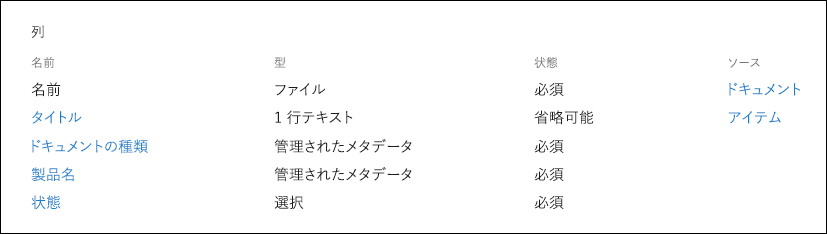

> [!NOTE]
> **ドキュメントの種類** および **状態** プロパティは、後述のシナリオで保持ポリシーによって使用され、保持ラベルを分類して自動適用します。

さまざまな種類のドキュメントを表すコンテンツの種類が複数ありますが、製品ドキュメントに重点を置きましょう。

このシナリオでは、Managed Metadata Service と用語ストアを使用して、*ドキュメントの種類* の用語セットと *製品名* の用語セットを作成します。 用語セットごとに、値ごとに用語を作成します。 SharePoint 組織の用語ストアでは、次のようになります。

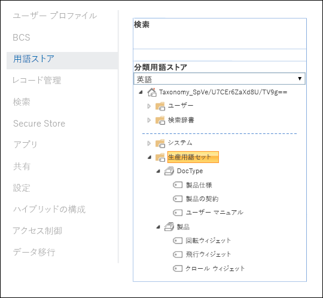

*コンテンツの種類* は、[コンテンツ タイプ ハブ](https://support.office.com/article/manage-content-type-publishing-06f39ac0-5576-4b68-abbc-82b68334889b) を使用して作成および公開できます。 コンテンツの種類は、[PnP プロビジョニング フレームワーク](/sharepoint/dev/solution-guidance/pnp-provisioning-framework) や [サイト デザイン JSON スキーマ](/sharepoint/dev/declarative-customization/site-design-json-schema#define-a-new-content-type) などのサイト プロビジョニング ツールを使用して作成および公開することもできます。

各製品には、1 つのドキュメント ライブラリを含む専用の SharePoint サイトがあり、適切なコンテンツの種類が有効になっています。すべてのドキュメントがこのドキュメント ライブラリに格納されています。

[](../media/SPRetention3.png#lightbox)

> [!NOTE]
> このシナリオの製造会社では、製品ごとに SharePoint サイトを用意する代わりに、製品ごとに Microsoft Teams を使用して、永続チャットなどのチーム メンバーとの共同作業をサポートし、Teams の [**ファイル**] タブを使用してドキュメントを管理できます。 この記事ではドキュメントのみに重点を置いているため、サイトのみを使用します。

回転ウィジェット製品のドキュメント ライブラリのビューを次に示します。

[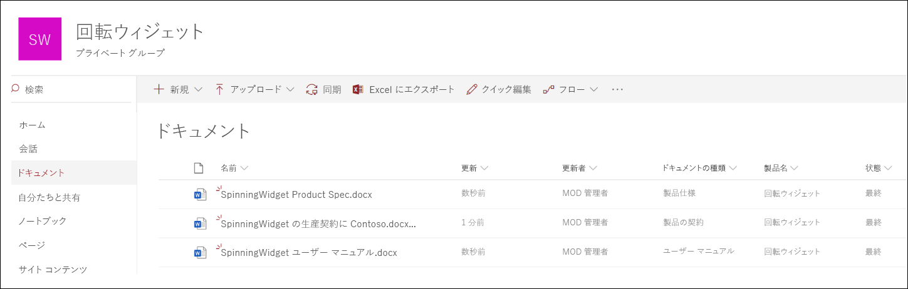](../media/SPRetention4.png#lightbox)

ドキュメント管理用に基本的な情報アーキテクチャが用意されているので、ドキュメントのメタデータと分類を使用するドキュメントの保持および廃棄戦略を見てみましょう。

## <a name="retention-and-disposition"></a>保持および廃棄

製造会社のコンプライアンスおよびデータ ガバナンスのポリシーは、データの保持および廃棄方法を規定しています。 製品に関連するドキュメントは、製品を製造する期間、および一定の追加期間保管する必要があります。 この追加期間は、製品の仕様、契約、およびユーザー マニュアルによって異なります。 次の表は、保持と廃棄の要件を示しています。

|   ドキュメントの種類            |   保持                            |   廃棄                                |
| -------------------------- | -------------------------------------- | -------------------------------------------- |
| 製品の仕様      | 生産中止後 5 年  | 削除                                       |
| 製品契約          | 生産中止後 10 年 | レビュー                                       |
| ユーザー マニュアル                | 生産中止後 5 年  | 削除                                       |
| 他のすべての種類のドキュメント | 積極的に保持しない  | ドキュメントが 3 年以上経過したときに削除する <br /><br /> 過去 3 年以内に変更されていないドキュメントは、3 年以上前のものと見なされます。 |
|||

Microsoft 365 コンプライアンス センターを使用して、次の [保持ラベル](retention.md#retention-labels) を作成します。

  - 製品の仕様

  - 製品の契約

  - ユーザー マニュアル

この記事では、製品の仕様の保持ラベルを作成して自動適用する方法のみを示します。 完全なシナリオを実装するには、他の 2 つのドキュメントの種類の保持ラベルも作成して自動適用します。

### <a name="settings-for-the-product-specification-retention-label"></a>製品の仕様の保持ラベルの設定

製品の仕様の保持ラベルの[ファイル計画](file-plan-manager.md)は次のとおりです。

- **名前:** 製品の仕様

- **ユーザー向けの説明:** 生産中止後 5 年間保持します。

- **管理者向けの説明:** 生産中止後 5 年間保持、自動削除、イベント ベースの保持、イベントの種類は *製品の中止* です。

- **保持処理:** 保持して削除します。

- **保持期間:** 5 年 (1825 日) です。

- **レコード ラベル**: アイテムを [レコード](records-management.md#records)としてマークするように保持ラベルを設定します。つまり、ラベル付けされたドキュメントをユーザーが変更または削除することはできません。

- **ファイル計画記述子:** シナリオを簡素化するため、オプションのファイル記述子は提供されません。

次のスクリーンショットは、Microsoft 365 コンプライアンス センターで製品の仕様の保持ラベルを作成するときの設定を示しています。 保持ラベルを作成するときに、*製品の中止* のイベントの種類を作成できます。 次のセクションの手順を参照してください。

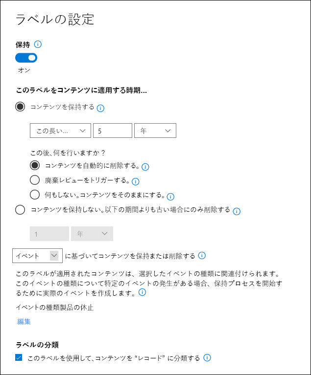

> [!NOTE]
> テスト環境でこのシナリオを再作成する場合、5 年経ってからドキュメントを削除することを防ぐには、保持期間を ***1 日*** に設定します。

### <a name="create-an-event-type-when-you-create-a-retention-label"></a>保持ラベルを作成するときにイベント種類を作成する

1. 保持ラベルの作成]ウィザードの [**保持設定の定義**] ページで、**次の基準に基づいて保持期間を開始** した後、[**新しいイベントの種類を作成する**] を選択します。

    ![[製品仕様書ラベル] ダイアログボックスの新しいイベントの種類を作成する](../media/SPRetention6.png)

3. [**イベントの種類に名前を付ける**] ページで、[**製品の停止**] とオプションの説明を入力します。 次に、[**次へ**]、[**送信**]、[**完了**] を選択します。

4. [**保持設定の定義**] ページに戻り、[**保持期間の開始日**] のドロップダウン ボックスを使用して、作成した [**製品の停止**] のイベントの種類を選択します。

    製品の仕様の保持ラベルの設定は次のとおりです。

   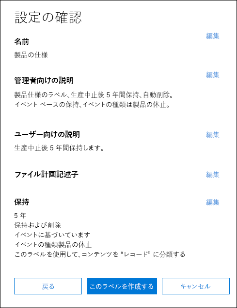

6. [**ラベルの作成**] を選択し、次のページでラベルの公開、ラベルの自動適用、または単にラベルを保存するオプションが表示されたら、[**今すぐラベルを保存する**] を選択し、[**完了**] を選択します。

    > [!TIP]
    > 詳細な手順については、「[保持期間がイベントに基づくラベルを作成する](event-driven-retention.md#step-1-create-a-label-whose-retention-period-is-based-on-an-event)」をご覧ください。

次に、製品仕様のコンテンツに保持ラベルを自動で適用する方法を見てみましょう。

## <a name="auto-apply-retention-labels-to-documents"></a>保持ラベルをドキュメントに自動適用

キーワード クエリ言語 (KQL) を使用して、作成した保持ラベルを [自動適用](apply-retention-labels-automatically.md) します。 KQL は、検索クエリの構築に使用される言語です。 KQL では、キーワードまたは管理プロパティを使用して検索できます。 詳細については、「[キーワード クエリ言語 (KQL) 構文のリファレンス](/sharepoint/dev/general-development/keyword-query-language-kql-syntax-reference)」 を参照してください。

基本的に、大まかに言うと、Microsoft 365 に、「**製品の仕様** の保持ラベルを、**最終版** の **状態** および **製品の仕様** の **ドキュメントの種類** であるすべてのドキュメントに適用する」 ように指示します。 **状態** および **ドキュメントの種類** は、以前に 「[情報アーキテクチャ](#information-architecture)」 セクションで製品のドキュメント コンテンツの種類に対して定義したサイト列であることを思い出してください。 これを行うには、検索スキーマを構成する必要があります。

SharePoint がコンテンツのインデックスを作成するとき、各サイト列のクロールされたプロパティを自動的に生成します。 このシナリオでは、**ドキュメントの種類** プロパティと **状態** プロパティに関心があります。 検索でクロールされたプロパティを作成するには、適切なコンテンツの種類を使用し、サイト列に入力されたライブラリ内のドキュメントが必要です。

SharePoint 管理センターで検索構成を開き、[**検索スキーマの管理**] を選択して、クロールされたプロパティを表示および構成できます。

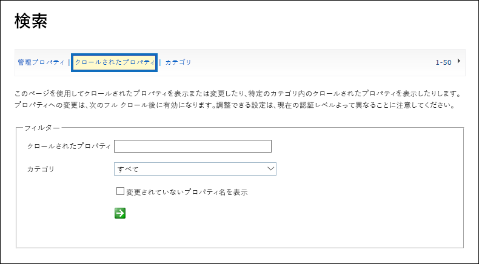

[_ *クロールされたプロパティ**] ボックスに ***状態** _ を入力し、緑色の矢印を選択すると、次のような結果が表示されます。

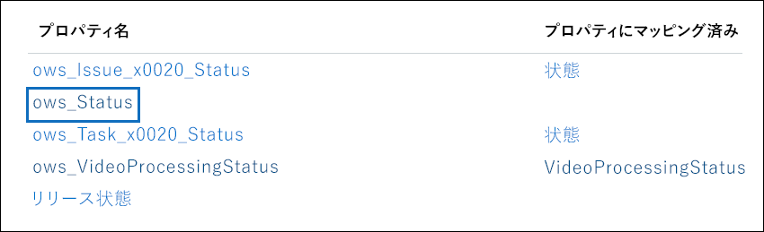

**ows\_\_Status** プロパティ (二重アンダースコアに注意) は、興味を引かれるものです。 これは、生産ドキュメントのコンテンツの種類の **状態** プロパティにマップします。

***ows\_doc*** と入力して緑色の矢印を選択すると、次のように表示されます。

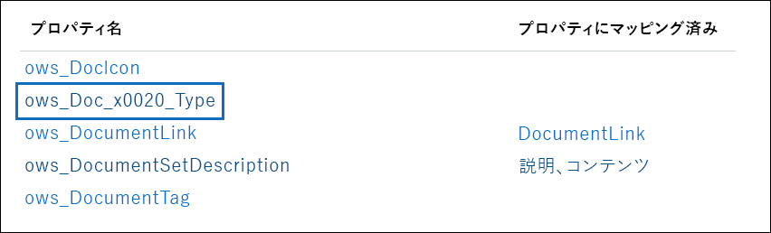

**ows\_Doc\_x0020\_Type** プロパティは、興味を引かれる2番目のプロパティです。 これは、生産ドキュメントのコンテンツの種類の **ドキュメントの種類** プロパティにマップします。

> [!TIP]
> このシナリオのクロールされたプロパティの名前を特定するには、生産ドキュメントを含むドキュメント ライブラリに移動します。 [ライブラリの設定] に移動します。 [**列**] には、列の名前 (**状態** や **ドキュメントの種類** など) を選択して、サイトの列ページを開きます。 そのページの URL の *フィールド* パラメーターには、フィールドの名前が含まれています。 先頭に「ows_」が付いたこのフィールド名は、クロールされたプロパティの名前です。 たとえば、URL `https://tenantname.sharepoint.com/sites/SpinningWidget/_layouts/15/FldEdit.aspx?List=%7BC38C2F45-3BD6-4C3B-AA3B-EF5DF6B3D172%7D&Field=_Status` は *ows\_\_Status* のクロールされたプロパティに対応します。

探しているクロールされたプロパティが SharePoint 管理センターの [検索スキーマの管理] セクションに表示されない場合、次のいずれかの理由が考えられます。

- ドキュメントのインデックスが作成されていない可能性があります。 [**ドキュメント ライブラリ設定**] > [**詳細設定**] の順に移動し、ライブラリのインデックスを強制的に再作成できます。

- ドキュメント ライブラリが最新のサイトにある場合は、SharePoint 管理者もサイト コレクション管理者であることを確認してください。

クロールされ管理されたプロパティの詳細については、「[SharePoint Server で自動的に作成される管理プロパティ](/sharepoint/technical-reference/automatically-created-managed-properties-in-sharepoint)」をご覧ください。

### <a name="map-crawled-properties-to-pre-defined-managed-properties"></a>クロールされたプロパティを事前定義された管理プロパティにマップする

KQL は、検索クエリでクロールされたプロパティを使用できません。 管理プロパティを使用する必要があります。 通常の検索シナリオでは、管理プロパティを作成し、クロールされた必要なプロパティにマップします。 ただし、保持ラベルを自動適用する場合は、KQL で事前定義された管理プロパティのみを指定でき、カスタム管理プロパティは指定できません。 使用可能な文字列 *RefinableString00* から *RefinableString199* に対して、システム内で事前に定義された管理プロパティのセットがあります。 完全なリストについては、「[既定の未使用の管理プロパティ](/sharepoint/manage-search-schema#default-unused-managed-properties)」を参照してください。 これらの既定の管理プロパティは、通常、絞り込み検索の条件を定義するために使用されます。

KQL クエリが機能し、正しい保持ラベルを製品ドキュメント コンテンツに自動適用するために、クロールされたプロパティ **ows\_Doc\_x0020\_Type* および *ows\_\_Status** を 2 つの絞り込み可能な管理プロパティにマップします。 このシナリオのテスト環境では、**RefinableString00** と **RefinableString01** は使用されていません。 SharePont 管理センターの [**検索スキーマの管理**] で [**管理プロパティ**] を見て、これを決定しました。

[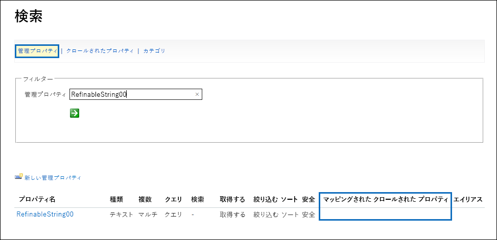](../media/SPRetention12.png#lightbox)

前のスクリーンショットの [**マップ先のクロールされたプロパティ**] 列は空であることにご注意ください。

**ows\_Doc\_x0020\_Type** のクロールされたプロパティをマップするには、次の手順を実行します。

1. [**管理プロパティ**] フィルター ボックスに **_RefinableString00_** と入力し、緑色の矢印を選択します。

2. 結果一覧で、**RefinableString00** リンクを選択し、[**クロールされたプロパティへのマッピング**] セクションまで下にスクロールします。

3. [**マッピングの追加**] を選択し、**_ows\_Doc\_x0020\_Type_*_ を [* クロールされたプロパティの選択**] ウィンドウの [_ **クロールされたプロパティ名の検索**] ボックスに入力します。 [**検索**] を選択します。

4. 結果リストで、**ows\_Doc\_x0020\_Type** を選択し、[**OK**] を選択します。

   [**マップ先のクロールされたプロパティ**] セクションに、次のスクリーンショットのようなものが表示されます。

   [![[マップ先のクロールされたプロパティ] セクションで [マッピングの追加] を選択する](../media/SPRetention13.png)](../media/SPRetention13.png#lightbox)


5. ページの一番下までスクロールし、[**OK**] を選択してマッピングを保存します。

この同じ手順を繰り返して、**RefinableString01** と **ows\_\_Status** をマップします。

これで、2 つのクロールされたプロパティにマップされた 2 つの管理プロパティが必要になります。

[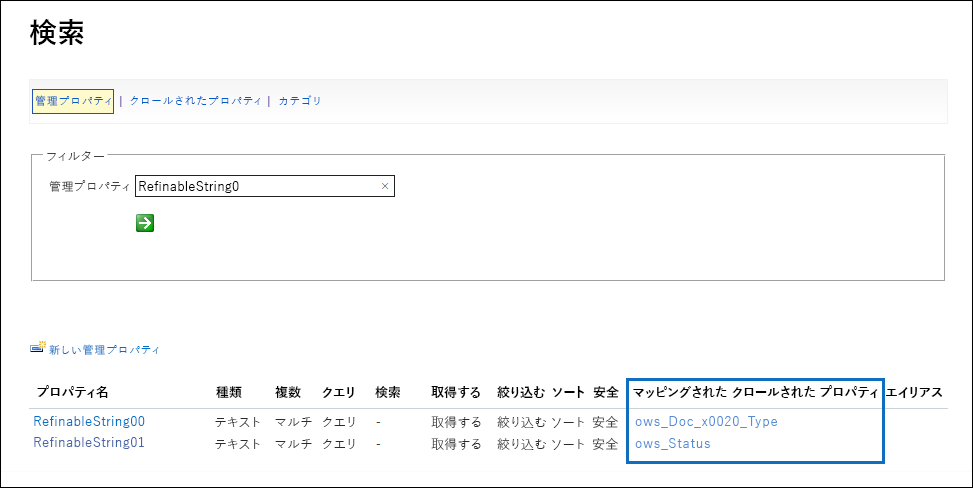](../media/SPRetention14.png#lightbox)

エンタープライズ検索を実行して、正しく設定されていることを確認しましょう。 ブラウザーで、 *https://\<your_tenant>.sharepoint.com/search* に移動します。 検索ボックスに ***RefinableString00:"Product Specification"** _ と入力し、Enter キーを押します。 この検索により、**_ドキュメントの種類_** の _ *製品の仕様** を持つすべてのドキュメントが返されます。

検索ボックスに、**RefinableString00:"Product Specification" AND RefinableString01:Final** と入力し、Enter キーを押します。 これにより、**_ドキュメントの種類_*_ の **製品の仕様** を持ち、_* 状態** が **_最終版_** であるすべてのドキュメントが返されます。

### <a name="create-auto-apply-label-policies"></a>自動適用ラベル ポリシーを作成する

KQL クエリが機能していることを確認したので、KQL クエリを使用して適切なドキュメントに製品の仕様の保持ラベルを適切なドキュメントに自動的に適用する自動適用ラベル ポリシーを作成しましょう。

1. [[コンプライアンス センター]](https://compliance.microsoft.com/homepage)で、[**レコード管理**] > [**ラベル ポリシー**] > [**ラベルの自動適用**] の順に移動します。

   [![[ラベル] ページで [ラベルの自動適用] を選択する](../media/SPRetention16.png)](../media/SPRetention16.png#lightbox)

2. 自動ラベル付けポリシーの作成ウィザードの [**自動ラベル付けポリシーに名前を付ける**] ページで、**製品仕様ラベルの自動適用** などの名前と、オプションの説明を入力します。 [**次へ**] を選択します。

3. [**このラベルを適用するコンテンツの種類を選択する**] ページで、[**特定の単語やフレーズ、またはプロパティを含むコンテンツにラベルを適用する**] を選択し、[**次へ**] を選択します。

   [ ![[特定の単語、語句、またはプロパティを含むコンテンツにラベルを適用する] を選択する](../media/SPRetention17.png) ](../media/SPRetention17.png#lightbox)

   このオプションでは、前のセクションでテストしたものと同じ KQL 検索クエリを提供します。 このクエリは、状態が [*最終*] のすべての製品の仕様ドキュメントを返します。 自動適用ラベル ポリシーでこの同じクエリを使用すると、製品の仕様の保持ラベルが、このクエリに一致するすべてのドキュメントに自動適用されます。

4. [**このクエリに一致するコンテンツにラベルを適用する**] ページで、「**RefinableString00:"Product Specification" AND RefinableString01:Final**」と入力し、[**次へ**] を選択します。

   ![[キーワード クエリ エディター] ボックスでクエリを指定する](../media/SPRetention19.png)

5. [**ポリシーを適用する場所を選択する**] ページで、ポリシーを適用するコンテンツの場所を選択します。 このシナリオでは、すべての生産ドキュメントが SharePoint ドキュメント ライブラリにのみ保存されるため、SharePoint の場所にのみポリシーを適用します。 **Exchange メール**、**OneDrive アカウント**、および **Microsoft 365 グループ** の状態を [**オフ**] に切り替えます。 [**次へ**] を選択する前に、SharePoint サイトの状態が [**オン**] に設定されていることを確認してください。

    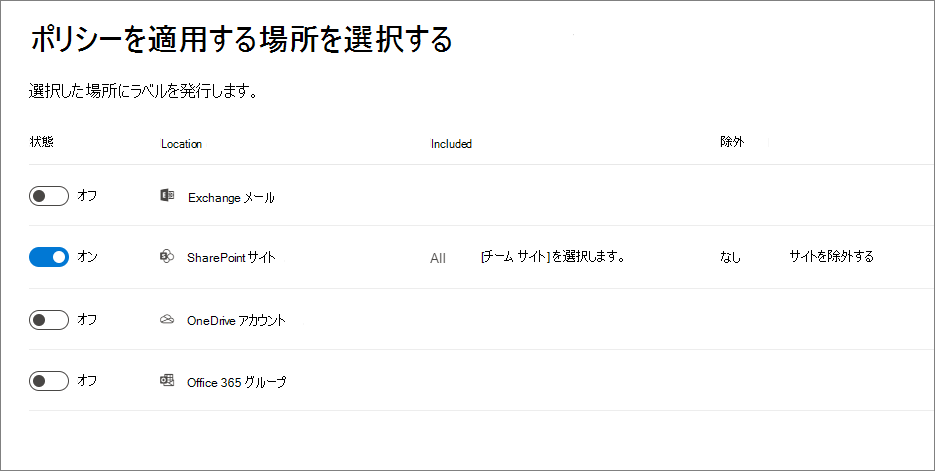

   > [!TIP]
   > ポリシーをすべての SharePoint サイトに適用する代わりに、[**サイトの選択**] を選択して、特定の SharePoint サイトの URL を追加できます。

6. [**自動適用するラベルを選択する**] ページで、[**ラベルの追加**] を選択します。

7. 保持ラベルの一覧で、[**製品の仕様**] を選択します。 [**追加**]、[**次へ**] の順に選択します。

8. 設定の確認:

    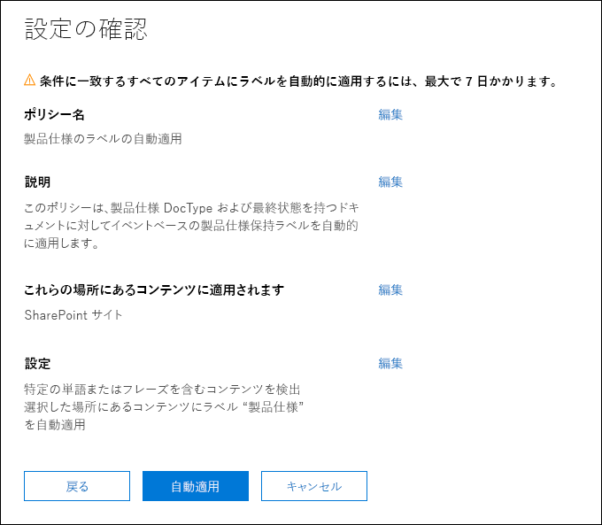

9. [**送信**] を選択して、自動適用ラベル ポリシーを作成します。

   > [!NOTE]
   > KQL 検索クエリに一致するすべてのドキュメントに製品の仕様のラベルを自動的に適用するには、最大 7 日かかります。

### <a name="verify-that-the-retention-label-was-automatically-applied"></a>保持ラベルが自動的に適用されたことを確認する

7 日後、コンプライアンス センターの [[アクティビティ エクスプローラー](data-classification-activity-explorer.md)] を使用して、作成した自動適用ラベル ポリシーがこのシナリオの保持ラベルを製品ドキュメントに自動的に適用したことを確認します。

ドキュメント ライブラリ内のドキュメントのプロパティも確認します。 情報パネルで、選択したドキュメントに保持ラベルが適用されていることがわかります。

[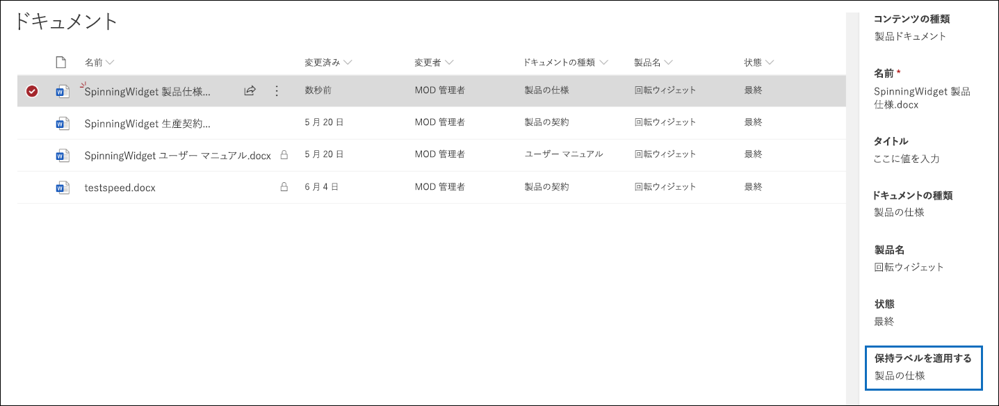](../media/SPRetention21.png#lightbox)

保持ラベルはドキュメントに自動適用され、これらのドキュメントを *レコード* として宣言するように保持ラベルが構成されているため、ドキュメントは削除されないよう保護されます。 この保護の例として、これらのドキュメントのいずれかを削除しようとすると、次のエラー メッセージが表示されます。

[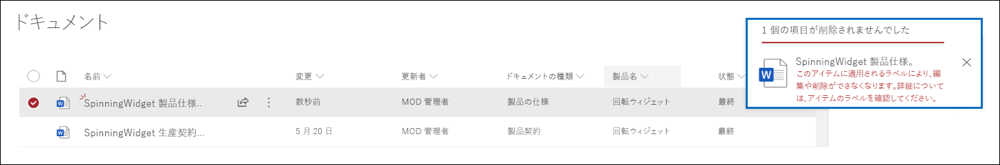](../media/SPRetention22.png#lightbox)

## <a name="generate-the-event-that-triggers-the-retention-period"></a>保持期間をトリガーするイベントを生成する

保持ラベルが適用されたので、特定の製品の生産終了を示すイベントに注目しましょう。 このイベントは、保持ラベルで定義されている保持期間の開始をトリガーします。 たとえば、製品の仕様ドキュメントの場合、「生産終了」 イベントがトリガーされると、5 年間の保持期間が開始します。

**管理** > **イベントのレコード** に移動して、Microsoft 365 コンプライアンス センターでイベントを手動で作成できます。 イベントの種類を選択し、正しい資産 ID を設定して、イベントの日付を入力します。 詳細については、[「イベントが発生したときに保持を開始 」](event-driven-retention.md) を参照してください。

ただし、このシナリオでは、外部の生産システムからイベントを自動的に作成します。 このシステムは、製品が生産中であるかどうかを示す単一の SharePoint リストです。 リストに関連付けられた [Power Automate](/power-automate/getting-started) フローが、イベントをトリガーします。 実際のシナリオでは、HR や CRM システムなど、イベントを生成するさまざまなシステムを使用できます。 Power Automate には、Microsoft Exchange、SharePoint、Teams、Dynamics 365 などの Microsoft 365 ワークロードに加え、Twitter、Box、Salesforce、Workdays などのサード パーティ アプリ向けのすぐに使用できる多くの操作と文書パーツが含まれています。 この機能を使用すると、Power Automate をさまざまなシステムと簡単に統合できます。 詳細については、「[イベント ベースの保持を自動化する](./event-driven-retention.md#automate-events-by-using-a-rest-api)」を参照してください。

次のスクリーンショットは、イベントのトリガーに使用される SharePoint リストを示しています。

[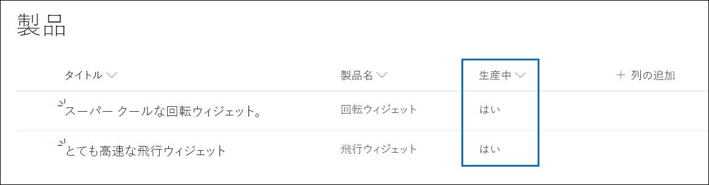](../media/SPRetention23.png#lightbox)

現在生産中の製品は 2 つあり、[_ **生産中***] 列で [**はい* _] で示されます。 製品のこの列の値が [**_いいえ_**] に設定されている場合、リストに関連付けられたフローは自動的にイベントを生成します。 このイベントにより、対応する製品ドキュメントに自動適用された保持ラベルの保持期間の開始がトリガーされます。

このシナリオでは、次のフローを使用してイベントをトリガーします。

[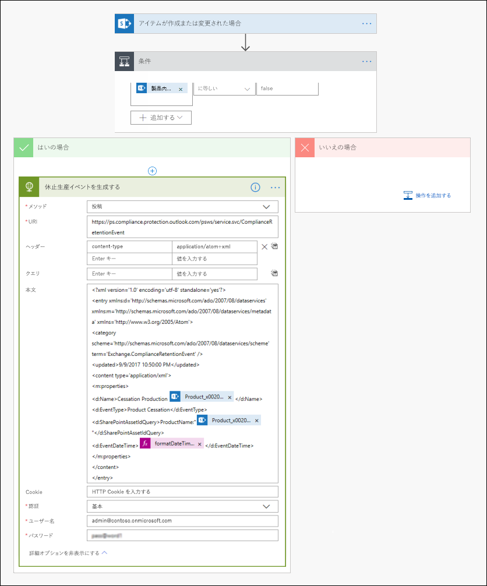](../media/SPRetention24.png#lightbox)

このフローを作成するには、SharePoint コネクターから開始し、「**アイテムが作成または変更されたとき**」トリガーを選択します。 サイトアドレスおよびリスト名を指定します。 [**生産中**] リスト列の値が [**_いいえ_* _] に設定されている (または条件カードで false に等しい) 場合に基づいて条件を追加します。 次に、組み込みの HTTP テンプレートに基づいてアクションを追加します。 次のセクションの値を使用して、HTTP アクションを構成します。 以下のセクションから **URI** および **本文** プロパティの値をコピーして、テンプレートに貼り付けることができます。

- **方法**: 投稿
- **URI**: `https://ps.compliance.protection.outlook.com/psws/service.svc/ComplianceRetentionEvent`
- **ヘッダー**: キー = Content-Type、値 = application/atom+xml
- **本文**:

    ```xml
    <?xml version='1.0' encoding='utf-8' standalone='yes'>
    <entry xmlns:d='http://schemas.microsoft.com/ado/2007/08/dataservices' xmlns:m='http://schemas.microsoft.com/ado/2007/08/dataservices/metadata' xmlns='https://www.w3.org/2005/Atom'>
    <category scheme='http://schemas.microsoft.com/ado/2007/08/dataservices/scheme' term='Exchange.ComplianceRetentionEvent'>
    <updated>9/9/2017 10:50:00 PM</updated>
    <content type='application/xml'>
    <m:properties>
    <d:Name>Cessation Production @{triggerBody()?['Product_x0020_Name']?['Value']}</d:Name>
    <d:EventType>Product Cessation&lt;</d:EventType>
    <d:SharePointAssetIdQuery>ProductName:&quot;@{triggerBody()?['Product_x0020_Name']?['Value']}<d:SharePointAssetIdQuery>
    <d:EventDateTime>@{formatDateTime(utcNow(),'yyyy-MM-dd')}</d:EventDateTime>
    </m:properties>
    </content&gt>
    </entry>
    ```

このリストでは、このシナリオ用に構成する必要があるアクションの **本文** プロパティ内のパラメーターを以下のように説明します。

- **名前**: このパラメーターは、Microsoft 365 コンプライアンス センターで作成されるイベントの名前を指定します。 このシナリオでは、名前は「Cessation Production *xxx*」 です。*xxx* は、前に作成した **ProductName** 管理プロパティの値です。
- **EventType**: このパラメーターの値は、作成されたイベントが適用されるイベントの種類に対応します。 このイベントの種類は、保持ラベルを作成したときに定義されました。 このシナリオでは、イベントの種類は 「製品の中止」 です。
- **SharePointAssetIdQuery**: このパラメーターは、イベントの資産 ID を定義します。 イベント ベースの保持には、ドキュメントの一意の識別子が必要です。 資産 ID を使用して、特別なイベントが適用されるドキュメントを特定できます。または、このシナリオの場合と同様に、独自の **製品名** であるメタデータ列を特定できます。 これを行うには、KQL クエリで使用できる新しい **ProductName** 管理プロパティを作成する必要があります。 (または、新しい管理プロパティを作成する代わりに **RefinableString00** を使用することもできます。 また、この新しい管理プロパティを **ows_Product_x0020_Name** のクロールされたプロパティにマップする必要があります。 この管理プロパティのスクリーンショットを次に示します。

    [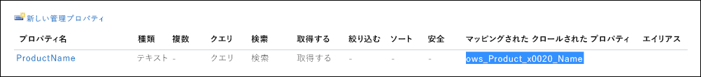](../media/SPRetention25.png#lightbox)

- **EventDateTime**: このパラメーターは、イベントが発生する日付を定義します。 現在の日付の形式を使用します。<br/><br/>*formatDateTime(utcNow(),'yyyy-MM-dd'*)

### <a name="putting-it-all-together"></a>すべてをまとめる

保持ラベルが作成されて自動適用され、フローが構成および作成されます。 [製品] リストの **[生産中]** 列の値が、**_[はい]_*_ から _*_[いいえ]_*_ に変更された場合は、フローがトリガーされてイベントが作成されます。コンプライアンス センターでこのイベントを確認するには、_*[レコード管理]** > **[イベント]** の順にアクセスしてください。

[![コンプライアンス センターの [イベント] ページに表示されるフローによってトリガーされたイベント。](../media/SPRetention28.png)](../media/SPRetention28.png#lightbox)

イベントを選択して、ポップアップ ページで詳細を表示します。 イベントが作成された場合でも、イベントの状態には、SharePoint サイトまたはドキュメントが処理されていないことが示されることに注意してください。

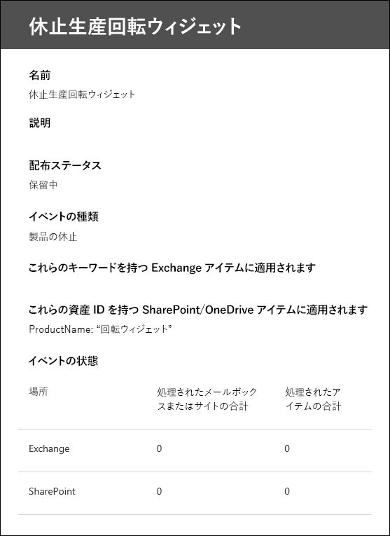

しかし、しばらくすると、イベントの状態に、SharePoint サイトと SharePoint ドキュメントが処理されたことが示されます。

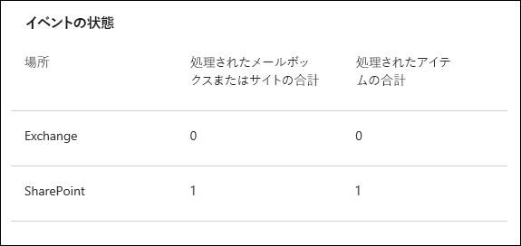

これは、*生産中止の回転ウィジェット イベント* イベントの日付に基づいて、回転ウィジェットの製品ドキュメントに適用されるラベルの保持期間が開始されたことを示します。 1 日間の保持期間を構成してテスト環境にシナリオを実装したと仮定すると、イベントが作成されてから数日後に製品ドキュメントのドキュメント ライブラリに移動し、ドキュメントが削除されたことを確認できます (SharePoint で削除ジョブが実行された後)。

### <a name="more-about-asset-ids"></a>資産 ID の詳細

[「イベントが発生したときに保持を開始」](event-driven-retention.md) の記事で説明したように、イベントの種類、保持ラベル、イベント、および資産 ID の関係を理解することが重要です。 資産 ID は、SharePoint と OneDrive の単一のドキュメント プロパティです。 イベントによって保持期間がトリガーされるドキュメントを特定するのに役立ちます。 既定では、SharePoint にはイベント ベースの保持に使用できる **資産 ID** プロパティがあります。

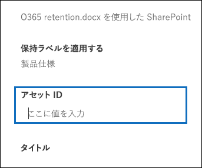

次のスクリーンショットに示すように、資産 ID 管理プロパティは **ComplianceAssetId** と呼ばれます。

[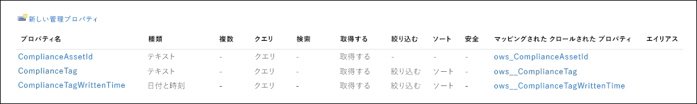](../media/SPRetention27.png#lightbox)

既定の **資産 ID** プロパティを使用する代わりに、他のプロパティを使用することができます。 ただし、イベントの資産 ID またはキーワードを指定しない場合、そのイベントの種類のラベルの付いたすべてのコンテンツはイベントによってトリガーされる保持期間を持つことを理解することが重要です。

### <a name="using-advanced-search-in-sharepoint"></a>SharePoint で高度な検索を使用する

前のスクリーンショットでは、**ComplianceTag** と呼ばれる保持ラベルに関連する別の管理プロパティがあり、クロールされたプロパティにマップされていることもわかります。 **ComplianceAssetId** 管理プロパティは、クロールされたプロパティにもマップされます。 つまり、高度な検索でこれらの管理プロパティを使用して、保持ラベルでタグ付けされたすべてのドキュメントを取得できます。