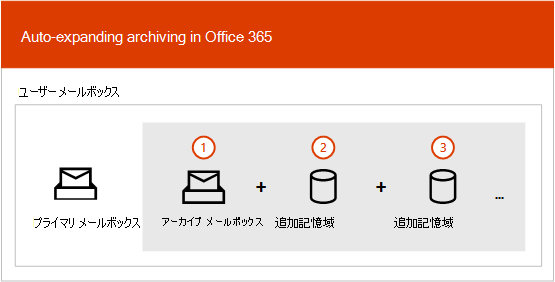
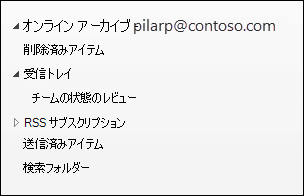
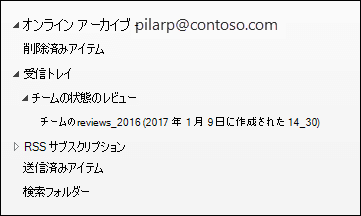

# 自動拡張アーカイブの概要

Office 365 のアーカイブ メールボックスは、ユーザーに追加のメールボックス記憶領域を提供します。 ユーザーのアーカイブ メールボックスを有効にすると、最大 100 GB の追加記憶域を使用できます。 以前は、100 GB の記憶域クォータに達したとき、組織は、Microsoft に問い合わせてアーカイブ メールボックス用の追加記憶領域を要求する必要がありました。 このようなことはもうなくなります。

Microsoft 365 (自動拡張アーカイブと呼 *ばれる)* のアーカイブ機能は、アーカイブ メールボックスに最大 1.5 TB の追加ストレージを提供します。 アーカイブ メールボックス内の記憶域クォータに達すると、Microsoft 365 メールボックスが 1.5 TB に達するまで、アーカイブのサイズが自動的に (増分的に) 増加します。

自動拡張アーカイブを有効にする手順については、「自動拡張アーカイブを有効にする」 [を参照してください](enable-autoexpanding-archiving.md)。

> [!NOTE]
> アーカイブの自動拡張では、共有メールボックスもサポートされます。 共有メールボックスのアーカイブを有効にするには、Exchange Online プラン 2 のライセンス、または Exchange Online Archiving のライセンスの付いた Exchange Online プラン 1 のライセンスが必要です。

## 自動拡張アーカイブのしくみ

前に説明したように、ユーザーのアーカイブ メールボックスが有効になっていると、追加のメールボックス記憶領域が作成されます。 自動拡張アーカイブを有効にすると、Microsoft 365 は定期的にアーカイブ メールボックスのサイズを確認します。 アーカイブ メールボックスが記憶域の制限に近づくと、Microsoft 365 はアーカイブに対する追加の記憶領域を自動的に作成します。 ユーザーがこの追加記憶領域を使い切ると、Microsoft 365 はユーザーのアーカイブの記憶領域をさらに追加します。 このプロセスは、ユーザーのアーカイブがサイズ 1.5 TB に達するまで続行されます。 この処理は自動的に行われるので、管理者は追加のアーカイブ記憶域を要求したり、自動拡張アーカイブを管理したりする必要はありません。

処理の概要は次のとおりです。

1. ユーザーのメールボックスまたは共有のメールボックスに対してアーカイブが有効になります。 100 GB の記憶領域を持つアーカイブ メールボックスが作成され、アーカイブ メールボックスの警告のクォータが 90 GB に設定されます。

2. 管理者がメールボックスの自動拡張アーカイブを有効にします。 アーカイブ メールボックス (回復可能なアイテム フォルダーを含む) が 90 GB に達すると、自動拡張アーカイブに変換され、Microsoft 365 は最大サイズが 1.5 TB になるまでアーカイブに記憶域を追加します。 追加記憶領域がプロビジョニングされるには、最大 30 日かかります。

   > [!NOTE]
   > メールボックスが保留にされているか、アイテム保持ポリシーに割り当てられている場合は、自動拡張アーカイブを有効にするとアーカイブ メールボックスの記憶領域のクォータが 110 GB に増やされます。 同様に、アーカイブ警告クォータは、100 GB に増やされます。

3. Microsoft 365 は、必要に応じて自動的に記憶領域を追加します。

> [!IMPORTANT]
> 自動拡張アーカイブは、1 日あたり 1 GB を超えない増加率を持つ個々のユーザー (または共有メールボックス) で使用されるメールボックスでのみサポートされます。 ユーザーのアーカイブ メールボックスは、そのユーザー専用です。 ジャーナリング、トランスポート ルール、または自動転送ルールを使用してメッセージをアーカイブ メールボックスにコピーすることは許可されていません。 Microsoft は、ユーザーのアーカイブ メールボックスを使用して他のユーザーのアーカイブ データを保存したり、不適切な使用を行った場合に、追加のアーカイブを拒否する権利を保持します。

## 追加のアーカイブ記憶領域に移動されるもの

自動拡張アーカイブ記憶域を効率的に使用するために、フォルダーは移動される場合があります。 Microsoft 365 では、追加記憶域がアーカイブに追加されたときに、どのフォルダーを移動するかを決定します。 フォルダーを移動する場合に、1 つ以上のサブフォルダーが自動的に作成され、元のフォルダーのアイテムがこれらのフォルダーに分配されて、移動プロセスが促進されます。 Outlook でフォルダー リストのアーカイブ部分を表示した場合、これらのサブフォルダーは元のフォルダーの下に表示されます。 Microsoft 365 は、これらのサブフォルダーに **\<folder name\>_yyyy (作成日: mmm dd、yyyy h_mm)** という名前を付けます。

- **yyyy** は、フォルダー内のメッセージが受信された年です。

- **mmm dd, yyyy h_m** は、Office 365 によってサブフォルダーが作成された日時 (UTC 形式) であり、Outlook でのユーザーのタイム ゾーンと地域の設定に基づきます。

次のスクリーンショットは、メッセージが自動拡張アーカイブに移動される前と後のフォルダー一覧です。

 **追加記憶域が追加される前**

 **追加記憶域が追加された後**

> [!NOTE]
> 前述したように、Microsoft 365 はアイテムをサブフォルダーに移動させ (さらに前述の命名規則で名前を付けます)、コンテンツを補助型のアーカイブに配信するのに役立ちます。 ただし、アイテムをサブフォルダーに移動させても、必ずしもそうなるとは限りません。 場合によっては、フォルダー全体が補助型アーカイブに移動されることもあります。 この場合、フォルダーの名前は元のままです。  Outlook のフォルダー リストでは、フォルダーが補助型アーカイブに移動されたことは明らかになりません。

## 自動拡張アーカイブ内のアイテムにアクセスするための Outlook の要件

自動拡張アーカイブに保存されているメッセージにアクセスするには、ユーザーは次のいずれかの Outlook クライアントを使う必要があります。

- Windows 版の Outlook 2016、Outlook 2019

- Outlook on the web

- Mac 版の Outlook 2016、Outlook 2019

Outlook または Outlook on the web を使って自動拡張アーカイブに保存されているメッセージにアクセスするときは、いくつかのことを考慮する必要があります。

- 自動拡張記憶域に移動されたものも含め、アーカイブ メールボックスの任意のフォルダーにアクセスできます。

- アーカイブ メールボックスに少なくとも 1 つの自動拡張記憶域がある場合は、アーカイブ メールボックスまたは補助アーカイブからフォルダーを削除できません。 つまり、自動拡張ストレージ領域が準備された後、アーカイブ内のフォルダーを削除することはできません。

- 自動拡張ストレージ領域内のアイテムを削除できます。 ただし、削除済みアイテムの回復機能を使用して、自動拡張ストレージ領域から削除されたアイテムを回復することはできません。

- 自動拡張アーカイブの検索は、web Outlook (OWA) で使用できます。 オンライン アーカイブと同様に、追加の記憶域に移動されたアイテムを検索できます。 OWA で検索範囲としてアーカイブを選択すると、すべてのアーカイブ (自動拡張アーカイブを含む) と、それに対応するサブフォルダーが検索されます。

- 自動拡張アーカイブの検索は、Outlook デスクトップの最新チャネル (プレビュー) で利用できます。 このプレビューでは、「現在のメールボックス」範囲が利用可能で、自動拡張アーカイブを検索することができます。 この機能やその他の Microsoft Search サポート機能の詳細については、「[Microsoft Search を活用して Windows 版 Outlook を Exchange Online に接続する方法](https://techcommunity.microsoft.com/t5/outlook-global-customer-service/how-outlook-for-windows-connected-to-exchange-online-utilizes/ba-p/1715045)」を参照してください。 

- 自動拡張アーカイブ内の Outlook のアイテム数および閲覧済み/未読数 (Outlook および Outlook on the web) は正しくないことがあります。

## 自動拡張アーカイブとその他の法令遵守機能

ここでは、自動拡張アーカイブと、その他の法令遵守およびデータ ガバナンス機能の間の機能について説明します。

- **電子情報開示**: コンテンツ検索やインプレース電子情報開示などの電子情報開示ツールを使うと、自動拡張アーカイブ内の追加記憶域も検索されます。

- **保持**: Exchange Online の訴訟ホールドや、のセキュリティ/コンプライアンス センターの電子情報開示ケースの保留リストと保持ポリシーなどのツールを使ってメールボックスを保留にすると、自動拡張アーカイブ内のコンテンツも保留になります。

- **メッセージング レコード管理 (MRM)**: Exchange Online の MRM 削除ポリシーを使って期限切れのメールボックス アイテムを完全に削除した場合、自動拡張アーカイブにある期限切れアイテムも削除されます。

- **インポート サービス**: Office 365 のインポート サービスを使うと、ユーザーの自動拡張アーカイブに PST ファイルをインポートできます。 PST ファイルの最大 100 GB のデータをユーザーのアーカイブ メールボックスにインポートできます。

## 詳細情報

自動拡張アーカイブについての技術的な詳細については、「[Office 365: 自動拡張アーカイブに関する FAQ](https://techcommunity.microsoft.com/t5/exchange-team-blog/office-365-auto-expanding-archives-faq/ba-p/607784)」を参照してください。
