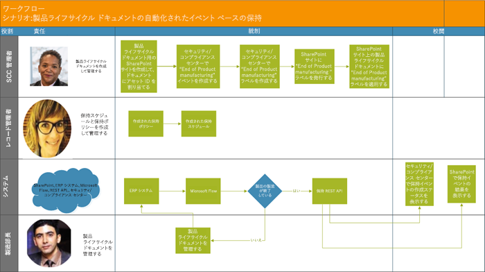

# <a name="automate-event-based-retention"></a>イベント ベースの保持を自動化する

>*[セキュリティとコンプライアンスのための Microsoft 365 ライセンス ガイダンス](https://aka.ms/ComplianceSD)。*

The explosion of content in organizations and how it can become ROT (redundant, obsolete, trivial) is serious business. To continue to meet legal, business, and regulatory compliance challenges, organizations must be able to keep and protect important information and quickly find what’s relevant. Retaining only important, pertinent information is key to an organization's success.

To help meet this need, organizations can take advantage of retention solutions in the Office 365 Security & Compliance Center. Retention can be triggered by using [retention labels](labels.md). A retention label has the option to [base the retention period on a specific event](event-driven-retention.md). Typically, the retention period is based on a known date, such as the creation date or last modified date for the content. However, organizations also have requirements to dispose of content based on the occurrence of an event, such as seven years after an employee leaves an organization.

To ensure compliant disposal of content, it's imperative to know when an event takes place. With the volume of content increasing rapidly, it's becoming challenging to retain and dispose content in a timely and compliant manner.

Event-based retention solves this problem. This topic explains how to set up your business process flows to automate retention through events by using the Microsoft 365 REST API.

## <a name="about-event-based-retention"></a>イベント ベースの保持について

An organization can be small, medium, or large. The number of business documents, legal documents, employee files, contracts, and product documents that get created and managed on a day-to-day basis is increasing dramatically.

For example, each day, tens and hundreds of employees are joining and leaving organizations. The HR department continues to create, update, or delete employee-related documents as per business requirements. This process is subject to the different retention policies outlined for the business:

- **The period of retention for content can be a known date** such as the date the content was created, last modified, or labeled. For example, you might retain documents for seven years after they're created and then delete them.

- **The period of retention of content can also be an unknown date**. For example, with retention labels, you can also base a retention period on when a specific type of event occurs, such as an employee leaving the organization.

The event triggers the start of the retention period, and all content with a label applied for that type of event get the label's retention actions enforced on them. This is called event-based retention. To learn more, see [Overview of event-driven retention](event-driven-retention.md).

## <a name="set-up-event-based-retention"></a>イベント ベースの保持をセットアップする

このセクションでは、コンテンツを保持する前に行う必要がある作業について説明します。

### <a name="identify-roles"></a>役割を特定する

レコード管理業務を実行し、業務文書の有効かつ効率的な保持に関して責任を担う、組織内の各役割を特定します。

  | ペルソナ | 役割 |
  | - | - |
  | 管理者 | 保持イベントの種類、保持ラベル、レコード リポジトリを SharePoint で作成します |
  | レコード管理者                                  | 保持ポリシー、保持スケジュール ガイダンス、コンプライアンスの詳細を提供します   |
  | システム管理者 (会社)                          | Microsoft 365 を扱う外部システムをセットアップして管理します                       |
  | インフォメーション ワーカー                               | (人事、財務、IT など) ビジネス プロセスのライフサイクルを管理します                 |

### <a name="set-up-the-security--compliance-center"></a>セキュリティ/コンプライアンス センターをセットアップする
  
1. コンプライアンス管理者がイベントの種類を作成します &ndash; たとえば、従業員の解雇、契約満了、製品の製造終了などです。  (「[イベント ベースの保持](event-driven-retention.md)」で説明するプロセスの手順を参照してください。）
    
2. コンプライアンス管理者は、イベントに基づいて保持ラベルを作成し、そのラベルをイベントの種類に関連付けます。
    
    保持ラベルのトリガーには 4 種類あります。
            
    1. 作成日
                
    2. 最終更新日時
                
    3. ラベル日付 (コンテンツがラベル付けされた日)
                
    4. イベント ベース
    
3. コンプライアンス管理者が保持ラベルを発行します。

### <a name="set-up-sharepoint"></a>SharePoint をセットアップする
   
レコード リポジトリを作成するには、コンプライアンス管理者は次の操作を行います。

1. SharePoint サイトを作成します。

2. 次のいずれかを実行します。
        
   - Creates a SharePoint library: Set event-based label at the library level. For more information, see [Applying a default retention label to all content in a SharePoint library, folder, or document set](labels.md#applying-a-default-retention-label-to-all-content-in-a-sharepoint-library-folder-or-document-set).
          
   - SharePoint でドキュメント セットをセットアップします。 詳細については、「[ドキュメント セット の概要](https://support.microsoft.com/ja-JP/office/introduction-to-document-sets-3dbcd93e-0bed-46b7-b1ba-b31de2bcd234)」を参照してください。
      
3. 各従業員のドキュメント セットに資産 ID を割り当てます。 資産 ID は、組織で使用されている製品名またはコードです。たとえば、従業員番号を資産 ID として使用することができます。 フォルダーに資産 ID を割り当てることで、そのフォルダー内のすべてのアイテムに同じ資産 ID が自動的に継承されます。 同一のイベントにより、すべてのアイテムで保持期間をトリガーできることを意味します。

## <a name="ways-to-trigger-event-based-retention"></a>イベント ベースの保持をトリガーする方法

イベント ベースの保持をトリガーするには 2 つの方法があります。

- **管理センター UI を使用する** このプロセスは、同時に保持するコンテンツを減らしたり、保持をトリガーする頻度を減らしたり (月次、年次など) するために使用できます。 この方法の詳細については、「[イベント ベースの保持の概要](event-driven-retention.md)」を参照してください。 ただし、保持をトリガーするためのこの方法は、時間がかかる場合があり、エラーも発生しやすいため、大規模な適用には不向きです。 そのため、自動化されたシームレスなソリューションを使用して保持をトリガーさせることで、データのセキュリティとコンプライアンスを向上させられます。

- **Using a M365 REST API** This process can be used when large amounts of content are to be retained at a time and/or the frequency to trigger retention is often such as daily or weekly. The flow detects when an event occurs in your line-of-business system, and then automatically creates a related event in the Security & Compliance Center. You don't need to manually create an event in the UI each time one occurs.

REST API の使用に関して次の 2 つのオプションがあります。

- イベントの発生を自動的にトリガーするために、**Microsoft Flow または同様のアプリケーション**を使用できます。 Microsoft Flow は、他のシステムとの接続における統合機能を提供します。 Microsoft Flow は、カスタム ソリューションがなくても使用できます。

- **PowerShell または HTTP クライアントを使用して REST API を呼び出す** PowerShell (バージョン 6 以降) を使用して Microsoft 365 REST API を呼び出してイベントを作成します。 

Rest API は一連の HTTP 操作 (メソッド) をサポートするサービス エンドポイントで、サービスのリソースに対する作成/取得/更新/削除のアクセス権を提供します。 詳細については、「[REST API 要求/応答のコンポーネント](https://docs.microsoft.com/rest/api/gettingstarted/#components-of-a-rest-api-requestresponse)」を参照してください。 この場合、Microsoft 365 REST API を使用することにより、POST および GET 操作 (メソッド) を使用してイベントを作成および取得できます。

## <a name="example-scenarios"></a>シナリオ例

次のシナリオについて考えます。

### <a name="scenario-1-employees-leaving-the-organization"></a>シナリオ 1: 従業員が組織のメンバーでなくなる 

組織では、従業員ごとに多数の従業員関連文書を作成し、保管しています。 これらの文書は、各従業員の雇用期間中、管理および保持されます。 ただし、従業員が組織のメンバーでなくなったり、従業員が退職したりした場合、法的および会社の要件に基づいて、規定された期間、その従業員の文書を保持する義務が組織にはあります。

ここで、複数の従業員が毎日組織のメンバーでなくなるとすると、数千ではないものの数百もの文書の保持期間を毎日トリガーしなくてはなりません。

また、各従業員に関して保持期間を計算する必要もあります。従業員の退社日に、従業員レコードの種類に応じて、日数、月数、または年数を加算します。 たとえば、要求される保持期間が、従業員の労働者災害補償の書類と同じ従業員の福利厚生申請書類とで異なる可能性があります。

次の図には、1 つのイベントに複数のラベルを関連付けられることを示しています。 「労働者災害補償 (Worker’s compensation)」ラベル下のすべてのファイルと、「従業員の福利厚生 (Employee benefits)」ラベル下のすべてのファイルがどちらも、従業員が組織のメンバーでなくなるという単一のイベントに関連付けられています。 これらのファイルの保持期間はそれぞれ異なります。 そのため、従業員が組織のメンバーでなくなると、各ラベルのファイルには異なる保持期間が適用されます。 各従業員について、ファイルの各種類または各ラベルのこれらの異なる保持期間をすべてトリガーすることは、困難な作業です。 この作業を複数の従業員に対して行う場合は、困難さがさらに強まります。


そのため、複数の従業員に対して異なる保持期間をトリガーする自動化されたプロセスでは、時間を節約し、エラーをなくし、効率性を非常に高められます。

**このシナリオに関する自動化されたイベント ベースの保持を構成する:**


  - 管理者は Jane Doe、John Smith などのドキュメント セットに従業員フォルダーを作成します。

  - 管理者は、福利厚生、給与、労働者災害補償などの従業員ファイルを各従業員フォルダーに追加します。

  - 管理者は、各従業員フォルダーに資産 ID を割り当てます。 

  - SCC 管理者は、セキュリティ/コンプライアンス センターにログインします。

  - SCC 管理者は、「従業員解雇」や「従業員雇用」など、従業員関連のイベントの種類を作成します。

  - SCC 管理者は、「従業員保持」ラベルを作成します。

  - この「従業員の保持」ラベルを発行し、SharePoint 内の従業員ファイルに手動または自動で適用します。

  - Workday などの人事管理システムを Microsoft Flow と連携させることにより、従業員ファイルの管理を定期的に実行できます。

  - 従業員が組織のメンバーではなくなると、Flow によって M365 イベント ベースの保持 REST API がトリガーされ、特定の従業員ファイルの保持期間が開始されます。

#### <a name="using-microsoft-flow"></a>Microsoft Flow の使用

手順 1 - Microsoft 365 REST API を使用してイベントを作成するフローを作成します


##### <a name="create-an-event"></a>イベントを作成する

REST API を呼び出すサンプル コード

- **方法**: 投稿
- **URL**: https://ps.compliance.protection.outlook.com/psws/service.svc/ComplianceRetentionEvent
- **ヘッダー**: キー = Content-Type、値 = application/atom+xml
- **本文**:
    
    ```xml
    <?xml version='1.0' encoding='utf-8' standalone='yes'?>
    
    <entry xmlns:d='http://schemas.microsoft.com/ado/2007/08/dataservices'
    
    xmlns:m='http://schemas.microsoft.com/ado/2007/08/dataservices/metadata'
    
    xmlns='http://www.w3.org/2005/Atom'>
    
    <category scheme='http://schemas.microsoft.com/ado/2007/08/dataservices/scheme' term='Exchange.ComplianceRetentionEvent' />
    
    <updated>9/9/2017 10:50:00 PM</updated>
    
    <content type='application/xml'>
    
    <m:properties>
    
    <d:Name>Employee Termination </d:Name>
    
    <d:EventType>99e0ae64-a4b8-40bb-82ed-645895610f56</d:EventType>
    
    <d:SharePointAssetIdQuery>1234</d:SharePointAssetIdQuery>
    
    <d:EventDateTime>2018-12-01T00:00:00Z </d:EventDateTime>
    
    </m:properties>
    
    </content>
    
    </entry>
    ```
- **認証**: 基本
- **ユーザー名**: 「Complianceuser」
- **パスワード**: 「Compliancepassword」


##### <a name="available-parameters"></a>利用可能なパラメーター


|パラメーター|説明|Notes|
|--- |--- |--- |
|<d:Name></d:Name>|イベントの一意の名前を入力します。|末尾にスペースおよび以下の文字を含めることはできません: % * \ & < > | # ? , : ;|
|<d:EventType></d:EventType>|イベントの種類の名前 (または GUID) を入力します。|Example: “Employee termination”. Event type has to be associated with a retention label.|
|<d:SharePointAssetIdQuery></d:SharePointAssetIdQuery>|「ComplianceAssetId:」と従業員 ID を入力します|例: 「ComplianceAssetId: 12345」|
|<d:EventDateTime></d:EventDateTime>|イベントの日時|形式: yyyy-MM-ddTHH:mm:ssZ、例: 2018-12-01T00:00:00Z
|

##### <a name="response-codes"></a>応答コード

| 応答コード | 説明       |
| ----------------- | --------------------- |
| 302               | リダイレクト              |
| 201               | 作成済み               |
| 403               | 承認に失敗しました  |
| 401               | 認証に失敗しました |

##### <a name="get-events-based-on-time-range"></a>時間範囲に基づいてイベントを取得する


|メソッド|GET||
|--- |--- |--- |
|URL|https://ps.compliance.protection.outlook.com/psws/service.svc/ComplianceRetentionEvent?BeginDateTime=2019-01-11&EndDateTime=2019-01-16||
|ヘッダー|Content-Type|application/atom+xml|
||||
|認証|基本||
|ユーザー名|“Complianceuser”||
|パスワード|“Compliancepassword”||

##### <a name="response-codes"></a>応答コード

| 応答コード | 説明                   |
| ----------------- | --------------------------------- |
| 200               | 問題ありません。イベントの一覧は atom+ xml 形式です |
| 404               | 見つかりません                         |
| 302               | リダイレクト                          |
| 401               | 承認に失敗しました              |
| 403               | 認証に失敗しました             |

##### <a name="get-an-event-by-id"></a>ID でイベントを取得する

| メソッド         | GET   |                      |
| -------------- | ------------------------------------------------------------------------------------------------------------------------------------------------------------------------------------------------------------------------------------------------------------------ | -------------------- |
| URL            | [https://ps.compliance.protection.outlook.com/psws/service.svc/ComplianceRetentionEvent(‘174e9a86-74ff-4450-8666-7c11f7730f66’)](https://ps.compliance.protection.outlook.com/psws/service.svc/ComplianceRetentionEvent\('174e9a86-74ff-4450-8666-7c11f7730f66'\)) |                      |
| ヘッダー         | Content-Type                                                                                                                                                                                                                                                       | application/atom+xml |
| 認証 | 基本                                                                                                                                                                                                                                                              |                      |
| ユーザー名       | “Complianceuser”                                                                                                                                                                                                                                                   |                      |
| パスワード       | “Compliancepassword”                                                                                                                                                                                                                                               |                      |

##### <a name="response-codes"></a>応答コード

| 応答コード | 説明                                      |
| ----------------- | ---------------------------------------------------- |
| 200               | 問題ありません。応答本体に atom+xml 形式のイベントが含まれています |
| 404               | 見つかりません                                            |
| 302               | リダイレクト                                             |
| 401               | 承認に失敗しました                                 |
| 403               | 認証に失敗しました                                |

##### <a name="get-an-event-by-name"></a>名前でイベントを取得する

| メソッド         | GET       |                      |
| -------------- | -------------------------------------------------------------------------------------------------------------------------------------------- | -------------------- |
| URL            | <https://ps.compliance.protection.outlook.com/psws/service.svc/ComplianceRetentionEvent('EventByRESTPost-2226bfebcc2841a8968ba71f9516b763')> |                      |
| ヘッダー        | Content-Type                                                                                                                                 | application/atom+xml |
| 認証 | 基本                                                                                                                                        |                      |
| ユーザー名       | “Complianceuser”                                                                                                                             |                      |
| パスワード       | “Compliancepassword”                                                                                                                         |                      |

##### <a name="response-codes"></a>応答コード

| 応答コード | 説明                                      |
| ----------------- | ---------------------------------------------------- |
| 200               | 問題ありません。応答本体に atom+xml 形式のイベントが含まれています |
| 404               | 見つかりません                                            |
| 302               | リダイレクト                                             |
| 401               | 承認に失敗しました                                 |
| 403               | 認証に失敗しました                                |

#### <a name="using-powershell-ver6-or-higher-or-any-http-client"></a>PowerShell (ver.6 以降) または任意の HTTP クライアントの使用

手順 1: PowerShell に接続します。

手順 2: 次のスクリプトを実行します。

```powershell
param([string]$baseUri)

$userName = "UserName"

$password = "Password"

$securePassword = ConvertTo-SecureString $password -AsPlainText -Force

$credentials = New-Object System.Management.Automation.PSCredential($userName, $securePassword)

$EventName="EventByRESTPost-$(([Guid]::NewGuid()).ToString('N'))"

Write-Host "Start to create an event with name: $EventName"

$body = "<?xml version='1.0' encoding='utf-8' standalone='yes'?>

<entry xmlns:d='http://schemas.microsoft.com/ado/2007/08/dataservices'

xmlns:m='http://schemas.microsoft.com/ado/2007/08/dataservices/metadata'

xmlns='http://www.w3.org/2005/Atom'>

<category scheme='http://schemas.microsoft.com/ado/2007/08/dataservices/scheme' term='Exchange.ComplianceRetentionEvent' />

<updated>7/14/2017 2:03:36 PM</updated>

<content type='application/xml'>

<m:properties>

<d:Name>$EventName</d:Name>

<d:EventType>e823b782-9a07-4e30-8091-034fc01f9347</d:EventType>

<d:SharePointAssetIdQuery>'ComplianceAssetId:123'</d:SharePointAssetIdQuery>

</m:properties>

</content>

</entry>"

$event = $null

try

{

$event = Invoke-RestMethod -Body $body -Method 'POST' -Uri "$baseUri/ComplianceRetentionEvent" -ContentType "application/atom+xml" -Authentication Basic -Credential $credentials -MaximumRedirection 0

}

catch

{

$response = $_.Exception.Response

if($response.StatusCode -eq "Redirect")

{

$url = $response.Headers.Location

Write-Host "redirected to $url"

$event = Invoke-RestMethod -Body $body -Method 'POST' -Uri $url -ContentType "application/atom+xml" -Authentication Basic -Credential $credentials -MaximumRedirection 0

}

}

$event | fl *

```


#### <a name="verify-the-outcome-in-both-options"></a>両方のオプションの結果を確認する

手順 1: セキュリティ/コンプライアンス センターに移動します。

手順 2: [**情報ガバナンス**] の [**イベント**] を選択します。

手順 3: イベントが作成されたことを確認します。

同様に、イベント ベースの保持を自動化する上記のオプションを以下のシナリオにも使用できます。

### <a name="scenario-2-contracts-expiring"></a>シナリオ 2: 契約の満了

組織には、顧客、ベンダー、パートナーとの各契約で複数のレコードを保持できます。 こうしたドキュメントは、SharePoint などのドキュメント ライブラリに格納できます。 契約に関連付けられている文書の保持期間の開始時期は、契約の終了時期に基づいて決められます。 たとえば、契約に関連するすべてのレコードは、契約満了後 5 年間は保持する必要があります。 5 年間の保持期間をトリガーするイベントは、契約の満了です。

顧客関係管理 (CRM) システムを Microsoft 365 と連携させ、契約文書の保持をトリガーできます。

**このシナリオに関する自動化されたイベント ベースの保持を構成する:**


  - 管理者は、契約の種類ごとにさまざまなフォルダーを含む SharePoint ライブラリを作成します。

  - 管理者は、ライセンス契約書、開発契約書などの契約ファイルを各契約フォルダーに追加します。

  - 管理者は、各契約フォルダーに資産 ID を割り当てます。

  - SCC 管理者は、セキュリティ/コンプライアンス センターにログインします。

  - SCC 管理者は、「契約締結」イベントや「契約満了」イベントなど、契約関連のイベントの種類を作成します。

  - SCC 管理者は、「契約満了」ラベルを作成します。

  - この「契約満了」ラベルを発行し、SharePoint 内の契約ファイルに手動または自動で適用します。

  - 契約管理システムを Microsoft Flow または同様のアプリケーションと連携させることにより、契約ファイルの管理を定期的に実行できます。

  - 契約の期限が切れると、Microsoft Flow によって M365 イベント ベースの保持 REST API がトリガーされ、特定の契約ファイルの保持期間が開始されます。

### <a name="scenario-3-end-of-product-manufacturing"></a>シナリオ 3: 製品製造の終了

A manufacturing company that produces different lines of products creates many manufacturing specifications and pricing documents. When the product is no longer manufactured, all specifications and documents linked to this product need to be retained for a specific period after the end of the lifetime of the product.

エンタープライズ リソース プランニング (ERP) システムを Microsoft 365 および Microsoft Flow と連携させ、保持をトリガーできます。

**このシナリオに関する自動化されたイベント ベースの保持を構成する:**



  - 管理者は、「製品 1」、「製品 2」 などの製品フォルダーをドキュメント セットに作成します。

  - 管理者は、「製造仕様」、「製品価格」、「製品ライセンス」などの製品ファイルを各製品フォルダーに追加します。

  - 管理者は、各製品フォルダーに資産 ID を割り当てます。

  - SCC 管理者は、セキュリティ/コンプライアンス センターにログインします。

  - SCC 管理者は、「製品製造開始」イベントや「製品製造終了」イベントなど、従業員関連のイベントの種類を作成します。

  - SCC 管理者は、「製品製造終了」ラベルを作成します。

  - この「製品製造終了」ラベルを発行し、SharePoint 内の製品ファイルに手動または自動で適用します。

  - ERP システムを Microsoft Flow または同様のアプリケーションと連携させることにより、製品ファイルの管理を定期的に実行できます。

  - 製品製造が終了すると、Microsoft Flow によって M365 イベント ベースの保持 REST API がトリガーされ、特定の製品ファイルの保持期間が開始されます。

## <a name="appendix"></a>付録

### <a name="using-redirect-302-response-results-to-call-the-rest-api"></a>リダイレクト 302 応答結果を使用して REST API を呼び出す

1. REST API URL <https://ps.compliance.protection.outlook.com/psws/service.svc/ComplianceRetentionEvent> を使用して、POST 保持イベント呼び出しを実行します (全体管理者のアクセス許可が必要です)。

2. 応答コードを確認します。 302 の場合、応答ヘッダーの場所プロパティから、リダイレクトされた URL を取得します

3. リダイレクトされた URL を使用して、もう一度 POST 保持イベント呼び出しを実行します。

## <a name="credits"></a>開発者情報

このトピックの校閲者をご紹介します。

Antonio Maio<br/>Microsoft Office アプリとサービスの MVP<br/> Antonio.Maio@Protiviti.com
