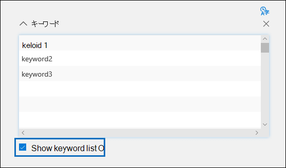

# 電子情報開示でコレクションの検索クエリを作成する (プレミアム)

[!include[Purview banner](../includes/purview-rebrand-banner.md)]

電子情報開示 (プレミアム) ケースで[コレクション](collections-overview.md)を作成するときに検索クエリを構成するときに、キーワードを使用して特定のコンテンツと条件を検索し、検索範囲を絞り込んで法的調査に最も関連するアイテムを返すことができます。

## キーワード検索

検索クエリの [キーワード] ボックスに **キーワード** クエリを入力します。 キーワード、電子メール メッセージのプロパティ (送受信日など)、ドキュメントプロパティ (ファイル名、ドキュメントが最後に変更された日付など) を指定できます。 **AND**、**OR**、**NOT**、**NEAR** などのブール演算子を使用するより複雑なクエリを使用できます。 SharePointやOneDrive内のドキュメント内の機密情報 (社会保障番号など) を検索したり、外部で共有されているドキュメントを検索したりすることもできます。 この **キーワード** ボックスを空のままにすると、指定したコンテンツの場所にあるすべてのコンテンツが検索結果に入ります。

## キーワード リスト

または、[ **キーワード 一覧を表示** ] チェック ボックスをオンにし、各行にキーワードまたはキーワード フレーズを入力することもできます。 各行のキーワードは、作成された検索クエリの **OR** 演算子と同様の機能を持つ論理演算子 (検索クエリ構文では *c:s* として表されます) によって接続されます。 つまり、任意の行に任意のキーワードを含む項目が検索結果に含まれます。 電子情報開示 (プレミアム) 検索クエリのキーワード リストに最大 180 行を追加できます。

キーワード リストを使用する理由 キーワード リスト内の各キーワードに一致する項目の数を示す統計情報を取得できます。 これにより、最も効果的な (かつ最も少ない) キーワードをすばやく特定できます。 キーワード リストの行にキーワード フレーズ (かっこで囲まれた) を使用することもできます。 検索統計の詳細については、「コレクションの[統計情報とレポート](collection-statistics-reports.md)」を参照してください。

## 条件

検索条件を追加して検索範囲を絞り込み、より洗練された結果セットを返すことができます。 各条件によって、作成された検索クエリに句が追加され、ユーザーが検索を開始するとそのクエリが実行されます。 条件は、**AND** 演算子と同様の論理演算子 (検索クエリ構文では *c:c* として表されます) によって、キーワード ボックスで指定されたキーワード クエリに論理的に接続されます。 つまり、アイテムは、キーワード クエリと、検索結果に含める 1 つ以上の条件の両方を満たす必要があります。 このように、条件を使用して結果を絞り込むことができます。 検索クエリで使用できる条件の一覧と説明については、「 [キーワード クエリと](keyword-queries-and-search-conditions.md#search-conditions)検索条件」の「検索条件」セクションを参照してください。
