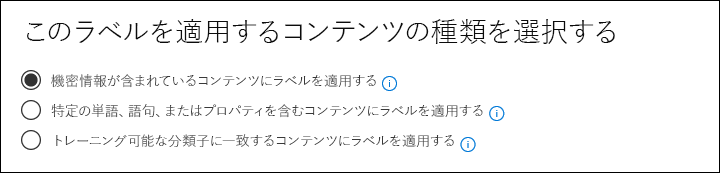

# すぐに使用できる分類子を使用する (プレビュー)Using a ready to use classifier (preview)

Microsoft では、非常に大規模なサンプルデータセットを使用して多数の分類子をトレーニングおよびテストしており、特定のカテゴリのコンテンツを特定するのに役立ちます。Microsoft has trained and tested a number of classifiers using very large sample data sets, which can help to identify certain categories of content. 「 [Trainable 分類子の概要 (プレビュー)」を](classifier-getting-started-with.md)参照してください。See [Getting started with trainable classifiers (preview)](classifier-getting-started-with.md). 既定では、 `Ready to use`これらの分類子はグループに表示されます。These classifiers show up in the `Ready to use` group by default.

- **不快な言葉**: profanities、slurs、taunts、および偽装式を含むテキストアイテムを検出します (これは、より不快な用語と同じ意味を持つ式です)。**Offensive Language**: detects text items that contain profanities, slurs, taunts, and disguised expressions (which are expressions that have the same meaning as a more offensive term).
- **履歴書**: 申請者の個人、教育、専門資格、作業経験、その他の個人を特定できる情報のテキストアカウントであるアイテムを検出します。**Resumes**: detects items that are textual accounts of an applicant's personal, educational, professional qualifications, work experience, and other personally identifying information.
- **SourceCode**: 広く使用されているコンピュータプログラミング言語で記述された命令およびステートメントのセットを含むアイテムを検出します。**SourceCode**: detects items that contain a set of instructions and statements written in widely used computer programming languages.
- **嫌がらせ**: 次の特徴に基づいて、1人または複数の個人を対象とした不快感のある言語のテキストアイテムの特定のカテゴリを検出します。競合、ethnicity、宗教、国内原産者、性別、性的なオリエンテーション、年齢、障碍。**Harassment**: detects a specific category of offensive language text items related to offensive conduct targeting one or multiple individuals based on the following traits: race, ethnicity, religion, national origin, gender, sexual orientation, age, disability.
- **不適切な用語**: 多くの人々を embarrass する式を含む、不快感を与える言語のテキストアイテムの特定のカテゴリを検出します。**Profanity**: detects a specific category of offensive language text items that contain expressions that embarrass most people.
- **脅威**: 暴力をコミットする脅威、または人またはプロパティに物理的な危害または損傷を与える脅威に関連する、不快感を与える言語のテキストアイテムの特定のカテゴリを検出します。**Threat**: detects a specific category of offensive language text items related to threats to commit violence or do physical harm or damage to a person or property,

> [!NOTE]
> 分類とラベル付けワークフローで分類子を使用できるようにするには、事前に組織のコンテンツのサンプルに照らしてテストし、分類の予測が期待どおりに満たされることを確認する必要があります。Before using ready to use classifiers in your classification and labeling workflow, you should test it against a sample of your organization's content that you feel fits the category to verify that its classification predictions meet your expectations.

> [!IMPORTANT]
> 不快な言葉、嫌がらせ、冒涜、および脅威の分類子は、検索可能なテキストのみで機能することに注意してください。Please note that the offensive language, harassment, profanity, and threat classifiers only work with searchable text are not exhaustive or complete. さらに、言語と文化的な標準が絶えず変化し、これらの現実からは、これらの分類子を裁量で更新する権利を Microsoft が留保します。Further, language and cultural standards continually change, and in light of these realities, Microsoft reserves the right to update these classifiers in its discretion. 分類子は、お客様の組織が不快な言葉や使用されている他の言語を監視するのに役立ちますが、分類子は、そのような言語の結果に対応していません。そのような言語。While the classifiers may assist your organization in monitoring offensive and other language used, the classifiers do not address consequences of such language and are not intended to provide your organization’s sole means of monitoring or responding to the use of such language. お客様の組織は、Microsoft またはその子会社ではなく、事前に訓練された分類子によって識別されるコンテンツの監視、実施、ブロック、削除、保持に関連するすべての意思決定に対して責任を負うことになります。Your organization, and not Microsoft or its subsidiaries, remains responsible for all decisions related to monitoring, enforcement, blocking, removal and retention of any content identified by a pre-trained classifier.

## 使用準備の分類子を準備して使用する方法How to prepare for and use a ready to use classifier

1. 破棄可能なテストコンテンツ項目を収集します。 [使用準備完了] 分類子 (正の一致) とそのカテゴリに含まれていないもの (負の一致) のカテゴリに属していると考えられます。Collect disposable test content items that you feel belong in the category of the ready to use classifier (positive matches) and ones that shouldn't be included (negative matches) in the category you're testing.

> [!IMPORTANT]
> サンプルアイテムは、暗号化する必要がなく、英語でなければなりません。The sample items must not be encrypted and they must be in English.

2. 専用の SharePoint Online フォルダーを作成します。フォルダーが検索インデックスに追加されるまで、少なくとも1時間待機します。Create a dedicated SharePoint Online folder; wait at least an hour for the folder to be added to the search index. フォルダーの URL をメモしておきます。Make note of the folder URL.

3. コンプライアンス管理者またはセキュリティ管理者の役割アクセスを使用して microsoft 365 コンプライアンスセンターにサインインし、 **microsoft 365 コンプライアンスセンター** > の**レコード管理 (プレビュー)** > **ラベルポリシー**タブを開きます。Sign in to Microsoft 365 compliance center with compliance admin or security admin role access and open **Microsoft 365 compliance center** > **Records management (preview)** > **Label policies** tab.

4. [ `Auto-apply a label`] を選択します。Choose `Auto-apply a label`.

5. [ `Choose a label to auto-apply`] を選択します。Choose `Choose a label to auto-apply`.

6. この`Create new labels`テストで使用するラベルを選択して作成します。Choose `Create new labels` and create a label for use just with this test. この操作を行う場合は`Retention` 、[オフ] のままにします。When you do this, leave `Retention` set to off. 保持またはその他のアクションをオンにしない。You don't want to turn on any retention or other actions. この場合は、アクションを強制しないで、単にテキストラベルとして保持ラベルを使用します。In this case, you'll be using the retention label simply as a text label, without enforcing any actions. たとえば、アクションなしで「SourceCode クラシファイア test」という名前の保持ラベルを作成し、その保持ラベルを条件としてソースコード分類子のコンテンツに自動適用することができます。For example, you can create a retention label named "SourceCode classifier test" with no actions, and then auto-apply that retention label to content that has Source code classifier as a condition. 保持ラベルの作成の詳細については、「[保持ラベルの概要](labels.md)」を参照してください。To learn more about creating retention labels, see [Overview of retention labels](labels.md).
  
7. [ `Auto-apply a label` ] を`Choose a label to auto-apply`選択してから、を選びます。Choose `Auto-apply a label` and then `Choose a label to auto-apply`. 条件に基づいてラベルを自動適用する方法の詳細については、「[条件に基づいて保持ラベルポリシーを自動適用](labels.md#applying-a-retention-label-automatically-based-on-conditions)する」を参照してください。To learn more about using condition based auto-apply a label see, [auto-apply retention label policy based on a condition](labels.md#applying-a-retention-label-automatically-based-on-conditions).

8. リストからテストラベルを選択し、を`Next`選択します。Choose your test label from the list and choose `Next`.

9. [ `Apply label to content that matches a trainable classifier`] を選択します。Choose `Apply label to content that matches a trainable classifier`.

..

10. この場合は、リストから分類子を選択します。`Source Code`Choose your classifier from the list, in this case `Source Code`

11. ポリシーに名前を指定します。たとえば、"ソースコードの準備のために、クラシファイアテストを使用するようにします" などです。Name the policy, for example "Source code ready to use classifier test".

12. [ `Let me choose specific locations`] を選択します。Choose `Let me choose specific locations`.

13. を除く`SharePoint sites`すべての場所をオフ`Choose sites`にします。Turn off all locations except `SharePoint sites` and choose `Choose sites`.

14. 手順2でサイトの URL を入力します。Enter the URL for the site from step 2.

15. ウィザードを終了し、`Auto-apply`Finish the wizard and choose `Auto-apply`

16. テストアイテムを専用の SharePoint Online フォルダーに配置します。Place the test items into the dedicated SharePoint Online folder.

17. ラベルが適用される時間を有効にします。Allow an hour for the label to be applied.

18. ラベルのドキュメントのプロパティをチェックして、分類子が予期したとおりにテストコンテンツを含むかどうかを確認します。Check the properties of the documents for the label to see if the classifier included and excluded the test content as you expected.

19. ラベル付けされたアイテムを確認します。Review the items that were labeled.

20. テストを完了したら、コンテンツとラベルポリシーを削除します。Delete the content and the label policy if you're done with your testing.

関連項目:See also:

- [トレーニング可能な分類子の使用を開始する (プレビュー)Getting started with trainable classifiers (preview)](classifier-getting-started-with.md)
- 「[保持ラベルの概要](labels.md)」を参照してください。[Overview of retention labels](labels.md)
- [条件に基づいて保持ラベルポリシーを自動適用するAuto-apply retention label policy based on a condition](labels.md#applying-a-retention-label-automatically-based-on-conditions)
